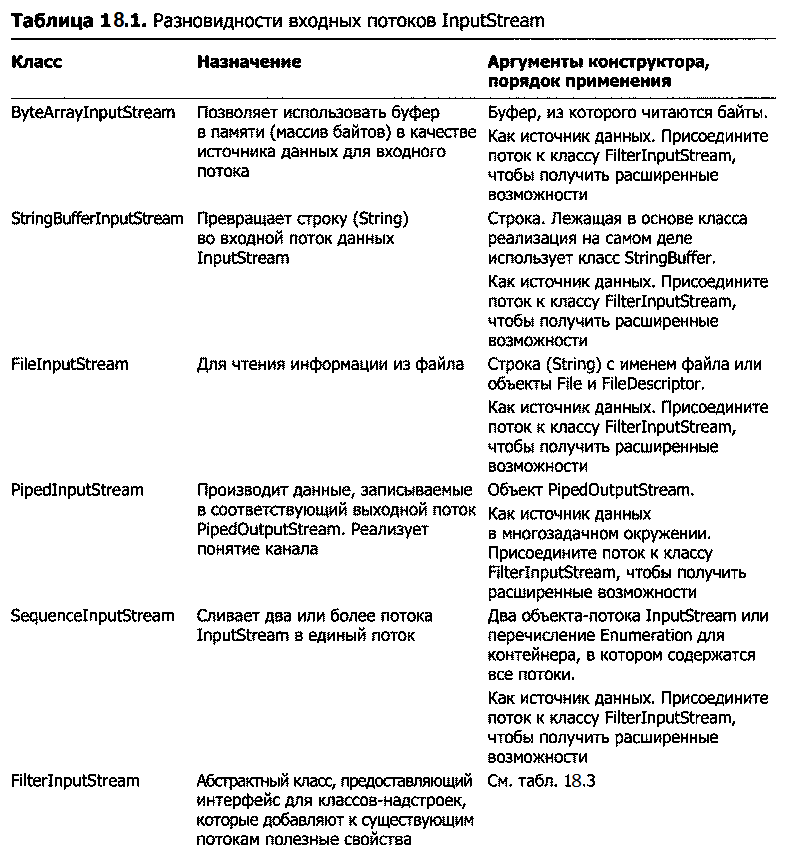
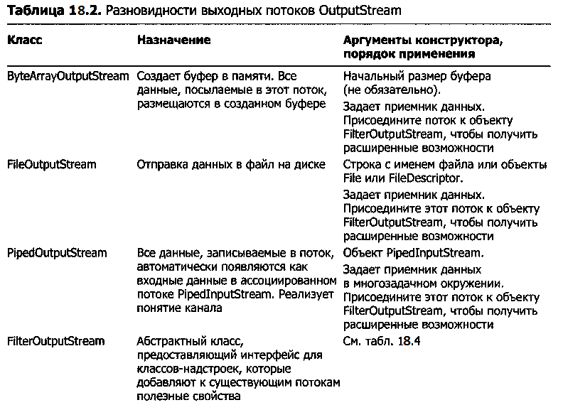
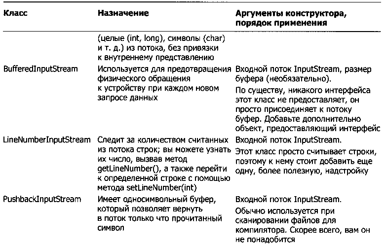
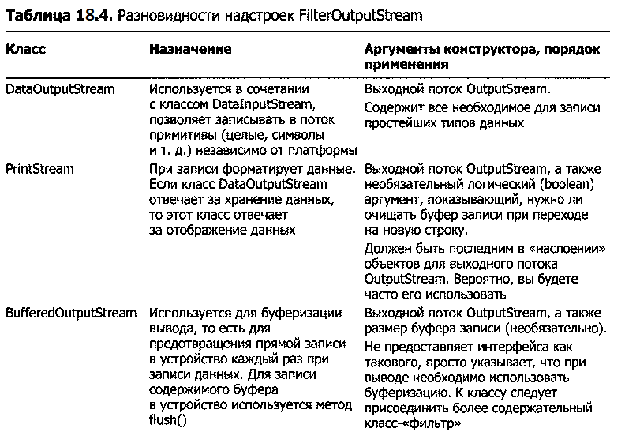

#Заметки по Java
**По книге «Философия Java»**
##2 глава. Все является объектом

 Java основан на С++, но является более ОО языком, относится к семейству смешанных языков. Java подразумевает, что вы занимаетесь  только ООП. 

 В Java почти все является объектом.Для работы с объектами используются ссылки. 
 В Java вы обращаетесь с любыми данными как с объектом, и поэтому повсюду используется единый последовательный синтаксис. Хотя вы обращаетесь со всеми данными как с объектом, идентификатор, которым вы манипулируете, на самом деле представляет собой ссылку на объект. Например, для хранения слова или предложения создается ссылка String:

	String s;

 Однако здесь определяется только ссылка, но не сам объект. Нужно инициализировать ссылку при ее создании:

	String s = “abs”;

Все объекты должны создаваться явно. Когда определяется ссылка, то желательно присоединить ее к новому объекту (при помощи ключевого слова new).

	String s = new String(“abs”);

###Где хранятся данные

5 разных мест для хранения:

 - Регистры (Данные хранятся прямо внутри процессора. У вас нет прямого доступа к регистрам)
 
 - Стек (Находится в общей оперативной памяти - RAM. Ссылки на объекты хранятся в стеке, но сами объекты не помещаются в стек. Быстрый способ)

 - Куча (Пул памяти общего назначения, находится в RAM, в нем размещаются все объекты Java.  new - память выделяется из кучи)
  
 - Постоянное хранилище (Значения констант часто встраиваются прямо в код программы, т.к. они неизменны. Иногда такие данные могут размещаться в постоянной памяти ROM)
 
 - Внешнее хранилище (Если данные хранятся вне программы, он могут существовать и тогда, когда она не выполняется. Пример: потоковые объекты (для передачи на другие машины) и долгоживущие объекты (запоминаются на диске))

 *Особый случай: примитивные типы*

 Требуют особого обращения, так как часто применяются, и в куче недостаточно эффективно хранить. Java следует по примеру С и С++, вместо создания переменной с помощью new создается «автоматическая»  переменная, не являющаяся ссылкой. Она хранит значение и располагается в стеке, операции с ней гораздо производительнее.

 Неизменность размера типа переменной – одна из причин улучшенной переносимости программ Java.

###Массивы
	
 Одной из основных целей Java является безопасность. Массивы гарантированно инициализируются, и к ним невозможен доступ за пределами его границ. Проверка границ массива обходится дорого, но повышение безопасности стоит того.

 При объявлении массива объектов на самом деле создается массив ссылок, и каждая из этих ссылок автоматически инициализируется null. 

 Массивы простейших типов заполняются нулями. Объекты никогда не приходится удалять - сборщик мусора все сделает сам.

 Область действия объектов отличается от области действия примитивов. Объект созданный оператором new, будет доступен до конца области действия. Если написать:

	{
		String s = new String(“sd);
	} // конец области действия 

 Ссылка s исчезнет в конце области действия. Однако сам объект, на который указывала ссылка, все еще будет занимать память. Уборщик мусора, который наблюдает за объектами, созданными оператором new,  определяет, на какие из них больше нет ссылок, тогда он освобождает память этих объектов, которая становится доступной для дальнейшего использования. Таким образом, никогда не придется очищать память вручную.

 Если переменная используется как член класса, то гарантируется значение по-умолчанию (для int это 0 и т.п.). Такая гарантия не относится к локальным переменным, которые не являются полями класса, переменная будет инициализирована случайным значением.

 Методы в Java определяют сообщения, принимаемые объектом. Имя метода и его список аргументов (объединяемые термином сигнатура) обеспечивают однозначную идентификацию метода.

###Видимость имен

 Для создания уникальных имен библиотек разработчики Java предлагают использовать доменное имя, записанное в обратном порядке, так как эти имена всегда уникальны.

 В Java не существует проблемы опережающих ссылок.

###Ключевое слово static

 Объект появляется только после того, как он будет создан ключевым словом new, и только начиная с этого момента для него выделяется память и появляется возможность вызова методов. Но есть две ситуации, в которых такой подход недостаточен. Первая – это когда некоторые данные должны храниться в единственном числе независимо от того, сколько было создано объектов класса. Вторая – когда требуется метод, не привязанный ни к какому конкретному объекту класса, то есть метод, который можно вызвать даже при полном отсутствии объектов класса.

 Такой эффект достигается использованием ключевого слова static, делающего элемент класса статическим. Данные или метод, объявленные как static,  не привязаны к определенному экземпляру этого класса.  

 Следующий код создает статическое поле класса и инициализирует его:

	Class StaticTest
	{
		static int i = 47;
	} 

 Теперь даже при создании двух объектов этого класса, для элемента StaticTest.i выделяется единственный блок памяти. Оба объекта совместно используют одно значение i.

 Для обращения к статической переменной есть возможность обращаться прямо через имя класса:
	
	StaticTest.i++;
	
 То же самое касается статических методов класса. Для нестатических членов такая возможность отсутствует. 
	
###Документация в комментариях
	
 Для упрощения ведения документации, код и документацию объединяют в одном файле, но для полноты картины нужен специальный синтаксис комментариев, чтобы помечать документацию, и инструмент, который извлекал бы эти комментарии и оформлял их в подходящем виде. 

 Инструмент для извлечения комментариев называется **javadoc**, он является частью пакета JDK.  Он не только извлекает помеченную информацию, но также узнает имя класса или метода, к которому относится данный фрагмент документации. Результатом работы программы является html-файл. Также можно дополнить javadoc своими собственными расширениями, называемыми доклетами, в которых можно проводить специальные операции над обрабатываемыми данными.

##3 глава. Операторы

###Простые команды печати

Вместо `System.out.println("…");` можно использовать команду `print("..."); ` но нужно сделать статический импорт:

	import static net.minview.util.Print.*;

###Присваивание

 Присваивание объектов отличается от обычного присваивания. При выполнении операций с объектом вы в действительности работаете со ссылкой, поэтому присваивание одного объекта другому в действительности означает копирование ссылки из одного места в другое. Это означает, что при выполнении команды c = d для объектов в конечном итоге c и d указывают на один объект, которому изначально соответствовала только ссылка d. Во многих языках программирования можно было ожидать, что c и d будут независимы все время, но из-за присваивания ссылок изменение объекта c будет отражаться на объекте d. Это происходит из-за того, что t1 и t2 содержат одинаковые ссылки, указывающие на один объект. (Исходная ссылка, которая содержалась в с и указывала на объект с определенным значением, была перезаписана во время присваивания и фактически потеряна, её объект будет вскоре удален уборщиком мусора.)

 Этот феномен совмещения имен часто называют синонимией (aliasing), и именно она является основным способом работы с объектами в Java. 

 Но что делать, если совмещение имен нежелательно?  Тогда можно пропустить присваивание и записать: 

	c.value = d.value; 

 При этом программа сохранит 2 разных объекта. Но прямая работа с полями данных внутри объектов противоречит принципам ООП.

###Автоувеличение и автоуменьшение

 Каждый из этих операторов существует в двух версиях – префиксной и постфиксной. Префиксный инкремент значит, что оператор ++ записывается перед переменной или выражением, а при постфиксном инкременте оператор следует после переменной или выражения. Аналогично, при префиксном декременте. Для префиксного инкремента и декремента сначала выполняется операция, а затем выдается результат. Для постфиксной записи сначала выдается значение и лишь затем выполняется операция.
	
###Операторы сравнения
	
 Для сравнения объектов можно использовать метод equals(), который нужно переопределять в собственных классах.
	
###Ускоренное вычисление
	
 При работе с логическими операторами можно столкнуться с феноменом, называемым «ускоренным вычислением». Это значит,  что выражение вычисляется только до тех пор, пока не станет очевидно, что он принимает значение «истина» или «ложь». В результате некоторые части логического выражения могут быть проигнорированы в процессе сравнения. Это обеспечивает потенциальный выигрыш в производительности.
	
###Литералы
	
 - 0x2f – шестнадцатеричное число (нижний регистр)
 - 0X2F – шестнадцатеричное число (верхний регистр)
 - 0177 – восьмеричное число (нижний регистр)
 - 200L - long
 - 200l – long(можно запутаться)
 - 1F - float
 - 1f - float
 - 1D - double
 - 1d – double

###Экспоненциальная запись

 е означает 10 в степени. 

	float expFloat = 1.39e – 43f;  

 Это 1.39 * 10^-43

###Тернарный оператор

 Логическое-условие ? выражение0 : выражение1

 Может ухудшить читаемость кода, обычно его применение ограничивается присваиванием переменной одного из двух значений.

###Перегрузка операторов

 В языке Java отсутствует перегрузка операторов.

###Оператор + и += для String

	int x = 0;
	String s ="x";
	print(s + x);
	print(x + " " + s); //Преобразует x в String
	print(" " + x); //Сокращение для Integer.toString();

###Привидение типов

 В случае с типами *char*, *byte* и *short* можно заметить эффект повышения при использовании арифметических операторов. Любая арифметическая операция с этими типами дает результат типа int, который затем нужно явно приводить к изначальному типу (сужающие привидение, при котором возможно потеря информации).

##4 глава. Управляющие конструкции

 В Java задействованы все управляющие конструкции языка С.
 *If-else*, *while*, *do-while*, *for*, *return*, *break*, *switch*.

###Оператор-запятая

 Позволяет записать несколько переменных в цикле for, но все эти переменные должны быть одного типа:

	for (int i = 0, j = I + 10; i < 5; i++, j = i * 2) 
	{} 

###Синтаксис foreach
 
 В Java SE5 появилась новая, более компактная форма for для перебора элементов массивов и контейнеров. Не требует ручного изменения переменной int для перебора последовательности объектов – цикл автоматически представляет очередной элемент.

 **Пример:**
 
	for (char c : "An African Swallow".toCharArray() )
	System.out.print(c + " ");

 Синтаксис foreach также работает для любого объекта, поддерживающего интерфейс Iterable.

###Break и continue
	
 Команда break завершает цикл, при этом оставшиеся операторы цикла не выполняются. Команда continue останавливает выполнение текущей итерации цикла и переходит к началу цикла, чтобы начать выполнение нового шага или же вернуться в начало цикла.

###Команда goto

 Java не имеет команды goto, однако существует механизм, похожий на безусловный переход.
 Метка представляет собой идентификатор с последующим двоеточием:

	label1:
	
 Единственное место, где в Java метка может оказаться полезной,- прямо перед телом цикла. Обычные версии break прерывают лишь текущий цикл, но с помощью метки можно досрочно завершать циклы и передавать выполнение в точку, адресуемую меткой:

	label1:
	внешний цикл 
	{
			внутренний цикл 
			{
				…
				break;
				…
				continue;	
				…
				continue label1;
				…
				break label1;
			}
	}

 В третьем варианте команда влечет выход из обоих циклов и выполнение цикла начинается снова с внешнего цикла. В 4 варианте команда останавливает действие обоих циклов, повторный вход в итерацию не происходит.

##5 глава. Инициализация и завершение.

###Конструктор

 Конструктор, не получающий аргументов, называется конструктором по умолчанию. Конструкторы не возвращают никогда и ничего. 

###Перегрузка методов

 Даже разного порядка аргументов достаточно для того, чтобы методы считались разными. Но такой подход почти не используется, так как он усложняет сопровождение программного кода.

###Ключевое слово this

 Употребляется только в особых случаях, когда необходимо сослаться на текущий объект. Может использоваться только внутри нестатического метода и предоставляет ссылку на объект, для которого был вызван метод. При вызове метода вашего класса из другого метода класса использовать this не нужно.

 Для передачи текущего объекта внешнему методу используется ключевое слово this:

	class Person 
	{
  		public void eat(Apple apple) 
		{
    		Apple peeled = apple.getPeeled();
    		System.out.println("Yummy");
  		}
	}

	class Peeler 
	{
  		static Apple peel(Apple apple) 
		{
    		// ... remove peel
    		return apple; // Peeled
  		}
	}

    class Apple 
	{
      	Apple getPeeled() { return Peeler.peel(this); }
    }
    
    public class PassingThis 
	{
      	public static void main(String[] args) 
		{
    		new Person().eat(new Apple());
      	}
    } 

 **Output:**
 >Yummy

###Вызов конструкторов из конструкторов

 Иногда бывает удобно вызвать один конструктор из другого, чтобы избежать дублирования кода. Такая операция проводится с использованием this.

 Обычно при употреблении this подразумевается *“текущий объект”*, но в конструкторе это ключевое слово имеет другой смысл: при использовании его со списком аргументов вызывается конструктор, соответствующий данному списку. Таким образом, появляется возможность прямого вызова других конструкторов:

	/: initialization/Flower.java
	// Calling constructors with "this"
	import static net.mindview.util.Print.*;
	
	public class Flower 
	{
	  	int petalCount = 0;
	  	String s = "initial value";
	  	Flower(int petals) 
		{
			petalCount = petals;
			print("Constructor w/ int arg only, petalCount= "
	  		+ petalCount);
	  	}
	  
		Flower(String ss) 
		{
			print("Constructor w/ String arg only, s = " + ss);
			s = ss;
	 	}
	  
		Flower(String s, int petals) 
		{
			this(petals);
			//!this(s); // Can't call two!
			this.s = s; // Another use of "this"
			print("String & int args");
	  	}
	  
		Flower() 
		{
			this("hi", 47);
			print("default constructor (no args)");
	  	}
	  
		void printPetalCount() 
		{
			//! this(11); // Not inside non-constructor!
			print("petalCount = " + petalCount + " s = "+ s);
	  	}

	  	public static void main(String[] args) 
		{
			Flower x = new Flower();
			x.printPetalCount();
	  	}
	} 

**Output:**

>Constructor w/ int arg only, petalCount= 47 

>String & int args 

>default constructor (no args) 

>petalCount = 47 s = hi 

 При вызове одного конструктора через this вызывать второй запрещается. Вдобавок вызов другого конструктора должен быть первой выполняемой операцией, иначе компилятор выдаст сообщение об ошибке.

###Значение ключевого слова static

 У статических методов не существует ссылки this. Статические методы вызываются для класса, без каких-либо объектов.

###Очистка: финализация и уборка мусора

 Уборщик мусора умеет освобождать память, выделенную оператором new, но ему неизвестно, как следует очищать специфическую память объекта. Для таких ситуаций в Java предусмотрен метод finalize(), который можно определить в собственном классе. Когда уборщик мусора готов освободить память, использованную вашим объектом, то он для начала вызывает метод и только после этого освобождает занимаемую объектом память. Таким образом, метод finalize() позволяет выполнить завершающие действия во время работы уборщика мусора, но не стоит путать его с деструктором языка C++ - ф-ей, всегда вызываемой перед разрушением объекта. В Java объекты не всегда удаляются уборщиком мусора. Уборка мусора не является уничтожением.

 Если перед тем, как объект станет ненужным, необходимо выполнить некоторое завершающее действие, то это действие придется выполнить собственноручно.

###Для чего нужен метод finalize()?

 Похоже, что поддержка метода finalize() была введена в язык, чтобы сделать возможными операции с памятью в стиле С, с привлечением нестандартных механизмов выделения памяти. Это может произойти в основном при использовании методов, предоставляющих способ вызова не-Java-кода из программы на Java. В действительности программа Java может вызвать любую процедуру или функцию на любом языке. Во внешнем коде можно выделить память вызовом функций С, относящихся к семейству malloc().

 Метод finalize() используется нечасто.

###Как работает уборщик мусора

**Дописать**

###Инициализация членов класса 

 Члены класса автоматически инициализируются. Ссылке на объект автоматически присваивается значение null.

###Явная инициализация

 Прямое присваивание значения переменной прямо в точке ее объявления в классе.

###Инициализация конструктором

 Переменные инициализируются внутри конструктора, но сначала пройдет автоматическая инициализация.

###Порядок инициализации

 Внутри класса очередность инициализации определяется порядком следования переменных, объявленных в этом классе. Определения переменных могут быть разбросаны по разным определениям методов, но в любом случае переменные инициализируются перед вызовом любого метода – даже конструктора.

###Инициализация статических данных

 Данные статических полей всегда существуют в единственном экземпляре, независимо от количества созданных объектов. Ключевое слово static не может применяться к локальным переменным, только к полям. 

 Если статическое поле относится к примитивному типу, при отсутствии явной инициализации ему присваивается значение по умолчанию. Если это ссылка на объект, то ей присваивается значение null.

 Статическая инициализация происходит только в случае необходимости. Они инициализируются только при создании первого объекта (или при первом обращении к статическим данным). После этого статические объекты заново не инициализируются.

 Сначала инициализируются статические члены, если они еще не были проинициализированы, и только затем нестатические объекты.

 Обобщим знания о процессе создания объекта. Для примера возьмем класс с именем Dog:

 - Хотя ключевое слово static  и не используется явно, конструктор в действительности является статическим методом. При создании первого объекта типа Dog  или при первом вызове статического метода/обращения к статическому полю класса Dog интерпретатор Java должен найти класс Dog.class. Поиск осуществляется в стандартных каталогах, перечисленных в переменной окружения CLASSPATH.
 
 - После загрузки Dog.class (с созданием особого объекта Class) производится инициализация статических элементов. Таким образом, инициализация статических членов проводится только один раз, при первой загрузке объекта Class.
 
 - При создании нового объекта конструкцией new Dog() для начала выделяется блок памяти, достаточный для хранения объекта Dog в куче.

 - Выделенная память заполняется нулями, при этом все примитивные поля объекта автоматически инициализируются значениями по умолчанию.
 
 - Выполняются все действия по инициализации, происходящие в точке определения полей класса.
 -
 - Выполняются конструкторы. 

###Явная инициализация статических членов

 Java позволяет сгруппировать несколько действий по инициализации объектов static в специальной конструкции, называемой статическим блоком. 

 Этот код, как и остальная инициализация static, выполняется только один раз: при первом создании объекта этого класса или при первом обращении к статическим членам этого класса (даже если ни один объект класса не создается).

**Пример:**

	import static net.mindview.util.Print.*;
	
	class Cup 
	{
		Cup(int marker) 
		{
			print("Cup(" + marker + ")");
		}
		  
		void f(int marker) 
		{
			print("f(" + marker + ")");
		}
	}
		
	class Cups 
	{
		static Cup cup1;
		static Cup cup2;
		
		static 
		{
			cup1 = new Cup(1);
			cup2 = new Cup(2);
		}
		  
		Cups() 
		{
			print("Cups()");
		}
	}
		
	public class ExplicitStatic 
	{
		public static void main(String[] args) 
		{
			print("Inside main()");
			Cups.cup1.f(99);  // (1)
		}
	  	// static Cups cups1 = new Cups();  // (2)
	  	// static Cups cups2 = new Cups();  // (2)
	} 

**Output:**

>Inside main() 

>Cup(1) 

>Cup(2) 

>f(99)

###Инициализация нестатических данных экземпляра

 Имеется схожий синтаксис для инициализации нестатических переменных для каждого объекта:

	import static net.mindview.util.Print.*;
	
	class Mug 
	{
	  	Mug(int marker) 
		{
	    	print("Mug(" + marker + ")");
	  	}
	  
		void f(int marker) 
		{
	    	print("f(" + marker + ")");
	  	}
	}
	
	public class Mugs 
	{
	  	Mug mug1;
	  	Mug mug2;

	  	{
	    	mug1 = new Mug(1);
	    	mug2 = new Mug(2);
	    	print("mug1 & mug2 initialized");
	  	}

	  	Mugs() 
		{
	    	print("Mugs()");
	  	}

	  	Mugs(int i) 
		{
	    	print("Mugs(int)");
	  	}

	  	public static void main(String[] args) 
		{
	    	print("Inside main()");
	    	new Mugs();
	    	print("new Mugs() completed");
	    	new Mugs(1);
	    	print("new Mugs(1) completed");
	  	}
	} 
**Output:**

>Inside main() 

>Mug(1) 

>Mug(2) 

>mug1 & mug2 initialized 

>Mugs() 

>new Mugs() completed 

>Mug(1) 

>Mug(2) 

>mug1 & mug2 initialized 

>Mugs(int) 

>new Mugs(1) completed 

 Такой синтаксис необходим для поддержки инициализации анонимных внутренних классов, но он также гарантирует, что некоторые операции будут выполнены независимо от того, какой именно конструктор был вызван в программе. Секция инициализации экземпляра выполняется раньше любых конструкторов.

###Инициализация массивов

 Массивы определяются и используются с помощью оператора индексирования [ ]. Чтобы определить ссылку на массив в программе нужно написать:

	int[] a1;

 Квадратные скобки также могут размещаться после идентификатора, эффект будет точно таким же:

    int a1[];

 Инициализация:

	int a1 = { 1, 2, 3, 4, 5 };

 В Java можно присвоить один массив другому:

	a2 = a1;

 В данном случае *скопируются ссылки*.

 Все массивы содержат поле, которое можно только прочитать – length (количество элементов в массиве).

 Есть метод Arrays.toString(), входящий в стандартную библиотеку java.util, метод выдает печатную версию одномерного массива.

###Списки аргументов переменной длины
	
 Такой список способен содержать неизвестное заранее количество аргументов неизвестного типа. Так как абсолютно все классы являются производными от общего корневого класса Object, можно создать метод, принимающий в качестве аргумента массив Object:

	class A { int i; }
	
	public class VarArgs 
	{
	 	static void printArray(Object[] args) 
		{
	    	for(Object obj : args)
	      		System.out.print(obj + " ");

	    	System.out.println();
	  	}

	  	public static void main(String[] args) 
		{
	    	printArray(new Object[]
			{
	      		new Integer(47), new Float(3.14), new Double(11.11)
	    	});

	    	printArray(new Object[]{"one", "two", "three" });
	    	printArray(new Object[]{new A(), new A(), new A()});
	  	}
	} 
**Output:** (Sample)

>47 3.14 11.11 

>one two three 

>A@1a46e30 A@3e25a5 A@19821f 

 Print() принимает массив объектов типа Object, перебирает его элементы и выводит их.

 До выхода Java SE5 переменные списки аргументов реализовывались именно так. В Java SE5 была добавлена возможность – для определения переменного списка аргументов может использоваться многоточие:

	public class NewVarArgs 
	{
	  	static void printArray(Object... args) 
		{
	    	for(Object obj : args)
	      		System.out.print(obj + " ");
	    	System.out.println();
	  	}

	  	public static void main(String[] args) 
		{
	    	// Can take individual elements:
	    	printArray(new Integer(47), new Float(3.14),
	    	  new Double(11.11));

	    	printArray(47, 3.14F, 11.11);
	    	printArray("one", "two", "three");
	    	printArray(new A(), new A(), new A());

	    	// Or an array:
	    	printArray((Object[])new Integer[]{ 1, 2, 3, 4 });
	    	printArray(); // Empty list is OK
	  	}
	} 

**Output: (75% match)**

>47 3.14 11.11 

>47 3.14 11.11 

>one two three

>A@1bab50a A@c3c749 A@150bd4d 

 Списки аргументов переменной длины избавляют от необходимости явной записи синтаксиса массивов – компилятор делает это автоматически.

 Списки аргументов переменной длины могут использоваться и с другими типами:

	public class OptionalTrailingArguments 
	{
	  	static void f(int required, String... trailing) 
		{
	    	System.out.print("required: " + required + " ");
	    	for(String s : trailing)
	      		System.out.print(s + " ");

	    	System.out.println();
	  	}

	  	public static void main(String[] args) 
		{
	    	f(1, "one");
	    	f(2, "two", "three");
	    	f(0);
	  	}
	} 

**Output:**

>required: 1 one

>required: 2 two three

>required: 0 

 Следующий пример показывает, что список аргументов переменной длины превращается в массив, а при отсутствии элементов он становится массивом нулевой длины.
	
	public class VarargType 
	{
	  	static void f(Character... args) 
		{
	    	System.out.print(args.getClass());
	    	System.out.println(" length " + args.length);
	  	}

	  	static void g(int... args) 
		{
	    	System.out.print(args.getClass());
	    	System.out.println(" length " + args.length);
	  	}

	  	public static void main(String[] args) 
		{
	    	f('a');
	    	f();
	    	g(1);
	    	g();
	    	System.out.println("int[]: " + new int[0].getClass());
	  	}
	} 

**Output:**
>class [Ljava.lang.Character; length 1  
>class [Ljava.lang.Character; length 0  
>class [I length 1  
>class [I length 0  
>int[]: class [I  

 Можно вызывать функцию вообще без аргументов.

 Списки аргументов переменной длины могут усложнит перегрузку. При вызове перегруженной функции без аргументов компилятор не сможет определиться какой из методов следует вызвать. Как правило, список аргументов переменной длины следует использовать только в одной версии перегруженного метода.

###Перечисления

 Ключевое слово **enum** введено в Java SE5. Оно значительно упрощает работу программиста при группировке и использовании перечисляемых типов.

	public enum Spiciness 
	{
	  	NOT, MILD, MEDIUM, HOT, FLAMING
	}

 Приведенный фрагмент создает перечислимый тип с именем Spiciness, состоящий из 4 именованных значений. Так как экземпляры перечислимых типов являются константами, то по правилом они записываются исключительно прописными буквами (если имя состоит из нескольких слов, то эти слова разделяются пробелами).

 Чтобы использовать перечисление нужно создать ссылку на перечислимый тип:

	public class SimpleEnumUse 
	{
	  	public static void main(String[] args) 
		{
	    	Spiciness howHot = Spiciness.MEDIUM;
	    	System.out.println(howHot);
	  	}
	} 

**Output:**
>MEDIUM

 На самом деле перечисления являются классами и обладают своими методами, вот некоторые из них:

 **toString()** –вывод имени экземпляра перечислимого типа.  
 **ordinal()** – порядок объявления констант.  
 **values()** – возвращает массив констант в enum  в порядке их объявления. 

Удобно использовать switch для работы с enum.

##6 глава. Управление доступом.

 Смысл управления доступом (или сокрытия реализации) заключается в постепенном совершенствовании кода.

 *Рефакторинг* – переработки работоспособности кода, направленного на то, чтобы сделать его более удобочитаемым и понятным и упростить сопровождение.

###Пакет как библиотечный модуль

 Пакет содержит группу классов, объединенных  в одном пространстве имен. Для импорта классов пакета используется ключевое слово import.
 
 Файл с исходным текстом на Java часто называют компилированным модулем. Файл .java может содержать один и только один открытый класс (public).

###Структура кода

 В результате компиляции для каждого класса, определенного в файле .java, создается класс с тем же именем, но с расширением .class. На компилируемом языке компилятор генерирует промежуточные файлы (.OBJ обычно), которые затем объединяются компоновщиком для получения исполняемого файла или библиотеки. Java  работает не так. Рабочая программа представляет собой набор однородных файлов .class, которые объединяются в пакет и сжимаются в файл JAR (утилитой Java jar). Интерпретатор Java отвечает за поиск, загрузку и интерпретацию этих файлов.

 Ключевые слова package и import позволяют разработчику библиотеки организовать логическое  деление глобального пространства имен, предотвращающее конфликты имен независимо от того, сколько людей подключатся к Интернету и начнут писать свои классы на Java.

###Конфликты имен

 Предположим, что программа содержит следующие директивы:

	import net.mindview.simple.*;
	import java.util.*;

 Эти пакеты содержат класс с именем *Vector*. Конфликт произойдет при попытке создать *Vector*: 

	Vector v = new Vector();

 Компилятор выдаст сообщение об ошибке и заставит явно указать нужное имя:

	java.util.Vector v = new java.util.Vector();

###Пользовательские библиотеки

 После компиляции методы пользовательских библиотек могут использоваться где угодно, для чего угодно, но нужно чтобы файл располагался в одном из каталогов, указанных в переменной окружения *CLASSPATH*. Затем в программу достаточно включить директиву `import static`.

###Спецификаторы доступа Java

 В Java спецификаторы доступа *public*, *protected* и *private* располагаются перед определением членов классов – как полей, так и методов. Каждый спецификатор доступа управляет только одним отдельным определением.

 Если спецификатор доступа не указан, то используется «пакетный» уровень доступа.

###Доступ в пределах пакета

 Доступ по умолчанию не имеет ключевого слова, но часто его называют доступом в пределах пакета. Это значит, что член класса доступен для всех остальных классов текущего пакета, но для классов за пределами пакета он воспринимается как приватный.

###Public

Объявление члена класса доступно для всех.

###Private

Доступ к члену класса не предоставляется никому, кроме методов этого класса. Сокрытие данных.

###Protected

Связано с понятием наследования. (Будет рассмотрено далее)

###Интерфейс и реализация

 Контроль над доступом часто называют сокрытием реализации. Помещение данных и методов в классы в комбинации с сокрытием реализации часто называют инкапсуляцией. 

 Доступ к типам данных ограничивается по двум причинам: 

 - Первая причина – программист-клиент должен знать, что он может использовать, а что не может. 
 - Вторая причина – разделение интерфейса и реализации.

  Для большей ясности при написании классов можно использовать такой стиль: сначала записываются *public*-члены, затем *protected*-члены, затем члены с доступом в пределах пакета и, наконец, закрытые члены(*private*). Преимущество такой схемы в том, что при чтении исходного текста пользователь сначала видит то, что ему важно, а затем останавливается при переходе к закрытым членам, являющимся частью внутренней реализации.

###Доступ к классам

 В Java с помощью спецификаторов доступа возможно также указать, какие из классов внутри библиотеки будут доступны для ее пользователей. Если нужно, чтобы класс был открыт программисту-клиенту, то нужно добавить *public* для класса в целом.
	
 Существуют некоторые ограничения:

 - В каждом компилируемом модуле может существовать только один открытый (*public*) класс. Идея в том, что каждый компилируемый модуль содержит определенный открытый интерфейс и реализуется этим открытым классом. В модуле может содержаться произвольное количество вспомогательных классов с доступом в пределах пакета.

 - Имя открытого класса должно в точности совпадать с именем файла, в котором содержится компилируемый модуль. 

 - Компилируемый модуль может вообще не содержать открытых классов (хотя это и не типично). В этом случае файлу можно присвоить любое имя по вашему усмотрению.

  Класс нельзя объявить как *private* (что сделает класс недоступным для окружающих,   использовать он сможет только сам себя) или *protected*. Поэтому выбор при задании доступа к классу небольшой: в пределах пакета или открытый(*public*).

  Если вы хотите перекрыть доступ к классу для всех, то нужно объявить все его конструкторы со спецификатором private, соответственно запрещая кому бы то ни было создание объектов этого класса. Только вы сами, в статическом методе этого класса, сможете создавать такие объекты. 

 **Пример:**

	class Soup1 
	{
	  	private Soup1() {}
	  	// (1) Allow creation via static method:
	  
		public static Soup1 makeSoup() 
		{
	    	return new Soup1();
	  	}
	}
	
	class Soup2 
	{
	  	private Soup2() {}
	  	// (2) Create a static object and return a reference
	  	// upon request.(The "Singleton" pattern):
	  	
		private static Soup2 ps1 = new Soup2();
	  	
		public static Soup2 access() 
		{
	    	return ps1;
	  	}

	 	public void f() {}
	}
	
	// Only one public class allowed per file:
	public class Lunch 
	{
	  	void testPrivate() 
		{
	    	// Can't do this! Private constructor:
	    	//! Soup1 soup = new Soup1();
	  	}
	  	
		void testStatic() 
		{
	    	Soup1 soup = Soup1.makeSoup();
	  	}
	  
		void testSingleton() 
		{
	    	Soup2.access().f();
	  	}
	} 

 Без явного определения хотя бы одного конструктора компилятор сгенерирует конструктор по-умолчанию.

##7 глава. Повторное использование классов.

 Есть два пути реализации этой идеи. Первый довольно прямолинеен: объекты уже имеющихся классов просто создаются внутри вашего нового класса. Механизм построения нового класса из объектов существующих классов называется композицией (*composition*). Вы просто используете функциональность готового кода, а не его структуру.

 Второй способ интереснее – новый класс создается как специализация уже существующего класса. Взяв существующий класс за основу, вы добавляете к нему свой код без изменения существующего класса. Этот механизм называется наследованием (*inheritance*), и большую часть работы в нем совершает компилятор.

###Синтаксис композиции

 Ссылка на внедряемый объект просто включается в новый класс. Компилятор не создает объектов для ссылок «по умолчанию», и это логично, потому что во многих случаях это привело бы к лишним затратам ресурсов. Если вам понадобится проинициализировать ссылку, то нужно сделать это самостоятельно:

 - В точке определения объекта. Это значит, что объект всегда будет инициализироваться перед вызовом конструктора.
 - В конструкторе данного класса.
 - Перед использованием объекта. Этот способ часто называют отложенной инициализацией. Он может сэкономить ресурсы в ситуациях, где создавать объект каждый раз необязательно и накладно.
 - С использованием инициализации экземпляров.

 Все 4 способа продемонстрированы в следующем примере:

	import static net.mindview.util.Print.*;
	
	//Инициализация в конструкторе с композицией
	class Soap {
	  private String s;
	  Soap() {
	    print("Soap()");
	    s = "Constructed";
	  }
	  public String toString() { return s; }
	}	
	
	public class Bath {
	  private String // Initializing at point of definition:
	    s1 = "Happy",
	    s2 = "Happy",
	    s3, s4;
	  private Soap castille;
	  private int i;
	  private float toy;
	  public Bath() {
	    print("Inside Bath()");
	    s3 = "Joy";
	    toy = 3.14f;
	    castille = new Soap();
	  }	
	  // Instance initialization:
	  { i = 47; }
	  public String toString() {
	    if(s4 == null) // Delayed initialization:
	      s4 = "Joy";
	    return
	      "s1 = " + s1 + "\n" +
	      "s2 = " + s2 + "\n" +
	      "s3 = " + s3 + "\n" +
	      "s4 = " + s4 + "\n" +
	      "i = " + i + "\n" +
	      "toy = " + toy + "\n" +
	      "castille = " + castille;
	  }	
	  public static void main(String[] args) {
	    Bath b = new Bath();
	    print(b);
	  }
	} 

**Output:**

>Inside Bath()

>Soap()

>s1 = Happy

>s2 = Happy

>s3 = Joy 

>s4 = Joy 

>i = 47 

>toy = 3.14 

>castille = Constructed 

###Синтаксис наследования

 Фактически наследование всегда используется при создании класса, потому что даже если класс не объявляется производным от другого класса, он автоматически становится производным от корневого класса Java *Object*.

 При использовании наследования вы говорите: «Этот новый класс похож на тот старый класс». В программе этот факт выражается перед фигурной скобкой, открывающей тело класса: сначала записывается ключевое слово *extends*, а затем имя базового класса. Тем самым вы автоматически получаете доступ ко всем полям и методам базового класса. 

**Пример:**

	// Inheritance syntax & properties.
	import static net.mindview.util.Print.*;
	
	class Cleanser 
	{
	  	private String s = "Cleanser";

	  	public void append(String a) { s += a; }

	  	public void dilute() { append(" dilute()"); }

	  	public void apply() { append(" apply()"); }

	  	public void scrub() { append(" scrub()"); }

	  	public String toString() { return s; }

	  	public static void main(String[] args) 
		{
	    	Cleanser x = new Cleanser();
	    	x.dilute(); x.apply(); x.scrub();
	    	print(x);
	  	}
	}	
	
	public class Detergent extends Cleanser 
	{
	  	// Change a method:
	  	public void scrub() 
		{
	    	append(" Detergent.scrub()");
	    	super.scrub(); // Call base-class version
	  	}

	  	// Add methods to the interface:
	  	public void foam() { append(" foam()"); }

	  	// Test the new class:
	  	public static void main(String[] args) 
		{
	    	Detergent x = new Detergent();
	    	x.dilute();
	    	x.apply();
	    	x.scrub();
	    	x.foam();
	    	print(x);
	    	print("Testing base class:");
	    	Cleanser.main(args);
	  	}	
	} 

**Output:**

>Cleanser dilute() apply() Detergent.scrub() scrub() foam() 

>Testing base class: 

>Cleanser dilute() apply() scrub() 

 Классы Cleanser и Detergent содержат метод main(). Даже если у вас в программе имеется множество классов, из командой строки исполняется только один (т.к. метод main() всегда объявляется как public, то неважно объявлен ли класс, в котором он описан, как public). Класс Cleanser не объявлен, но все равно можно вызвать метод `Cleanser.main()`. Даже если класс обладает доступом в пределах класса, открытый метод main() остается доступным.

 Здесь метод Detergent.main() вызывает Cleanser.main() явно, передавая ему собственный массив аргументов командной строки.

 При отсутствии спецификатора доступа член класса автоматически получает доступ "в пределах пакета", что позволяет обращаться к нему только из текущего пакета. Таким образом, в пределах данного пакета при отсутствии спецификатора доступа вызов этих методов разрешен кому угодно.

 В Java существует ключевое слово *super*, которое обозначает "суперкласс", то есть класс, производным от которого является текущий класс.

###Инициализация базового класса

 Наследование не просто копирует интерфейс базового класса. Когда вы создаете объект производного класса, внутри него содержится *подобъект* базового класса. Этот подобъект выглядит точно так же, как выглядел бы созданный обычным порядком объект базового класса. Поэтому извне представляется, будто бы в объекте производного класса "упакован" объект базового класса.

 Конечно, очень важно, чтобы подобъект базового класса был правильно инициализирован, и гарантировать это можно только одним способом: выполнить инициализацию в конструкторе, вызывая при этом конструктор базового класса, у которого есть необходимые знания и привилегии для проведения инициализации базового класса. Java автоматически вставляет вызовы конструктора базового класса в конструктор производного класса. В следующем примере задействовано 3 уровня наследования:

	//: reusing/Cartoon.java
	// Constructor calls during inheritance.
	import static net.mindview.util.Print.*;
	
	class Art 
	{
	  	Art() { print("Art constructor"); }
	}
	
	class Drawing extends Art 
	{
	  	Drawing() { print("Drawing constructor"); }
	}
	
	public class Cartoon extends Drawing 
	{
	  	public Cartoon() { print("Cartoon constructor"); }
	  	public static void main(String[] args) 
		{
	    	Cartoon x = new Cartoon();
	  	}
	} 

**Output:**
>Art constructor

>Drawing constructor

>Cartoon constructor

 Конструирование начинается с самого внутреннего базового класса. Даже если конструктор класса Carton не определен, компилятор сгенерирует конструктор по умолчанию, в котором также вызывается конструктор базового класса.

###Конструкторы с аргументами

 Если класс не имеет конструктора по умолчанию или вам понадобится вызвать конструктор базового класса с аргументами, этот вызов придется оформить явно, с указанием ключевого слова *super* и передачей аргументов:

	
	//: reusing/Chess.java
	// Inheritance, constructors and arguments.
	import static net.mindview.util.Print.*;
	
	class Game 
	{
	  	Game(int i) 
		{
	    	print("Game constructor");
	  	}
	}
	
	class BoardGame extends Game 
	{
	  	BoardGame(int i) 
		{
	    	super(i);
	    	print("BoardGame constructor");
	  	}
	}	
	
	public class Chess extends BoardGame 
	{
	  	Chess() 
		{
	    	super(11);
	    	print("Chess constructor");
	  	}
	  
		public static void main(String[] args) 
		{
	  		Chess x = new Chess();
	  	}
	} 

**Output:**
>Game constructor

>BoardGame constructor

>Chess constructor

 Если не вызвать конструктор базового класса в BoardGame(), то компилятор "пожалуется" на то, что не может обнаружить конструктор в форме Game(). Вдобавок, _вызов конструктора базового класс должен быть первой командой в конструкторе производного класса_.

###Делегирование

 Третий вид отношений, не поддерживаемый в Java напрямую, называется *делегированием*. Он занимает промежуточное положение между наследованием и композицией: экземпляр существующего класса включается в создаваемый класс (как при композиции), но в то же время все методы встроенного объекта становятся доступными в новом классе (как при наследовании). 

**Пример:**
 
 Класс SpaceShipControls имитирует модуль управления космическим кораблем:

	//: reusing/SpaceShipControls.java

	public class SpaceShipControls 
	{
	  	void up(int velocity) {}
	  	void down(int velocity) {}
	  	void left(int velocity) {}
	  	void right(int velocity) {}
	  	void forward(int velocity) {}
	  	void back(int velocity) {}
	  	void turboBoost() {}
	 } 
  
 Для построения космического корабля можно воспользоваться наследованием:

	//: reusing/SpaceShip.java

	public class SpaceShip extends SpaceShipControls 
	{
	  	private String name;
	 	public SpaceShip(String name) { this.name = name; }
	  	public String toString() { return name; }
	  	public static void main(String[] args) 
		{
	    	SpaceShip protector = new SpaceShip("NSEA Protector");
	    	protector.forward(100);
	  	}
	 } 

 Однако космический корабль не может рассматриваться как частный случай своего управляющего модуля - несмотря на то, что ему, к примеру можно приказать двигаться вперед (forward()). SpaceShip *содержит* SpaceShipControls, и в то же время все методы последнего предоставляются классом SpaceShip.

 Проблема решается при помощи делегирования:

	//: reusing/SpaceShipDelegation.java
	
	public class SpaceShipDelegation 
	{
	  	private String name;
	  	private SpaceShipControls controls =
	    	new SpaceShipControls();

	  	public SpaceShipDelegation(String name) 
		{
	    	this.name = name;
	  	}

	  	// Delegated methods:
	  	public void back(int velocity) 
		{
	    	controls.back(velocity);
	  	}

	  	public void down(int velocity) 
		{
	    	controls.down(velocity);
	  	}

	  	public void forward(int velocity) 
		{
	    	controls.forward(velocity);
	  	}

	  	public void left(int velocity)
		{
	    	controls.left(velocity);
	  	}

	  	public void right(int velocity) 
		{
	    	controls.right(velocity);
	  	}

	  	public void turboBoost() {
	    	controls.turboBoost();
	  	}

	  	public void up(int velocity) {
	    	controls.up(velocity);
	  	}

	  	public static void main(String[] args) 
		{
	    	SpaceShipDelegation protector =
	      		new SpaceShipDelegation("NSEA Protector");
	    	protector.forward(100);
	  	}
	} 
	
 Вызовы методов переадресуются встроенному объекту controls, а интерфейс остается таким же, как и при наследовании. С другой стороны, делегирование позволяет лучше управлять происходящим, потому что вы можете ограничиться небольшим подмножеством методов встроенного объекта.
 
###Сочетание композиции и наследования 

 Композиция очень часто используется вместе с наследованием. 

 **Пример:**

	//: reusing/PlaceSetting.java
	// Combining composition & inheritance.
	import static net.mindview.util.Print.*;
	
	class Plate {
	  Plate(int i) {
	    print("Plate constructor");
	  }
	}
	
	class DinnerPlate extends Plate {
	  DinnerPlate(int i) {
	    super(i);
	    print("DinnerPlate constructor");
	  }
	}	
	
	class Utensil {
	  Utensil(int i) {
	    print("Utensil constructor");
	  }
	}
	
	class Spoon extends Utensil {
	  Spoon(int i) {
	    super(i);
	    print("Spoon constructor");
	  }
	}
	
	class Fork extends Utensil {
	  Fork(int i) {
	    super(i);
	    print("Fork constructor");
	  }
	}	
	
	class Knife extends Utensil {
	  Knife(int i) {
	    super(i);
	    print("Knife constructor");
	  }
	}
	
	// A cultural way of doing something:
	class Custom {
	  Custom(int i) {
	    print("Custom constructor");
	  }
	}	
	
	public class PlaceSetting extends Custom {
	  private Spoon sp;
	  private Fork frk;
	  private Knife kn;
	  private DinnerPlate pl;
	  public PlaceSetting(int i) {
	    super(i + 1);
	    sp = new Spoon(i + 2);
	    frk = new Fork(i + 3);
	    kn = new Knife(i + 4);
	    pl = new DinnerPlate(i + 5);
	    print("PlaceSetting constructor");
	  }
	  public static void main(String[] args) {
	    PlaceSetting x = new PlaceSetting(9);
	  }
	} 

**Output:**	
>Custom constructor

>Utensil constructor

>Spoon constructor

>Utensil constructor

>Fork constructor

>Utensil constructor

>Knife constructor

>Plate constructor

>DinnerPlate constructor

>PlaceSetting constructor

###Обеспечение правильного завершения

 В Java отсутствует понятие деструктора из C++ - метода, автоматически вызываемого при уничтожении объекта. В Java программисты просто "забывают" об объектах, не уничтожая их самостоятельно, так как функции очистки памяти возложены на уборщика мусора.

 Во многих случаях эта модель работает, но иногда требуются завершающие действия в секции *finally*.

	/: reusing/CADSystem.java
	// Ensuring proper cleanup.
	package reusing;
	import static net.mindview.util.Print.*;
	
	class Shape {
	  Shape(int i) { print("Shape constructor"); }
	  void dispose() { print("Shape dispose"); }
	}
	
	class Circle extends Shape {
	  Circle(int i) {
	    super(i);
	    print("Drawing Circle");
	  }
	  void dispose() {
	    print("Erasing Circle");
	    super.dispose();
	  }
	}
	
	class Triangle extends Shape {
	  Triangle(int i) {
	    super(i);
	    print("Drawing Triangle");
	  }
	  void dispose() {
	    print("Erasing Triangle");
	    super.dispose();
	  }
	}
	
	class Line extends Shape {
	  private int start, end;
	  Line(int start, int end) {
	    super(start);
	    this.start = start;
	    this.end = end;
	    print("Drawing Line: " + start + ", " + end);
	  }
	  void dispose() {
	    print("Erasing Line: " + start + ", " + end);
	    super.dispose();
	  }
	}
	
	public class CADSystem extends Shape {
	  private Circle c;
	  private Triangle t;
	  private Line[] lines = new Line[3];
	  public CADSystem(int i) {
	    super(i + 1);
	    for(int j = 0; j < lines.length; j++)
	      lines[j] = new Line(j, j*j);
	    c = new Circle(1);
	    t = new Triangle(1);
	    print("Combined constructor");
	  }
	  public void dispose() {
	    print("CADSystem.dispose()");
	    // The order of cleanup is the reverse
	    // of the order of initialization:
	    t.dispose();
	    c.dispose();
	    for(int i = lines.length - 1; i >= 0; i--)
	      lines[i].dispose();
	    super.dispose();
	  }
	  public static void main(String[] args) {
	    CADSystem x = new CADSystem(47);
	    try {
	      // Code and exception handling...
	    } finally {
	      x.dispose();
	    }
	  }
	} 

**Output:**
>Shape constructor

>Shape constructor

>Drawing Line: 0, 0

>Shape constructor

>Drawing Line: 1, 1

>Shape constructor

>Drawing Line: 2, 4

>Shape constructor

>Drawing Circle

>Shape constructor

>Drawing Triangle

>Combined constructor

>CADSystem.dispose()

>Erasing Triangle

>Shape dispose

>Erasing Circle

>Shape dispose

>Erasing Line: 2, 4

>Shape dispose

>Erasing Line: 1, 1

>Shape dispose

>Erasing Line: 0, 0

>Shape dispose

>Shape dispose

 Ключевое слово try показывает, что следующий за ним блок является защищенной секцией. Код в секции finally выполняется всегда, независимо от того, как прошло выполнение блока try -  при обработке исключений можно выйти из блока try некоторыми необычными способами. (12 глава.)

 Порядок вызова завершающих методов соответствует последовательности обратной порядку создания объектов.

###Сокрытие имен

 Если какой-либо из методов базового класса Java был перегружен несколько раз, переопределение имени этого метода в производном классе *не скроет* ни одну из базовых версий (в отличие от С++). 

	//: reusing/Hide.java
	// Overloading a base-class method name in a derived
	// class does not hide the base-class versions.
	import static net.mindview.util.Print.*;
	
	class Homer {
	  char doh(char c) {
	    print("doh(char)");
	    return 'd';
	  }
	  float doh(float f) {
	    print("doh(float)");
	    return 1.0f;
	  }
	}
	
	class Milhouse {}
	
	class Bart extends Homer {
	  void doh(Milhouse m) {
	    print("doh(Milhouse)");
	  }
	}
	
	public class Hide {
	  public static void main(String[] args) {
	    Bart b = new Bart();
	    b.doh(1);
	    b.doh('x');
	    b.doh(1.0f);
	    b.doh(new Milhouse());
	  }
	} 

**Output:**
>doh(float)

>doh(char)

>doh(float)

>doh(Milhouse)

 Все перегруженные методы класса Homer доступны классу Bart, хотя класс Bart и добавляет новый перегруженный метод (в С++ такое действие спрятало бы все методы базового класса). 

 На практике при переопределении методов гораздо чаще используется точно такое же описание и список аргументов, как и в базовом классе (иначе можно легко запутаться).

 В Java SE5 появилась аннотация `@Override` она не является ключевым словом, но может использоваться так, как если бы была им. Если вы собираетесь переопределить метод, используйте `@Override`, и компилятор выдаст сообщение об ошибке, если вместо переопределения будет случайно выполнена перегрузка.

###Композиция в сравнении с наследованием

 Когда следует выбирать одно, а когда другое?

 Композиция в основном используется, когда в новом классе необходимо задействовать функциональность уже существующего класса (через определенный вами интерфейс), но не его интерфейс. 

 Иногда требуется предоставить пользователю прямой доступ к композиции вашего класса, то есть сделать встроенный объект открытым. Встроенные объекты и сами используют сокрытие реализации, поэтому открытый доступ безопасен. 

 Когда пользователь знает, что класс собирается из составных частей, ему значительно легче понять его интерфейс. 

 **Пример:**

	//: reusing/Car.java
	// Composition with public objects.
	
	class Engine {
	  public void start() {}
	  public void rev() {}
	  public void stop() {}
	}
	
	class Wheel {
	  public void inflate(int psi) {}
	}
	
	class Window {
	  public void rollup() {}
	  public void rolldown() {}
	}
	
	class Door {
	  public Window window = new Window();
	  public void open() {}
	  public void close() {}
	}
	
	public class Car {
	  public Engine engine = new Engine();
	  public Wheel[] wheel = new Wheel[4];
	  public Door
	    left = new Door(),
	    right = new Door(); // 2-door
	  public Car() {
	    for(int i = 0; i < 4; i++)
	      wheel[i] = new Wheel();
	  }
	  public static void main(String[] args) {
	    Car car = new Car();
	    car.left.window.rollup();
	    car.wheel[0].inflate(72);
	  }
	} 

 Взаимосвязь "является" выражается наследованием, а взаимосвязь "имеет" описывается композицией.
 
###protected

 Ключевое слово *protected* означает, что член класса является закрытым для пользователя класса, но для всех, кто наследует от класса и для соседей по пакету он доступен. (В Java protected автоматически предоставляет доступ в пределах пакета.)

 Управляемый доступ наследникам класса предоставляется через методы protected:

	//: reusing/Orc.java
	// The protected keyword.
	import static net.mindview.util.Print.*;
	
	class Villain {
	  private String name;
	  protected void set(String nm) { name = nm; }
	  public Villain(String name) { this.name = name; }
	  public String toString() {
	    return "I'm a Villain and my name is " + name;
	  }
	}	
	
	public class Orc extends Villain {
	  private int orcNumber;
	  public Orc(String name, int orcNumber) {
	    super(name);
	    this.orcNumber = orcNumber;
	  }
	  public void change(String name, int orcNumber) {
	    set(name); // Available because it's protected
	    this.orcNumber = orcNumber;
	  }
	  public String toString() {
	    return "Orc " + orcNumber + ": " + super.toString();
	  }	
	  public static void main(String[] args) {
	    Orc orc = new Orc("Limburger", 12);
	    print(orc);
	    orc.change("Bob", 19);
	    print(orc);
	  }
	} 

**Output:**
>Orc 12: I'm a Villain and my name is Limburger

>Orc 19: I'm a Villain and my name is Bob

###Восходящее преобразование типов

 Наследование выражает отношения между новым и базовым классом - новый класс является разновидностью существующего.

	//: reusing/Wind.java
	// Inheritance & upcasting.
	
	class Instrument {
	  public void play() {}
	  static void tune(Instrument i) {
	    // ...
	    i.play();
	  }
	}
	
	// Wind objects are instruments
	// because they have the same interface:
	public class Wind extends Instrument {
	  public static void main(String[] args) {
	    Wind flute = new Wind();
	    Instrument.tune(flute); // Upcasting
	  }
	} 

 Преобразование ссылки на объект Wind в ссылку на объект Instrument называется *восходящим преобразованием типов* (upcasting).

 Восходящее преобразование всегда безопасно, так как это переход от конкретного типа к более общему типу. Иначе говоря, производный класс является надстройкой базового класса. Он может содержать больше методов, чем базовый класс, но обязан включать в себя все методы базового класса.

 Единственное, что может произойти с интерфейсом класса при восходящем преобразовании,- потеря методов, но никак не их приобретение. Именно поэтому компилятор всегда разрешает выполнять восходящее преобразование, не требуя явных преобразований или других специальных обозначений.

###Снова о композиции и наследовании

 В теории ООП очень много внимания уделяется наследованию, но это не значит, что его следует без разбора применять всюду.

 Один из хороших критериев выбора между композицией и наследованием - спросить себя, собираетесь ли вы впоследствии проводить восходящее преобразование от производного класса к базовому классу.

###Ключевое слово final

 *final* накладывает запрет на изменения.

 3 возможных применения final:

- для данных
- для методов
- для классов 

###Неизменные данные

 Для примитивов final делает постоянным значения, а для ссылки на объект постоянной становится ссылка, такая ссылка уже не сможет указывать на другой объект. Впрочем, сам объект при этом может измениться.

 В Java нет механизмов, позволяющих сделать произвольный объект неизменным (Можно написать класс так, чтобы его объекты фактически были константными.) Данное ограничение относится и к массивам, которые тоже являются объектами.

 Поле, одновременно объявленное с ключевыми словами static и final, существует в памяти в единственном экземпляре и не может быть изменено.

	//: reusing/FinalData.java
	// The effect of final on fields.
	import java.util.*;
	import static net.mindview.util.Print.*;
	
	class Value {
	  int i; // Package access
	  public Value(int i) { this.i = i; }
	}
	
	public class FinalData {
	  private static Random rand = new Random(47);
	  private String id;
	  public FinalData(String id) { this.id = id; }
	  // Can be compile-time constants:
	  private final int valueOne = 9;
	  private static final int VALUE_TWO = 99;
	  // Typical public constant:
	  public static final int VALUE_THREE = 39;
	  // Cannot be compile-time constants:
	  private final int i4 = rand.nextInt(20);
	  static final int INT_5 = rand.nextInt(20);
	  private Value v1 = new Value(11);
	  private final Value v2 = new Value(22);
	  private static final Value VAL_3 = new Value(33);
	  // Arrays:
	  private final int[] a = { 1, 2, 3, 4, 5, 6 };
	  public String toString() {
	    return id + ": " + "i4 = " + i4 + ", INT_5 = " + INT_5;
	  }
	  public static void main(String[] args) {
	    FinalData fd1 = new FinalData("fd1");
	    //! fd1.valueOne++; // Error: can't change value
	    fd1.v2.i++; // Object isn't constant!
	    fd1.v1 = new Value(9); // OK -- not final
	    for(int i = 0; i < fd1.a.length; i++)
	      fd1.a[i]++; // Object isn't constant!
	    //! fd1.v2 = new Value(0); // Error: Can't
	    //! fd1.VAL_3 = new Value(1); // change reference
	    //! fd1.a = new int[3];
	    print(fd1);
	    print("Creating new FinalData");
	    FinalData fd2 = new FinalData("fd2");
	    print(fd1);
	    print(fd2);
	  }
	} 

**Output:**
>fd1: i4 = 15, INT_5 = 18

>Creating new FinalData

>fd1: i4 = 15, INT_5 = 18

>fd2: i4 = 13, INT_5 = 18

 Само по себе присутствие final еще не означает, что значение переменной известно уже на стадии компиляции. 

###Пустые константы
 
 В Java разрешается создавать пустые константы - поля, объявленные как final, но которым не присвоено начальное значение. Во всех случаях пустую константу обязательно нужно инициализировать перед использованием.

	//: reusing/BlankFinal.java
	// "Blank" final fields.
	
	class Poppet {
	  private int i;
	  Poppet(int ii) { i = ii; }
	}
	
	public class BlankFinal {
	  private final int i = 0; // Initialized final
	  private final int j; // Blank final
	  private final Poppet p; // Blank final reference
	  // Blank finals MUST be initialized in the constructor:
	  public BlankFinal() {
	    j = 1; // Initialize blank final
	    p = new Poppet(1); // Initialize blank final reference
	  }
	  public BlankFinal(int x) {
	    j = x; // Initialize blank final
	    p = new Poppet(x); // Initialize blank final reference
	  }
	  public static void main(String[] args) {
	    new BlankFinal();
	    new BlankFinal(47);
	  }
	}

###Неизменные аргументы

 Это значит, что метод не может изменить значение, на которое указывает передаваемая ссылка:

	//: reusing/FinalArguments.java
	// Using "final" with method arguments.
	
	class Gizmo {
	  public void spin() {}
	}
	
	public class FinalArguments {
	  void with(final Gizmo g) {
	    //! g = new Gizmo(); // Illegal -- g is final
	  }
	  void without(Gizmo g) {
	    g = new Gizmo(); // OK -- g not final
	    g.spin();
	  }
	  // void f(final int i) { i++; } // Can't change
	  // You can only read from a final primitive:
	  int g(final int i) { return i + 1; }
	  public static void main(String[] args) {
	    FinalArguments bf = new FinalArguments();
	    bf.without(null);
	    bf.with(null);
	  }
	} 
 
 Эта возможность чаще всего используется при передаче данных анонимным внутренним классам.

###Неизменные методы

 Неизменные методы используются по двум причинам:

 - Первая причина - "блокировка" метода, чтобы производные классы не могли изменить его содержание. Это делается по соображениям проектирования, когда вам точно надо знать, что поведение метода не изменится при наследовании.
 - Второй причиной в прошлом считалась эффективность. В более ранних реализациях Java объявление метода с ключевым словом final позволяло компилятору превратить все вызовы такого метода во встроенные (inline). Когда компилятор видит метод, объявленный как final, он может (на свое усмотрение) пропустить стандартный механизм вставки кода для проведения вызова метода (занести аргументы в стек, перейти к телу метода, исполнить находящийся там код, вернуть управление, удалить аргументы из стека и распорядиться возвращенным значением) и вместо этого подставить на место вызова копию реального кода, находящегося в теле метода. Таким образом устраняются издержки вызова метода. 

 В последних версиях Java виртуальная машина выявляет подобные ситуации и устраняет лишние передачи управления при оптимизации, поэтому использовать final для методо уже нежелательно.

 Следует объявлять методы final только в том случае, если вы хотите явно запретить переопределение.

###Спецификаторы final и private

 Любой закрытый метод в классе косвенно является неизменным методом, так как вы не в силах получить доступ к закрытому методу, то не сможете и переопределить его. 

 Это может вызвать недоразумения, так как при попытке переопределения закрытого метода, также неявно являющегося final, все вроде бы работает, и компилятор не выдает сообщений об ошибках: 

	//: reusing/FinalOverridingIllusion.java
	// It only looks like you can override
	// a private or private final method.
	import static net.mindview.util.Print.*;
	
	class WithFinals {
	  // Identical to "private" alone:
	  private final void f() { print("WithFinals.f()"); }
	  // Also automatically "final":
	  private void g() { print("WithFinals.g()"); }
	}
	
	class OverridingPrivate extends WithFinals {
	  private final void f() {
	    print("OverridingPrivate.f()");
	  }
	  private void g() {
	    print("OverridingPrivate.g()");
	  }
	}
	
	class OverridingPrivate2 extends OverridingPrivate {
	  public final void f() {
	    print("OverridingPrivate2.f()");
	  }
	  public void g() {
	    print("OverridingPrivate2.g()");
	  }
	}
	
	public class FinalOverridingIllusion {
	  public static void main(String[] args) {
	    OverridingPrivate2 op2 = new OverridingPrivate2();
	    op2.f();
	    op2.g();
	    // You can upcast:
	    OverridingPrivate op = op2;
	    // But you can't call the methods:
	    //! op.f();
	    //! op.g();
	    // Same here:
	    WithFinals wf = op2;
	    //! wf.f();
	    //! wf.g();
	  }
	} 

**Output:**
>OverridingPrivate2.f()

>OverridingPrivate2.g()

 "Переопределение" применимо только к компонентам интерфейса базового класса. Иначе говоря, вы должны иметь возможность выполнить восходящее преобразование объекта к его базовому типу и вызвать тот же самый метод. Если метод объявлен как private, он не является частью интерфейса базового класса, это просто некоторый код, скрытый внутри класса, у которого осталось то же имя. 
 
 Если вы создаете в производном классе одноименный метод со спецификатором public, protected или с доступом в пределах пакета, то он никак не связан с закрытым методом базового класса. Так как private метод недоступен и фактически невидим для окружающего мира, он не влияет ни на что, кроме внутренней организации кода в классе, где он был описан.

###Неизменные классы

 Объявляя класс неизменным, вы показываете, что не собираетесь использовать этот класс в качестве базового при наследовании и запрещаете это делать другим.

 Другими словами, по какой-то причине структура класса должна оставаться постоянной - или же появление субклассов нежелательно по  соображениям безопасности.

	//: reusing/Jurassic.java
	// Making an entire class final.
	
	class SmallBrain {}
	
	final class Dinosaur {
	  int i = 7;
	  int j = 1;
	  SmallBrain x = new SmallBrain();
	  void f() {}
	}
	
	//! class Further extends Dinosaur {}
	// error: Cannot extend final class 'Dinosaur'
	
	public class Jurassic {
	  public static void main(String[] args) {
	    Dinosaur n = new Dinosaur();
	    n.f();
	    n.i = 40;
	    n.j++;
	  }
	}
 
 Из-за того, что final запрещает наследование от класса, то все методы в неизменном классе также являются неизменными, поскольку нет способа переопределить их.

###Инициализация и загрузка классов

 В традиционных языках программы загружаются целиком в процессе запуска. Далее следует инициализация, а затем программа начинает работу. Процесс инициализации в таких языках должен тщательно контролироваться, чтобы порядок инициализации статических объектом не создавал проблем. Например, в С++ могут возникнуть проблемы, когда один из статических объектов полагает, что другим статическим объектом уже можно пользоваться, хотя последний еще не инициализирован.

 В Java таких проблем нет, поскольку в нем используется другой подход к загрузке. Скомпилированный код каждого класс хранится в отдельном файле. Этот файл не загружается, пока не возникнет такая необходимость. В сущности, код класса загружается только в точке его первого использования. Обычно это происходит при создании первого объекта класса, но загрузка также выполняется при обращениях к статическим полям или методам.

 Конструктор также является статически методом, хотя ключевое слово static и не указывается явно. Таким образом, формально загрузка класса выполняется при первом обращении к любому из его статических методов.
 
 Точкой первого использования также является точка выполнения инициализации статических членов. Все статические объекты и блоки кода инициализируются при загрузке класса в том порядке, в котором они записаны в определении класса. Конечно, статические объекты инициализируются только один раз.

###Инициализация с наследованием

**Пример:**

	//: reusing/Beetle.java
	// The full process of initialization.
	import static net.mindview.util.Print.*;
	
	class Insect {
	  private int i = 9;
	  protected int j;
	  Insect() {
	    print("i = " + i + ", j = " + j);
	    j = 39;
	  }
	  private static int x1 =
	    printInit("static Insect.x1 initialized");
	  static int printInit(String s) {
	    print(s);
	    return 47;
	  }
	}
	
	public class Beetle extends Insect {
	  private int k = printInit("Beetle.k initialized");
	  public Beetle() {
	    print("k = " + k);
	    print("j = " + j);
	  }
	  private static int x2 =
	    printInit("static Beetle.x2 initialized");
	  public static void main(String[] args) {
	    print("Beetle constructor");
	    Beetle b = new Beetle();
	  }
	} 

**Output:**
>static Insect.x1 initialized

>static Beetle.x2 initialized

>Beetle constructor

>i = 9, j = 0

>Beetle.k initialized

>k = 47

>j = 39

 Запуск класса Beetle начинается с выполнения метода Beetle.main(), загрузчик пытается найти скомпилированный код класса Beetle (он должен находиться в файле Beetle.class). При этом загрузчик обнаруживает, что у класса имеется базовый класс (extends), который затем и загружается.

 Это происходит независимо от того, собираетесь вы создавать объекты базового класса или нет.

 Затем проводится static-инициализация корневого базового класса, затем следующего за ним производного класса и т.д. 

 В этой точке все необходимые классы уже загружены и можно переходить к созданию объекта класса. Сначала всем примитивам данного объекта присваиваются значения по-умолчанию, а ссылкам на объекты задается null - делается это за один подход посредством обнуления памяти. Затем вызывается конструктор базового класса (Автоматически или через super). После завершения работы конструктора базового класса инициализируются переменные, в порядке их определения. Наконец, выполняется оставшееся тело конструктора.

##8 глава. Полиморфизм

 Полиморфизм также называют динамическим связыванием, или поздним связыванием, или связывание во время выполнения.
 
 Полиморфизм предоставляет еще одну степень отделения интерфейса от реализации, разъединения *что* от *как*. Полиморфизм улучшает организацию кода и его читаемость, а также способствует созданию расширяемых программ, которые могут "расти" не только в процессе начальной разработки проекта, но и при добавлении новых возможностей.

 Вызов полиморфного метода позволяет одному типу выразить свое отличие от другого, сходного типа, хотя они и происходят от одного базового типа. Это отличие выражается различным действием методов, вызываемых через базовый класс.

###Снова о восходящем преобразовании

 Интерпретация ссылки на объект как ссылки на базовый тип называется *восходящим преобразованием*.

###Связывание "метод-вызов"

 Присоединение вызова метода к телу метода называется *связыванием* (binding). Если связывание проводится перед запуском программы (компилятором и компоновщиком, если он есть), оно называется *ранним свзяыванием* (early binding). 

 *Позднее связывание* (late binding) - связывание, проводимое во время выполнения программы, в зависимости от типа объекта. Позднее связывание также называют *динамическим* (dynamic) или *связыванием на стадии выполнения* (runtime binding). 

 В языках, реализующих позднее связывание, должен существовать механизм определения фактического типа объекта во время работы программы для вызова подходящего метода. Иначе говоря, компилятор не знает  типа объекта, но механизм вызова методов определяет его и вызывает соответствующее тело метода.

 Для всех методов Java используется механизм позднего связывания, если только метод не был объявлен как final (приватные методы являются final по умолчанию).
 Следовательно, вам не придется принимать решений относительно использования позднего связывания - оно осуществляется автоматически.

 Объявления метода как final, не только запрещает переопределение этого метода, но также "отключает" позднее связывание, поэтому для методов final компилятор генерирует чуть более эффективный код. Впрочем, в большинстве случаев влияние на производительность программы незначительно.

###Получение нужного результата

 Связывание всех методов в Java осуществляется полиморфно, через позднее связывание. Код базового класса будет работать верно для всех производных классов.

 Классический пример полиморфизма:

 <img src="data:image/png;base64,iVBORw0KGgoAAAANSUhEUgAAAVsAAADbCAIAAABMaqXWAAAAAXNSR0IArs4c6QAAAARnQU1BAACxjwv8YQUAAAAJcEhZcwAADsMAAA7DAcdvqGQAABIhSURBVHhe7Z1hmuOoDkV7XbWgrCeryWZqMTMCZJCwRcWJbQS+58f7wBiCrqTb1T3def/+AwCABTgCAKAARwAAFOAIAIACHAEAUIAjAAAKcAQAQAGOAAAowBEAAAU4AgCgAEcAABTgCACAAhyhA/9uBocNRgDZ6sCtmgSOMBbIVgfgCMAtyFYH4AjALchWB/Y3yetBe36evzwdCTjCWCBbHfijSX6fP/RGZDEBOAK4CGSrA60mSXbAzU+TxysM4AjgIpCtDrSaJPb+v+QDBXaEZ1wkynp6PyJ/oPh5vvJPGuIw8ePHVQZDn8QjMALIVgdaTZJ7VjUs933sbeEZ9HL5aWJ5uLwcV9Lz9JJ8J70kvOI06GN4BEYA2erAH02STYHgho/9u3iEmiyIh2q92IAyhOssgT6FR2AEkK0OvNUkiy/E1jYdIY4zpiOEmX41AUcAFchWB95tktTDoWtVk+eJ/FVfvKFeLu+ox9dBH8ojMALIVgcaTUINnJs2tnBqeNXNeRK7PT1N78pxmogz1Pg66CN5BEYA2epAs0nSL+rM0r7ZBKoJNz/xeNBQPPx5PJZzhAeU9yNXuAN9DI/ACCBbHTi5SZR9dAeOMBbIVgfgCMAtyFYH4AjALchWB27VJHCEsUC2OgBHAG5BtjpATXIrOGwwAshWB27VJHCEsUC2OgBHAG5BtjoARwBuQbY6AEcAbkG2OgBHAG5BtjoARwBuQbY68G6TvB6H/9VD8W8rTzh9CzjCWCBbHejnCOpE+S+vzwOOMBbIVge6OUJ14CU/JcARxgLZ6kCrScrXI8SvXuaOjb3L38Qcv9RAfItC+pKD8CB/3QG9vjVRjwNXWALdkEdgBJCtDthNEvp66dHQv8IRcu/H6fJS2SAs4ff5+BGTZSgPT4g9pwFHGAtkqwNmk1QdWn4JX/3qnilb8jv06PFaTEMcuXFI+YTTgCOMBbLVAbNJqp4t/Vo3c+jzQun4+PrrQQ/ojTARhrA6hCifcBp0Px6BEUC2OmA2iexfwnIEOatant7nnw6SJdCjvE8fEkk7eHIOcISxQLY6YDdJaFpu0dDq6s8RNh0hDFXPh29cTXOahK9jLdvCibr/Kwc6BTjCWCBbHWg1STKCwOOVfpkPT7UjsBEE4n+BKCvKINQkUJ8SHpz9IwIcYTCQrQ50a5LKAVYOcQZwhLFAtjrQr0mUJVxiCHCEwUC2OtCxScpvRC75LQMBRxgLZKsDt2oSOMJYIFsdgCMAtyBbHYAjALcgWx2AIwC3IFsdgCMAtyBbHYAjALcgWx3w0CSX/WdIOMJYIFsdcNAkygWEOxwPHGEskK0O9G+S6seCM39KgCOMBbLVgWaTlH/qJP6OcWzZ5req6We5vzdPC8fpv798oiXQB/MIjACy1YFGk8heDd3MfRoeiyb+41vVMsZpYshsbT4IOMJYIFsdMJukbtX8S7dsbU3u5TDQ7+w5La8dDhxhLJCtDjQdoWK7h/WLy8rylHv77dMIOAJIIFsdMJsk9HDVqgndw3K2sWVZfvO0CBwBJJCtDthNEpp4qzNNRwjDuruzE1inrZ+b5vE9cISxQLY60GyS0JwFbtz6V/VoBGl9+Va1/Igor26etjouPNiyjiOgj+URGAFkqwP9m6RygJVDHAgcYSyQrQ44aBJlCWcaAhxhMJCtDnhoEvrthPg9xFm/ZSDgCGOBbHXgVk0CRxgLZKsDcATgFmSrA3AE4BZkqwNwBOAWZKsDcATgFmSrA9Qkt4LDBiOAbN0L9Cdog/q4F3AE0Ab1cSPij/ABngOwAsVxI9gP4AjABsVxI9gP4AjABsVxF5IRyP8FYA0q4y7AEcA7oDJuQbaA9QAACcriFsARwJugLO4FjAC0QX3cCzgCaIP6uBdwBNAG9XEv4AigDerjXsARQBvUx72AI4A2qI97AUcAbVAf9wKOANqgPu4FHAG0QX3cCzgCaIP6uBdwBNAG9XEv4AigDerjXsARQBvUx72AI4A2qI97AUcAbVAf9wKOANqgPu4FHAG08Vwfv88fKuDE48UP1ePHS74T+Xn+xjfEBlAghXgEwBZ+6+P1KD4QWjy0OhEe85DGZSRNA45gAkcAbbzWh/CACLV8nOrWz6wdoQBvEJAePAJgC8+OULE4gjSKBftnhLCyteOmkI48AmALz46w9Yv72z8j5JnhITcFjgDauK2P0NXWTwPL83f+HMGwkLsCRwBtPNdHaOxCtofyuDjG2hEyW7ZyX0gQHgGwBerjXsARQBvUx72AI4A2qI97AUcAbVAf9wKOANr0rA+qTgBuDjeDGzo7Ao/AVUBzV8ARFKjO64HmroAjKFCd1wPNXQFHUKA6rweauwKOoEB1Xg80dwUcQYHqvB5o7go4ggLVeT3Q3BVwBAWq83qguSvgCApU5/VAc1fAERSozuuB5q6AIyhQndcDzV0BR1CgOq8HmrsCjqBAdV4PNHcFHEGB6rweaO4KOIIC1Xk90NwVcAQFqvN6oLkr4AgKVOf1QHNXwBEUqM7rgeaugCMoUJ3XA81dAUdQoDqvB5q7Ao6gQHVeDzR3BRxBgeq8HmjuCjiCAtV5PdDcFXAEBarzeqC5K+AIClTn9UBzV8ARFKjO64HmroAjKFCd1wPN34FUmh4OdQUc4V5A83eYXiU4whiQILeCw/aH57sdQiNAe2FqOEhnuL3YGXgOdvpENAK0F+YVxW1o0xeixHOw0yeiEaC98KEorwft/Pd48bTN7/Pn/ZcP49PQTueTiyUJIz/PX344AnRhHvnj07vtKv4/ObE7GgHaC++IkhRIcD3CET5n98WSfqw8Ta5W8hvcZoFY3y3brmDtwPd2hHTffGGa7v816sSYG/wZWi92X8yqQM5NKNpXGMbMKLHTZMmYcPZiL2H8FB+QDyX2p3oFncIjf1h306qdjUrYsTTEtxf+SFi7GOPzdVWJohLzfIhYPlN2Op1Hzth9sSyYUiumJj3hVo8TJXaaLM95u3hjOXnJjdocT81Z+xA6gkf+sO4mVCtzUeFKpQ2fjY/YpSNFRPFyIGzQp/E0Ua7wGXQEj1bYC+2EpQA2qkKEsYSgFOJYXo86ZhV/fHXj9EOgo3nkjE8utq4TKTMvx5kSWDwXlK3Vutp7THroBB75w7pbrVqaFymETDTk96R2UTiepPHy8kaSrPEB8tN+Hq2wF5oJSxfcupW4ehpm/Uq5ZVYv5wOPqDkLOplHzvj8YpyPIK9WXcyUwuotrlNm/XL9RuLL7NAJPPKHdTetrTWvhRGFr3qgTMKIn8Yj0gnitOrguPMb/Wk7j1bYC+2ExTttXcoMowoqIp6lAzUbxx8BncwjZ3x1sZyROFiqLikcZyoB5bl8XLaql+XCYdCBPPKHdTehppiXMlVzXdFpk9KxUrsaqdP0WYnysfuh7TxaYS+0E5Zuu3ErEYYY5tmiRqKOWa+eBX0Qj5yx92IkX1Ys1UyQUgrNlSQnRe30PL4uX4hjkZmI2HsQdByP/GHdTUpb5kWVMpcrUTuh8LK/TNLbTD5enKH2HQCdxqMV9sJfCUs1UuRIfzIgw5Cq5CmHtf5zhHRefvtE6GN45Iz9F0sCMkU7zg09ekrRy3P53yDK03+PBw3rNC6U1yLfZoqO4JE/rLupEs7zokSZx5GUV4yX/XkiXpbI09Mh32qeobN4tMJeeCNh6coMRyTCkBElyob0dvXGwTVnQUfzyBknXCwpvK62/rjNAmHdrVazrnA5L8VcfNZwBKPyT+wO2s+jFfaC44R9idvQTrgYHOETLr6b8onaZU6hEaC94DhhX+I2tBMuBkf4hGvvpj0g/SgAR7gSt6FNrPkaz8Fefjf9O4KT7YCgD+HRCnth3up0G1qohjvBYfuD7zc1HOqKliNMDAfpDLcXOwPPwU6fiEaA9sK8orgNbfpClHgOdvpENAK0F+YVxW1o0xeixHOw0yeiEaC9MK8obkObvhAlnoOdPhGNAO2FeUVxG9r0hSjxHOz0iWgEaC/MK4rb0KYvRInnYKdPRCNAe2FeUdyGNn0hSjwHO30iGgHaC/OK4ja06QtR4jnY6RPRCNBemFcUt6F9dbHX4/C/rPxb/rX18ad7LrCJiz/RCNBemFcUt6F9dbHje1adKNzhGDwX2Lt3G82FM40A7YV3RBlTEbe1+NXFDlerOvDo891mgXj3bsdXqDrxcBfONAK0F94RZUxF3Nbi7ouRQLQnEL8QmMWKGqbvB07/aKa8xv+IJjzI/5yGXt+aqMcBlZrvocvwyB/v3u1gSVYHHn7+QiNAe+EdUcZUxG0t7rxY6OtFHlIq/6PnOJZNvrxUNghL+H0+fsRkGcrDE2LPEbjNAtG6W5AhMZ4LZ+hWPFphL1h7xleErsQjZ+y7mBJUSrVSMVO25Hfo0eO1mIY4cuOQY5PhNguEfbeg0CJCkEhqLgRz6sKZhvj2wvYeeelRFWnI0Zd9FwuSC21oKnIhRQsiFnhlef31oAf0RphItetDiPIJR0BX4ZE/zLtV9WhrXihb8jv0qI8LZxri2wube6ZQxG0t7rvYm7mQM7klvc9ZoIU4Kfv0IZG0gydf4zYLhHm3SpWiSC1XULrAK8vr3Vw4Q3fi0Qp7YXNPdedy3zoYz4rQhXjkjJ0XC3KxOEnuzVyIWRiWlSDt48H/77E0CV8QWraFE7XyMlMH4DYLhHm3SoMg4R+a1wVO7/dz4UxDfHthc88Uiritxd0XC9omHq8kZ3hayxjmkfgnPWUlPhepWe9SyaAHR6aCPo5H/rDvFlRhFZL4m5qLWRiWlaBhRxfONMS3F7b3hABHV6QhR198XSzkSiRD5PQQ3GaBaN0tlX1gPBfO0OfyaIW9YO0ZXxH6UB45w9nFlPir1HyL2ywQ3e5W1fvhoi80ArQXuohyiSJua9HbxYrh14k5ALdZIPrdTel8miG0ArQX+ohyhSJua9FzkxyO52A73u1UF840ArQXOolygSJua9FzkxyO52CnT0QjQHthXlHchjZ9IUo8Bzt9IhoB2gvziuI2tOkLUeI52OkT0QjQXphXFLehTV+IEs/BTp+IRoD2wryiuA1t+kKUeA52+kQ0ArQX5hXFbWhuL3bGH/d6LrCJiz/RCNBemFcUt6F5vZhyAeEOX+G5wDzcrddfBrEXeotyniJua9HpxSr5D8qG2ywQDu52igtnGgHaC51FOVERt7W4/2IkDG1K5L/LFaVrfnuNfpal3TwtHKf/ntgxlkCfwSN/9L9bpfExkhcaAdoLfUU5UxG3tbj3YqRK7tXQzSxReCyaePkiCvlOGKkuJ4zTxJDZ2rwft1kgmncL4S8IkUkk9y6coQ/j0Qp7wdwzvCL0STxyxr6LBeWkJlmilXiZsKVkR72z57RDkuE2C0TjblIOoVl4LHRy6sKZRoD2grFnAkUacvRl38WCJBVJMylqQL8o5Q4IySu2TyPokc7OJ9AH8Mgf5t2CSjL0rMSGSkzYEleiwuqdPacdonmmIb69sLlnCkXc1uK+i2Vha7R6craxZVl+87TIIblwmwXCvFusYc12xeoXl5XlKav39mnEIZpn6JN4tMJe2NwzhSL0MTxyxs6LBfm2NNHqiVkY1rqGQ+Ij67T187zlK9xmgTDvZoZuar61ZVl+87QIPTqq/omG+PbC5p4pFHFbi/svFhQssEC1emHO68u31+RHRHl187R1Mo5JBX0Cj/xh3y1ItBW8FknMotJKPlH31mnr53nLMTTEtxe298ygSEOOvji9GKVQJkOn+mPcZoFo3i2UYoGVqUWJZZ/WHblwhj6KRyvsBXPP8IrQ5/DIGV4vpsRfpeZD3GaB6H+3qt6PEn2hEaC90FeUMxVxW4tuL0a2Lbz6GGt2Gyzh4G5K56MNoRWgvdBZlBMVcVuLnpvkcDwH6+FuZ7hwphGgvdBblPMUcVuLnpvkcDwHO30iGgHaC/OK4ja06QtR4jnY6RPRCNBemFcUt6FNX4gSz8FOn4hGgPbCvKK4DW36QpR4Dnb6RDQCtBfmFcVtaNMXosRzsNMnohGgvTCvKG5Dm74QJZ6DnT4RjQDthXlFcRva9IUo8Rzs9IloBGgvzCuK29CmL0SJ52CnT0QjQHthajhIZ7i92Bl4Dnb6RDQCvFEJ+ofydCs4bH/w/aaGQ10BRwAAFOAIAIACHAEAUIAjAAAKcAQAQAGOAAAowBEAAAU4AgCgAEcAACz899//rXFqirhT23cAAAAASUVORK5CYII="/>

 Восходящее преобразование имеет место даже в такой простой команде:

 	Shape s  = new Circle();

 Здесь создается объект Circle, и полученная ссылка немедленно присваивается типу Shape. На первый взгляд это может показаться ошибкой (присвоение одного типа другому), но в действительности все правильно, потому что тип Circle (окружность) является типом Shape (фигура) посредством наследования. 

 Предположим, вызывается один из методов базового класса (из тех, что были переопределены в производных классах):

 	s.draw();

 Опять можно подумать, что вызывается метод draw() из класса Shape, раз имеется ссылка на объект Shape - как компилятор может сделать что-то другое? И все же будет вызван правильный метод `Circle.draw()`, так как в программе используется позднее связывание (полиморфизм).

 Следующий пример показывает несколько другой подход:

	//: polymorphism/shape/Shape.java
	package polymorphism.shape;
	
	public class Shape {
	  public void draw() {}
	  public void erase() {}
	} 

	//: polymorphism/shape/Circle.java
	package polymorphism.shape;
	import static net.mindview.util.Print.*;
	
	public class Circle extends Shape {
	  public void draw() { print("Circle.draw()"); }
	  public void erase() { print("Circle.erase()"); }
	}

	//: polymorphism/shape/Square.java
	package polymorphism.shape;
	import static net.mindview.util.Print.*;
	
	public class Square extends Shape {
	  public void draw() { print("Square.draw()"); }
	  public void erase() { print("Square.erase()"); }
	}

	//: polymorphism/shape/Triangle.java
	package polymorphism.shape;
	import static net.mindview.util.Print.*;
	
	public class Triangle extends Shape {
	  public void draw() { print("Triangle.draw()"); }
	  public void erase() { print("Triangle.erase()"); }
	}

	//: polymorphism/shape/RandomShapeGenerator.java
	// A "factory" that randomly creates shapes.
	package polymorphism.shape;
	import java.util.*;
	
	public class RandomShapeGenerator {
	  private Random rand = new Random(47);
	  public Shape next() {
	    switch(rand.nextInt(3)) {
	      default:
	      case 0: return new Circle();
	      case 1: return new Square();
	      case 2: return new Triangle();
	    }
	  }
	}

	//: polymorphism/Shapes.java
	// Polymorphism in Java.
	import polymorphism.shape.*;
	
	public class Shapes {
	  private static RandomShapeGenerator gen =
	    new RandomShapeGenerator();
	  public static void main(String[] args) {
	    Shape[] s = new Shape[9];
	    // Fill up the array with shapes:
	    for(int i = 0; i < s.length; i++)
	      s[i] = gen.next();
	    // Make polymorphic method calls:
	    for(Shape shp : s)
	      shp.draw();
	  }
	}

**Output:**
>Triangle.draw()

>Triangle.draw()

>Square.draw()

>Triangle.draw()

>Square.draw()

>Triangle.draw()

>Square.draw()

>Triangle.draw()

>Circle.draw()

 Базовый класс Shape устанавливает общий интерфейс для всех классов, производных от Shape, - то есть любую фигуру можно нарисовать (draw()) и стереть (erase()). Производные классы переопределяют этот интерфейс, чтобы реализовать уникальное поведение для каждой конкретной фигуры.
 
 RandomShapeGenerator - своего рода "фабрика". Восходящее преобразование выполняется в командах return. 

###Расширяемость

 В хорошо спроектированной ООП-программе большая часть методов оперируют только с интерфейсом базового класса. Такая программа является расширяемой, поскольку в нее можно добавить дополнительную функциональность, определяя новые типы данных от общего базового класса. Методы, работающие на уровне интерфейса базового класса, совсем не нужно изменять, чтобы приспособить их к новым классам.

###Проблема: "переопределение" закрытых методов

 Перед вами одна из ошибок, совершаемых по наивности:
	
	//: polymorphism/PrivateOverride.java
	// Trying to override a private method.
	package polymorphism;
	import static net.mindview.util.Print.*;
	
	public class PrivateOverride {
	  private void f() { print("private f()"); }
	  public static void main(String[] args) {
	    PrivateOverride po = new Derived();
	    po.f();
	  }
	}
	
	class Derived extends PrivateOverride {
	  public void f() { print("public f()"); }
	} 

**Output:**

>private f()

 Вполне естественно было бы ожидать, что программа выведет сообщение public f(), но закрытый метод автоматически является неизменным (final), а заодно и скрытым от производного класса. Так что метод f() класса Derived в нашем случае является полностью новым - он даже не был перегружен, так как метод f() базового класса классу Derived недоступен.

 Из этого можно сделать вывод, что переопределяются только методы, не являющиеся закрытыми. Будьте внимательны: компилятор в подобных ситуациях не выдает сообщений об ошибке, но и не делает того, что вы от него ожидаете. Иными словами, методам производного класса следует присваивать имена, отличные от имен закрытых методов базового класса.

###Проблема: поля и статические методы

 После первого знакомства с полиморфизмом создается впечатление, что все обращения в программе осуществляются полиморфно. Тем не менее полиморфизм поддерживается только для обычных вызовов методов. Например, прямое обращение к полю будет обработано на стадии компиляции:

	//: polymorphism/FieldAccess.java
	// Direct field access is determined at compile time.
	
	class Super {
	  public int field = 0;
	  public int getField() { return field; }
	}
	
	class Sub extends Super {
	  public int field = 1;
	  public int getField() { return field; }
	  public int getSuperField() { return super.field; }
	}
	
	public class FieldAccess {
	  public static void main(String[] args) {
	    Super sup = new Sub(); // Upcast
	    System.out.println("sup.field = " + sup.field +
	      ", sup.getField() = " + sup.getField());
	    Sub sub = new Sub();
	    System.out.println("sub.field = " +
	      sub.field + ", sub.getField() = " +
	      sub.getField() +
	      ", sub.getSuperField() = " +
	      sub.getSuperField());
	  }
	}

**Output:**
>sup.field = 0, sup.getField() = 1

>sub.field = 1, sub.getField() = 1, sub.getSuperField() = 0

 При восходящем преобразовании объекта Sub в ссылку на Super все обращения к полям разрешаются компилятором, и это поведение не является полиморфным. В этом примере для `Super.field` и `Sub.field` выделяются разные области памяти. Таким образом, Sub фактически содержит два поля с именем field: собственное и унаследованное от Super. При этом версия Super не используется по умолчанию при обращении к полю в Sub, чтобы получить доступ к полю из Super, необходимо использовать явную запись super.field.

 Впрочем, эта проблема почти никогда не возникает на практике. Во-первых, обычно все поля объявляются закрытыми, а обращения к ним осуществляются не напрямую, а только в виде побочного эффекта от вызова методов. Кроме этого, использовать одно имя для поля базового и производного класса вообще не рекомендуется, потому что это создает путаницу.

 Статические методы не поддерживают полиморфного поведения:

	//: polymorphism/StaticPolymorphism.java
	// Static methods are not polymorphic.
	
	class StaticSuper {
	  public static String staticGet() {
	    return "Base staticGet()";
	  }
	  public String dynamicGet() {
	    return "Base dynamicGet()";
	  }
	}
	
	class StaticSub extends StaticSuper {
	  public static String staticGet() {
	    return "Derived staticGet()";
	  }
	  public String dynamicGet() {
	    return "Derived dynamicGet()";
	  }
	}
	
	public class StaticPolymorphism {
	  public static void main(String[] args) {
	    StaticSuper sup = new StaticSub(); // Upcast
	    System.out.println(sup.staticGet());
	    System.out.println(sup.dynamicGet());
	  }
	} 

**Output:**

>Base staticGet()

>Derived dynamicGet()

 Статические методы существуют на уровне класса, а не на уровне отдельных объектов.

###Конструкторы и полиморфизм

 Конструкторы сами по себе не полиморфны (фактически они являются статическими методами, только ключевое слово static опущено).

###Порядок вызова конструкторов

 Конструктор базового класса всегда вызывается в процессе конструирования производного класса. Вызов автоматически проходит вверх по цепочке наследования, так что в конечном итоге вызываются конструкторы всех базовых классов по всей цепочке наследования. 

 Производный класс обычно имеет доступ только к своим членам, но не к членам базового класса (которые чаще всего private). Только конструктор базового класса обладает необходимыми знаниями и правами доступа, чтобы правильно инициализировать свои внутренние элементы. Именно поэтому компилятор настаивает на вызове конструктора для любой части производного класса. Он незаметно подставит конструктор по умолчанию, если вы явно не вызовете конструктор базового класса в теле конструктора производного класса. Если конструктора по умолчанию не существует, компилятор сообщит об этом. (Если у класса вообще нет пользовательских конструкторов, компилятор автоматически генерирует конструктор по умолчанию.)

 Следующий пример показывает, как композиция, наследование и полиморфизм влияют на порядок конструирования:

	//: polymorphism/Sandwich.java
	// Order of constructor calls.
	package polymorphism;
	import static net.mindview.util.Print.*;
	
	class Meal {
	  Meal() { print("Meal()"); }
	}
	
	class Bread {
	  Bread() { print("Bread()"); }
	}
	
	class Cheese {
	  Cheese() { print("Cheese()"); }
	}
	
	class Lettuce {
	  Lettuce() { print("Lettuce()"); }
	}
	
	class Lunch extends Meal {
	  Lunch() { print("Lunch()"); }
	}
	
	class PortableLunch extends Lunch {
	  PortableLunch() { print("PortableLunch()");}
	}
	
	public class Sandwich extends PortableLunch {
	  private Bread b = new Bread();
	  private Cheese c = new Cheese();
	  private Lettuce l = new Lettuce();
	  public Sandwich() { print("Sandwich()"); }
	  public static void main(String[] args) {
	    new Sandwich();
	  }
	}

**Output:**

>Meal()

>Lunch()

>PortableLunch()

>Bread()

>Cheese()

>Lettuce()

>Sandwich()

 Конструкторы для сложного объекта вызываются в такой последовательности:

 - Сначала вызывается конструктор базового класса. Этот шаг повторяется рекурсивно: сначала конструируется корень иерархии, затем следующий за ним класс и т.д., пока не достигается "низший" производный класс.
 - Проводится инициализация членов класса в порядке их объявления.
 - Вызывается тело конструктора производного класса.

###Поведение полиморфных методов при вызове из конструкторов

 В иерархиях конструкторов возникает интересный вопрос. Что произойдет, если вызвать в конструкторе динамически связываемый метод конструируемого объекта?

 В обычных методах представить происходящее нетрудно - динамически связываемый вызов обрабатывается во время выполнения, так как объект не знает, принадлежит ли этот вызов классу, в котором определен метод, или классу, производному от этого класса. Казалось бы, то же самое должно происходить и в конструкторах.

 Но ничего подобного. При вызове динамически связываемого метода в конструкторе используется переопределенное описание этого метода. Однако последствия такого вызова могут быть весьма неожиданными, и здесь могут крыться некоторые коварные  ошибки.

 По определению задача конструктора - дать объекту жизнь. Внутри любого конструктора объект может быть сформирован лишь частично - известно лишь то, что объекты базового класса были проинициализированы.

 Если конструктор является лишь очередным шагом на пути построения объекта класса, производного от класса данного конструктора, "производные" части еще не были инициализированы на момент вызова текущего конструктора. Однако динамически связываемый вызов может перейти во "внешнюю" часть иерархии, то есть к производным классам. Если он вызовет метод производного класса в конструкторе, это может привести к манипуляциям с неинициализированными данными, а это наверняка приведет к катастрофе.

 Пример поясняющий суть проблемы:
	
	//: polymorphism/PolyConstructors.java
	// Constructors and polymorphism
	// don't produce what you might expect.
	import static net.mindview.util.Print.*;
	
	class Glyph {
	  void draw() { print("Glyph.draw()"); }
	  Glyph() {
	    print("Glyph() before draw()");
	    draw();
	    print("Glyph() after draw()");
	  }
	}	
	
	class RoundGlyph extends Glyph {
	  private int radius = 1;
	  RoundGlyph(int r) {
	    radius = r;
	    print("RoundGlyph.RoundGlyph(), radius = " + radius);
	  }
	  void draw() {
	    print("RoundGlyph.draw(), radius = " + radius);
	  }
	}	
	
	public class PolyConstructors {
	  public static void main(String[] args) {
	    new RoundGlyph(5);
	  }
	}

**Output:**

>Glyph() before draw()

>RoundGlyph.draw(), radius = 0

>Glyph() after draw()

>RoundGlyph.RoundGlyph(), radius = 5

 Метод `Glyph.draw()` изначально предназначен для переопределения в производных классах, что и происходит в RoundGlyph. Но конструктор Glyph вызывает этот метод, и в результате это приводит к вызову метода `RoundGlyph.draw()`, что вроде бы и предполагалось. Но из результатов работы программы видно - когда конструктор класса Glyph вызывает метод `draw()`, переменной radius еще не присвоено даже значение по умолчанию 1. Переменная равна 0. В итоге класс может не выполнить свою задачу.

 Порядок инициализации, описанный ранее немного неполно. На самом деле процесс инициализации проходит следующим образом:

 - Память, выделанная под новый объект, заполняется двоичными нулями.
 - Конструкторы базовых классов вызываются в описанном ранее порядке. В этот момент вызывается переопределенный метод draw() (перед вызовом конструктора класса RoundGlyph), где обнаруживается, что переменная radius равна 0 из-за первого этапа.
 - Вызываются инициализатор членов класса в порядке их определения.
 - Исполняется тело конструктора производного класса.
 
 При написании конструктора стоит руководствоваться следующим принципом: "Не пытайтесь сделать больше для того, чтобы привести объект в нужное состояние, и по возможности избегайте вызова каких-либо методов". Единственные методы, которые можно вызывать в конструкторе без опаски, - неизменные (final) методы базового класса. (Сказанное относится и закрытым (private) методам, поскольку они автоматически являются неизменными.) Такие методы невозможны переопределить, поэтому они и застрахованы от "сюрпризов".

###Ковариантность возвращаемых типов

 В Java SE5 появилась концепция *ковариантности возвращаемых типов*, это означает, что переопределенный метод производного класса может вернуть тип, производный от типа, возвращаемого методом базового класса:

	//: polymorphism/CovariantReturn.java
	
	class Grain {
	  public String toString() { return "Grain"; }
	}
	
	class Wheat extends Grain {
	  public String toString() { return "Wheat"; }
	}
	
	class Mill {
	  Grain process() { return new Grain(); }
	}
	
	class WheatMill extends Mill {
	  Wheat process() { return new Wheat(); }
	}
	
	public class CovariantReturn {
	  public static void main(String[] args) {
	    Mill m = new Mill();
	    Grain g = m.process();
	    System.out.println(g);
	    m = new WheatMill();
	    g = m.process();
	    System.out.println(g);
	  }
	}

**Output:**

>Grain

>Wheat

###Наследование при проектировании

 Полиморфизм, также как и наследование, не стоит применять всегда и везде. Для начала лучше использовать композицию. Механизм композиции более гибок, так как он позволяет динамически выбирать тип (а следовательно, и поведение), тогда как наследование требует, чтобы точный тип был уже известен во время компиляции.

 Пример:

	//: polymorphism/Transmogrify.java
	// Dynamically changing the behavior of an object
	// via composition (the "State" design pattern).
	import static net.mindview.util.Print.*;
	
	class Actor {
	  public void act() {}
	}
	
	class HappyActor extends Actor {
	  public void act() { print("HappyActor"); }
	}
	
	class SadActor extends Actor {
	  public void act() { print("SadActor"); }
	}
	
	class Stage {
	  private Actor actor = new HappyActor();
	  public void change() { actor = new SadActor(); }
	  public void performPlay() { actor.act(); }
	}
	
	public class Transmogrify {
	  public static void main(String[] args) {
	    Stage stage = new Stage();
	    stage.performPlay();
	    stage.change();
	    stage.performPlay();
	  }
	}

**Output:**

>HappyActor

>SadActor
 
 Переключиться на другой способ наследования во время работы программы невозможно. Иерархия наследования раз и навсегда определяется в процессе компиляции программы.

###Нисходящее преобразование и динамическое определение типов

 В Java каждое преобразование контролируется! Если внешне преобразование выглядит как обычное приведение типов в круглых скобках, во время выполнения программы это преобразование проходит проверку на фактическое соответствие типу. Если типы не совпадают, происходит исключение   ClassCastException.
 
 Процесс проверки типов во время выполнения программы называется *динамическим определением типов* RTTI.

###Резюме

 Полиморфизм означает "многообразие форм". В ООП базовый класс предоставляет общий интерфейс, а различные версии динамически связываемых методов - разные формы использования интерфейса.

##9 глава. Интерфейсы

 Интерфейсы и абстрактные классы улучшают структуру кода и способствуют отделению интерфейса от реализации.

###Абстрактные классы и методы

 *Абстрактный класс* - важный и необходимый инструмент для создания классов, содержащих нереализованные методы. Применение "чистых" интерфейсов возможно не всегда.

 Если в программе определяется абстрактный класс, создание объектов этого класса практически всегда бессмысленно. Абстрактный класс создается для работы с набором классов через общий интерфейс. 

 Абстрактные классы имеют *абстрактные методы* (аналог чисто виртуальных методов языка С++).

 Абстрактный метод незавершен - он состоит только из объявления и не имеет тела. Синтаксис объявления абстрактных методов выглядит так:

	abstract void f();

 Класс, содержащий абстрактные методы, называется абстрактным классом. Такие классы должны помечаться ключевым словом abstract (в противном случае компилятор выдает сообщение об ошибке).

 Если вы объявляете класс, производный от абстрактного класса, но хотите иметь возможность создания объектов нового типа, вам придется предоставить определения для всех абстрактных методов базового класса. Если вы этого не сделаете, то производный класс тоже останется абстрактным, и компилятор заставит пометить новый класс ключевым словом abstract.

 Можно создавать класс с ключевым словом abstract даже тогда, когда в нем не имеется ни одного абстрактного метода. Это бывает полезно в ситуациях, где в классе абстрактные методы просто не нужны, но необходимо запретить создание экземпляров этого класса.

##11 глава. Коллекции объектов

###Основные концепции

 Библиотека контейнеров Java решает вопрос "хранения объектов".

 Основные интерфейсы библиотек:

 - **Коллекция**(Collection): последовательность отдельных элементов, формируемая по некоторым правилам. Интерфейс List(список) хранит элементы в определенной последовательности, а в интерфейсе  Set(множество) нельзя хранить повторяющиеся элементы. Интерфейс Queue(очередь) выдает элементы в порядке, определяемом дисциплиной очереди(обычно совпадающим с порядком вставки).
 
 - **Карта**(Map): набор пар объектов "ключ-значение", с возможностью выборки значения по ключу. Контейнер ArrayList позволяет получить объект по числу, так что он в каком-то смысле связывает числа с объектами. *Карта* позволяет получить объект по *другому объекту*. Также часто встречается термин *ассоциативный массив* и *словарь*.
	
 Пример создания контейнера List:
    
    List<Apple> apples = new ArrayList<Apple>();

 ArrayList преобразуется в List посредством восходящего преобразования, но такое решение работает не всегда, потому что некоторые классы обладают дополнительной функциональностью. LinkedList содержит методы, отсутствующие в интерфейсе List, а TreeMap содержит методы, не входящие в интерфейс Map.

###List

 Контейнер List гарантирует хранение списка элементов в определенной последовательности. Интерфейс List добавляет в Collection методы вставки и удаления элементов в середине списка.

 Существует 2 основные разновидности List:

 - Базовый контейнер ArrayList с превосходной скоростью произвольного доступа к элементам, но относительно медленными операциями вставки и удаления элементов в середине.
 - Связанный список LinkedList с оптимальным последовательным доступом и низкозатратными операциями вставки и удаления в середине списка. Операции произвольного доступа LinkedList выполняет относительно медленно, но обладает более широкой функциональностью, чем ArrayList.

 Поведение List изменяется в зависимости от поведения equals() *(Object)*;

###Итераторы

 Итератор - паттерн проектирования, это объект, обеспечивающий перемещение по последовательности объектов с выбором каждого объекта этой последовательности. Итератор обычно является *"легковесным" (light-weight)* объектом: его создание не должно занимать много ресурсов. Из-за этого для итераторов часто устанавливаются ограничения, например, в Java Iterator поддерживает перемещение только в одном направлении. 

 Итератор позволяет написать код общего вида, который не зависит от типа контейнера, с которым он работает.

 С итератором можно выполнять следующие операции:
 
 1. Запросить у Collection итератор посредством метода с именем iterator(). Этот итератор готов вернуть начальный элемент последовательности.
 2. Получить следующий элемент последовательности вызовом метода next().
 3. Проверить, есть ли еще объекты в последовательности (метод hasNext()).
 4. Удалить из последовательности последний элемент, возвращенный итератором, методом remove().

 Пример:

     //: holding/SimpleIteration.java
	import typeinfo.pets.*;
	import java.util.*;
	
	public class SimpleIteration {
	  public static void main(String[] args) {
	    List<Pet> pets = Pets.arrayList(12);
	    Iterator<Pet> it = pets.iterator();
	    while(it.hasNext()) {
	      Pet p = it.next();
	      System.out.print(p.id() + ":" + p + " ");
	    }
	    System.out.println();
	    // A simpler approach, when possible:
	    for(Pet p : pets)
	      System.out.print(p.id() + ":" + p + " ");
	    System.out.println();	
	    // An Iterator can also remove elements:
	    it = pets.iterator();
	    for(int i = 0; i < 6; i++) {
	      it.next();
	      it.remove();
	    }
	    System.out.println(pets);
	  }
	} 

**Output:**
>0:Rat 1:Manx 2:Cymric 3:Mutt 4:Pug 5:Cymric 6:Pug 7:Manx 8:Cymric 9:Rat 10:EgyptianMau 11:Hamster

>0:Rat 1:Manx 2:Cymric 3:Mutt 4:Pug 5:Cymric 6:Pug 7:Manx 8:Cymric 9:Rat 10:EgyptianMau 11:Hamster

>[Pug, Manx, Cymric, Rat, EgyptianMau, Hamster]

 Операция перебора элементов последовательности отделяется от базовой структуры этой последовательности. По этой причине иногда говорят, что итераторы *унифицируют доступ к контейнерам.*

###ListIterator

 Интерфейс ListIterator представляет собой более мощную разновидность Iterator, которая работает только с классами List, является *двусторонним*.

###LinkedList

 Реализует базовый интерфейс List. Выполняет операции вставки и удаления в середину списка более эффективно, чем ArrayList. Операции произвольного доступа менее эффективны.

 В LinkedList также добавляются методы, которые позволяют использовать его как стек, очередь или двустороннюю очередь(дек).
 
###Стек

 Стек - это контейнер, построенный на принципе "первый вошел, последний вышел" (LIFO). 
 
 В классе LinkedList имеются методы, напрямую реализующие функиональность стека, поэтому можно использовать LinkedList, не создавая для стека новый класс.

 Впрочем, иногда требуется отдельный класс:

	//: net/mindview/util/Stack.java
	// Making a stack from a LinkedList.
	package net.mindview.util;
	import java.util.LinkedList;
	
	public class Stack<T> {
	  private LinkedList<T> storage = new LinkedList<T>();
	  public void push(T v) { storage.addFirst(v); }
	  public T peek() { return storage.getFirst(); }
	  public T pop() { return storage.removeFirst(); }
	  public boolean empty() { return storage.isEmpty(); }
	  public String toString() { return storage.toString(); }
	} 

 Метод peek() предоставляет верхний элемент без извлечения его из стека, а метод pop() удаляет и возвращает верхний элемент.

###Множество

 Контейнер Set сохраняет не более одного экземпляра каждого объекта значения. При попытке добавить более одного экземпляра эквивалентного объекта Set предотвращает появление дубликата. Чаще всего Set используется для тестирования принадлежности, чтобы пользователь мог легко узнать, присутствует ли объект в множестве. По этой причине поиск по ключу обычно является самой важной операцией для Set, и разработчик чаще всего выбирает реализацию HashSet, оптимизированную по скорости поиска по ключу.

 Set представляет собой разновидность Collection - просто обладает другим поведением (Идеальная ситуация для применения наследования и полиморфизма: выражение другого поведения.) 

 	Set<Integer> intset = new HashSet<Integer>();

 В данных HashSet не прослеживает никакого видимого порядка. Это объясняется тем, что HashSet для скорости использует хеширование. Порядок, поддерживаемый HashSet, отличается от порядка TreeSet или LinkedHashSet, так как каждая реализация использует свой механизм хранения элементов. TreeSet хранит элементы отсортированными в специальной структуре данных - красно-черном дереве, тогда как HashSet применяет хеширование. LinkedHashSet также использует хеширование для повышения скорости поиска по ключи, но выглядит все так, словно элементы сохраняются в связанном списке в порядке вставки. 

 Если нужно, чтобы данные были отсортированы, то стоит использовать TreeSet.

 Одной из самых частых операций, выполняемых с множествами, является проверка присутствия значений методом *contains().*

###Map

  Ассоциативный массив. Пример:

	//: holding/Statistics.java
	// Simple demonstration of HashMap.
	import java.util.*;
	
	public class Statistics {
	  public static void main(String[] args) {
	    Random rand = new Random(47);
	    Map<Integer,Integer> m =
	      new HashMap<Integer,Integer>();
	    for(int i = 0; i < 10000; i++) {
	      // Produce a number between 0 and 20:
	      int r = rand.nextInt(20);
	      Integer freq = m.get(r);
	      m.put(r, freq == null ? 1 : freq + 1);
	    }
	    System.out.println(m);
	  }
	} 
**Output:**
>{15=497, 4=481, 19=464, 8=468, 11=531, 16=533, 18=478, 3=508, 7=471, 12=521, 17=509, 2=489, 13=506, 9=549, 6=519, 1=502, 14=477, 10=513, 5=503, 0=481}

###Очередь

 *Очередь*(queue) - это контейнер, работающий по принципу "первый вошел, первый вышел"(FIFO). 
 
 Очереди играют важные роль в параллельном программировании (21 глава), так как они обеспечивают безопасную передачу объектов между задачами.

 Класс LinkedList содержит несколько методов для поддержки поведения очередей и реализует интерфейс Queue.

	//: holding/QueueDemo.java
	// Upcasting to a Queue from a LinkedList.
	import java.util.*;
	
	public class QueueDemo {
	  public static void printQ(Queue queue) {
	    while(queue.peek() != null)
	      System.out.print(queue.remove() + " ");
	    System.out.println();
	  }
	  public static void main(String[] args) {
	    Queue<Integer> queue = new LinkedList<Integer>();
	    Random rand = new Random(47);
	    for(int i = 0; i < 10; i++)
	      queue.offer(rand.nextInt(i + 10));
	    printQ(queue);
	    Queue<Character> qc = new LinkedList<Character>();
	    for(char c : "Brontosaurus".toCharArray())
	      qc.offer(c);
	    printQ(qc);
	  }
	} 

**Output:**
>8 1 1 1 5 14 3 1 0 1

>B r o n t o s a u r u s

 - *offer()* вставляет элемент в конец очереди или возвращает false.
 - *peek()* и *element()* возвращают элемент  в начале очереди *без его   извлечения*, но *peek()* возвращает null для пустой очереди, а *element()* 
 выдает исключения NoSuchElementException.
 - *poll()* и *remove()* извлекают и возвращают элемент в начале очереди, но *poll()* возвращает null для пустой очереди, а *remove()* выдает NoSuchElementException.

###PriorityQueue

 Согласно принципу FIFO, следующим должен извлекаться элемент, который дольше всех ожидает в очереди.

 В приоритетной очереди PriorityQueue следующим извлекается элемент, обладающий наивысшим приоритетом. 

 При вызове offer() для объекта, помещаемого в PriorityQueue, позиция этого объекта в очереди определяется сортировкой *(хотя это зависит от реализации, алгоритмы приоритетных очередей обычно выполняют сортировку при вставке).* 

 Сортировка по умолчанию использует естественный порядок следования объектов в очереди, но есть возможность изменить его, предоставив собственную реализацию Comparator.PriorityQueue гарантирует, то при вызове peek(), poll() или remove() будет получен элемент с наивысшим приоритетом.  

 По умолчанию получается так, что наименьшие значения обладают наивысшим приоритетом (в случае String пробелы также считаются значениями, которые обладают более высоким приоритетом, чем буквы). 

 Пример:

	//: holding/PriorityQueueDemo.java
	import java.util.*;
	
	public class PriorityQueueDemo {
	  public static void main(String[] args) {
	    PriorityQueue<Integer> priorityQueue =
	      new PriorityQueue<Integer>();
	    Random rand = new Random(47);
	    for(int i = 0; i < 10; i++)
	      priorityQueue.offer(rand.nextInt(i + 10));
	    QueueDemo.printQ(priorityQueue);
	
	    List<Integer> ints = Arrays.asList(25, 22, 20,
	      18, 14, 9, 3, 1, 1, 2, 3, 9, 14, 18, 21, 23, 25);
	    priorityQueue = new PriorityQueue<Integer>(ints);
	    QueueDemo.printQ(priorityQueue);
	    priorityQueue = new PriorityQueue<Integer>(
	        ints.size(), Collections.reverseOrder());
	    priorityQueue.addAll(ints);
	    QueueDemo.printQ(priorityQueue);
	
	    String fact = "EDUCATION SHOULD ESCHEW OBFUSCATION";
	    List<String> strings = Arrays.asList(fact.split(""));
	    PriorityQueue<String> stringPQ =
	      new PriorityQueue<String>(strings);
	    QueueDemo.printQ(stringPQ);
	    stringPQ = new PriorityQueue<String>(
	      strings.size(), Collections.reverseOrder());
	    stringPQ.addAll(strings);
	    QueueDemo.printQ(stringPQ);
	
	    Set<Character> charSet = new HashSet<Character>();
	    for(char c : fact.toCharArray())
	      charSet.add(c); // Autoboxing
	    PriorityQueue<Character> characterPQ =
	      new PriorityQueue<Character>(charSet);
	    QueueDemo.printQ(characterPQ);
	  }
	} 

**Output:**
>0 1 1 1 1 1 3 5 8 14

>1 1 2 3 3 9 9 14 14 18 18 20 21 22 23 25 25

>25 25 23 22 21 20 18 18 14 14 9 9 3 3 2 1 1

>       A A B C C C D D E E E F H H I I L N N O O O O S S S T T U U U W

>W U U U T T S S S O O O O N N L I I H H F E E E D D C C C B A A

>  A B C D E F H I L N O S T U W

 Типы Integer, String и Character работают с PriorityQueue, потому что для этих классов существует естественный встроенный порядок. Если нужно использовать собственный класс с PriorityQueue, то придется включить дополнительную функциональность для введения естественного порядка или передать собственный объект Comparator.

###Collection и Iterator

 Collection - корневой интерфейс, описывающий общие аспекты всех последовательных контейнеров. Класс AbstractCollection предоставляет реализацию Collection по умолчанию.

 **Код, написанный для интерфейса, а не для реализации, может применяться к большему количеству объектов.**
 
 Получение Iterator обеспечивает связывание последовательности с методом, работающим с этой последовательностью, при минимальном уровне логических привязок и накладывает гораздо меньше ограничений на класс последовательности, чем реализация Collection.

###Foreach и итераторы

 Синтаксис foreach работает для любого объекта Collection. 

 В Java SE появился новый интерфейс Iterable, который содержит метод iterator() для получения объекта Iterator; именно интерфейс Iterable используется foreach для перемещения по последовательности. Таким образом, если создать любой класс, реализующий Iterable, его можно будет использовать в команде foreach:

	//: holding/IterableClass.java
	// Anything Iterable works with foreach.
	import java.util.*;
	
	public class IterableClass implements Iterable<String> {
	  protected String[] words = ("And that is how " +
	    "we know the Earth to be banana-shaped.").split(" ");
	  public Iterator<String> iterator() {
	    return new Iterator<String>() {
	      private int index = 0;
	      public boolean hasNext() {
	        return index < words.length;
	      }
	      public String next() { return words[index++]; }
	      public void remove() { // Not implemented
	        throw new UnsupportedOperationException();
	      }
	    };
	  }	
	  public static void main(String[] args) {
	    for(String s : new IterableClass())
	      System.out.print(s + " ");
	  }
	} 
**Output:**
>And that is how we know the Earth to be banana-shaped.

 Метод iterator() возвращает экземпляр анонимной внутренней реализации Iterator<String>, которая выдает каждое слово в массиве. В методе main() IterableClass  работает в синтаксисе foreach.

 В Java SE5 Iterable реализуется многими классами, прежде всего всеми реализациями Collection (но не Map).

###Идиома "Метод-Адаптер"

 А если имеется существующий класс, который реализует Iterable, и вы хотите добавить новые способы использования этого класса в команде foreach? Предположим, что нужно иметь возможность выбора между перебором списка слов в прямом или обратном направлении. Если просто создать производный класс и переопределить метод iterator(), то вы замените существующий метод, и выбора не будет.

 Одно из решений основано на идиоме "Метод-Адаптер"(от автора). "Адаптер" в названии происходит от паттернов проектирования, потому что для команды foreach необходимо предоставить конкретный интерфейс. Если имеется один интерфейс, а нужен другой проблема решается написанием адаптера:

	//: holding/AdapterMethodIdiom.java
	// The "Adapter Method" idiom allows you to use foreach
	// with additional kinds of Iterables.
	import java.util.*;
	
	class ReversibleArrayList<T> extends ArrayList<T> {
	  public ReversibleArrayList(Collection<T> c) { super(c); }
	  public Iterable<T> reversed() {
	    return new Iterable<T>() {
	      public Iterator<T> iterator() {
	        return new Iterator<T>() {
	          int current = size() - 1;
	          public boolean hasNext() { return current > -1; }
	          public T next() { return get(current--); }
	          public void remove() { // Not implemented
	            throw new UnsupportedOperationException();
	          }
	        };
	      }
	    };
	  }
	}	
	
	public class AdapterMethodIdiom {
	  public static void main(String[] args) {
	    ReversibleArrayList<String> ral =
	      new ReversibleArrayList<String>(
	        Arrays.asList("To be or not to be".split(" ")));
	    // Grabs the ordinary iterator via iterator():
	    for(String s : ral)
	      System.out.print(s + " ");
	    System.out.println();
	    // Hand it the Iterable of your choice
	    for(String s : ral.reversed())
	      System.out.print(s + " ");
	  }
	}

**Output:**
>To be or not to be

>be to not or be To

 Если просто поместить объект ral в команду foreach, то вы получите прямой итератор (по умолчанию). Но если вызвать для объекта метод reversed(), он обеспечит другое поведение.

###Резюме

 В контейнерах нельзя хранить примитивы, только ссылки на объекты, автоматическая упаковка преобразует каждое сгенерированное число в класс-"обертку" Integer, чтобы его можно было использовать в контейнере.

 В Java предусмотрены следующие способы хранения объектов:

 1. Массив ассоциирует с объектом числовой индекс. Он содержи объекты известного типа, так что при поиске объекта нет необходимости проводить преобразование. Он может иметь несколько измерений и способен хранить примитивы, но после создания его размер изменить невозможно.
 2. Коллекция (Collection) заполняется одиночными элементами, в то время как карта (Map) хранит пары "ключ-значение". При использовании обобщенных типов указывается тип объекта, хранимого в контейнере, так что поместить объект неправильно типа не удастся, а с извлекаемыми объектами не нужно выполнять преобразование типа. И Collection, и Map автоматически изменяют свои размеры с добавления новых элементов. Контейнер не может хранить примитивы, но механизм автоматической упаковки обеспечит необходимые преобразования к типам-"оберткам", хранимым в контейнере.
 3. Список (List) также ассоциирует с объектами числовые индексы - массивы и списки можно представить себе как упорядоченный контейнеры.
 4. Используйте ArrayList, если имеется необходимость частого получения произвольных элементов, или LinkedList, если будет производиться множество вставок и удалений элементов в середине списка.
 5. Возможности очередей и стеков предоставляет класс LinkedList.
 6. Map позволяет ассоциировать с объектами не только числа, но и объекты с другими объектами. HashMap разработан для быстрого доступа к элементам, в то время как TreeMap хранит набор ключей в отсортированном виде и поэтому уступает по скорости HashMap. LinkedHashMap упорядочивает свои элементы в порядке добавления, но обеспечивает быстрый доступ к элементам благодаря хешированию.
 7. Set позволяет хранить не более одного экземпляра определенного объекта. Множество HashSet предназначено для максимально ускоренного поиска, в то время как множество TreeSet хранит элементы отсортированными. Элементы множества LinkedHashSet хранятся в порядке добавления.
 8. При написании новых программ нет никакой необходимости использовать устаревшие классы Vector, Hashtable и Stack.
 
 Упрощенная диаграмма:

 <img src="data:image/png;base64,iVBORw0KGgoAAAANSUhEUgAAAlgAAAFKCAYAAADBkCHRAAAABGdBTUEAALGPC/xhBQAAAAlwSFlzAAAOwQAADsEBuJFr7QAAABh0RVh0U29mdHdhcmUAcGFpbnQubmV0IDQuMC45bDN+TgAASttJREFUeF7tvT2sHMeX3q0FGBALAstAECgsF6tAgQJKYKBAuCCwDBQoUKCAwCpgwIAYKGAgAwKWLyCAgYJ/oIADKFDAQAEDBQoUELgKFDBQoECBAgVc4AayTds0LBu0Tb+Wbdoe91Pdp/p0dVV/VFf39MfzI4oz1R9V1edUnXqmumfuKwdCCCGEEJIUCixCCCGEkMRQYBFCCCGEJIYCixBCCCEkMRRYhBBCCCGJocAipCdvv/324Z133jEJyHvm4/OEELI2KLAI6QkFQVpoTzIH+MEpfX7rUGAR0hMGjrTQnmQOsB+mhfZsEVhU9OnzhBBC5gfjc1pozxaBRQOlhfZcB/RjWmhPQsgaocCaENpzHdCPaaE9yRxgP0wL7clnsAjpDQNHWmhPMgfYD9NCe3IFa1JoT0IImSeMz2mhPSmwJoX2XAf0Y1poT0LIGqHAmhDacx3Qj2mhPckcYD9MC+3JZ7AI6Q0DR1poTzIH2A/TQntyBWtSaM8Nc7o7vPLKKyrtDqdm+/6wPzNHNHK2PynOOzHHu/kkOG053SUun5AZM3Z8zseTSjsTAWp0PW7ucL6jwJoU2nMd9PPj2WF/UgTKk32WE04POxNAuwoYKUeOd/NDQXuqZU0lsDguyGY42x92J00fjk4P+93ucNIrNpC5QoE1IbTnOujjR7vSVBFXJWf7XccgOq7AOuZqVVd7Pn78uHhHSHomic+ZwNqfyoerVw4nzoA72+8Pp9kxaxBYnO8megbLfoLXSS97drxNMpip6iGrpnvgCAdSP2q1C6kiyroJrPLWIVJxG9LilF/s992S8N+CDLdP17vLJol8gsjed7i70WZPCKvr16+b8ggZi+kElh5zeoxm4ws7AwLLHacytnRZO3XMse8sUmBNuYJln0FxVXn91sQ4TFVPmDZ7vnz58vDNN98UObJ41HNX7cFOxIsE3EKcWRHjCio3j7ici5xK4K2dn5cvx55kAf3sTISgHh+h+traV2yTSUKJsL5oYSWJkLGYUmB5Y4MsAPgElmzDwXa/MxZtWZLX4m16KLCmFFi+TpORq+/qtjGYqp4mmuz57bffHt58800zSMi86Twu+ggsGR+dBZWbrwfVXEQV+2vlazoIrM7tK661NgmEce3pE1aSCFk02bgwAkuNFxlTp/tibNmxo8ejUIqpusCSvDMWydE4qsBylzz1bUN9y6ESpCsrYUXHkg7qlCfFhetRnRxJTz4N9cTis+f3339/uHr1atmGLJFh/P777yYJbh4TuH6eB+/1yiHe6/y9e/dMEjqPC9vnO9wilP5WEzDSjyXvCpoir+pykzm/Vr6mg8Dq3L4ib9vTXWA1CStJri+YZz5VPul8FyIbF7nAwluZ4/I5Zi+DzzNXgvz4bDzVxpYrsDBc8/HS7dGEcZjEnjNnutm81mnOArcmyo4nOsh0llpgPzmcnOyyTpkdi31SPk6qdMBQPVKO00nb6jH7hnPMT+ljCxA3f+vWLZMENw87IAl4/8YbbxS5g3mv866dps73CRxW3If6zulp3v+kz3r6n4yX5rx/LFnsB4YyCJc0jY9iW+f2xQks9Bexc5ckMM98qvzUAqscd0hqnNixo8ajbKvNb0DKKcuQuCNz6DGgwMr6V/HqJamBfJ3GdgzftrKzVG51uIG8hq/TeuqR9nSdMBIAe/7666+HDz74oGifPy1dgBw779rDzfvs2SQAXcHYD9UfnY5k+rXdJv3N6bOdBVd2hog5VU/5LcWyP9v92RjYmZ16fGTvzf5QfW3t6y+wBK5gMX/M/CSCIPugo4and8yWH4bKsW1XuzDeah+WyhiTFyP57mNvDCiwsrmpePVyFIFlj6unvPPUJxahfQlVndP5lke9nlhef/31vM6OSUid9wkQV3DovCs42gSIm3dXvNy8b8WsaYXt2MSMCxsgVaov35d90CTbN53zs+2nTr7s1sW2IlXrKAOxe15Zfj5m3Pry47q2L5tE1HFttylcezYJLUKWSmVsytgp5qrqnOMk7NTz4i4bX3qfHdfz+hYhyebe4tXLUQSWd5smIHyk/EpnbBBYckxt8pBjAvUMAPbs8ikd4sMVHDrvCo65CZC1k3RckKA9fWOFkLFY7rguBdacNBXjZIvASopn2bMqfLL3heTudqujKnzsJ2gIpuASqq5HynGOCQqutOBW4UcffVS0s5ooluYNA0da2uyphRYhY0GBlRbGyYlWsHKh4qRCPLm3JoTgrQ4rnrKkblGUq1ZZqi2hhuoREVUkXV6ongH47Amhhdtt586ds/VRYBFSR6/iEpKapQqC6lw5H5FFgTXlLULSaM+zs7PD7du3D+fPn08qsH744Qf7zJNOf/75Z3EE6QvHRVq2YE+OQ0K2BwXWhHSx57Nnzw4vXrwocsPBA+xYIZMHz5G4SjYMjou0bMGeHIfzh+M6LbTnlM9gkaOAwO7eWtGB/cmTJ+ZT9NOnTw8//fRTTdw9f/788PPPP5tbmfhTPgKO18fiOIhD4ZdffjH1YruAOrEN9ejtAGWjDtTlawPOkyTnunWijN9++828Rx36HLQnFQwcadmKwEI/1HAczguO67TQnlzBmpRj2LMtsOPh4Y8//vjw7rvvmveXLl0yQRsgyCL/4YcfHt577z3zi/MSVPFpHLc4ACaGK1eumE/lQMpEevXVV83tT4Bjbty4cfjkk0/MnwV68OCB2Y4yr127ZupAXagTdQufffaZuQ5pn9SLV2wTvvjiC3McAjy2ozxcK96///77xVGETA/H4fzHIee7tNCeFFiTMleBhW8zyqdiBNbPP//cvEdgfPjwoXkPsA/BE+jAjkCNgCuBXX/yRcDG31kEui1ff/21qRegTEwCwv37903dAiYDaYeuVwd2fFK+fPmyqUPANeJaU8NxkZYt2JPjkDdLyPagwJqQuQosCZQAwRnBE+CbjfJJGeCTrgRjCbD4W4r41I3JQAI7zsF+HIvyZdJAW/Ar9jdv3jSfonErAuBTrZ5A8ElbB2R8ypZjfYEd9eGYL7/8cpLAznGRFgosjsM5wHGdFtqzRWCR5TMksOO4P/74w7wHCOzyCRfH4BMvPq0iEOM8CewI5Kjzu+++MwEXrwBtwado1I2JQG4X4FW3AeVdvHjRvsftDcEX2DGB4NM26pwisDNwpIUCi+NwDnBcp4X2bBFYNFBajmHPLoEdtw9wOwEBGbcEECQBPt3KezzfoScBBNgLFy7YT7w6sMuzIwA/PfHpp5+a97oteLZDgvfdu3fNJ2r5hI2gL5PLnTt3zLMfghvY8bMWuGUClhrYyfrhOKTA2hq0JwXWpMxFYOGWgw7sSHh2A8ciwCKIA3zjB5988VAt9iNIS/BFgMUtBkEHdtyqwASBhHPx6Ve2I4/6UJdMCvh0Ltveeustcx6+lYSAjrZK25AwmeCT9FdffWUCOz65y6d7PP+BY4SxAjvHRVq2YE/0S45DQrYFBdaEzNGeCKgIkHh+Qj/noUHglIDeFXx6loCrwTb9yVqDT++6DZg83EkJ6EnkGHBcpIX25DicA+yHaaE9WwQWWT8S2OcIBdY2oD05DucA+2FaaE+uYE3KHO2JP+Ehtw7mBj5ly20SjfsJ+xjAl5KYH57fOhyHx4d9MS20JwXWpNCeZArkgWhCSD8QoyXNLY9xrfPu/jnmtw4F1oTQnmRs8CdX8EDxo0ePii2EkKXDcb1MWp/BchXp3PKvv/564/655QkZEzwvg0CMr/b3fSCaEDJPOK6XyaIfcqeqJ6QEX6nH7xFhTCDJ35gjhCwXjuvlsmiBRVVPSAl+KBLjQcDvFvkeTiaELAeO6+WyWIFFVU9ICb7RhV/k1oEY79f0NXpCtgbH9bJZrMCiqiekBN8w0uNBwC9u48MIIWR5cFwvm0UKLKp6Qkpwexx/msQXiLENf1qFELIsOK6XzyIFFlU9ISX4W3K+8SDg78jhCyGEkOXAcb18FiewqOoJqYI/3Iu+7yas8mKsIN25c6c4mhCyBDiul8/iBBZVPSFhcJsc44O3ywlZLlhI+P33322SnySCqCLLYXECi6qekDAUWISsD4gsjGsKrGWxOIGl4WRCCCGEkDlCgUUIIYQQkphFCyxCSBV+6CBknWBcI5HlQG8RsiIosAhZJ5cvXzZjG89jkWXAW4SEEEIIIYmhwCKEEEIISQxvERKyIvihg5B1gp9o4C3CZUGBRciKoMAiZJ1cu3bNjO3Hjx8XW8jc4S1CQgghhJDEUGARQgghhCSGtwgJWRH80EHIOrl586YZ2998802xhcwdCixCVgQFFiHr5NatWxRYC4O3CAkhhBBCEkOBRQghhBCSGN4iJGRF8EMHIeuEY3t5UGARsiJigjB+uFD/eOHQPH6nR/9Wz9A8njnRz50MzcM22j5teUJi6DtO2vrtP/zDP1TGNl7xXJaA903569evmyS4efyQKZKA903Hx+T7tHcN45C3CMks0T51B5qbbxuoffNdAkWfvC9wDcmjzyMJzI+T132MLIO+cWLIuA31G4H5NPklj8PyahYIDL90BxA/enDJe4H5tPm2iaRv3p2ohuZ9E+OQPPqUjhlteTJ/4K+2fj51vu846dtv21a83Ly7YubmfStuTcfH5Pu0dw3jsOwNhMwIPbDcgebm2wZq33yXQNEn7wtcQ/JNwC4I8to+hGyFvnFiyLglpA0KLEJWBAXWcDDxwoZ69YAQMi1rGIeLFlicTNYLfUuOxY8//mj6nr59Q+YN48X6WMM4pMAis4S+JYR0hfGCzBHeIiRkRXCiIYSQeUCBRciKoMAaztnZmbGh/sYXIWRa1jAOeYtwBH744Qf7jRWd/vzzz+II0gaFAjkW+KYYBdayYLxYH2sYhxRYI4AOgW8+oF2S0E5+xbc7c/UtIWR+MF6QOcJbhCMAgaV/TwVogfXkyROzmvX06dPDTz/9dHjx4oXZLjx//vzw888/H3799dfDy5cvi60Hc7w+Fsc9e/asyB0Ov/zyi6kX2wXUiW2oR28HKBt1oC5fG+R3YXSZbp0o47fffjPvUYc+B+0h08KJhhBC5gEF1gi0CSx87fTjjz8+vPvuu+b9pUuXjHgCEDvIf/jhh4f33nvvcPXqVStusCqGW40AAu3KlSt2IpUykV599VVz/xrgmBs3bhw++eSTw5tvvnl48OCB2Y4yr127ZupAXagTdQufffaZuQ5pn9SLV/212S+++MIcB6GF7SgP14r377//fnEUmQoKrDTAhkiEkOOx9HHIW4Qj0EVgffTRR3Z1CgLn888/N+8hUB4+fGjeA+yDiAFaYEEwQfjItesVKAinb7/91rzXbfn6669NvQBlQowJ9+/fN3ULEGXSDl2vFlhYsbp8+bKpQ8A1phgQFArkmKBf6zFL5g3jxTpZ+jikwBqBLgJLBAtA++XXas+dO2dXrABWnEQUidD5/vvvzeoXRJlcO87BfhyL8kW8oS0ffPDB4ebNm2Y1C7cEAVaXtJCTb2wIWO2SY30CC/XhmC+//JICixByVBgvyBxZtMCaK0MEFo77448/zHsAgSUrTTgGK09Q9RBEOE8CCgQV6vzuu++M8MErQFuwmoW6Icjkth1edRtQ3sWLF+173GYUfAILQg6rXqhzDIFF4uBEQwgh84Az4Qh0EVi4jYfbehBGuDUHsQKwyiTv8ZyVFmMQOhcuXLArT1pgyTNc4Pbt24dPP/3UvNdtwTNWIqLu3r1rVrZkpQviS0TenTt3zDNYgiuwzp8/b25dAgqseUGBlQaMO9jRHceEkOlY+jhc9Ew418nEJ7Bw608LLCQ8Q4VjIXTkN7LwzTusQOHhduyHWBIRBKGDW30CrluuHbcMIdSQcK485I7tyKM+1CXiDKtksu2tt94y5+HbgRBWaKu0DQmiDitaX331lRFYWEGTVTY8h4VjhFQCa66+Jdtg6YF9azBerJOlj0MKrCOATgOhgueY9PNWGggYEVZdwSqWvr0oYJte4dJgFU23ASLO15lh4yntvFTfEkKmh/GCzBHeyzkCIrDmyFwEFomDEw0hhMwDCqwjgD+lI7fw5gZWu3x/0sdd6SLzhAIrDfigATvO9YMQIVtg6eOQtwjJLKFvyTHBlz7Y/5YD48U6Wfo4bBVYb7/99uGdd94xCcj7OeRlUL322mve/XPNk3YYMAkhXWG8IHOkVWBREKRlafacs8AeK49rHgrtFg9tN38gZpjGS2Piq49pePJBgTUxS7PnFv2f4pppt3hou/njm2CY0qUxGbv8LRKyKS1NGtniZJcC2i0e2m7+TCEEtsgUdqXf0hOyaaulGezSQnvOH/ooDtotnqXZbgohsEWmsCv9lp6QTSmwJmZp9tyi/1NcM+0WD203f6YQAltkCrvSb+kJ2ZQCa2KWZk9OdnHQbvHQdvNnCiGwRaawK/2WnpBNaWnSyBYnuxTQbvHQdvNnCiGwRaawK/2WnpBNWy3NYJcW2nP+0Edx0G7xLM12UwiBLTKFXem39IRsSoE1MUuz5xb9n+Kaabd4aLv5M4UQ2CJT2JV+S0/IphRYE7M0e3Kyi4N2i4e2mz9TCIEtMoVd6bf0hGxKS5NGtjjZpYB2i4e2mz9TCIEtMoVd6bf0hGzaamkEu/1J7nSdTvZnxRFVTnfYf3II7K5zui+OPfPW88ru1BxmsMcmoG9Zierm5DF/6KM4aLd4lmY7ic8kLVPYtW/5Z/sT265QCumBFOSaQiWtCRRdjxsD1Oejk8AynO6KhjeLp34C6/Swc48N1uM5Npq+ZaWru0sgffz4cfHu+AwJ/NMI8/SkmOyWNmGmINU1x5TjmwTGDPqpWVp/ERt3JfThuTYpIp3ss4/bceh+4Jtf5z5ZS31j0rd82NRe/tn+cGLaqGJ1NmePPtayencn4lvfPHF62O+ydgT3j0vIphECa5ddShq8k6rPgRm9J+AG+paVsu6mQAphdf369ayucQdYHwYH/qmEeUJSTHajTph2jCDl4/F033NSGkGgprrmfuWUK9+VID9CvBqTUfvLCOS27RmnQrFA9efhOqbsD8GyZjxZ520aN/4PKj8wP49OVu/+FHE/t48r6M6y+Hd6rLZlhGza3dIdAlb56UFdoD2vSMWnk3xCVUlGg8dIwWMzqp9cVdsqg7lwTFb3PlCWW4dUEa7buaWpP3UF6g75XAsrSXNhcODv0G/60k+MHYfxJsy8P5UBpr1/1cE587VfH9vZ8em5frtPxQuShqg4FZoA7fbpBNZcJ+sou/ZkUPlNdmmZ94JzdUHjfuMzNaYr+zOfY2egbe4cXp/bd4edOiamD+I8H62WtsGu00QpnVsu0DEyDGDeZ//EAa6jakYKHysOqRjMOrRsy8nJLnNAdmz2euorS+pEQbZ+XGeobilbbOFcp7fufJ+ePHzCStJq6NBvkgjzhIwnjhKg+6ol62876Xvt5DasjqUUTG43O1YDtwMrAV/3nXxsy0Ts9s1QoB96fhOz7nMe5Pp6UYvtBcqPulu7Y73S5QPxISvM+mWXCSVfuahvrpO1nDcmg8oP+dAgtq/Pe81zdft+8Vm2wxynj7Wr8b62yTYcbPeLv2Vul7Ik323MalCGj1ZLJxFYSNpYBp9wyfA60Hds3Ri5k+QYNdAqDQ7Ua1DtrTlBHS9trA3qtrpzezYJK0n37t0zSThWfnDgH9JvxL6wt3nfIMwTkmKyG23CtOMjT27/EtpFQpFCBUSQ6po7l+MLtprafuk7hT1qAbe0m5RXDfRDzw8zWn8ZCbFrL5y+60vWj3IsNtTsHIoPJmNjr9kv52ofZNvmOllLe8ZkUPk+u1ja5lx3nDjxPrjfbMh95vo322Ifj2hsW+mfus8kH5632wjZNI3Ayi5sZ67InSiBvjDdcNnuGMNrJM+x9rh6yuvwtQX4680dml2bLdd1gjpebOEZ1M11Hw6vvfZafm7HJBwrPzjwN/Ubi2sv1Wd0YDQE+k1CUkx2Y06YMomXqWrb8CQ/rkBNdc2dy/FNkJrafrn2wl7BsV7as3Ei6H1+mDH7yxiIXXvhje0ZKpbX/Sg21XZV22rxwYnFNR9lZNvmOlnnZfa0a08Gld9ol8C8p/zrpqqPAvuB9RneSvxDPaeHvVQWaFt+fOYXuz/ks2xL8QHUuyLeAM7x0d3SDRMlLiA3RMDAwJ4v++TiQs7Q233HBs63hNriOU/qxEUEneA5viaw5JgGO2RwBasgs2MyYT4zRp8wbT+VFA4afpEwX/t1tp2yQZdbhDXbuGO9ZtMy5f1v6PnrQa6rF9Y+Tt9TdtN2Ck+MQHzhniexpNjmOzfbNtfJWq5nTAaVH7BLTo85t0Lb/gzls6rvq36ttU22oTP08Fnf8RqyaaulbbCrBauCYnveIMfAuKCgCNFGzd7LFXnr8R8rxtC3Oc72u+K8Ls7Oy7KDDG2tCQJf3VK2c0zwWkv05LH1Z7Bg99x1YXvV+4P2hzkiOaOLoyFkYyoXpYLYowjkNojUU27r8ex3DLvZGGDHXkl9n1x70ReDATdkm6Hnh5l1n/MgfaoX1l6OfVSftaFctmFDzc6KWnyQWNJNYJU+qx9Ta2tjm5y+gS0Rk3XejnHj/6DyfXaxhON481zdvh9+1nb0HY9jzDZVf7e53Y2Nqh90BGX4aLU0Br502HDKL6j8NJAlXFDmjJ39umuetD3K43FB5cCopOKE6rEl1tBFsp8WrDGz5ATfWlm202Qpa68dcI11O+3VdTTU7Quk2/gWoTPoiu25iZ2BCX9Yu7mDVk9i2XvdoRKRYrIbbcKs2Kag6L9539f2yXdXadsfT6pr7leOXI+zUlALpqB67b5x3Rzoh54fZrT+MhL5dfeMU6FYoOKvmM3aFn3d9WVjfCjjsinLlq36QVaeDhtzmqzzMseN/7Hlu3OtSV6bZcmNURnBubogtL+yXcot/JpX78zFkrBT9a363F766PjfIiRJaLKnFlpzYYj/vZ2+ktyJKksYQNmg6C7M05Oiz482biRgKIPk9iht4Zsw/CIhex8TTQKkuuaYcrzB3xPkdV87UX1MB/umiWDo+SFG6y8jIdfWldAEGPRb08TYEB+qsSQ7T9ULP1Tqm+FkLeeNydjlL4c4EewjZFNaeoZAaM2FpQX+uTCmwDK3CPWnRXdFIKObSBhHoA4l2nZqAuwiakg80q+IkGaynsKu9JswA4HFCTYttOf8oY/imIPd9ApG39WDY7K0Pic2JgIF1tKofggd7jcfFFgTszR7btH/Ka6ZdotncDn6Vg6S51bh3FhafxHbkpxUk/UUdqXf0hOyKQXWxCzNnlv0f4prpt3ioe3mzxRCYItMYVf6LT0hm9LSpJEtTnYpoN3ioe3mzxRCYItMYVf6LT0hm7ZamsEuLbTn/KGP4qDd4lma7aYQAltkCrvSb+kJ2ZQCa2KWZs8t+j/FNdNu8dB282cKIbBFprAr/ZaekE0psCZmafbkZBcH7RYPbTd/phACW2QKu9Jv6QnZlJYmjWxxsksB7RYPbTd/phACW2QKu9Jv6QnZtNXSDHZpoT3nD30UB+0Wz9JsN4UQ2CJT2JV+S0/IphRYE7M0e27R/ymumXaLh7abP1MIgS0yhV3pt/SEbEqBNTFLsycnuzhot3hou/kzhRDYIlPYVepgSpt8dPIkBr8k5ofnl8QS2zwHaLd4aLv545tgmNIlsg7oSUIcOMHHQbvFszTb+UQBU7pE1gE9SRpB4Je0lfzbb79t3g/BV+7a8ynsBnxlj51//fXXG/ePnU9lOzIfnjx5YsTSo0ePii1ka1BgkVly//794h3pA+3WH06EZAxu3bpl+tWVK1cOL1++LLaSLUGBRWYHJ7w4aLc4OBGS1Dx79uxw/vx506+QHjx4UOwhW4ICi8wOTnhx0G794URIxuDu3bumPwmXLl06/Pnnn0WObAUKLDIrOOHFQbvFwYmQpObFixeHixcvVvoV3t+7d6/Ika1AgUVmBSe8OGi3/nAiJGOA5yB1nxIuXLhgPgiR7UCBRWYDJ7w4aLc4OBGS1ODW/BtvvOHtV9h2+/btIke2AAUWmQ2c8OKg3frDiZCMwcOHD719Sjh37pz5MgrZBhRYZBZwwouDdouDEyEZg6tXr5p+5SasMGOcIt25c6c4mqwdCiwyCzjhxUG7xcGJkKQGH3Z+//13m+RnU9CXyDahwCKzgBNeHLRbf/Dwv54If/zxR2Oz69evF0cQMhw8G4l+hVv1ZJtQYJHZgYezEZj4kHY/vvnmG2M3/B4W6c7jx48psMgooF8hkW1Cz5PZQYEVBwUWIfOCAmvb0POEEELICMiP/+J2IdkeFFiEkE2D57AwCfJhZJIa9Cn0LfQxsj0osMjs4C3COHiLMA4KLDIWFFjbhgKLzA4KrDgosAiZFxRY24YCixBCCBmBa9euGYGFb6qS7UGBRQjZNLxFSMYCP/1BgbVdKLDI7OAtwjh4izAO/AI37IZESEoosLYNIwqZHRRYcfAXyQmZFzdu3DBj8rvvviu2kC1BgUUIIYSMAFaTIbCwuky2BwUWIWTzYBJEIiQlFFjbhhGFHJWzszPzx3fBb7/9ZtI//uM/mqAk+adPn5pjJP/8+XNzPKnCv6kXDwUWGYNPPvnE9Kuvvvqq2EK2BCMKORr3798/nDt37vCXv/zF5GWSk/T/3fsX5hX89NNP5q/Sv/vuu+ahZFKHAouQecHnSbcNBRaZHKxCAQgCCKxPP/3U5LWo0u8F2Q4ePHhgPh1SbG0L+Bs/q6B/uFHnsR/9Sr61hTxuzzx8+NDkAfJyywb7MflxAiRjQIG1bSiwyGTg1t577713uHjxorntB+S1DygHq1kIXI8ePSq2Eh8+QYLbslgRFIYKks8///xw+/btIpc/dyI/FYHjsaL2/vvvmzxAXlbZsB+/P6V/g+ry5ctGeAtaWIOx8kjaToQMhQJr25RRhmwKPZG4E3Dq/D//8z+bBDDR/u3f/q15H6JLUPrll1/srUX8pfonT56Y9zG0tV8LEID3IjiAFiAA7dZtd/NagACfING3+fBr0G+++WaRy//8hggSHA9bQZCgXSIUkIS15V1B5uZd+zXZG8A3f/M3f2Pq0H4npAnpl0zrTkMYdvaMaZrg8L4p4Lbl3QDeN982QbTlXccvKf/s2TPz2sTf//3fm+O1z0JAYPz1X//14a/+6q/sqsya7AW65kMCy7UH3jf1z7b+7xtPTYLTJ1B13idwCZk7eoyRdTLUx6vtIdow7oTDfPXPgvgm4JT5v/u7vzucP3/efluwDbe9TaBMOV5Wsdzz2/Jt7XcFCN73FSA67wqQLoLEFSAUIYQcFx1DyDoZ6uPV9pCmCQ7vmya4trxvAuyTdyfIvvm149qrDTxT1GRfQtrgH+UlfaHAWj8UWA4QTzCKFlRkWdCHcUAcwG56tY10AzaD7SiwSFeGTr5k/gz1MXsImR0UWHFgJQ9207c3CSHjQIG1fiiwCCGEkImhwFo/FFgOXP0ghPSFtwhJXyiw1g8FlgMF1vKhD+PAg/2wG28R9ufmzZvGdvrLLIQ0MXTyJfNnqI/ZQ8jsoMCKgwKLkOmgwFo/FFiEEELIxFBgrR8KLAeufhBC+oIfikXc4C1C0hUKrPVDgeVAgbV86MM4eIswHgos0pehky+ZP0N9zB5CZgcFVhwUWIRMR2jy3Z/kf4pLp5P9WbG3yukO+08Ogd1VTnet5fXj9LCzbUQbzrxtf2V3WrTTSSf7Q2wrzvYntpys+Bq1+nwHZXQ9LhaUOQQKLEIIIaQnjZOvFUPN4qmXwMoQQZFGYAERWaoNobaf7Q8nZrtfFPWjFHPBsrL6dicixHw2Oj3sd7uiTd1t2AfUPYTVCSyufhBC+sK4QfrSOPlakbLLZEA6JhFYVkgdX2DtT8tVNveaz/b7w2morYlAvUOgwCKzgz6MY263CNEWpvWnrdJ47R0EVnmbLBcHldtmmXjwiZmqwKre0tMCRJdVa4MSSq/sdoMFlnubriKY1G1Nk+xtRSWwAteK+vZZvixfX0d2PnYG2hpqky5rp46p1KvAviFsd3SQ2UKBFcfLly9twJgDc2kHGY8t+7jx2jutYInIEHGgBBOEiIgH9axTVWCZLZlAqtYh4qoiKmwZsiJUnOO7HaiEVChZQSLHYoM9T9pT1CV1Y79HYIWuFcdDQ5VtVPWeZvtwoK3T0/6mNtmyHHs44LghRJ8tF8w0TiJk6bAfr58t+7jx2gcKLDP518QBis33G4Fl9rvl1wVDLriKOqRdpVIpjvcJLLUN2O1K6FhK4eITMxXhZGi/VmwzAksdK+Wc7ovyQm01NLVJ8k47HLB9CNFn541mGitNha9upnRpy2z9+rfAln3ceO1NAisTBTujBuIFlk4VYWDP8R9nbx3ak4YLrLzMrI2e9lZFjj6vj8CSOrAfbTo97KVhgbaG2+QKrNKm7jNeANuHEH12frEMoKmZ2q5SH9M4aWqOVa+PubSDjMeWfdx47Q0CC5N/LjTiBZYRA7YOLS48gkmRXGDJNmzwtNdSa2s/gVW2s35Mra2NbQoLLHtNCmwfQvTZ+YUygKZmarvSj+NwLLvOyZ/sV+tnyz5uvHav+MkotueT+UCBlW8weV2PXeVSiuFsv8v3u2X62hlquz23FCNWsOHWnT2vKBvH21uD/a8V7VCX4L0uX1sb25T9L0ItL6YuuDQ4bgjRZ+eNZgBNzdR2pR/HgXbNbUDWzZZ9HLp2EQ7hlIsBKwSQMjFwWsln4kKVU12xQsrLsKJDbQPV7c7tL12O/RYh3u/9bc+UiFueSRAwSnRVy8rkSrZvZ3+nKk+ijarXXr/WSn0i0oq68jJKgVZJRb3BNilBNetvEUrDSFqmtiv9OA60a24Dsm627GP27yXSvGLlMtTH0WejYnaw9ExtV/pxHI5l1zn5k/1q/WzZx+zfS4QCa9NMbVf6cRyOZdc5+ZP9av1s2cfs38ujequzXWQN9XH02dJIkpap7Uo/jgPtmtuArJst+5j9e/0M9XH02aiYHSw9U9uVfhwH2jW3AVk3W/Yx+/f6Gerj6LNRMTtYeqa2K/04Dsey65z8yX61frbsY/bv9TPUx9Fno2J2sPRMbVf6cRyOZdc5+XNoO5q+7h76WrUmf96i/Op6LN5y5G+h9aDy1fQiVb4+v0BwDVtly9e+FYb6OPpsCRC9qfyWxTHw/35GKND1DtIRgVcj7ZmKqevbCrRrboPByG/2OL+Fg21t4mQ8gYVvIvUpt4w5/t8j6vaNpjmSxMcLZcvXvhWG+jj67Dww9D89D1ZZOp7CyrHBrTlQ9gvSfQNvnVi7xjJ1fVuBds1tMBhXYJlNuW31tinpK9ya2jubeBhJEh8vlC1f+1YY6uPos01Q6F25/AYF0pE/tY3w6bFv4PURZ9d42uobbbXP2j/VbRLdt9CG465USn1T88Ybb5h6f//992LL8Uhy/W0Cq/JBqegD2fbyV7G1T50+oQVPx3Js3ZJOTuq/VK3LyvpJ44pbpV5dPuKSbm81TlVvN5b7hp7fF5y/VbZ87VthqI+jz5bB2QszKZUTYS3gBIJcKIjibDfgmQCnfypftjmBrMyHg0sZhIpzgD2vSIF2xH4ilfOnolN9ru0C5DZoPkYjNksjsID0LZ+/UrYd9TQf28muI7B6gaXGdj7ERERkQudkd9hjzJpjy+25nyQv470aR7qVk+Vs/FL+t21SsSRrdzXuBB6LqO2X8ouyPGVLXJLyTN+11zH0/H6gnK2y5WvfCkN9HH02Ku5XeRaodvkglom1Pqjbg1xluwQPRAo3kDQFveJ9fg1qfw0dXJF3gjLqKNrnDbwR9LfrMDrV18lW/ZlWYKVrexcx1smuKyfJ9SsBUiZtexmjroBxxq7EAxtz3LHdsRxfH8sQ0SJ9+fS0KES1v1puQW1/m0By9mfkdbvtiz2/H2j3VtnytW+FoT6OPluCQmeygb6XER0MOm1BLhCkbNBAcgOHJ+iBThNvKLhmyQZqQfbFBSohb9N0A7dTfR1sJbaW6y/zmc/2EuSr/qsKrNLH5bYcXVatDXYCyZL9w57KBxFtN6g+alLhb/vhQJK/Q9r9WybJ9YsfauNNcMeo4GyvlePGlI7lBMe5Ei461qn+6f0gYfuZW37RX12BpPu7k/LrGHp+P3DeVtnytW+FoT6OPlsGZVdqE5OkyqjuGuRK8skxD2qVQGIIBD3QNPFmx+5MRb56pcw8lc2X7fU29kHKnYpO9TXZyuLaSvJZwqQm/lETZX0FCzas1iHiR+xszrFlOJNJbbLS2/q0vShX6kHbzfvuK5V5ndP5UdjCM1hVQrHB2V7rf6H+2lKO7XPucWgqtiNV+5rd7rmG+j6nT0u7bZlt/W/o+f1I4uOFkvuaae1pCNFn96v89LB3RrN31aBzkCuQ4IHZtxZIckJBzwZud3sG2pZP6KH2ZNQm8zSBKy9zuqDVqb4okSL5Qhx5/CO+MQLL7HfLdyaLjLzfFHVIu6zK9fggqu1STpZqk2I3P+d1TudHgQJLCPVH6QeFH4OCSwj1DeSz97bvZRR9vL5SVfanyj5v36z2rzJOlsfYmKbqPtvvPO2LOb8fKIcQ4id6dOSDttvppzs3aIEy6JQDvWuQy7HBA0EyNJGGgp493qmr2J43yakXZQUDsg5s2XsdeHuQt2m6oNWpvpBtQWYT/2qf5NsFlk4Vs9lz/MdZ/9uTqpNLvimm7UD1zyyV7fLU4UHO2zJDr1/6T5k8Nrf+zZISYaWw0NvLPuke36ccn2jJQfnhfuHr75U2FOg6T3Y7OwZ0DHPL0vuGnt8HnEsI8RM9OmRgtqEDWjmIq5OXSQg0gSAXCn5ZJCknYPv8Dd7rsOcGPSfIelN+fC24YkJWAQtJVxUOvN2RcqeiU30NIgXXnNvAFSmlnc3+BoFl+oWtQ/uqWcxYe1sn9BNY4bYrau2iwOrKFq//dF8XTBVUzIoVNXNi632ckCaiR8eSJpDWoDcjprZrp/q84iej2J5EYOUbTF7XYz9pWxGFoorbGW6ZvnbGtB3lWiHvXpcWWNl71S5NXuf042N1twgXQN5Hsz6Y9ZvKc54B9Ae3QPdZDFvxMSExRI8OCRBzpW/QmwtT27WtPhFJ4ZQLDz1pYLWv/IFG5HeHnSqnumKFlJdhxZTaBqrbnU/+upzKKmbm98i2p1iplPOmhgJremx/0KvrbdgPB0Xqc+6M2IqPCYkhenRIYJgrUUFvBkxt17n7canQrrkNyLqhjwkJEz06OIGMw9R2pR/HgXbNbUDWDX1MSJjo0cEJZBymtiv9OA7Hsuv169dNvY8fPy62HA/2q/VDHxMSJnp0HGsCWTtT25V+HIdj2ZUCi0wJfUxImOjRcawJZO1MbVf6cRxo19wGZN3Qx4SEiR4dnEDGYWq70o/jQLvmNiDrhj4mJEz06OAEMg5T25V+HIdj2ZW3CMmU0MeEhIkeHceaQNbO1HalH8fhWHalwCJTQh+n4dGjR4dvvvnGpJ9++qnYSpZO9Og41gSydqa2K/04DrRrbgOybujjNOAHgm/dunW4e/fu4erVq4cPPvig2EOWTPTo4AQyDlPblX4cB9o1twFZN/RxGiCwZNX5+fPnxq5Pnz41eYBtP//8c2Ub8jhH0pMnT4o9OWdnZ2b7H3/8UWzJwfZnz54VuRxsc4/DX4PA+bpOoOtFu4Aci3IErMTJcUi//PJLsSevD/vlfAF5lCVJ+O233w4vX74sciU4RpeBvFwbXt3yAeykt7948cJcE+pITfTokAmEaZw0FVPXtxWOZde53SJkWn8iw9ECCxP9xYsXzcQPfvzxR5N///33D2+++ebhhx9+MOIBtsd4R8KqF/YJd+7cMfmPPvrocOnSpcPXX39d7Dkc3nrrrcOrr75qy4fwOXfu3OHmzZsmDz7//PPD5cuXDzdu3DCvX3zxhdnu1ou2/OUvfzm89957ZgUO14FjIWCwH9vl+I8//tiU8cknnxyuXbt2+PDDD007tPDCPrQPx+M8EXcoVwsuAXXitqqA/L1798x7vMp7DcqWc1A36pO24zUlFFgzTVPhq5spXZoaCUxzEFiEkG5gcodIgvC4cOGCuVUoQOCIIPjzzz+NyIHY0PEF4x1lAKwM4RwRUBBsKFNWbc6fP2/EzsOHD00eYgp5iCEA0QFRJudD5OAc1OnWC/RqEOqWdgD3eNkvq1FffvmlEYECRNd3331n3uM8EVU4R95rhgosiNYHDx6Y92gThOyvv/5q8imYfgYgswKdmGm8RAghbUBAfPvtt0ZEfP/990bgQARAvCCOyG0vwRUuWmBhBen27dvmvYB9OAblQESgDogLgBUcrJKhTnD//v3aSg7EH85x6wUQJhBrEDNY8ZJ2APd4lI2VNZSPhGfN9Mob3ovAwXkiqlAmRCPaCiGIW3oAZUCUSnk4XwssXOuVK1fMeagbaIGF/WiznA8biPBMAWcAQggh5IiIABI+++wzM+GLwNKrRKBNYOFcDcQJRAkSBAdWwnB7Drf4ILSkHmyHENG3CwHOwbE+gYXbeliFwupU2wrWV199ZQQNtksS8SjiT8B52A9QprxHGVIHrhOrfbh+JAg2LbDkPVbxcBsUZWiBBRugzdIWJNggFRRYhKwIBBwEJr1sTgiZN1pgQexglQa37gBWZeQ2FvbhFh6EgBYuWmBBMEBQiXCR1SkIB6ySyTcUIaIgnKRsiA08AI7zIXTkfKwoIY+63XoBysDPTACscjUJLGmbfqBebkXidqEWhiGBhfaiDIDjdaxD3iewcC24zYmH691bhBBsAmzke5g+FgosQlYEBRYhywO3sCCCICQgdDCORXhAPGEfbtNBWEAwQWxgRUbAMfpWG1Z1IIpwDs7FOQAPpGPFCUAMQXSI2Hn33XetyMP5aAe24XwcC3wCCyteOAaiEM9yuQJLtxNghQ3HQ+jgupGHEMK1iYgCqEcecsd1oHy5HqymgSaBhXahLTgPtsC1Ay2wILjQBlwnjoMN3W9TDoECixBCCJk5EBt9bl9hJUZWoWLpej6Oc29jtgExJatFbedCbOL4vteDc7RoC4H6UworgQKLEEIIISQxFFiErAjeIiSEkHlAgUXIinAFln7QEzB/3DwhZDtQYBGyMvRDqHjP/PHzFFmEbI8yEhBCVkHTCgrzx80TEgIPcuNHLuXnE/DNNxHooZQK/BSDPHCOB8n1w+R4+FseFtd/lxAP3ON3tfDTC+7D97gW/JyE/tuEAGXgm4pyPB4u9z24juOSfpvPYztJsDPsjd/nwsp/34f1m6DAImRF8BksQpYHfkcKP1PgTv5tKRUoS75thz9Xo+MHhIf8TILUCRGCnzfAzzLI3zsUoQSxhmvBL6zjGPmdLfyuF8QMjsfPIaAM1IOY5aJ/biEF2mZtCT9PIX+uZygUWISsCAqseYFJAv7gKhbxgZUe/GFmmdzlb+Nh5Ud+B2sKUDcEFuqFONIrUhBX7o+bYrVLr/RANEnMgbCS/o7jsOqFX1LHb27JORBjqGMqgdUE7IwfWIXdYX/xBdowdDWLAosQQkaCAouEwMSOFR70D6zsHPNDEdqAlSq0R36VXZA/FK0FFoAowY93fvrpp2ZFStqPa5G/FShgH1bAXLAd5eMWHcqQHwOdUmC5oE1yexY/VDpEZFFgEUIIIRMjK1dY8dHPNh0DtAN/RgfPf+G2n4DbffIL8VpgYaULtwXxzBhWp+T5JQBxIn+wWcBx+AV1F5wjK1iwgYizYwosgLbAL7heaV8MFFiErAiumBAyf7BKhHEKQXFscQXQFggo3LbDM0gikCAC8WdzgBZYeEYJf14G4DYgxIgILNxmk7+jiPLwEDxWu3CLEGUA3HLEypAWWMhjNQvHH1tgARF8uGZ3Va8rFFiErAgKrHlBfxAX3BqUB9pFlBwbtEXEDwQVVrFw6w+37uQWmRZY+Iaf/ht++u/7YUULt9bk7wZi9Qrgbw5CQGE7EuyAv3GIYyDQIGYg6AAEFo4/NrgmXDP8FfNMHAUWIYSMBAUWcYHgQJ/ASs+caXv2CKtTIsp84EF2V5TgHHfFDnmUIz8TMTcgHuEvEYp9oMAihBBCJgLPOWHClp8vIPMGK2nwF/zWFwosQlYEV0wImTe47YYx6v4IJ5kn8rwc/NYXCixCVgQF1rygP4iLPDgd80wPmR48bwZ/wW99ocAipAMYYEzjpVT4ymYankg6aNPlEeszepmQDsgAYxonpSJlWSSHNk1L6j5PxifWZ/QyIR1gUByH1Halj9JDm6YldZ8n4xPrM3qZkA4wKI5DarvSR+mhTdOSus+T8Yn1Gb1MSAcYFMchtV3po/TQpmlJ3efJ+MT6jF4mpAMMiuOQ2q70UXpo07TE9Hk5hylt6krf4wWOHEI6EDvASDOp7UofpYc2TUtMn6cP0tPHpjE+A/QaIR2IHWCkmdR2pY/SQ5umJabP0wfp6WPTGJ8Beo2QDsQOMNJMarvSR+mhTdMS0+fpg/T0sWmMzwC9RkgHYgcYaSa1Xemj9NCmaYnp8/RBevrYNMZngF4jpAOxA4w0k9qu9FF6aNO0xPR5+iA9fWwa4zNArxHSgdgBRppJbVf6KD20aVpi+jx9kJ4+No3xGaDXCOlA7AAjzaS265CyzvYntj2hdLI/K44eibP94cTWtzucZptO9/tDr1pP94eUzURbSDqkL/WBPkhPH5vG+AzQa4R0IHaAgf2JTJgq7U4PpzvP9pOek6lCC4SseD8zm8ClvakYUhbsZ+1m7XRSXuvpbmSBdXrYZXWWdeT5fn0C56g2JyClf0hcn6cP0tPHpjE+A/QaIR2IHWCWbHLOy3AmPyV4gqKoM2dWzPnLmt8EPtiuDsnK8gmssZE6K87LfLrr7p9ctFNgzZmYPk8fpKePTWN8Bug1QjoQO8AsoQl7SoE1wwl8sF0dkpXVJLAqYrkuUqu3GvNVQk1wv+oLSKH+EDq/tiI6vEMZUBZJh/inD/RBevrYNMZngF4jpAOxA8zSU2C5k2VlrrQTfJHs5K4E1t5T7gwncCkrFcnKahJY1s4nh5OT3WEPexU+ENuJaYzNPOKrbX+ZqgItfH72T8Set83xoD6SDvFtHzof78YG6T8db+uX/S/vQ24+CU5b8riSts92AdfVFbFnXzhyCOlA7ACzOOLGl6xekWOxwZ4nE62zYoL9doIuBZbZL+fOeAKXdqQiWVnW7r5rDa0Uin1Km+b2lDLa9hfYuiU5vm8tP51/QEr/kLg+3368M/aLrf37RPnhIT/ezQ8F7amWRYFFyMaJHWCW0IStJtPqZA0kOCK5k2yWKoEUOBO/LbuckA0zmsClDalIVlbIX4bApFOza5mq/gjv31UKLH1tnptrO38E/wCUT9IhPutD2/HywageE3LO9ruOfWJcgXUsMeWjjw9ifAY4cgjpQOwAs4QmbDVpaoGVB8xM6Nj9WiQpkVU5r0VgZfm5TeBSfiqSlWVt4bvW0KTTZp+W/ajTnSCLduRfTBhYfiQp/UPi+nzz8eJ3/QWWJso4YVKlz3UTWFbQmaRjE3DKL/bn4kqlLKiU5ejyw+3T9XofgwDBRyiqYF9XpKy+cOQQ0oHYAWYJTdhK1NggIduwwe53g1hG7ZuJZWAyZbnnIj+zCXywXR2SlWVt57tW/6QD7CSiIr5ePWjcL3VW9hVCu8g3l6/9k71XxwwhpX9IXJ9vPF4JinaXS9+VPlX0GRsX3L5d7+sicqQu0ydr5+fly7En+0xMeR8xCNXX1r5im4wZu9853hfzClBGV0x9PY4XOHII6UDsALPUxFCBncjLgGU/pSEw2PN8IikUnBoEFvIqCh97As+vLV0YSlGWtYFO+lr1J2RP8HbPd1cVgvsz/5gVRl2+218ymsq3fUf5dCgoj6RD/NaHxuP7CCyJAa0xJJSXGFD2r7zPFftr5Wt0/Cg2ueV3bl8gxtk6dBl+Gm3qIPbtC0cOIR2IHWBAAkIlZdHBO5EjKNigkaXdrgwYiCjZvl22ze7PkgTVcnLN0kl2nqrXTMI4F68zmsCljlSkLIvk0KZpienzjcereOGK+Roy9msCRuJISNA4AsiTzPm18jUdBFbn9oUEFlAiy55XB/u6ImX1hSOHkA7EDjDSTGq70kfpoU3TEtPn2463H4pCqzan2Qc6vIogqQmYgKCq5X0iSWE/vPk+gE2xgqWwbfG3tc2mmryc/uOAI4eQDsQOMNJMarvSR+mhTdMS0+fbj1erNs6SjVl1tttEoDi31DoLLugW5LOk6ikfIygFkN2fiaD8yzVaYGXvc4UUqK+tfQGBhXzwWqq027TEXE+P4wWOHEI6EDvASDOp7UofpYc2TUtMn+96fOUxgSLVbxsqEYRkBYlzfrb91MnLcU2PEZRCqkje8nNB5NaXH9e1fYHHIAKPULhgX1ekrL5w5BDSgdgBRppJbVf6KD20aVpi+jx9kJ4+No3xGaDXCOlA7AAjzaS2K32UHto0LTF9nj5ITx+bxvgM0GuEdCB2gJFmUtuVPkoPbZqWmD5PH6Snj01jfAboNUI6EDvASDOp7UofpYc2TUtMn6cP0tPHpjE+A/QaIR2IHWCkmdR2pY/SQ5umJabP0wfp6WPTGJ8Beo2QDsQOMNJMarvSR+mhTdMS0+fpg/T0sWmMzwC9RkgHYgcYaSa1Xemj9NCmaYnp8/RBevrYNMZngF4jpAOxA4w0k9quUh5T2kTSEWNT+iA9fWwa4zNArxHSARlgTOMkQrZCTJ/nGElPH5vG+AzQa4R0QAYY0ziJkK0Q0+c5RtLTx6YxPgP0GiFkFJ48eWKC0qNHj4otNV5k6f/kbwnZBjGTdczkTprpY9MYnwF6jRAyCrdu3TJB6cqVK4eXL18WW2v81+KVkE0QM1nHTO6kmT42jfEZoNcIIcl59uzZ4fz58zYwPXjwoNhTgwKLbIqYyVrOYUqbutL3eIECixAylP+epf+Sv825e/duJSBdunTp8Oeffxa5Gv+reCVk9cRO1uR4UGARQo7B/81SZRXqxYsXh4sXL1YCEt7fu3evyNX4V8UrIasndrImxyPWZ/QyISQGLEdVVq2E+/fve4PRhQsXzK1DD3jYnZBNQIG1PCiwCCFT8m+L1wp4mP2NN97wBiNsu337dpEjZJvETtbkeMT6jF4mhMTw/xevFR4+fNgYiM6dO2d+voGQrUKBtTwosAghY4IH2eVZK7z+kaXaw+lXr161wUgnPJOFlS2kO3fuFEdb+E1CshlkTJDlEOszepkQ0oV/U7x2Bg+1Iyg1PNwu4FmuId8k/N9Z+k9ZwsPy3pU1QuYCBdbyoMAihIzJ/yxeO9NDYLWBFS6soLngV+AhqPTD9v+6eCVkllBgLQ8KLELI2EBkQcBgpWjq23pPs4RVLggqrFb9+yz5vsXoE2KEzAYKrOVBgUUImRL8/pX+eYU+K1wQZxBpSF1/ogFiqulYWeVCuwiZLRRYy4MCixAyNfoHQvEcVIWGW4T4w4Q4Hr+lBdGEVan/Vrz+jyz1AcIKD9z3PY+Qo0CBtTwosAghU+P9oVGh5Rms3s90ZUBM4VYhfq0UtwkhyHDbkKtWZDFQYC0PCixCyNRgFSr1r7CjPDznhR8yxXNW/zFLEHJY7cLKFyGLhgJreVBgEUKmJvjncjoAIYXVqH+Xpf+QpedZQnm1W42ErInoybo4jylt6kKfYzUUWISQWHx/Lge37fBs1r/8p3/6p/+MoITXLO/e2qOQIpskerKOOIc009Wm0T4rXoO8/fbbh3feecckIO+Zj8/PDfo4fX4j4Ft7EE4QVBBbWIWyt/FansEiZJNET9YR55Bmuto02mfFa5ANTRaTMEd70sdpoT0JISGiJ+uIc0gzXW0a7bPiNQgni7RQYK0f2pMQEiJ6so44hzTT1abRPiteCSEkKbxFSEid6Mk64hzSTFebRvuseA3CT+Np4QrW+qE9cyiwCKkTPVlHnEOa6WrTaJ8Vr0E4WaSFAmv90J6EkBDRk3XEOaSZrjaN9lnxGoSTRVoosNYP7UkICRE9WUecQ5rpatNonxWvhBBibucxrT+R4xE9WUecQ5rpatNonxWvQfhpPC1cwVo/S7Yng/j6oY+PS/RkTb8lp6tNo31WvAbh5JsWCqz1Q4FF5gx9fFyiJ2v6LTldbRrts+I1CCfftFBgrR8KLDJn6OPjEj1ZT+m3s/3hJKtvd1rkV0pXm0b7rHglhJBpgzg5CvTxcYmerCf02+kub+MrK1dYXW0a7bPiNQhXN9LCFaz1wxUsMmfo4+MSPVlP5rfTw65o4yuv7LLceulq02ifFa9BOPmmpYs9Hz9+XLwbTpeygm063dmOladisJ3uD/szc8Q6SHw9FFhkztDHx0XiaV8m85uJh6XIOnGDo50XTsrjTvaHs9B2c0peliSzMFbchqxsq5Sh80UqyksFyuyC1N+X1jO2OfmeHfYnznU5nO1Piv1FR+hI0+QLMXT9+nVTbipQFspsElr1Nqnrr3RoGXT9rnne4JrSXg8FFpkz9PFxMXE1wgfT+C2L/TtHFNVEjcwPJ4eTk91hj7nQHBPYLkIKCsqKqmJedfMg0xb5ncmqSDPH1toyjK42jfZZ8dqDrUy+cj1+gaU72dDr1cIq1pEhdJltQkuw4jHQmc/22eBZhY8liKxJMA4jZd8j84Q+Pi4Sj/syid8yEbOXCU8tolQfxSo1QLftgsypSOW8KvONrJSdntoGlMcnFlYCyu5C3uYInxWvQdxP49uZfMcRWNqePmElKRW+sl2hVfVx2alrS8NelOBG0v2iMkCdcu0nl3IwlsvI2ScYtaSsB6t3qTnfUWyDP4q6iraEznG3lw90drmmej0CV7DInKGPj4vElb5M4bdaTJSkg7CNj+7cF54Tc92QzaW+FSs912qBZyjnDaRKMxKAMrsg9fel9YytTr7ZHut0s9RZ2+/vTOWtw/xc1TwD7NkkrCT5fn05JvnKliRCq+Ljil+KbUHEBnKdVdtW/Y9jSj+bY6Que3y5P6+79IHJSr/AztpALf3RbXn6LNsn5Wsfdr0md3m8hAKLzBn6+LiYmBfhg/H9dprFMx3JEDJlPvPFSFdIBbY3xu0cPb/r7ZbKHF5sS0BXm+Z1R/iseA2yzckXlPXlYlLy4uB6Z5LOKLYxncaZfF977TVzzJwS2mTp42OxWc2nro1cnxX7a+c7Pq2dL5S+aT9W8J3j+jSj9zXVocAic4Y+Pi55DIqYrEf22+lOxUGLips24LkxUfBvr9z1svOLxOCCIu5WFm6wLRiH09DVpnmbI3xWvHZjk5Nv2RFEZedluNdTPz7vWPUOMbcVrApi9yy1rlLWRLBr56E+Lm0ubcltmu237ZRjXX+UhM9x2mM2db2mej1rANdJ1g19fFxMfInwwZh+kxiHVMZ9iY8qIS4qHVDGyYzQdjWnvLLblWVWJmPEVSemZuftsuPtuVmqnJIAlNkFqb8vrWdUPo0rQ21n8g3V55SpbOMm3Sm0PZuEVip8ZbvCyl1xkeusDBLNKdYbM2o+cu2czsfmfDkemZq/Aj5uPMdpD6i1KXRNTj2KLaxgiV91CsWE3Idhe1VQQbo1xnRCfCxtKPtkJWX9w/Z7nUJjoAN5bMnLyfu/B9snkfJ+ebrvWWfPb26jLnI8pE/0Ze1+693vE9DVptE+K16DcPIN1Fcr0zNZe/BNvj6hlQpdpnfFKqPeJjUp5RdrMZOG3SY2cGxW83lfH7vH5+XbCQvH24m42cfN5+j2ZO9NpV2vKeznLQgsg7Vnc5/vJbAyZJylEVhA+1k2Bdpu44D0wSG4/d8lb1d5nW5f6wLO6W5bgPaQ45H3u4jJeoV+y8d6FmuzcVd9uH0auto02mfFaxBOvnJOqP1lmTIxaLu436psmny10EoFygoJKyHUJmsfleqTXulHk6x9MqxNkapfTnhllw0odV5ebulT7xcZ1ORXW2rWdek2NJ1jdss1it9Bx2vS2xXbE1jadsOZRGDZflGNCbq/qGEciRvjHKSuys7snOJ3iLrQV7yCXj4mycnHTMRkvUK/VebgYtuUdLVptM+K196sf/LN6sOx+hh1buX61XYrsooUM0k0iaG+pCxrfEof++YjMj7os53pILDKcZKLAD1udnu/mKkKrGoM0eOpGoOcNnjHdrzAcse13leJL0g2HiiB5btW3Ua93SF0nW6bqkItDI4lx0P81Rf6LT1dbRrts+I1yHw+ja9j8p3j6gZ9nBauYGlEZIiQUYJJf4DxfEgpxRT6RbUOER2iKcw5tgynH9l2+gRWONWEEDbY86Q9RV1SN/Z7BFboWqviCanrdYZ+ZqQdlEeOh/i6L/RberraNNpnxWsQTr5pocAKU/1Evlw/U2BpwgLLiIaaYCn7gRFYZr9bfj0W5EKkqEPaZRWSR4jYeh1xYrf7VpSkHCSpW21Twimn/VoNqk5/2YHrtPuda2gBdZDjIX7uC/2Wnq42jfZZ8RqEk29aKLDWDwVWRiYadmbWjxdYOlXETk2QVI+zq0L2pOECKy8za6OnvWX57nkt15rlcxsJZTmluCzL1SmvgwJriYgP+0K/paerTaN9VrwSQki/INIgsCBIchEQL7CMyPDd3msRFskFlmzDBk97LbW2tgus2h+vLY7Jb4+2CSgKrCWS95GIyZp+S05Xm0b7rHgNwtWNtHAFa/1sbwXLmeCL7blAGSiw8g0mr+uxq1xWBaGo4hu7bpm+dobabs8tBZYVbBBD9jyfSOp5rZKvXEOxUlbkG68zO6oUWNl7dUwTKI8cj7z/REzW9Ftyuto02mfFaxBOvmmhwFo/WxBYIhzCKRcZVpwgZULktJLfHXaqnOqKFVJeRvWWYSmIqtuVIAO6nMo3hKvfUC6PafihUSW6at82zvaFfm26eu2ea8W5gWvWNF1nWUcpytrA8eR4iB/7Qr+lp6tNo31WvAbh5JsWCqz1swWBRZYLfXxcoidr+i05XW0a7bPilRBCGMQ3AH18XKIn6+I8prSpC32O1bSewdWNtHAFa/1wBYvMGfr4uFy4cMH44MWLF8UWMmf++OMP46+LFy8WW7pDgTUxFFjrhwKLzBn6+Li89dZbxgdnZ87DdmSWPHr0yPjrypUrxZbuUGBNDAXW+qHAInOGPj4uN27cMD548OBBsYXMmS+++ML4C37rS6eRhglDEvPD83PEbSPzw/JLhZPv+qGPj8s333xjfPD+++8XW8icuX79uvEX/NYXjjRCiIWT7/qhj4/L8+fPD6+++mr0pE2mQ8Qw/AW/9YUjjRBi4eS7fujj4/Pdd98ZP+DB6adPnxZbyZyAX+Af+An+ioEjjRBi4eS7fujjeXDz5k3ji2vXrlFkzQz4A36Bf2KevRI40gghFk6+64c+nge45fTGG28Yf2ClhLcL5wH8ICtXly5dMj/TEAtHGiHEwsl3/dDH8wEi69atW8YnSHigGt9aw08DDJnYSXdgZ9gbdpcH2pGwcjXUBxxphBALJ9/1Qx/PD0zwly9ftpM70/ESHmiPfebKhSONEGJBgCHrhj6eJ/hl94cPH5pns/CjlnKbimncBDvD3lixwu3BmG8LhuBII4RYfAGIaX2JEDI+HGmEEEIIIYmhwCKEEEIISQwFFiGEEEJIYiiwCCGEEEKScjj8P5AMhnv8P5jGAAAAAElFTkSuQmCC"/>

##12 глава. Обработка ошибок и исключений.

 Слово "исключение" следует воспринимать в смысле "возникла исключительная ситуация". 

 Возможно, в точке возникновения проблемы вы еще не представляете, что же с ней делать, но точно знаете, что уже не можете просто игнорировать и продолжить выполнение; необходимо остановиться, чтобы кто-то где-то предпринял все полагающиеся действия. Но в текущем контексте вы не располагаете всей нужной информацией для преодоления проблемы. Тогда вы направляете свой вопрос на уровень выше, где "квалификация" достаточна, чтобы принять верное решение.

 Другое важное преимущество использования механизма исключений состоит в том, что они значительно упрощают создание частей программы, отвечающих за обработку ошибок. Исключения гарантируют, что кто-то обработает их. Проблемы можно решить в одном месте, так называемом *обработчике исключения* (exception handler).
 
###Основные исключения

 *Исключительная ситуация* возникает, когда невозможно нормальное продолжение работы метода или части программы, выполняющихся в данный момент. 

 Важно отличать исключительную ситуацию от обычной ошибки, когда текущая обстановка позволяет решить возникшее затруднение. В случае исключительной ситуации вы не можете продолжить работу программы, так как вам не хватит информации для разрешения исключения в *текущем контексте*. Все, что вам остается, - это покинуть текущий контекст и передать задачу на более высокий уровень. Именно это и происходит, когда вы возбуждаете исключение.

 Когда вы возбуждаете исключение, то происходит сразу несколько вещей. Во-первых создается объект, представляющий исключение, - точно так же, как и любой другой объект в Java: в куче, оператором new. Далее текущий поток исполнения (тот самый, где произошла ошибка) останавливается и ссылка на объект, представляющий исключение, извлекается из текущего контекста. С этого момента включается механизм обработки исключений, который начинает поиск подходящего для продолжения исполнения места в программе. Этим местом является *обработчик исключений*, который пытается решить возникшую проблему так, чтобы предпринять другую попытку выполнения задачи или просто продолжить.

 	if(t == null)
 		throw new NullPointerException();

 Исключения позволяют рассматривать все происходящее в программе как транзакции("...Транзакция - компьютерный аналог договорного права. Если что-то идет не так, мы просто отменяем все вычисление".)
 
 Исключения позволяют заставить программу остановиться и сообщить о возникших проблемах или (в идеале) преодолеть последствия ошибки и вернуться в стабильное состояние.

###Аргументы исключения

 Исключения, как и любые другие объекты Java, создаются в куче оператором new, который выделяет память и вызывает конструктор. Существует 2 конструктора для всех стандартных исключений: конструктор по умолчанию и конструктор, который принимает в качестве аргумента строку, где можно поместить подходящую информацию об исключении:

	throw new NullPointerException("t = null");

 
 Ключевое слово throw фактически "возвращает" объект. Можно упрощенно говорить об обработке исключений как об альтернативном механизме возврата из исполняемого метода. Выдача исключений также позволяет выходить из простых областей действия. В любом случае, объект исключения возвращается, а исполнение текущего метода или области действия завершается.

 Но на этом сходство с обычным возвратом из метода и заканчивается, поскольку при возврате с выдачей исключения управление передается подходящему обработчику исключений, который может находиться очень далеко - на расстоянии нескольких уровней в стеке вызова - от метода, где возникла исключительная ситуация.

###Перехват исключений

####Блок try
 
 В блоке try перехватываются исключения, этот блок представляет собой простую область действия, введенную ключевым словом try:

 	try {
    	// Часть программы, способная возбуждать исключения
	}

###Обработчики исключений

 Обработчики исключений размещаются прямо за блоком try и вводятся ключевым словом catch.

 Каждый блок catch (обработчик исключения) похож на маленький метод, принимающий один и только один аргумент определенного типа. Тип исключения дает достаточно информации для обработки исключения.

 Если возбуждается исключения, механизм обработки исключений ищет первый из обработчиков исключений, аргумент которого соответствует текущему типу исключения. После этого он входит в блок catch, и таким образом исключения считается обработанным. После выполнения блока catch поиск обработчиков исключения прекращается. 

 Внутри блока try могут вызываться различные методы, способные возбудить то же исключение, но обработчик понадобится всего один.

####Прерывание и возобновление
 
 В теории обработки исключений имеются 2 основные модели. В *прерывании*(которое используется в Java) предполагается, что ошибка настолько серьезна, что не существует способа продолжить исполнение там, где произошло исключение. Кто бы ни возбудил исключение, оно ясно дает понять, что исправить ситуацию невозможно, и даже *не собирается* это сделать.

 Альтернативны путь - *возобновление*. Подразумевает, что обработчик ошибок сделает что-то для исправления ситуации, после чего предпринимается попытка повторить неудавшуюся операцию в надежде на успешный исход. 

###Создание собственных исключений

 Для создания собственного класса исключения вам придется унаследовать его от уже существующего типа, желательно того, который наиболее близок вашему по значению (хоть это и не всегда возможно). Простейший путь - создать класс с конструктором по умолчанию, что потребует минимума работы:

	class SimpleException extends Exception {}
	
	public class InheritingExceptions {
	  public void f() throws SimpleException {
	    System.out.println("Throw SimpleException from f()");
	    throw new SimpleException();
	  }
	  public static void main(String[] args) {
	    InheritingExceptions sed = new InheritingExceptions();
	    try {
	      sed.f();
	    } catch(SimpleException e) {
	      System.out.println("Caught it!");
	    }
	  }
	}

**Output:**
>Throw SimpleException from f()

>Caught it!

 Компилятор создает конструктор по умолчанию, который автоматически (и незаметно) вызывает конструктор базового класса.

 Создать класс исключения с конструктором, который получает аргумент-строку, также достаточно просто:

	class MyException extends Exception {
		public MyException() {}
		public MyException(String msg) {super(msg);}
	}

###Спецификация исключений

 В Java рекомендуется сообщать программисту, вызывающему ваш метод, об исключениях, которые данный метод способен возбуждать. Так как пользователь, вызывающий метод, может написать весь необходимый код для перехвата возможных исключений, поэтому в Java добавили синтаксис(*обязательный* для использования), позволяющий сообщить потребителю метода об исключениях, возбуждаемых этим методом, чтобы он сумел правильно обработать их. Этот синтаксис называется *спецификацией исключений* (exception specification), является частью объявления метода и следует сразу за списком аргументов.

 Спецификация исключений предваряет дополнительное ключевое слово throws, за которым перечисляются все возможные типы исключений. Таким образом, определение метода выглядит примерно так:

	void f() throws TooBig, TooSmall, DivZero {//...

 Если вы пишете

	void f() {//...

 то это значит, что метод не вырабатывает исключений. (Кроме исключений, производных от RuntimeException, которые могут быть возбуждены практически в любом месте без привлечения спецификации исключений, - об этом еще будет сказано.)

 Сообщить неверную информацию о возбуждаемых исключениях невозможно - если ваш метод возбуждает исключение и не обрабатывает их, то компилятор это увидит и предложит либо обработать исключений, либо отметить в спецификации исключений, что оно может быть возбуждено в вашем методе.
 Жесткий контроль за соблюдением правил гарантирует правильность использования механизма исключений во время трансляции программы.

 Правда, существует один способ обойти этот контроль: вы выправе объявить возбуждение исключения, которого на самом деле нет. Компилятор верит вам "на слово" и заставляет пользователей вашего метода поступать так, как будто и в самом деле необходимо перехватывать исключение. 

 Таким образом можно "запастись" исключением на будущее и потом уже возбуждать его на самом деле, не изменяя описание готовой программы. Это важно и для создания абстрактных базовых классов и интерфейсов, производным классам которых может быть необходимо возбуждение исключений.

 Исключения, которые проверяются и навязываются еще на этапе компиляции программы, называются *контролируемыми* (checked).

###Перехват любого типа исключения

 Можно написать обработчик для перехвата *любых* типов исключений. Для этого следует перехватывать базовый класс всех исключений Exception:

	catch(Exception e) {
		System.err.println("Перехвачено исключение");
	}

 Подобная конструкция не упустит ни одного исключения, поэтому ее следует помещать в конец списка обработчиков, чтобы избежать блокировки следующих за ней обработчиков исключений.

 Можно вызвать следующие методы из базового класса Exception - Throwable: 

 	1. String getMessage()
	2. String getLocalizedMessage()
	3. String toString()
	4. void printStackTrace()
	5. Throwable fillInStackTrace()

 1. Получает детальное сообщение
 2. Получает локализованное сообщение
 3. Возвращает короткое описание объекта Throwable, включая детальное сообщение, если оно присутствует.
 4. Выводи информацию об объекте Throwable и трассировку стека вызов этого объекта.
 5. Записывает информацию о текущем состоянии кадров стека относительно текущего объекта Throwable. Используется при повторном возбуждении ошибок или исключений.

###Трассировка стека

 К информации, предоставляемой методом `printStackTrace()`, также можно обратиться напрямую методом `getStackTrace()`. Этот метод возвращает массив элементов трассировки стека; каждый элемент представляет один *кадр стека*. Нулевой элемент находится на вершине стека и описывает последний вызов метода в последовательности.

###Повторное возбуждение исключения

 Иногда может потребоваться заново возбудить уже перехваченное исключение, что особенно вероятно при использовании класса Exception для перехвата любого исключения. Так как вы уже получили ссылку на это исключение, вы его попросту возбуждаете еще раз:

	catch(Exception e) {
		System.err.println("Было возбуждено исключение");
		throw e;
	}

 Повторное возбуждение исключения заставляет его перейти в распоряжение обработчика исключений более высокого уровня.
 Все последующие блоки catch текущего блока try игнорируются.

 Если вы просто заново возбуждаете исключение, информация о нем, печатаемая методом printStackTrace(), будет по-прежнему относиться к месту, где возникло исключения, но не к месту его повторного возбуждения. Если вам понадобится использовать новую информацию о трассировке стека, используйте метод fillInStackTrace(), который возвращает исключение (объект Throwable), созданное на основе старого включением туда текущей информации о стеке:

	//: exceptions/Rethrowing.java
	// Demonstrating fillInStackTrace()
	
	public class Rethrowing {
	  public static void f() throws Exception {
	    System.out.println("originating the exception in f()");
	    throw new Exception("thrown from f()");
	  }
	  public static void g() throws Exception {
	    try {
	      f();
	    } catch(Exception e) {
	      System.out.println("Inside g(),e.printStackTrace()");
	      e.printStackTrace(System.out);
	      throw e;
	    }
	  }
	  public static void h() throws Exception {
	    try {
	      f();
	    } catch(Exception e) {
	      System.out.println("Inside h(),e.printStackTrace()");
	      e.printStackTrace(System.out);
	      throw (Exception)e.fillInStackTrace();
	    }
	  }
	  public static void main(String[] args) {
	    try {
	      g();
	    } catch(Exception e) {
	      System.out.println("main: printStackTrace()");
	      e.printStackTrace(System.out);
	    }
	    try {
	      h();
	    } catch(Exception e) {
	      System.out.println("main: printStackTrace()");
	      e.printStackTrace(System.out);
	    }
	  }
	}
**Output:**
>originating the exception in f()

>Inside g(),e.printStackTrace()

>java.lang.Exception: thrown from f()

>at Rethrowing.f(Rethrowing.java:7)

>at Rethrowing.g(Rethrowing.java:11)

>at Rethrowing.main(Rethrowing.java:29)

>main: printStackTrace()

>java.lang.Exception: thrown from f()

>at Rethrowing.f(Rethrowing.java:7)

>at Rethrowing.g(Rethrowing.java:11)

>at Rethrowing.main(Rethrowing.java:29)

>originating the exception in f()

>Inside h(),e.printStackTrace()

>java.lang.Exception: thrown from f()

>at Rethrowing.f(Rethrowing.java:7)

>at Rethrowing.h(Rethrowing.java:20)

>at Rethrowing.main(Rethrowing.java:35)

>main: printStackTrace()

>java.lang.Exception: thrown from f()

>at Rethrowing.h(Rethrowing.java:24)

>at Rethrowing.main(Rethrowing.java:35)

 Также возможно повторно возбудить исключение, отличающееся от изначально перехваченного, получается такой же эффект, как и при использовании метода fillInStackTrace(), - информация о месте зарождения исключения теряется и остается только то, что относится к новой команде throw.
 
 Никогда не приходится беспокоиться об удалении предыдущих исключений, и исключений вообще. Все они являются объектами, созданными в общей куче оператором new, и уборщик мусора автоматически уничтожает их.

###Цепочки исключений

 Зачастую бывает нужно перехватить одно исключение и возбудить следующее, не теряя при этом информации о первом исключении, - это называется *цепочкой исключений* (exception chaining).

 Все подклассы Throwable могут принимать в качестве аргумента конструктора объект-*причину*. Под *причиной* подразумевается изначальное исключение, и передавая ее в новый объект, вы поддерживаете трассировку стека вплоть до самого его начала, даже если при этом создаете и возбуждаете новое исключение.

 Единственными подклассами Throwable, принимающими объект-причину в качестве аргумента конструктора, являются 3 основополагающих класса исключений: Error (используется виртуальной машиной (JVM) для сообщений о системных ошибках), Exception и RuntimeException. Если вам понадобится организовать цепочку из других типов исключений, придется использовать метод initCause(), а не конструктор.

###Стандартные исключения Java

 Все, что может быть возбуждено как исключение, описывается классом Throwable. Существует 2 основные разновидности объектов Throwable (то есть классов, производных от Throwable). 

 - Класс Error представляет системные ошибки и ошибки времени компиляции, которые обычно не перехватываются (кроме нескольких особых случаев).
 - Класс Exception представляет "исключение вообще" и может быть возбужден из любого метода стандартной библиотеки классов Java или вашего метода. Таким образом для программиста интерес представляет в основном класс Exception.

 В Java 2 разных класса исключений часто не отличаются ничем, кроме имени. 

 Любая программная библиотека от стороннего производителя, скорее всего, также будет иметь собственный набор исключений. Здесь важнее понять принцип работы и поступать с исключениями сообразно.

 Имя исключения говорит само за себя.

###Особый случай. RuntimeException

 Вспомним первый пример в этой главе:

	if(t == null)
		throw ne NullPointerException();

 Было бы ужасно вот так проверять каждую ссылку,передаваемую вашим методам. К счастью, этого не нужно делать - это входит в стандартную проверку во время выполнения Java-программы, и при попытке использования ссылки, содержащей null, автоматически возбуждается NullPointerException. Таким образом, использованная в примере конструкция избыточна (хотя, возможно, вам стоит выполнить другие проверки, предотвращающие появление NullPointerException).

 Есть целая группа исключений, принадлежащих к этой категории. Они всегда возбуждаются в Java автоматически, и нет нужды включать их в спецификацию исключений. Они удобно сгруппированы, поскольку все унаследованы от одного базового класса RuntimeException. Также не придется создавать спецификацию исключений, говорящую, что метода возбуждает RuntimeException (или любое унаследованное от него исключение), так как эти исключения относятся к *неконтроллируемым* (unchecked). Такие исключения означают ошибки в программе, и фактически вам никогда не придется перехватывать их - это делается автоматически. 

 Если бы вам пришлось проверять возможность возбуждения RuntimeException, программа стала бы слишком беспорядочной. 

 Если RuntimeException добирается до main() без перехвата, то при выходе из программы для исключения вызывается метод printStackTrace().

 Помните, что исключения RuntimeException (и их подклассы) могут быть проигнорированы в программном коде, в то время как обработка остальных исключений обеспечивается компилятором. Причина в том, что RuntimeException является следствием ошибки программиста, например:

 1. непредвиденной ошибки (к примеру, передачи вашему методу ссылки null, которая находится вне вашего контроля);
 2. ошибки, которую вы, как программист, должны были проверить в вашей программе (подобной исключению ArrayIndexOutOfBoundsException, для которого следовало проверить размер массива). Ошибки из пункта 1 часто становятся причиной ошибок пункта 2.

 Разумеется, исключения в этом случае оказывают неоценимую помощь в процессе отладки. К тому же, механизм исключений необходим для обнаружения логических ошибок, которые не могут быть обнаружены компилятором.

###Завершение с помощью finally

 Часто возникает ситуация, когда часть программы должна выполняться независимо от того, было ли возбуждено исключение внутри блока try. Обычно это имеет отношение к операции, отличающейся от освобождения памяти (т.к. это входит в обязанности уборщика мусора). Чтобы осуществить задуманное необходимо использовать блок finally в конце всех обработчиков исключений. Таким образом, полная конструкция обработки исключения выглядит так:

	try {
		// Охраняемая секция: небезопасные операции,
		// которые могут возбуждать исключения A,B или C
	}
	catch(A a1) {
		// Обработчик для ситуации А
	}
	catch(B a1) {
		// Обработчик для ситуации B
	}
	catch(C c1) {
		// Обработчик для ситуации C
	}
	finally { 
		// Действия, производимые в любом случае
	}

 Вне зависимости от того, было ли возбуждено исключение, блок finally выполнится всегда.

###Для чего нужен блок finally?

 В Java есть уборщик мусора, поэтому нет необходимости в освобождении ресурсов и памяти собственноручно. 

 Блок finally используется, когда вам необходимо вернуть в первоначальное состояние не память, а что-то другое. Это может быть, к примеру, открытый файл или сетевое соединение, результат графического вывода на экран или даже какие-то внешние операции.

 Блок finally также исполняется в ситуациях, где используются операторы break и continue.

###Использование finally при return

 Поскольку блок finally выполняется всегда, метод может возвращать вправление из нескольких точек, при этом все важные завершающиеся действия гарантированно будут выполнены:

//: exceptions/MultipleReturns.java
import static net.mindview.util.Print.*;

public class MultipleReturns {
  public static void f(int i) {
    print("Initialization that requires cleanup");
    try {
      print("Point 1");
      if(i == 1) return;
      print("Point 2");
      if(i == 2) return;
      print("Point 3");
      if(i == 3) return;
      print("End");
      return;
    } finally {
      print("Performing cleanup");
    }
  }
  public static void main(String[] args) {
    for(int i = 1; i <= 4; i++)
      f(i);
  }
}

**Output:**
>Initialization that requires cleanup

>Point 1

>Performing cleanup

>Initialization that requires cleanup

>Point 1

>Point 2

>Performing cleanup

>Initialization that requires cleanup

>Point 1

>Point 2

>Point 3

>Performing cleanup

>Initialization that requires cleanup

>Point 1

>Point 2

>Point 3

>End

>Performing cleanup

 Из выходных данных видно, что завершение выполняется независимо от того, какая из команд return вернула управление в классе с finally.

###Ловушка: потерянное исключение

 К сожалению, без изъяна в реализации механизма исключений Java не обошлось. Несмотря на то что исключение сигнализирует о кризисе в программе и никогда не должно игнорироваться, возможная его потеря. Это происходит при использовании finally в конструкции определенного вида:

	//: exceptions/LostMessage.java
	// How an exception can be lost.
	
	class VeryImportantException extends Exception {
	  public String toString() {
	    return "A very important exception!";
	  }
	}
	
	class HoHumException extends Exception {
	  public String toString() {
	    return "A trivial exception";
	  }
	}
	
	public class LostMessage {
	  void f() throws VeryImportantException {
	    throw new VeryImportantException();
	  }
	  void dispose() throws HoHumException {
	    throw new HoHumException();
	  }
	  public static void main(String[] args) {
	    try {
	      LostMessage lm = new LostMessage();
	      try {
	        lm.f();
	      } finally {
	        lm.dispose();
	      }
	    } catch(Exception e) {
	      System.out.println(e);
	    }
	  }
	}

**Output:**
>A trivial exception

 От VeryImportantException не осталось и следа - это исключение замещено исключение HoHumException в предложении finally. Это очень серьезный недочет, так как потеря исключения может произойти в гораздо более скрытой и трудно диагностируемой ситуации. 

 Возможно, в новых версиях Java эта проблема будет решена (хотя, с другой стороны, любой метод, способный возбуждать исключения, подобный dispose() в приведенном примере, можно заключить в блок try-catch).

 Исключение может быть потеряно еще проще: достаточно включить в блок finally команду return.

###Ограничения исключений

 При переопределении метода вы вправе возбуждать только те исключения, которые были описаны в методе базового класса. Это полезное ограничение означает, что программа, работающая с базовым классом, автоматически сможет работать и с объектом, произошедшим от базового (конечно, это фундаментальный принцип ООП), включая и исключения.

 Переопределенные методы могут возбуждать только исключения, описанные в версии базового класса, или исключения, производные от исключений базового класса.

 Следующий пример демонстрирует виду ограничений (во время компиляции), наложенные на исключения:

	//: exceptions/StormyInning.java
	// Overridden methods may throw only the exceptions
	// specified in their base-class versions, or exceptions
	// derived from the base-class exceptions.
	
	class BaseballException extends Exception {}
	class Foul extends BaseballException {}
	class Strike extends BaseballException {}
	
	abstract class Inning {
	  public Inning() throws BaseballException {}
	  public void event() throws BaseballException {
	    // Doesn't actually have to throw anything
	  }
	  public abstract void atBat() throws Strike, Foul;
	  public void walk() {} // Throws no checked exceptions
	}
	
	class StormException extends Exception {}
	class RainedOut extends StormException {}
	class PopFoul extends Foul {}
	
	interface Storm {
	  public void event() throws RainedOut;
	  public void rainHard() throws RainedOut;
	}
	
	public class StormyInning extends Inning implements Storm {
	  // OK to add new exceptions for constructors, but you
	  // must deal with the base constructor exceptions:
	  public StormyInning()
	    throws RainedOut, BaseballException {}
	  public StormyInning(String s)
	    throws Foul, BaseballException {}
	  // Regular methods must conform to base class:
	//! void walk() throws PopFoul {} //Compile error
	  // Interface CANNOT add exceptions to existing
	  // methods from the base class:
	//! public void event() throws RainedOut {}
	  // If the method doesn't already exist in the
	  // base class, the exception is OK:
	  public void rainHard() throws RainedOut {}
	  // You can choose to not throw any exceptions,
	  // even if the base version does:
	  public void event() {}
	  // Overridden methods can throw inherited exceptions:
	  public void atBat() throws PopFoul {}
	  public static void main(String[] args) {
	    try {
	      StormyInning si = new StormyInning();
	      si.atBat();
	    } catch(PopFoul e) {
	      System.out.println("Pop foul");
	    } catch(RainedOut e) {
	      System.out.println("Rained out");
	    } catch(BaseballException e) {
	      System.out.println("Generic baseball exception");
	    }
	    // Strike not thrown in derived version.
	    try {
	      // What happens if you upcast?
	      Inning i = new StormyInning();
	      i.atBat();
	      // You must catch the exceptions from the
	      // base-class version of the method:
	    } catch(Strike e) {
	      System.out.println("Strike");
	    } catch(Foul e) {
	      System.out.println("Foul");
	    } catch(RainedOut e) {
	      System.out.println("Rained out");
	    } catch(BaseballException e) {
	      System.out.println("Generic baseball exception");
	    }
	  }
	} 

 Взгляните на класс Inning и конструктор, и метод event() объявляют, что будут возбуждать исключения, но никогда этого не делают. Это разрешается, поскольку подобный подход позволяет вам заставить пользователя перехватывать все виду исключений, которые потом могут быть добавлены в переопределенные версии метода event(). Этот же принцип остается в силе и для абстрактных методов, что и показано для метода atBat().

 Интерфейс Storm интересен тем, что содержит один метод event(), уже определенный в классе Inning и один уникальный. Оба метода возбуждают новый тип исключения RainedOut. Когда класс StormyInning расширяется от Inning и реализует интерфейс Storm, выясняется, что метод event() из Storm не способен изменить тип исключения для метода event() класса Inning. Опять-таки, это очень важно, так как иначе вы бы никогда не знали, перехватывает ли нужное исключение в случае работы с базовым классом. Конечно, когда метод описан в интерфейсе и отсутствует в базовом классе, никаких проблем с возбуждением исключений нет.

 Ограничения для исключений не распространяются на конструкторы. Конструктор волен возбудить любое исключение по своему вкусу, не обращая внимания на то, какие исключения вырабатывает конструктор базового класса. Однако конструктор базового класса так или иначе вызывается, и поэтому конструктор унаследованного класса должен объявить все исключения базового конструктора в своей спецификации исключений.

 Конструктор унаследованного класса не может перехватывать исключения, возбуждаемые конструктором базового класса.

 В методах унаследованных классов можно вообще не возбуждать исключений, даже если это делается в базовой версии. 

 Метод main() - здесь видно, что при работе именно с объектом StormyInning компилятор заставляет перехватить только те исключения, которые характерны для этого класса, но при восходящем преобразовании к базовому типу компилятор навязывает перехват исключений из базового класса. Все эти ограничения приводят к гораздо более надежному коду обработки исключений.

 Полезно понимать, что, несмотря на то что компилятор заставляет описывать исключения при наследовании, спецификация исключений не является частью объявления метода, которое включает только имя метода и его аргументы. Соответственно, нельзя переопределять методы, опираясь на спецификацию исключений. Вдобавок, даже если оно присутствует в методе базового класса, это вовсе не гарантирует существования этой спецификации  методе унаследованного класса. Данная практика сильно отличается от правил наследования, по которым метод базового класса обязательно есть и в унаследованном классе. Другими словами, "интерфейс спецификации исключений" для определенного метода может сузиться в процессе наследования и переопределения, но никак не расшириться - и это прямая противоположность интерфейсу класса во время наследования.

###Конструкторы
 
 Во время написания кода с исключениями следует постоянно спрашивать себя: "Если произойдет исключение, будет ли все корректно завершено?" 

 Конструктор приводит объект в определенное начальное состояние, но может начать выполнять какое-либо действие - такое, как открытие файла, - которое не будет правильно завершено, пока пользователь не освободит объект, вызвав специальный завершающий метод. Если вы возбуждаете исключения из конструктора, эти финальные действия могут быть исполнены ошибочно.

 Казалось бы, проблема может быть решена при помощи блока finally, но это не так-то просто, ведь finally выполняется всегда, и даже тогда, когда вы не хотите исполнять завершающий код до вызова какого-то метода.

 Пример:

	/: exceptions/InputFile.java
	// Paying attention to exceptions in constructors.
	import java.io.*;
	
	public class InputFile {
	  private BufferedReader in;
	  public InputFile(String fname) throws Exception {
	    try {
	      in = new BufferedReader(new FileReader(fname));
	      // Other code that might throw exceptions
	    } catch(FileNotFoundException e) {
	      System.out.println("Could not open " + fname);
	      // Wasn't open, so don't close it
	      throw e;
	    } catch(Exception e) {
	      // All other exceptions must close it
	      try {
	        in.close();
	      } catch(IOException e2) {
	        System.out.println("in.close() unsuccessful");
	      }
	      throw e; // Rethrow
	    } finally {
	      // Don't close it here!!!
	    }
	  }
	  public String getLine() {
	    String s;
	    try {
	      s = in.readLine();
	    } catch(IOException e) {
	      throw new RuntimeException("readLine() failed");
	    }
	    return s;
	  }
	  public void dispose() {
	    try {
	      in.close();
	      System.out.println("dispose() successful");
	    } catch(IOException e2) {
	      throw new RuntimeException("in.close() failed");
	    }
	  }
	} 

 Если вызов конструктора FileReader проходит неудачно, он возбуждает исключение FileNotFoundException, которое должно быть перехвачено отдельно. В этом случае не нужно закрывать файл, так как он и не был открыт. Все другие блоки catch обязаны закрыть файл, так как он уже был открыт ко времени входа в эти предложения. Метод close() также может возбудить исключение, потому попытка его вызова предпринимается в новом блоке try. После выполнения всех необходимых действия по месту исключение возбуждается заново, и это правильно - ведь вы не хотите, чтоб вызывающий метод полагал, что объект был благополучно создан.

###Отождествление исключений

 При возбуждении исключения механизм обработки исключений ищет в списке "ближайших" обработчик подходящий, в том порядке, в каком они были записаны. Когда соответствие обнаруживается, исключение считается найденным, и дальнейшего поиска не происходит.

 Отождествление исключений не требует точного соответствия между исключением и обработчиком. Объект порожденного класса подойдет и для обработчика, изначально написанного для базового класса:

	//: exceptions/Human.java
	// Catching exception hierarchies.
	
	class Annoyance extends Exception {}
	class Sneeze extends Annoyance {}
	
	public class Human {
	  public static void main(String[] args) {
	    // Catch the exact type:
	    try {
	      throw new Sneeze();
	    } catch(Sneeze s) {
	      System.out.println("Caught Sneeze");
	    } catch(Annoyance a) {
	      System.out.println("Caught Annoyance");
	    }
	    // Catch the base type:
	    try {
	      throw new Sneeze();
	    } catch(Annoyance a) {
	      System.out.println("Caught Annoyance");
	    }
	  }
	}

**Output:**
>Caught Sneeze

>Caught Annoyance

 Исключение Sneeze будет перехвачено в первом блоке catch, который ему соответствует - таковым является первый блок, но если удалить первый блок catch, оставив только catch для Annoyance, код все равно работает правильно, поскольку исключения Sneeze перехватывает базовый класс. Другими словами, блок catch(Annoyance a) перехватит Annoyance или любой класс, унаследованный от него.

 Если вы попытаетесь "замаскировать" исключения производного класса, поместив сначала предложение catch базового класса, как ниже в примере:

	try {
		throw new Sneeze();	
	} catch(Annoyance a) {
		// ...
	} catch(Sneeze s) {
		// ...
	}
 
 то получите сообщение об ошибке от компилятора, который заметит, что предложение catch для исключения Sneeze никогда не выполнится.

###Альтернативные решения

 Один из главных советов при использовании исключений таков: не обрабатывайте исключения до тех пор, пока вы не знаете, что с ним делать. По сути, отделение кода, ответственного за обработку ошибок, от места, где ошибка возникает, является одной из главных целей обработки исключений. Это позволяет вам сосредоточиться на том, что вы хотите сделать, в одном фрагменте кода и реализовать обработку ошибок в совершенно другом месте программы. В результате основной код не перемешается с логикой обработки ошибок и его легко поддерживать и понимать. Обработка исключений также сокращает объем кода, потому что один обработчик может обслуживать разные точки возникновения ошибок.

 Контролируемые исключения немного усложняют происходящее, так как они заставляют вас добавлять блоки catch там, где вы не всегда еще готовы справиться с ошибкой. В итоге возникает проблема "пагубности поспешного поглощения":

	try {
		// ... делает что-то полезное
	}
	catch(ОбязывающееИсключение e) {} // Поглощено

###Преобразование контролируемых исключений в неконтролируемые
 
 Возникает проблема при написании тела самого обычного метода, когда вы вызываете еще один метод и осознаете: "Я не имею ни малейшего представления о том, что делать с исключением дальше, но "поглощать" его мне не хочется, так же как и печатать банальное сообщение". Благодаря цепочкам исключений у этой проблемы появляется простое решение. Управляемое исключение "заворачивается" в класс RuntimeExcetption, примерно так:

	try {
		// ... делаем что-нибудь полезное
	}
	catch(НеЗнаюЧтоДелатьСЭтимКонтроллируемымИсключением е) {
		throw new RuntimeException(e);
	}

###Рекомендации по использованию исключений

 Используйте исключения для того, чтобы:

 1. Обработать ошибку на текущем уровне. (Старайтесь не перехватывать исключения, если вы не знаете, как с ними поступить.)
 2. Исправить проблему и снова вызвать метод, возбудивший исключение.
 3. Предпринять все необходимые действия и продолжить выполнение без повторного вызова метода.
 4. Попытаться найти альтернативный результат вместо того, который должен был бы произвести вызванный метод.
 5. Сделать все, что можно в текущем контексте, и заново возбудить *этот же* исключение, перенаправив его на более высокий уровень.
 6. Сделать все, что можно в текущем контексте, и возбудить *новое* исключение, перенаправив его на более высокий уровень.
 7. Завершить работу программы.
 8. Упростить программу. (Если используемая вами схема обработки исключений делает все только сложнее, значит, она никуда не годится.)
 9. Повысить уровень безопасности вашей библиотеки и программы. (Сначала это поможет в отладке программы, а в дальнейшем окупится ее надежностью.)

###Резюме

 Исключение являются неотъемлемым аспектом программирования на языке Java; без умения работать с ними далеко не уйти.

##13 глава. Строки

 Операции со строками являются одной из самых распространенных задач программирования.

 Это утверждение особенно справедливо для веб-систем.

###Постоянство строк

 Объекты класса String постоянны (immutable). Каждый метод класса, который на первый взгляд изменяет String, в действительно создает и возвращает новый объект String c включенными изменениями. Исходный объект String при этом не модифицируется.

	//: strings/Immutable.java
	import static net.mindview.util.Print.*;
	
	public class Immutable {
	  public static String upcase(String s) {
	    return s.toUpperCase();
	  }
	  public static void main(String[] args) {
	    String q = "howdy";
	    print(q); // howdy
	    String qq = upcase(q);
	    print(qq); // HOWDY
	    print(q); // howdy
	  }
	}

**Output:**
>howdy

>HOWDY

>howdy

 При передаче q методу upcase() в действительности передается копия ссылки на q. Физическое местонахождения объекта, с которым связана ссылка, при этом не изменяется. Ссылки копируются при передаче.

 Возвращаемая методом upcase() ссылка указывает на новый объект, а исходный объект q остается в прежнем виде.

###Перегрузка + и StringBuilder

 Оператор + был перегружен для объектов String. (*Перегрузкой* называется изменение смысла оператора при его использовании с конкретным классом).

 Оператор + может использовать для конкатенации объектов String:

	String s  = "abc" + mango + "def" + 47;

 Класс StringBuilder появился в Java SE5. До этого использовался класс StringBuffer, который обеспечивал потоковую безопасность, поэтому операции с ним были связаны с большими затратами. Соответственно, строковые операции в Java SE5/6 должны выполняться быстрее.

###Операции со строками

|Тип возвращаемого значения|Название и аргументы|Выполняемое действие|
|--------------------------|--------------------|--------------------|
|char|	charAt(int index)	|Возвращает символ по указанному индексу.|
|int|	codePointAt(int index)	|Возвращает символ (кодовая точка Юникода) по указанному индексу.|
|int|	codePointBefore(int index)	|Возвращает символ (кодовая точка Юникода) до указанного индекса.|
|int|	codePointCount(int beginIndex, int endIndex)|	Возвращает количество кодовых точек Юникода в указанном диапазоне.|
|int|	compareTo(String anotherString)|	Производит лексикографическое сравнение двух строк.|
|int|	compareToIgnoreCase(String str)|	Производит лексикографическое сравнение двух строк, игнорируя регистр символов.|
|String|	concat(String str)|	Объединяет указанную строку с концом данной строки.|
|boolean|	contains(CharSequence s)|	Возвращает истину если эта и только эта строка содержит указанную последовательность символов.|
|boolean|	contentEquals(CharSequence cs)|	Сравнивает данную строку с указанным CharSequence.|
|boolean|	contentEquals(StringBuffer sb)|	Сравнивает данную строку с указанным StringBuffer.|
|static String|	copyValueOf(char[] data)|	Возвращает строку, которая представляет собой последовательность символов в указанном массиве.|
|static String|	copyValueOf(char[] data, int offset, int count)|	Возвращает строку, которая представляет собой последовательность символов в указанном массиве.|
|boolean|	endsWith(String suffix)|	Проверяет, заканчивается ли данная строка указанной.|
|boolean|	equals(Object anObject)|	Сравнивает данную строку с указанным объектом.|
|boolean|	equalsIgnoreCase(String anotherString)|	Сравнивает данную строку с указанной, игнорируя регистр символов.|
|static String|	format(Locale l, String format, Object... args)|	Возвращает отформатированную строку, используя указанный регион, форматирующую строку и аргументы.|
|static String|	format(String format, Object... args)|	Возвращает отформатированную строку, используя форматирующую строку и аргументы.|
|byte[]|	getBytes()|	Кодирует заданную строку в последовательность байтов, используя платформенную кодировку по умолчанию; результат сохраняется в новый массив.|
|byte[]|	getBytes(Charset charset)|	Кодирует заданную строку в последовательность байтов, используя указанную кодировку; результат сохраняется в новый массив.|
|void|	getBytes(int srcBegin, int srcEnd, byte[] dst, int dstBegin)|	Неправильно преобразовывает символы в байты; вместо него следует использовать метод getBytes().|
|byte[]|	getBytes(String charsetName)|	Кодирует заданную строку в последовательность байтов, используя charsetName; результат сохраняется в новый массив.|
|void|	getChars(int srcBegin, int srcEnd, char[] dst, int dstBegin)|	Копирует символы из заданной строки в целевой массив символов.|
|int|	hashCode()|	Возвращает хэш-код для этой строки.|
|int|	indexOf(int ch)| Возвращает индекс первого вхождения указанного символа.|
|int|	indexOf(int ch, int fromIndex)|	Возвращает индекс первого вхождения указанного символа, начиная поиск с указанного индекса.|
|int|	indexOf(String str)|	Возвращает индекс первого вхождения указанной подстроки.|
|int|	indexOf(String str, int fromIndex)|	Возвращает индекс первого вхождения указанной подстроки, начиная поиск с указанного индекса.|
|String|	intern()|	Возвращает каноническое представление строкового объекта.|
|boolean|	isEmpty()|	Возвращает истину, если длина строки равна нулю.|
|int|	lastIndexOf(int ch)|	Возвращает индекс последнего вхождения указанного символа.|
|int|	lastIndexOf(int ch, int fromIndex)|	Возвращает индекс последнего вхождения указанного символа, начиная поиск в обратном порядке с указанного индекса.|
|int|	lastIndexOf(String str)|	Возвращает индекс последнего вхождения указанной подстроки.|
|int|	lastIndexOf(String str, int fromIndex)|	Возвращает индекс последнего вхождения указанной подстроки, начиная поиск в обратном порядке с указанного индекса.|
|int|	length()|	Возвращает длину строки.|
|boolean|	matches(String regex)|	Проверяет, соответствует ли данная строка указанному регулярному выражению.|
|int|	offsetByCodePoints(int index, int codePointOffset)|	Возвращает индекс внутри данной строки, смещённый от указанного индекса на codePointOffset кодовых точек.|
|boolean|	regionMatches(boolean ignoreCase, int toffset, String other, int ooffset, int len)|	Проверяет, равны ли регионы двух строк.|
|boolean|	regionMatches(int toffset, String other, int ooffset, int len)|	Проверяет, равны ли регионы двух строк.|
|String|	replace(char oldChar, char newChar)|	Возвращает новую строку, производя замену всех вхождений oldChar на newChar.|
|String|	replace(CharSequence target, CharSequence replacement)|	Возвращает новую строку, производя замену всех подстрок, соответствующих target, на строку replacement.|
|String|	replaceAll(String regex, String replacement)|	Заменяет каждую подстроку данной строки, которая соответствует указанному регулярному выражению с указанной заменой.|
|String|	replaceFirst(String regex, String replacement)|	Заменяет первую подстроку данной строки, которая соответствует указанному регулярному выражению с указанной заменой.|
|String[]|	split(String regex)|	Разбивает строку на фрагменты, используя в качестве разделителей символы, входящие в аргумент regex, и возвращает ссылку на массив, составленный из этих фрагментов.|
|String[]|	split(String regex, int limit)|	Разбивает строку на фрагменты, используя в качестве разделителей символы, входящие в аргумент regex, и возвращает ссылку на массив, составленный из этих фрагментов.|
|boolean|	startsWith(String prefix)|	Проверяет, начинается ли данная строка с указанной.|
|boolean|	startsWith(String prefix, int toffset)|	Проверяет, начинается ли подстрока данной строки с указанного индекса, начиная с указанного префикса.|
|CharSequence|	subSequence(int beginIndex, int endIndex)|	Возвращает новую последовательность символов, представляющую собой подпоследовательность данной последовательности.|
|String|	substring(int beginIndex)|	Возвращает новую строку, представляющую собой подстроку данной строки.|
|String|	substring(int beginIndex, int endIndex)|	Возвращает новую строку, представляющую собой подстроку данной строки.|
|char[]|	toCharArray()|	Преобразует данную строку в новый массив символов.|
|String|	toLowerCase()|	Преобразует все символы данной строки в нижний регистр, используя правила по умолчанию.|
|String|	toLowerCase(Locale locale)|	Преобразует все символы данной строки в нижний регистр, используя указанные правила.|
|String|	toString()|	Данный объект возвращает сам себя.|
|String|	toUpperCase()|	Преобразует все символы данной строки в верхний регистр, используя правила по умолчанию.|
|String|	toUpperCase(Locale locale)|	Преобразует все символы данной строки в верхний регистр, используя указанные правила.|
|String|	trim()|	Возвращает новую строку, из которой исключены все предшествующие и завершающие пробелы.|
|static String|	valueOf(boolean b)|	Возвращает строковое представление аргумента boolean.|
|static String|	valueOf(char c)|	Возвращает строковое представление аргумента char.|
|static String|	valueOf(char[] data)|	Возвращает строковое представление массива char.|
|static String|	valueOf(char[] data, int offset, int count)|	Возвращает строковое представление конкретного подмассива указанного массива char.|
|static String|	valueOf(double d)|	Возвращает строковое представление аргумента double.|
|static String|	valueOf(float f)|	Возвращает строковое представление аргумента float.|
|static String|	valueOf(int i)|	Возвращает строковое представление аргумента int.|
|static String|	valueOf(long l)|	Возвращает строковое представление аргумента long.|
|static String|	valueOf(Object obj)|	Возвращает строковое представление аргумента Object.|

 Когда появляется необходимость в изменении содержимого, методы String возвращают новый объект String. Если же содержимое не нуждается в изменении, метод просто возвращает ссылку на исходный объект String для экономии памяти.

###Форматирование вывода

 Одним из нововведений, появившихся в Java SE5, стал механизм форматирования вывода в стиле команды printf() языка С.

####System.out.format()

 В Java SE5 появился новый метод format(), доступный в объектах PrintStream и PrintWriter.

 Метод format() создан по образцу printf() языка С. Также существует метод printf(), который просто вызывает format().

	//: strings/SimpleFormat.java
	
	public class SimpleFormat {
	  public static void main(String[] args) {
	    int x = 5;
	    double y = 5.332542;
	    // The old way:
	    System.out.println("Row 1: [" + x + " " + y + "]");
	    // The new way:
	    System.out.format("Row 1: [%d %f]\n", x, y);
	    // or
	    System.out.printf("Row 1: [%d %f]\n", x, y);
	  }
	}

**Output:**
>Row 1: [5 5.332542]

>Row 1: [5 5.332542]

>Row 1: [5 5.332542]

####Класс Formatter

 Вся новая функциональность форматирования Java SE5 обеспечивается классом Formatter из пакета java.util. Класс Formatter можно рассматривать как преобразователь, приводящий форматную строку и данные к нужному результату. При создании объекта Formatter вы сообщаете ему, куда следует выдать результат, передавая эту информацию конструктору.

####Форматные спецификаторы

 Для управления интервалами и выравниванием вставляемых данных потребуются более сложные форматные спецификаторы. Общий синтаксис выглядит так:

 %[*аргумент_индекс$*][*флаги*][*ширина*][*.точность*]*преобразование*

 - *ширина* - управляет минимальным размером поля. Formatter гарантирует, что выходное поле занимает не менее указанного количества символов, при необходимости данные дополняются пробелами.
 - *флаги* - тип выравнивания
 - *точность* - максимальное значение

 Так как целые числа не имеют дробной части, точность на них не распространяется, и при попытке применения этого спецификатора с целочисленным преобразованием будет возбуждено исключение.

####Преобразования Formatter

|Символ|Описание|
|------|--------|
|d| Целое число (десятичное)|
|c| Символ юникода|
|b| Логическое значение|
|s| Строка|
|f| Вещественное число (в десятичной записи)|
|e| Вещественное число (в экспоненциальной записи)|
|x| Целое число (16-ное)|
|h| Хеш-код (в 16-й записи)|
|%| Литерал "%"|

 Пример:

	Formatter f = new Formatter(System.out);
	f.format("s: %s\n",str);

####String.format()

 Статический метод String.format() получает те же аргументы, что и метод format() класса Formatter, но возрващает String. Он может пригодиться в ситуации, в которой format() нужно вызвать всего один раз.

 Во внутренней реализации String.format() всего лишь создает экземпляр Formatter и передает ему аргументы, но вызывать этот вспомогательный метод часто оказывается проще и удобнее, чем делать все "вручную".

###Регулярные выражения

 Регулярные выражения - мощный и гибкий инструмент обработки текстов.

####Создание регулярных выражений

|Символ | Значение|
|-------|---------|
|B|Символ B|
|\xhh|Символ с 16-м кодом 0xhh|
|\uhhhh|Символ Юникода с 16-м представлением 0xhhhh|
|\t|Табуляция|
|\n|Новая строка|
|\r|Возврат курсора|
|\f|Подача страницы|
|\e|Escape|

Мощь регулярных выражений начинает проявляться при определении символьных классов:

|Символьные классы | Значение|
|-------|---------|
|.|Любой символ|
|[abc]|Любой из символов a,b и c|
|[^abc]|Любой символ, кроме a,b и c (отрицание)|
|[a-zA-z]|Любой символ от a до z и от А до Z (диапазон)|
|[abc[hij]]|Любой из символов (объединение)|
|[a-z&&[hij]]|Символ h,i или j (пересечение)|
|\s|Пропус(пробел, табуляция, новая строка, подача страницы, возврат курсора)|
|\S|Символ, не являющийся пропуском ([^\s])|
|\d|Цифра [0-9]|
|\D|Не цифра [^0-9]|
|\w|Символ слова [a-zA-z_0-9]|
|\W|Символ, не являющийся символом слова [^\W]|

|Логические операторы | Значение|
|-------|---------|
|XY|Любой символ|
|X/Y|X или Y|
|(X)|Сохраняющая группировка|

|Привязка к границам | Значение|
|-------|---------|
|^|Начало строки|
|$|Конец строки|
|\b|Граница слова|
|\B|Не граница слова|
|\G|Конец предыдущего совпадения|

####Квантификаторы

 *Квантификатор* описывает режим "поглощения" входного текста шаблоном:

 - *Максимальные* квантификаторы используются по умолчанию. В максимальном режиме для выражения подбирается максимально возможное количество возможных совпадений. Одна из типичных ошибок - полагать, что шаблон совпадет только с первой возможной группой символов, тогда как в действительности механизм регулярных выражений продолжает двигаться вперед, пока не подберет возможное совпадение максимальной длины.
 - *Минимальный* квантификатор (задается вопросительным знаком) старается ограничиться минимальным количеством символов, необходимых для соответствия шаблону.
 - *Захватывающие* квантификаторы, поддерживаются только в Java. Они сложнее других квантификаторов - при применении регулярного выражения к строке генерируется множественные состояния для возврата в случае неудачи при поиске. Захватывающие квантификаторы не поддерживают эти промежуточные состояния, что предотвращает возврат и может способствовать повышению эффективности.
 
|Максимальный|Минимальный|Захватывающий|Совпадает|
|-|-|-|-|
|X?|X??|X?+|X, один или ни одного|
|X*|X*?| X*+|X, нуль и более|
|X+|X+?|X++|X, один и более|
|X{n}|X{n}?|X{n}+|X, ровно n раз|
|X{n,}|X{n,}?|X{n,}+|X, не менее n раз|
|X{n,m}|X{n,m}?|X{n,m}+|X,не менее n раз, но не более m раз|

 Пример:

 Чтобы найти одно и более совпадений для всей строки "abc", следует использовать запись:
	
	(abc)+

####CharSequence

 Интерфейс CharSequence устанавливает обобщенное определение последовательности символов, выделенной в классе CharBuffer, String, StringBuilder или StringBuffer.

	interface CharSequence {
		charAt(int i);
		length();
		subSequence(int start, int end);
		toString();
	}
 
 Перечисленные классы реализуют этот интерфейс. Многие операции регулярных выражений получают аргументы CharSequence.

####Pattern и Matcher

 В общем случае следует компилировать объекты регулярных выражений вместо того, чтобы использовать весьма ограниченные возможности String. 

 Для этого нужно импортировать java.util.regex, а затем откомпилировать регулярное выражение статическим методом Pattern.compile(). В результате на базе аргумента String создается объект Pattern; чтобы использовать этот объект, вызовите его метод matcher() и передайте строку, в которой ведется поиск. Метод matcher() создает объект Matcher с набором операций:

 - boolean matches() выполняет успешную проверку, если шаблон совпадает со всей входной строкой
 - boolean lookingAt() успешен, если совпадение находится в начале области
 - boolean find() может использоваться для поиска множественных совпадений шаблона в объекте CharSequence.
 - boolean find(int start)

 Пример:
	Matcher m = Pattern.compile("\\w+").matcher("Evening is full of the linnet's wings");

 Шаблон \\w+ разбивает входные данные на слова. Метод find() действует как итератор, перемещаясь по входной строке.

####Группы
 
 *Группы* представляют собой части регулярного выражения, заключенные в круглые скобки, к которым позднее можно обращаться по номеру группы. Группа 0 соответствует совпадению всего выражения, группа 1 - совпадению первого подвыражения в круглых скобках и т.д. Таким образом, в выражении 

  A(B(C))D

 задействованы 3 группы: группа 0 - ABCD, 1 - BC, 2 - C.

 Объект Matcher содержит методы для получения информации о группах:
 - public int groupCount() возвращает количество групп в шаблоне, группа 0 в это количество не включается.
 - public String group() возвращает группу 0(все совпадение)
 - public String group(int i) возвращает группы с заданным номером от предыдущей операции поиска совпадения. Если совпадение было найдено, но указанная группа не совпала ни с какой частью входной строки, возвращается null.
 - public int start(int group) возвращает начальный индекс группы, найденной в предыдущей операции поиска совпадения.
 - public int stop(int group) возвращает индекс последнего символа группы, найденной в предыдущей операции поиска совпадения, увеличенный на 1.

###Флаги шаблонов

 Альтернативный метод compile() получает флаги, управляющие процессом поиска совпадений:

 	Pattern Pattern.compile(String regex, int flag)

 Параметр flag принимает значения из следующих констант класса Patern.

 - Pattern.CANON_EQ
 - Pattern.CASE_INSENSITIVE (?i)
 - Pattern.COMMENTS (?x)
 - Pattern.DOTALL (?s)
 - Pattern.MULTILINE (?m)
 - Pattern.UNICODE_CASE (?u)
 - Pattern.UNIX_LINES (?d)
 
 Эти и другие флаги также могут объединяться операцией | (ИЛИ):

	Pattern p = Pattern.compile("^java",
		Pattern.CASE_INSENSITIVE | Pattern.MULTILINE);

 Созданный шаблон совпадает в строках, начинающихся с префикса "java", "Java","JAVA" и т.д., и пытается найти совпадение в каждой логической строке многострочного набора.

####split()

 Метод split() разбивает входную строку по совпадениям регулярного выражения и создает массив объектов String.

###Операции замены

 Регулярные выражения особенно полезны при замене текста. Для ее выполнения доступны следующие методы:

 - replaceFirst(String replacment) заменят первое совпадения во входной строке строкой replacment
 - replaceAll(Stirng replacemtn) заменяет все совпадения
 - appendReplacement(StringBuffer sbuf, String replacement) выполняет пошаговые замены в sbuf. Этот метод очень важен, поскольку он позволяет вызывать методы и выполнять другие операции для получения replacement(replaceFirst() и replaceAll() могут добавлять только фиксированные строки). С этим методом вы можете разбирать группы на программном уровне и строить мощные заменяющие конструкции
 - appendTall(StringBuffer sbuf, String replacement) вызывается после одного или нескольких вызовов appendReplacement() для копирования остатка входной строки.

 Пример всех операций:

	//: strings/TheReplacements.java
	import java.util.regex.*;
	import net.mindview.util.*;
	import static net.mindview.util.Print.*;
	
	/*! Here's a block of text to use as input to
	    the regular expression matcher. Note that we'll
	    first extract the block of text by looking for
	    the special delimiters, then process the
	    extracted block. !*/
	
	public class TheReplacements {
	  public static void main(String[] args) throws Exception {
	    String s = TextFile.read("TheReplacements.java");
	    // Match the specially commented block of text above:
	    Matcher mInput =
	      Pattern.compile("/\\*!(.*)!\\*/", Pattern.DOTALL)
	        .matcher(s);
	    if(mInput.find())
	      s = mInput.group(1); // Captured by parentheses
	    // Replace two or more spaces with a single space:
	    s = s.replaceAll(" {2,}", " ");
	    // Replace one or more spaces at the beginning of each
	    // line with no spaces. Must enable MULTILINE mode:
	    s = s.replaceAll("(?m)^ +", "");
	    print(s);
	    s = s.replaceFirst("[aeiou]", "(VOWEL1)");
	    StringBuffer sbuf = new StringBuffer();
	    Pattern p = Pattern.compile("[aeiou]");
	    Matcher m = p.matcher(s);
	    // Process the find information as you
	    // perform the replacements:
	    while(m.find())
	      m.appendReplacement(sbuf, m.group().toUpperCase());
	    // Put in the remainder of the text:
	    m.appendTail(sbuf);
	    print(sbuf);
	  }
	} 

**Output:**
>Here's a block of text to use as input to

>the regular expression matcher. Note that we'll

>first extract the block of text by looking for

>the special delimiters, then process the

>extracted block.

>H(VOWEL1)rE's A blOck Of tExt tO UsE As InpUt tO

>thE rEgUlAr ExprEssIOn mAtchEr. NOtE thAt wE'll

>fIrst ExtrAct thE blOck Of tExt by lOOkIng fOr

>thE spEcIAl dElImItErs, thEn prOcEss thE

>ExtrActEd blOck.

####reset()

 Существующий объект Matcher может быть применен к новой последовательности методами reset().

 Вызов reset() без аргументов переводит Matcher в начало текущей последовательности.

###StringTokenizer
 
 До введения поддержки регулярных выражения или класса Scanner для разбиения строк использовался класс StringTokenizer.

 С регулярными выражениями и объектами Scanner строку также можно разбить на части по более сложным шаблонам - с StringTokenizer это сделать сложнее. Можно уверенно сказать, что класс StringTokenizer устарел и пользоваться им не следует.

##14 глава. Информация о типах

 Механизм идентификации типа во времени выполнения ( RTTI — run-time type identification ).

 Данный механизм состоит из нескольких частей, которые отличаются своей важностью, сложностью и частотой использования.

 - Базовые средства RTTI лежат в основе механизма полиморфизма. Соответственно, они используются постоянно при программировании на Java.
 - При первом доступе к некоторому классу из программы, создается объект класса Class для данного класса. Это тоже относится к средствам RTTI.
 - Механизмы определения типов (классов) объектов во время выполнения используются достаточно часто. Простейший из этих механизмов, операцию instanceof , мы уже рассматривали.
 - Наиболее сложным механизмом RTTI является рефлексия . Это набор средств, позволяющих получить полную информацию о классе, такую как список полей, конструкторов, методов и т.д. Полученная информация может быть использована для создания объектов этого класса, вызова его методов.

Несколько форм RTTI:
1. Классическое преобразование (например, (Shape)), использующее RTTI для проверки правильности преобразования. В случае неверного преобразования возбуждается исключение ClassCastException.
2. Объект Class, представляющий тип вашего объекта. У объекта Class можно запросить полезную информацию во время выполнения.
3. Третья форма реализуется ключевым словом instanceof

###Базовые средства RTTI

 Любое  нисходящее преобразование типов выполняется с динамическим контролем корректности типа.

 Так, пусть у нас есть класс Base :

	class Base { ... int f(); ... }

 И от него порождены классы D1 , D2 D3 . Где-то в программе у нас описан ArrayList :

	ArrayList list;

 В другой точке программы

	... Iterator iter = list.iterator(); 
	while ( iter.hasNext() ) 
	{ 
		((Base)iter.next()).f();
	}

 Здесь метод next интерфейса Iterator возвращает Object . Но мы знаем, что в списке находятся объекты классов D1 , D2 и D3 , базовым классом для которых является Base . Мы не можем вызвать f() для Object . Поэтому мы приводим его к Base и вызываем f().

 Это шаблонный пример применения полиморфизма. Но самое главное, что нельзя забывать, это то, что в данном случае, как и в других подобных случаях, во время выполнения программы будет выполняться динамический контроль типов. Если в списке окажется объект какого-то другого класса, для которого Base не является базовым, то в процессе выполнения возникнет исключение ClassCastException.

###Объекты класса Class

 Объекты класса Class создаются для каждого используемого в программе класса при первом доступе к нему. Первым доступом к классу может быть создание экземпляра класса или обращение к статическому методу или полю. Есть также и другие варианты в рамках механизма RTTI.

 Имея доступ к объекту класса Class , соответствующему некоторому классу, можно создать экземпляр этого класса, получить имя класса и извлечь много различной другой информации о классе.

####Получение объекта типа Class

	MyClass a = new MyClass(); 
	Class aclass = a.getClass(); 

 Самое простое, что обычно делается в динамическом программировании, - это получают объект типа java.lang.Class. Если у нас есть экземпляр объекта Class мы можем получить всевозможную информацию об этом классе и даже осуществлять операции над ним. 

 Вышеприведенный метод getClass() часто полезен тогда когда есть экземпляр объекта, но не известно какого класса этот экземпляр. Если у нас есть класс, для которого в момент компиляции известен тип, то получить экземпляр класса ещё проще.

	Class aclass = MyClass.class; 
	Class iclass = Integer.class; 

 Если имя класса не известно в момент компиляции, но становится известным во время выполнения программы, можно использовать метод forName(), чтобы получить объект Class.

	Class c = Class.forName("com.mysql.jdbc.Driver");

###Определение типа объекта в программе

 При проведении нисходящего преобразования классов возникает необходимость в определении типа объекта для того, чтобы проверить допустимость такого преобразования.

####InstanceOf

    for(int i = 0; i < catalog.length; i++) { 
      if (catalog[i] instanceof Book ) 
       ((Book) catalog[i]).printAuthors(System.out);
           catalog[i].printName(System.out); }

 В этом примере операция instanceof использована для выделения частного случая, когда печатное издание является книгой, и вывода на печать списка авторов книги.

 Как видно из примера, левым операндом операции instanceof является объект, правым — класс.

 Еще один способ сравнения состоит в сравнении объектов класса Class . 

	if ( catalog[i].getClass() == Book.class )

Эта проверка не сработает если у Book есть наследники. Instanceof с учетом наследования.

####isIntance

	if ( Book.class.isInstance(catalog[i]) )

####Загрузка и динамическое создание экземпляра класса

	Class c = Class.forName("Test"); 
	Object obj = c.newInstance(); 
	Test test = (Test) obj;

###Рефлексия

 Рефлексия - это набор средств для получения полной и исчерпывающей информации о каком-либо классе во время выполнения программы.

 Она дает возможность в некоторой программе работать с классами, которые не были известны разработчику этой программы в момент ее написания.

 Механизмы рефлексии собраны в одном пакете java.lang.reflect. Но исходная информация для рефлексии сосредоточена в классе Class.

 Классы: 

 **Constructor**

 - getConstructors – возвр. массив объектов конструкторов класса (public)
 - getDeclaredConstructors – вне зависимости от модификатора
 
**Method**

 - getMethods
 - getDeclaredMethods – унаследованные в рез. не входят
 - getName
 - getReturnType
 - getParemeterType

getClasses, getDeclaringClass – суперклассы данного класса

getInterface – реализуемые интерфейсы

Исследование, получение и установка значений полей класса.

	Class c = obj.getClass(); 
	Field[] publicFields = c.getFields(); 
	for (Field field : publicFields) { 
	    Class fieldType = field.getType(); 
	    System.out.println("Имя: " + field.getName()); 
	    System.out.println("Тип: " + fieldType.getName()); 
	} 

###Резюме

 Динамическое определение типов (RTTI) позволяет вам получить информацию о точном типе объекта тогда, когда у вас имеется лишь ссылка на базовый класс. Таким образом, оно может неправильно использоваться новичком, который еще не понял и не успел оценить всю мощь полиморфизма.

 В Java рекомендуется использовать именно полиморфные методы везде, где можно, а к RTTI прибегать только при крайней необходимости.

##15 глава. Обобщенные типы

 Чтобы написать более общий код, необходимо иметь возможность указать, что код работает с неким "условным типом"(в отличие от конкретного интерфейса или класса).

 В этом заключается суть механизма *обобщенных типов*, или *обобщений* (generics), - одного из самых значительных изменений в Java SE5. Обобщения реализуют концепцию *параметризованных типов*, позволяющих создавать компоненты (прежде всего контейнеры), которые удобно использовать с разными типами. Под термином "обобщение" следует понимать "применимость к большой группе классов".

 Когда вы создаете экземпляр параметризованного типа, все приведения типов выполняются за вас, а правильность типов проверяется во время компиляции.

###Простые обобщения

 Одна из самых убедительных причин для применения обобщений - классы контейнеров.

 Чтобы использовать "условный" тип, с которым программист может определиться позднее, нужно указать параметр тип в угловых скобках после имени класса, а при использовании класса параметр-тип заменяется фактическим типом:

	//: generics/Holder3.java
	
	public class Holder3<T> {
	  private T a;
	  public Holder3(T a) { this.a = a; }
	  public void set(T a) { this.a = a; }
	  public T get() { return a; }
	  public static void main(String[] args) {
	    Holder3<Automobile> h3 =
	      new Holder3<Automobile>(new Automobile());
	    Automobile a = h3.get(); // No cast needed
	    // h3.set("Not an Automobile"); // Error
	    // h3.set(1); // Error
	  }
	}
 
 В объекте можно размещать только объекты указанного типа (или его подтипа, потому что принцип подстановки работает и для обобщенных типов).

 В этом заключается основной принцип обобщенных типов Java: вы сообщаете, какой тип хотите использовать, а обобщение берет на себя все подробности.

####Библиотека кортежей

 На практике при вызове метода часто возникает необходимость вернуть несколько объектов. Команда return позволяет вернуть только один объект, поэтому задачу приходится решать созданием объекта, содержащего несколько возвращаемых объектов. 

 Конечно, можно писать специальны класс каждый раз, когда возникает такая ситуация, но обобщения позволяют решить задачу один раз и сэкономить время в будущем. В то же время такое решение гарантирует безопасность типов во время компиляции.

 Группа объектов, "завернутых" в один объект, называется *кортежем* (tuple). Получатель объекта может читать элементы, но не может добавлять новые (эта концепция также называется "объектом передачи данных").

 Обычно кортеж может иметь произвольную длину. Следующая версия содержит 2 объекта:
	
	//: net/mindview/util/TwoTuple.java
	package net.mindview.util;
	
	public class TwoTuple<A,B> {
	  public final A first;
	  public final B second;
	  public TwoTuple(A a, B b) { first = a; second = b; }
	  public String toString() {
	    return "(" + first + ", " + second + ")";
	  }
	} 

 Можно подумать, что такое решение нарушает основные принципы безопасности при программировании на Java. Разве поля first и second не следует объявить закрытыми, а для обращения к ним использовать методы getFirst() и getSecond()? 

 Подумайте, какая безопасность достигается в данном случае: клиент может прочитать объект и сделать с ним то, что захочет, но ему не удастся присвоить first или second другое значение. Объявление final обеспечивает тот же уровень безопасности, но приведенная форма короче и проще.

 Для создания кортежей большей длины можно применить наследование:

	//: net/mindview/util/ThreeTuple.java
	package net.mindview.util;
	
	public class ThreeTuple<A,B,C> extends TwoTuple<A,B> {
	  public final C third;
	  public ThreeTuple(A a, B b, C c) {
	    super(a, b);
	    third = c;
	  }
	  public String toString() {
	    return "(" + first + ", " + second + ", " + third +")";
	  }
	} 

####Класс стека

 Рассмотрим нечто менее тривиальное: традиционный стек.

	//: generics/LinkedStack.java
	// Стек, реализованный на базе связанного списка.
	
	public class LinkedStack<T> {
	  private static class Node<U> {
	    U item;
	    Node<U> next;
	    Node() { item = null; next = null; }
	    Node(U item, Node<U> next) {
	      this.item = item;
	      this.next = next;
	    }
	    boolean end() { return item == null && next == null; }
	  }
	  private Node<T> top = new Node<T>(); // Сторож
	  public void push(T item) {
	    top = new Node<T>(item, top);
	  }	
	  public T pop() {
	    T result = top.item;
	    if(!top.end())
	      top = top.next;
	    return result;
	  }
	  public static void main(String[] args) {
	    LinkedStack<String> lss = new LinkedStack<String>();
	    for(String s : "Phasers on stun!".split(" "))
	      lss.push(s);
	    String s;
	    while((s = lss.pop()) != null)
	      System.out.println(s);
	  }
	}

**Output:**
>stun!

>on

>Phasers
 
 В этом примере для определения пустого стека используется *сторож*(end sentinel). Сторож создается при конструировании LinkedStack, и при каждом вызове push() новый узел Node<T> создается и связывается с предыдущим узлом Node<T>. При вызове pop() всегда возвращается top.item, после чего текущий узел Node<T> удаляется и происходит переход к следующему узлу; но при достижении сторожа перемещение не выполняется. Если клиент будет и дальше вызывать pop(), он будет получать null (признак пустого стека).

###Обобщенные интерфейсы

 Обобщения также работают с интерфейсами. Например,*генератор* представляет собой класс для создания объектов. В действительности он является разновидностью паттерна проектирования "Фабричный метод", но запрашивая у генератора новый объект, вы не передаете ему никаких аргументов, тогда как фабричный метод обычно вызывается с аргументами. Генератор умеет создавать новые объекты без дополнительной информации.

 Как правило, генератор определяет всего один метод, создающий новые объекты:

	//: net/mindview/util/Generator.java
	// A generic interface.
	package net.mindview.util;
	public interface Generator<T> { T next(); } 

 Возвращаемый тип next() параметризуется по T.

 Пример:

	//: generics/coffee/Coffee.java
	package generics.coffee;
	
	public class Coffee {
	  private static long counter = 0;
	  private final long id = counter++;
	  public String toString() {
	    return getClass().getSimpleName() + " " + id;
	  }
	}

	//: generics/coffee/Latte.java
	package generics.coffee;
	public class Latte extends Coffee {}

	//: generics/coffee/Mocha.java
	package generics.coffee;
	public class Mocha extends Coffee {} 

	//: generics/coffee/Cappuccino.java
	package generics.coffee;
	public class Cappuccino extends Coffee {}

	//: generics/coffee/Americano.java
	package generics.coffee;
	public class Americano extends Coffee {} 

	//: generics/coffee/Breve.java
	package generics.coffee;
	public class Breve extends Coffee {}

	//: generics/coffee/CoffeeGenerator.java
	// Generate different types of Coffee:
	package generics.coffee;
	import java.util.*;
	import net.mindview.util.*;

 Теперь можно реализовать интерфейс Generator<Coffee> для создания случайных типов объектов Coffee:
	
	public class CoffeeGenerator
	implements Generator<Coffee>, Iterable<Coffee> {
	  private Class[] types = { Latte.class, Mocha.class,
	    Cappuccino.class, Americano.class, Breve.class, };
	  private static Random rand = new Random(47);
	  public CoffeeGenerator() {}
	  // For iteration:
	  private int size = 0;
	  public CoffeeGenerator(int sz) { size = sz; }	
	  public Coffee next() {
	    try {
	      return (Coffee)
	        types[rand.nextInt(types.length)].newInstance();
	      // Report programmer errors at run time:
	    } catch(Exception e) {
	      throw new RuntimeException(e);
	    }
	  }
	  class CoffeeIterator implements Iterator<Coffee> {
	    int count = size;
	    public boolean hasNext() { return count > 0; }
	    public Coffee next() {
	      count--;
	      return CoffeeGenerator.this.next();
	    }
	    public void remove() { // Not implemented
	      throw new UnsupportedOperationException();
	    }
	  };	
	  public Iterator<Coffee> iterator() {
	    return new CoffeeIterator();
	  }
	  public static void main(String[] args) {
	    CoffeeGenerator gen = new CoffeeGenerator();
	    for(int i = 0; i < 5; i++)
	      System.out.println(gen.next());
	    for(Coffee c : new CoffeeGenerator(5))
	      System.out.println(c);
	  }
	}

**Output:**
>Americano 0

>Latte 1

>Americano 2

>Mocha 3

>Mocha 4

>Breve 5

>Americano 6

>Latte 7

>Cappuccino 8

>Cappuccino 9

  Также реализуется интерфейс Iterable, что позволяет использовать конструкцию foreach. Однако необходим "сторож" для обнаружения завершения перебора, который создается во втором конструкторе. 

###Обобщенные методы

 Также возможна параметризация методов внутри класса. Сам класс при этом не обязан быть обобщенным.

 Чтобы определить обобщенный метод, следует поместить список параметров-типов перед возвращаемым значением:
 
	//: generics/GenericMethods.java
	
	public class GenericMethods {
	  public <T> void f(T x) {
	    System.out.println(x.getClass().getName());
	  }
	  public static void main(String[] args) {
	    GenericMethods gm = new GenericMethods();
	    gm.f("");
	    gm.f(1);
	    gm.f(1.0);
	    gm.f(1.0F);
	    gm.f('c');
	    gm.f(gm);
	  }
	}

**Output:**
>java.lang.String

>java.lang.Integer

>java.lang.Double

>java.lang.Float

>java.lang.Character

>GenericMethods

 При использовании обобщенных методов указывать параметры-типы обычно не обязательно, потому что компилятор может вычислить их за вас. 

 Для вызовов f(), использующих примитивные типы, в дело вступает *автоматическая упаковка* - автоматическое преобразование примитивных типов в соответствующие объекты. 

####Использование автоматического определения аргументов-типов

 Автоматическое определение аргументов-типов работает *только* при присваивании. Если передать результат вызова метода в аргумент другого метода, компилятор не пытается вычислить тип. Вместо этого он интерпретирует вызов так, словно возвращаемое значение присваивается переменной типа Object.

####Явное указание типа

 Тип для обобщенного метода можно задать явно, хотя необходимость в таком синтаксисе возникает редко. Для этого тип указывается в угловых скобках после точки и непосредственно перед именем метода.

	TestClass.<T,M>method();

####Списки аргументов переменной длины и обобщенные методы

 Обобщенные методы нормально сосуществуют со списками аргументов переменной длины:

	//: generics/GenericVarargs.java
	import java.util.*;
	
	public class GenericVarargs {
	  public static <T> List<T> makeList(T... args) {
	    List<T> result = new ArrayList<T>();
	    for(T item : args)
	      result.add(item);
	    return result;
	  }
	  public static void main(String[] args) {
	    List<String> ls = makeList("A");
	    System.out.println(ls);
	    ls = makeList("A", "B", "C");
	    System.out.println(ls);
	    ls = makeList("ABCDEFFHIJKLMNOPQRSTUVWXYZ".split(""));
	    System.out.println(ls);
	  }
	}
**Output:**
>[A]

>[A, B, C]

>[, A, B, C, D, E, F, F, H, I, J, K, L, M, N, O, P, Q, R, S, T, U, V, W, X, Y, Z]

 Метод makeList() реализует ту же функциональность, что и метод java.util.Arrays.asList() стандартной библиотеки.

####Обобщенный метод для использования с генераторами

 Для заполнения коллекций удобно использовать генератор, причем эту операцию логично обобщить:

	//: generics/Generators.java
	// A utility to use with Generators.
	import generics.coffee.*;
	import java.util.*;
	import net.mindview.util.*;
	
	public class Generators {
	  public static <T> Collection<T>
	  fill(Collection<T> coll, Generator<T> gen, int n) {
	    for(int i = 0; i < n; i++)
	      coll.add(gen.next());
	    return coll;
	  }	
	  public static void main(String[] args) {
	    Collection<Coffee> coffee = fill(
	      new ArrayList<Coffee>(), new CoffeeGenerator(), 4);
	    for(Coffee c : coffee)
	      System.out.println(c);
	  }
	}

**Output:**
>Americano 0

>Latte 1

>Americano 2

>Mocha 3

####Генератор общего назначения

 Следующий класс создает Generator для любого класса, имеющего конструктор по умолчанию.

	//: net/mindview/util/BasicGenerator.java
	// Automatically create a Generator, given a class
	// with a default (no-arg) constructor.
	package net.mindview.util;
	
	public class BasicGenerator<T> implements Generator<T> {
	  private Class<T> type;
	  public BasicGenerator(Class<T> type){ this.type = type; }
	  public T next() {
	    try {
	      // Assumes type is a public class:
	      return type.newInstance();
	    } catch(Exception e) {
	      throw new RuntimeException(e);
	    }
	  }
	  // Produce a Default generator given a type token:
	  public static <T> Generator<T> create(Class<T> type) {
	    return new BasicGenerator<T>(type);
	  }
	}

 Этот класс предоставляет базовую реализацию для создания объекта класса, который является открытым и имеет конструктор по умолчанию (без аргументов).

 Чтобы создать один из объектов BasicGenerator, следует вызвать метод create() и передать ему маркер генерируемого типа. Обобщенный метод create() позволяет использовать запись BasicGenerator.create(MyType.class) вместо более громоздкой записи new BasicGenerator<MyType>(MyType.class).

 Пример:

	//: generics/CountedObject.java
	
	public class CountedObject {
	  private static long counter = 0;
	  private final long id = counter++;
	  public long id() { return id; }
	  public String toString() { return "CountedObject " + id;}
	} 

 При помощи BasicGenerator можно легко создать Generator для CountedObject:

	//: generics/BasicGeneratorDemo.java
	import net.mindview.util.*;
	
	public class BasicGeneratorDemo {
	  public static void main(String[] args) {
	    Generator<CountedObject> gen =
	      BasicGenerator.create(CountedObject.class);
	    for(int i = 0; i < 5; i++)
	      System.out.println(gen.next());
	  }
	}

**Output:**
>CountedObject 0

>CountedObject 1

>CountedObject 2

>CountedObject 3

>CountedObject 4 

####Упрощение использования кортежей

	//: net/mindview/util/Tuple.java
	// Tuple library using type argument inference.
	package net.mindview.util;
	
	public class Tuple {
	  public static <A,B> TwoTuple<A,B> tuple(A a, B b) {
	    return new TwoTuple<A,B>(a, b);
	  }
	  public static <A,B,C> ThreeTuple<A,B,C>
	  tuple(A a, B b, C c) {
	    return new ThreeTuple<A,B,C>(a, b, c);
	  }
	  public static <A,B,C,D> FourTuple<A,B,C,D>
	  tuple(A a, B b, C c, D d) {
	    return new FourTuple<A,B,C,D>(a, b, c, d);
	  }
	  public static <A,B,C,D,E>
	  FiveTuple<A,B,C,D,E> tuple(A a, B b, C c, D d, E e) {
	    return new FiveTuple<A,B,C,D,E>(a, b, c, d, e);
	  }
	} 

####Операции с множествами

	//: net/mindview/util/Sets.java
	package net.mindview.util;
	import java.util.*;
	
	public class Sets {
	  // Объединение
	  public static <T> Set<T> union(Set<T> a, Set<T> b) {
	    Set<T> result = new HashSet<T>(a);
	    result.addAll(b);
	    return result;
	  }
      // Пересечение
	  public static <T>
	  Set<T> intersection(Set<T> a, Set<T> b) {
	    Set<T> result = new HashSet<T>(a);
	    result.retainAll(b);
	    return result;
	  }	
	  // Вычитание подмножества из надмножества
	  public static <T> Set<T>
	  difference(Set<T> superset, Set<T> subset) {
	    Set<T> result = new HashSet<T>(superset);
	    result.removeAll(subset);
	    return result;
	  }
	  // Рефлексивность - все, что не входит в пересечение:
	  public static <T> Set<T> complement(Set<T> a, Set<T> b) {
	    return difference(union(a, b), intersection(a, b));
	  }
	}

 В следующем примере метод Sets.difference() демонстрирует различия в методах различных классов Collection и Map из java.util:

 
	//: net/mindview/util/ContainerMethodDifferences.java
	package net.mindview.util;
	import java.lang.reflect.*;
	import java.util.*;
	
	public class ContainerMethodDifferences {
	  static Set<String> methodSet(Class<?> type) {
	    Set<String> result = new TreeSet<String>();
	    for(Method m : type.getMethods())
	      result.add(m.getName());
	    return result;
	  }
	  static void interfaces(Class<?> type) {
	    System.out.print("Interfaces in " +
	      type.getSimpleName() + ": ");
	    List<String> result = new ArrayList<String>();
	    for(Class<?> c : type.getInterfaces())
	      result.add(c.getSimpleName());
	    System.out.println(result);
	  }
	  static Set<String> object = methodSet(Object.class);
	  static { object.add("clone"); }
	  static void
	  difference(Class<?> superset, Class<?> subset) {
	    System.out.print(superset.getSimpleName() +
	      " extends " + subset.getSimpleName() + ", adds: ");
	    Set<String> comp = Sets.difference(
	      methodSet(superset), methodSet(subset));
	    comp.removeAll(object); // Don't show 'Object' methods
	    System.out.println(comp);
	    interfaces(superset);
	  }
	  public static void main(String[] args) {
	    System.out.println("Collection: " +
	      methodSet(Collection.class));
	    interfaces(Collection.class);
	    difference(Set.class, Collection.class);
	    difference(HashSet.class, Set.class);
	    difference(LinkedHashSet.class, HashSet.class);
	    difference(TreeSet.class, Set.class);
	    difference(List.class, Collection.class);
	    difference(ArrayList.class, List.class);
	    difference(LinkedList.class, List.class);
	    difference(Queue.class, Collection.class);
	    difference(PriorityQueue.class, Queue.class);
	    System.out.println("Map: " + methodSet(Map.class));
	    difference(HashMap.class, Map.class);
	    difference(LinkedHashMap.class, HashMap.class);
	    difference(SortedMap.class, Map.class);
	    difference(TreeMap.class, Map.class);
	  }
	}

###Построение сложных моделей

 Следующий пример показывает, как легко строятся сложные модели с применением обобщенных типов. Несмотря на то что каждый отдельный класс создается как "строительный блок", общая модель состоит из множества частей. В данном случае моделируется магазин с рядами (Aisle), полками (Shelf) и товарами (Product):

	//: generics/Store.java
	// Building up a complex model using generic containers.
	import java.util.*;
	import net.mindview.util.*;
	
	class Product {
	  private final int id;
	  private String description;
	  private double price;
	  public Product(int IDnumber, String descr, double price){
	    id = IDnumber;
	    description = descr;
	    this.price = price;
	    System.out.println(toString());
	  }
	  public String toString() {
	    return id + ": " + description + ", price: $" + price;
	  }
	  public void priceChange(double change) {
	    price += change;
	  }
	  public static Generator<Product> generator =
	    new Generator<Product>() {
	      private Random rand = new Random(47);
	      public Product next() {
	        return new Product(rand.nextInt(1000), "Test",
	          Math.round(rand.nextDouble() * 1000.0) + 0.99);
	      }
	    };
	}
	
	class Shelf extends ArrayList<Product> {
	  public Shelf(int nProducts) {
	    Generators.fill(this, Product.generator, nProducts);
	  }
	}	
	
	class Aisle extends ArrayList<Shelf> {
	  public Aisle(int nShelves, int nProducts) {
	    for(int i = 0; i < nShelves; i++)
	      add(new Shelf(nProducts));
	  }
	}
	
	class CheckoutStand {}
	class Office {}
	
	public class Store extends ArrayList<Aisle> {
	  private ArrayList<CheckoutStand> checkouts =
	    new ArrayList<CheckoutStand>();
	  private Office office = new Office();
	  public Store(int nAisles, int nShelves, int nProducts) {
	    for(int i = 0; i < nAisles; i++)
	      add(new Aisle(nShelves, nProducts));
	  }
	  public String toString() {
	    StringBuilder result = new StringBuilder();
	    for(Aisle a : this)
	      for(Shelf s : a)
	        for(Product p : s) {
	          result.append(p);
	          result.append("\n");
	        }
	    return result.toString();
	  }
	  public static void main(String[] args) {
	    System.out.println(new Store(14, 5, 10));
	  }
	}

**Output:**
>258: Test, price: $400.99

>861: Test, price: $160.99

>868: Test, price: $417.99

>207: Test, price: $268.99

>551: Test, price: $114.99

>278: Test, price: $804.99

>520: Test, price: $554.99

>140: Test, price: $530.99

###Загадка стирания
 
 По мере более основательного изучения обобщений проявляются некоторые аспекты, которые на первый взгляд выглядят бессмысленно. Скажем, хотя вы можете использовать конструкцию ArrayList.class, запись ArrayList<Integer>.class недопустима:

 Также рассмотрим пример:

	//: generics/ErasedTypeEquivalence.java
	import java.util.*;
	
	public class ErasedTypeEquivalence {
	  public static void main(String[] args) {
	    Class c1 = new ArrayList<String>().getClass();
	    Class c2 = new ArrayList<Integer>().getClass();
	    System.out.println(c1 == c2);
	  }
	}

**Output:**
>true

 Логика подсказывает, что ArrayList<String> и ArrayList<Integer> являются разными типами. Разные типы ведут себя по-разному; так, при попытке поместить Integer в ArrayList<String> вы получите другое поведение (ошибка), чем при помещении Integer в ArrayList<Integer> (успех). И все же из приведенной программы, следует, что они относятся к одному типу.

 Еще один пример:

	//: generics/LostInformation.java
	import java.util.*;
	
	class Frob {}
	class Fnorkle {}
	class Quark<Q> {}
	class Particle<POSITION,MOMENTUM> {}
	
	public class LostInformation {
	  public static void main(String[] args) {
	    List<Frob> list = new ArrayList<Frob>();
	    Map<Frob,Fnorkle> map = new HashMap<Frob,Fnorkle>();
	    Quark<Fnorkle> quark = new Quark<Fnorkle>();
	    Particle<Long,Double> p = new Particle<Long,Double>();
	    System.out.println(Arrays.toString(
	      list.getClass().getTypeParameters()));
	    System.out.println(Arrays.toString(
	      map.getClass().getTypeParameters()));
	    System.out.println(Arrays.toString(
	      quark.getClass().getTypeParameters()));
	    System.out.println(Arrays.toString(
	      p.getClass().getTypeParameters()));
	  }
	}

**Output:**
>[E]

>[K, V]

>[Q]

>[POSITION, MOMENTUM]

 Согласно документации JDK, метод Class.getTypeParameter() "возвращает массив объектов TypeVariable, представляющих переменные типов, объявленные в объявлении обобщения..." Это наводит на мысль, что вы можете получить информацию о параметрах-типах. Но как видно из результатов, метод возвращает только идентификаторы, представляющие параметры, а эта информация интереса не предоставляет.

 Итак, жестокая правда:

 *В обобщенном коде информация о параметрах-типах обобщения недоступна.*
 
 Обобщения Java реализуются с использованием *стирания* (erasure). Иначе говоря, при использовании обобщения любая конкретная информация о типе теряется. В обобщении известно лишь то, что вы используете объект. Таким образом, List<String> и List<Integer> во время выполнения по сути являются одним типом. Обе формы "стираются" до "низкоуровневого" типа List. 

####Проблема стирания

 Обозначение вида List<T> стирается до List, а переменные обычные типы стираются до Object (если не задано ограничение).

 Главной причиной для реализации стирания является процесс перехода от необобщенного кода к обобщенному и возможность встраивания обобщений в язык без нарушения работоспособности существующих библиотек. Благодаря стиранию существующий необобщенный клиентский код используется без изменений, пока клиенты не будут готовы переписать код для поддержки обобщений. Это стоящая цель, потому что она предотвращает внезапное нарушение работоспособности всего существующего кода.

 За стирание приходится заплатить значительную цену. Обобщенные типы не могут использоваться в операциях, в которых явно задействуются типы времени выполнения - приведения типов, операции instanceof и выражения new. Так как вся информация о типе параметров теряется, при написании обобщенного кода вы должны постоянно напоминать себе, что наличие информации о типе - не более чем видимость.

 Таким образом, когда вы пишите фрагмент кода вида:

	class Foo<T> {
		T var;
	}

 может показаться, что при создании экземпляра Foo:

 	Foo<Cat> t = new Foo<Cat>();

 код класса Foo должен знать, что теперь он работает с Cat. Синтаксис создает впечатление, что тип T автоматически подставляется везде, где он используется в классе. Но это не так, и при написании кода класса вы должны постоянно напоминать себе: "Нет, это всего лишь Object".

 Кроме того, стирание и миграционная совместимость означают, что правильность использования обобщений не обеспечивается там, где это было бы желательно:

	//: generics/ErasureAndInheritance.java
	
	class GenericBase<T> {
	  private T element;
	  public void set(T arg) { arg = element; }
	  public T get() { return element; }
	}
	
	class Derived1<T> extends GenericBase<T> {}
	
	class Derived2 extends GenericBase {} // No warning
	
	// class Derived3 extends GenericBase<?> {}
	// Strange error:
	//   unexpected type found : ?
	//   required: class or interface without bounds	
	
	public class ErasureAndInheritance {
	  @SuppressWarnings("unchecked")
	  public static void main(String[] args) {
	    Derived2 d2 = new Derived2();
	    Object obj = d2.get();
	    d2.set(obj); // Warning here!
	  }
	}

 Derived2 наследует от GenericBase без параметров, и компилятор не предупреждает об этом. Предупреждение не выдается до момента вызова set().

####Компенсация стирания

 Стирание приводит к невозможности выполнения некоторых операций в обобщенном коде. Любые операции требующие знания точного типа во время выполнения, работать не будут:

	//: generics/Erased.java
	// {CompileTimeError} (Won't compile)
	
	public class Erased<T> {
	  private final int SIZE = 100;
	  public static void f(Object arg) {
	    if(arg instanceof T) {}          // Error
	    T var = new T();                 // Error
	    T[] array = new T[SIZE];         // Error
	    T[] array = (T)new Object[SIZE]; // Unchecked warning
	  }
	}

 Стирание приходится компенсировать введение *метки типа*. Это означает явную передачу объекта Class для своего типа, чтобы его можно было использовать в выражениях типов:

	//: generics/ClassTypeCapture.java
	
	class Building {}
	class House extends Building {}
	
	public class ClassTypeCapture<T> {
	  Class<T> kind;
	  public ClassTypeCapture(Class<T> kind) {
	    this.kind = kind;
	  }
	  public boolean f(Object arg) {
	    return kind.isInstance(arg);
	  }	
	  public static void main(String[] args) {
	    ClassTypeCapture<Building> ctt1 =
	      new ClassTypeCapture<Building>(Building.class);
	    System.out.println(ctt1.f(new Building()));
	    System.out.println(ctt1.f(new House()));
	    ClassTypeCapture<House> ctt2 =
	      new ClassTypeCapture<House>(House.class);
	    System.out.println(ctt2.f(new Building()));
	    System.out.println(ctt2.f(new House()));
	  }
	}
**Output:**
>true

>true

>false

>true

####Массивы обобщений

 Как было показано в Erased.java, создать массив обобщений невозможно. Как правило, проблема решается использованием ArrayList везде, где возникает потребность в создании массива обобщений:

	//: generics/ListOfGenerics.java
	import java.util.*;
	
	public class ListOfGenerics<T> {
	  private List<T> array = new ArrayList<T>();
	  public void add(T item) { array.add(item); }
	  public T get(int index) { return array.get(index); }
	} 

###Ограничения

 Ограничения сужают диапазон параметров-типов, которые могут использоваться с обобщениями. И хотя это позволяет вам задавать свои правила относительно типов, к которым могут применяться обобщения, более важным может оказаться другой эффект: возможность вызова методов из ограниченных типов.

 Так как стирание удаляет информацию типа, для неограничиваемых параметров обобщений можно вызвать только методы, доступные для Object. Но при ограничении параметра подмножеством типов вы сможете вызвать методы этого подмножества.

 Для установления этого ограничения обобщения Java использует ключевое слово extends. Важно понимать, что в контексте обобщений extends имеет совершенно иной смысл, чем обычно. 

 Пример:

	//: generics/BasicBounds.java
	
	interface HasColor { java.awt.Color getColor(); }
	
	class Colored<T extends HasColor> {
	  T item;
	  Colored(T item) { this.item = item; }
	  T getItem() { return item; }
	  // Ограничение позволяет вызвать метод:
	  java.awt.Color color() { return item.getColor(); }
	}
	
	class Dimension { public int x, y, z; }
	
	// Не работает - сначала должен быть указан класс, затем интерфейсы:
	// class ColoredDimension<T extends HasColor & Dimension> {
		
	// Множественные ограничения:
	class ColoredDimension<T extends Dimension & HasColor> {
	  T item;
	  ColoredDimension(T item) { this.item = item; }
	  T getItem() { return item; }
	  java.awt.Color color() { return item.getColor(); }
	  int getX() { return item.x; }
	  int getY() { return item.y; }
	  int getZ() { return item.z; }
	}
	
	interface Weight { int weight(); }	
	
	// Как и в случае с наследованием, можно указать только
	// один конкретный класс, но несколько интерфейсов:
	class Solid<T extends Dimension & HasColor & Weight> {
	  T item;
	  Solid(T item) { this.item = item; }
	  T getItem() { return item; }
	  java.awt.Color color() { return item.getColor(); }
	  int getX() { return item.x; }
	  int getY() { return item.y; }
	  int getZ() { return item.z; }
	  int weight() { return item.weight(); }
	}
	
	class Bounded
	extends Dimension implements HasColor, Weight {
	  public java.awt.Color getColor() { return null; }
	  public int weight() { return 0; }
	}	
	
	public class BasicBounds {
	  public static void main(String[] args) {
	    Solid<Bounded> solid =
	      new Solid<Bounded>(new Bounded());
	    solid.color();
	    solid.getY();
	    solid.weight();
	  }
	}
 
  Возможно, вы заметили, что пример BasicBounds.java содержит избыточность, которую можно устранить посредством наследования. В следующем примере видно, что каждый уровень наследования также добавляет ограничения:

	//: generics/InheritBounds.java
	
	class HoldItem<T> {
	  T item;
	  HoldItem(T item) { this.item = item; }
	  T getItem() { return item; }
	}
	
	class Colored2<T extends HasColor> extends HoldItem<T> {
	  Colored2(T item) { super(item); }
	  java.awt.Color color() { return item.getColor(); }
	}
	
	class ColoredDimension2<T extends Dimension & HasColor>
	extends Colored2<T> {
	  ColoredDimension2(T item) {  super(item); }
	  int getX() { return item.x; }
	  int getY() { return item.y; }
	  int getZ() { return item.z; }
	}
	
	class Solid2<T extends Dimension & HasColor & Weight>
	extends ColoredDimension2<T> {
	  Solid2(T item) {  super(item); }
	  int weight() { return item.weight(); }
	}
	
	public class InheritBounds {
	  public static void main(String[] args) {
	    Solid2<Bounded> solid2 =
	      new Solid2<Bounded>(new Bounded());
	    solid2.color();
	    solid2.getY();
	    solid2.weight();
	  }
	} 

 HoldItem просто хранит объект; это поведение наследуется классом Colored2, который также требует, чтобы его параметр раелизовал HasColor.ColoredDimension2 и Solid2 расширяют иерархию и добавляют ограничения на каждом уровне. Теперь методы наследуются и их не нужно повторять для каждого класса.

 А сейчас вопрос – какая (-ие) из нижеприведённых строк откомпилируется без проблем?

1. List<Integer> list = new List<Integer>(); 
2. List<Integer> list = new ArrayList<Integer>(); 
3. List<Number> list = new ArrayList<Integer>(); 
4. List<Integer> list = new ArrayList<Number>(); 

 Перед ответом на этот вопрос следует учесть, что List – интерфейс, ArrayList наследуется от List; Number - абстрактный класс и Integer наследуется от Number.

 Ответ с пояснением:

 Первый вариант неправильный, т.к. нельзя создавать объект интерфейса. 

 Во втором случае мы создаем объект типа ArrayList и ссылку на него базового для ArrayList класса. И там, и там дженерик-тип одинаковый – всё правильно.

 В третьем и четвёртом случае будет иметь ошибка компиляции, т.к. дженерик-типы должны быть одинаковыми (связи наследования здесь никак не учитываются).

 Условие одинаковости дженерик-типов может показаться не совсем логичным. В частности хотелось бы использовать конструкцию под номером 3. Почему же это не допускается?

 Будем думать от обратного – допустим 3-ий вариант возможен. Рассмотрим такой код:

	/* 
	 * Данный код не скомпилируется из-за первой строки. На его примере 
	 * объясняется, почему он не должен компилироваться 
	 */
	List<Number> intList = new ArrayList<Integer>(); 
	intList.add(new Integer(10)); 
	intList.add(new Float(10.0f)); 

 Первая строка кода смотрится вполне логично, т.к. ArrayList наследуется от List , а Integer наследуется от Number. Однако допуская такую возможность мы получили бы ошибку в третьей строке этого кода, ведь динамический тип IntList - ArrayList <Integer>, т.е. происходит нарушение типобезапасности (присвоение значение Float там, где ожидается Integer) и в итоге была бы получена ошибка компилятора. Дженерики созданы, чтобы избегать ошибок такого рода, поэтому существует данное ограничение. Но тем не менее это неудобное ограничение и Java поддерживает маски для его обхода.

####Маски

 Сейчас будут рассмотрены Wildcard Parameters (wildcards). Этот термин в разных источниках переводится по-разному: метасимвольные аргументы, подстановочные символы, групповые символы, шаблоны, маски и т.д. В данной статье я буду использовать "маску", просто потому, что в ней меньше букв…

 Как было написано выше вот такая строка кода не скомпилируется:

	List<Number> intList = new ArrayList<Integer>(); 
 
 Но есть возможность похожей реализации:

	List<?> intList = new ArrayList<Integer>(); 

 Под маской мы будем понимать вот эту штуку – "<?>".

 А сейчас пример кода использующего маску и пригодного к компиляции:

	class Test { 
	    static void printList(List<?> list) { 
	        for (Object l : list) 
	            System.out.println("{" + l + "}"); 
	    } 
	 
	    public static void main(String[] args) { 
	        List<Integer> list = new ArrayList<>(); 
	        list.add(10); 
	        list.add(100); 
	        printList(list); 
	        List<String> strList = new ArrayList<>(); 
	        strList.add("10"); 
	        strList.add("100"); 
	        printList(strList); 
	    } 
	} 

 Метод printList принимает список, для которого в сигнатуре использована маска:

	static void printList(List<?> list) 

 И этот метод работает для списков с различными типами данных (в примере Integer и String).

 Однако вот это не скомпилируется:

	List<?> intList = new ArrayList<Integer>(); 
	intList.add(new Integer(10)); 
	/* intList.add(new Float(10.0f)); даже с закомментированной последней строкой не скомпилируется */ 

 Почему не компилируется? При использовании маски мы сообщаем компилятору, чтобы он игнорировал информацию о типе, т.е. <?> - неизвестный тип. При каждой попытке передачи аргументов дженерик-типа компилятор Java пытается определить тип переданного аргумента. Однако теперь мы используем метод add () для вставки элемента в список. При использовании маски мы не знаем, какого типа аргумент может быть передан. Тут вновь видна возможность ошибки, т.к. если бы добавление было возможно, то мы могли бы попытаться вставить в наш список, предназначенный для чисел, строковое значение. Во избежание этой проблемы, компилятор не позволяет вызывать методы, которые изменяют объект. Поскольку метод add () изменяет объект, мы получаем ошибку. Тем не менее есть возможность получить доступ к информации, хранящейся в объекте, с использованием маски, как это было показано выше.

 И ещё один маленький пример:

	List<?> numList = new ArrayList<Integer>(); 
	numList = new ArrayList<String>(); 

 Тут не возникнет проблем компиляции. Однако нехорошо, что переменная numList хранит список со строками. Допустим нам нужно так объявить эту переменную, чтобы она хранила только списки чисел. Решение есть:

	List<? extends Number> numList = new ArrayList<Integer>(); 
	numList = new ArrayList<String>(); 

 Данный код не скомпилируется, а всё из-за того, что с помощью маски мы задали ограничение. Переменная numList может хранить ссылку только на список, содержащий элементы унаследованные от Number, а всё из-за объявления: `List<? extends Number> numList`. Тут мы видим, как маске задаётся ограничение – теперь numList предназначен для списка с ограниченным количеством типов. Double как и Integer наследуется от Number, поэтому код приведённый ниже скомпилируется.

	List<? extends Number> numList = new ArrayList<Integer>(); 
	numList = new ArrayList<Double>(); 

 То, что было описано выше называется ограниченными масками (Bounded wildcards). Применение таких конструкций может быть весьма красивым и полезным. Допустим нам необходимо посчитать сумму чисел различного типа, которые хранятся в одном списке:

	public static Double sum(List<? extends Number> numList) { 
	    Double result = 0.0; 
	    for (Number num : numList) { 
	        result += num.doubleValue(); 
	    } 
	    return result; 
	} 

 Double-тип был использован для переменной result т.к. он без проблем взаимодействует с другими числовыми типами (т.е. не будет проблем с приведением типов).

 Аналогично ключевому слову extends в подобного рода выражениях может использоваться ключевое слово super - `<? super Integer>`. Выражение `<? super X> `означает, что вы можете использовать любой базовый тип (класс или интерфейс) типа Х, а также и сам тип Х. Пара строк, которые нормально скомпилируются:

	List<? super Integer> intList = new ArrayList<Integer>(); 
	System.out.println("The intList is: " + intList); 

####Неограниченные маски
 
 Неограниченная маска <?> означает "что угодно", так что может показаться, что использование неограниченной маски, эквивалентно использованию самого типа.

 Во многих ситуациях компилятор действительно совершенно не интересует, используете ли вы сам тип или <?>. В таких случаях <?> можно рассматривать как обычное украшение. Тем не менее маска все же полезна, потому что она фактически говорит: "Этот кода написан с учетом обобщений Java, и здесь имеется в виду, что в обобщенном параметре может передаваться любой тип".

####Фиксация

 Есть ситуация, в которой использование <?> вместо неспециализированного типа особенно принципиально. Если передать неспециализированный тип методу, использующему <?>, компилятор может автоматически вычислить фактический параметр-тип и вызвать другой метод, использующий точный тип. Следующий пример демонстрирует работу этого механизма, который называется *фиксацией* (capture conversion), потому что неуказанный тип маски фиксируется и преобразуется к точному типу. В этом случае комментарии о предупреждениях действуют только при удалении аннотации @SuppressWarnings:
	
	//: generics/CaptureConversion.java
	
	public class CaptureConversion {
	  static <T> void f1(Holder<T> holder) {
	    T t = holder.get();
	    System.out.println(t.getClass().getSimpleName());
	  }
	  static void f2(Holder<?> holder) {
	    f1(holder); // Call with captured type
	  }	
	  @SuppressWarnings("unchecked")
	  public static void main(String[] args) {
	    Holder raw = new Holder<Integer>(1);
	    // f1(raw); // Produces warnings
	    f2(raw); // No warnings
	    Holder rawBasic = new Holder();
	    rawBasic.set(new Object()); // Warning
	    f2(rawBasic); // No warnings
	    // Upcast to Holder<?>, still figures it out:
	    Holder<?> wildcarded = new Holder<Double>(1.0);
	    f2(wildcarded);
	  }
	}

**Output:**
>Integer

>Object

>Double

 Все параметры-типы f1() являются точными, не содержат масок или ограничений. В f2() параметр Holder является неограниченной маской, так что на первый взгляд он фактически неизвестен. Однако в f2() вызывается метод f1(), которому требуется известный параметр. Здесь параметр-тип фиксируется в процессе вызова f2() и может использоваться при вызове f1().

 Нельзя ли использовать эту методику для записи? Для этого вместе с Holder<?> необходимо передавать конкретный тип. Фиксация работает только в ситуациях, при которых внутри метода необходимо работать с точным типом. Учтите, что вы не можете вернуть T из f2(), потому что тип T неизвестен для f2().

####Алмазный синтаксис (Diamond syntax)

 Пример:

	Pair<Integer, String> pair = new Pair<Integer, String>(6, " Apr"); 

 Если типы не будут совпадать:

	Pair<Integer, String> pair = new Pair<String, String>(6, " Apr"); 

 То мы получим ошибку при компиляции:

	Exception in thread "main" java.lang.Error: Unresolved compilation problems:  
	    The constructor Pair<String,String>(int, String) is undefined 
	    Type mismatch: cannot convert from Pair<String,String> to Pair<Integer,String> 
	 
	    at test.Test.main(Test.java:23) 

 Немного лениво каждый раз заполнять типы и при этом можно ошибиться. Чтобы упростить жизнь программистам в Java 7 был введён алмазный синтаксис (diamond syntax), в котором можно опустить параметры типа. Т.е. можно предоставить компилятору определение типов при создании объекта. Вид упрощённого объявления:

	Pair<Integer, String> pair = new Pair<>(6, " Apr"); 

 Следует обратить внимание, что возможны ошибки связанные с отсутствием "<>" при использовании алмазного синтаксиса

	Pair<Integer, String> pair = new Pair(6, " Apr"); 

 В случае с примером кода выше мы просто получим предупреждение от компилятора, Поскольку Pair является дженерик-типом и были забыты "<>" или явное задание параметров, компилятор рассматривает его в качестве простого типа (raw type) с Pair принимающим два параметра типа объекта. Хотя такое поведение не вызывает никаких проблем в данном сегменте кода, это может привести к ошибке. Здесь необходимо пояснение понятия простого типа.

 Посмотрим на вот этот фрагмент кода:

	List list = new LinkedList(); 
	list.add("First"); 
	list.add("Second"); 
	List<String> list2 = list;  
    for(Iterator<String> itemItr = list2.iterator(); itemItr.hasNext();) 
    System.out.println(itemItr.next()); 

 Теперь посмотрим на вот этот:

    List<String> list = new LinkedList<String>(); 
    list.add("First"); 
    list.add("Second"); 
    List list2 = list;  
    for(Iterator<String> itemItr = list2.iterator(); itemItr.hasNext();) 
    System.out.println(itemItr.next()); 

 По результатам выполнения оба фрагмента аналогичны, но у них разная идея. В первом случае мы имеем место с простым типом, во вторым – с дженериком. Теперь сломаем это дело – заменим в обоих случаях

	list.add("Second"); 

 на

	list.add(10); 

 Для простого типа получим ошибку времени выполнения (java.lang.ClassCastException), а для второго – ошибку компиляции. В общем, это очень похоже на 2 самых первых примера. Если в двух словах, то при использовании простых типов, вы теряете преимущество безопасности типов, предоставляемое дженериками.

###Проблемы

 В этом разделе рассматриваются разнообразные проблемы, встречающиеся при использовании обобщений Java.

####Примитивы не могут использоваться как параметры-типы

 Один из недостатков обобщений Java заключается в том, что примитивы не могут использоваться в качестве параметров-типов. Таким образом, например, вы не сможете создать ArrayList<int>.

 Проблема решается использованием примитивных классов-"оберток" в сочетании с автоматической упаковкой Java SE. Если вы создадите ArrayList<Integer> и используете примитивные значения int с этим контейнером, вы обнаружите, что автоматическая упаковка выполняет преобразование к Integer и обратно автоматически - все выглядит так, словно вы работаете с ArrayList<int>:

	//: generics/ListOfInt.java
	// Autoboxing compensates for the inability to use
	// primitives in generics.
	import java.util.*;
	
	public class ListOfInt {
	  public static void main(String[] args) {
	    List<Integer> li = new ArrayList<Integer>();
	    for(int i = 0; i < 5; i++)
	      li.add(i);
	    for(int i : li)
	      System.out.print(i + " ");
	  }
	}

**Output:**
>0 1 2 3 4

 Автоматическая упаковка даже позволяет использовать синтаксис foreach для производства int. В общем случае такое решение работает нормально - ваш код может успешно сохранять и читать int. При этом выполняются некоторые преобразования типа, но они остаются скрытыми от вас. Впрочем, если лишние преобразования создают проблемы с производительностью, вы можете использовать специализированную версию контейнеров, приспособленную для примитивных типов.

####Реализация параметризованных интерфейсов

 Класс не может реализовать две разновидности одного обобщенного интерфейса. Из-за стирания они превратятся в один интерфейс. 

 Пример:
	
	//: generics/MultipleInterfaceVariants.java
	// {CompileTimeError} (Won't compile)
	
	interface Payable<T> {}
	
	class Employee implements Payable<Employee> {}
	class Hourly extends Employee
	  implements Payable<Hourly> {} 

 Класс Hourly не компилируется, потому что стирание сокращает Payabke<Employee> и Payable<Hourly> до одного класса Payable, а приведенный выше код будет означать, что один интерфейс реализуется дважды. При удалении обобщенных параметров из обоих мест использования Payable (как это делает компилятор при стирании) код откомпилируется.

####Приведение типа и предупреждения

 Использование приведения типов и instanceof с обобщенным параметром-типом ни к чему не приводит. Следующий контейнер хранит значения во внутреннем представлении как Object и преобразует их к типу T при чтении:

	//: generics/GenericCast.java
	
	class FixedSizeStack<T> {
	  private int index = 0;
	  private Object[] storage;
	  public FixedSizeStack(int size) {
	    storage = new Object[size];
	  }
	  public void push(T item) { storage[index++] = item; }
	  @SuppressWarnings("unchecked")
	  public T pop() { return (T)storage[--index]; }
	}	
	
	public class GenericCast {
	  public static final int SIZE = 10;
	  public static void main(String[] args) {
	    FixedSizeStack<String> strings =
	      new FixedSizeStack<String>(SIZE);
	    for(String s : "A B C D E F G H I J".split(" "))
	      strings.push(s);
	    for(int i = 0; i < SIZE; i++) {
	      String s = strings.pop();
	      System.out.print(s + " ");
	    }
	  }
	}

**Output:**
>J I H G F E D C B A
 
 Без аннотации @SupressWarnings компилятор выдает для pop() предупреждения "неконтролируемов привидение типа". Из-за стирания он не знает, безопасно ли приведение типа, и метод pop() не выполняет никакого реального приведения типа. T стирается по первому ограничению, которым по умолчанию является Object, так что pop() фактически преобразует Object в Object.

 В некоторых ситуациях обобщения не отменяют необходимости в приведении типа, и компилятор выдает нежелательное предупреждение:

	//: generics/NeedCasting.java
	import java.io.*;
	import java.util.*;
	
	public class NeedCasting {
	  @SuppressWarnings("unchecked")
	  public void f(String[] args) throws Exception {
	    ObjectInputStream in = new ObjectInputStream(
	      new FileInputStream(args[0]));
	    List<Widget> shapes = (List<Widget>)in.readObject();
	  }
	}

 Метод readObject() не может знать, что он читает, поэтому возвращает объект, к которому должно быть применено преобразование типа. Но если закомментировать аннотацию @SupressWarnings и откомпилировать программы, то вы получите предупреждение, что в классе используются неконтролируемые или небезопасные операции.

 Вы обязаны выполнить приведение типа, но при этом вам подсказывают, что делать этого не следует. Для решения следует применить новую форму приведения типа, появившуюся в Java SE5, - приведение через обобщенный класс: 
 
	//: generics/ClassCasting.java
	import java.io.*;
	import java.util.*;
	
	public class ClassCasting {
	  @SuppressWarnings("unchecked")
	  public void f(String[] args) throws Exception {
	    ObjectInputStream in = new ObjectInputStream(
	      new FileInputStream(args[0]));
	      // Won't Compile:
	//    List<Widget> lw1 =
	//    List<Widget>.class.cast(in.readObject());
	    List<Widget> lw2 = List.class.cast(in.readObject());
	  }
	}

 Однако приведение к фактическому типу (List<Widget>) невозможно. И даже при добавлении дополнительного приведения типа:

	(List<Widget>) List.class.cast(in.readObject());

 все равно будет выдано предупреждение.

####Перегрузка

 Следующая программа не откомпилируется, хотя на первый взгляд выглядит логично:
 
	//: generics/UseList.java
	// {CompileTimeError} (Won't compile)
	import java.util.*;
	
	public class UseList<W,T> {
	  void f(List<T> v) {}
	  void f(List<W> v) {}
	}

 Перегрузка метода порождает идентичную сигнатуру типа из-за стирания.

 Вместо этого необходимо явно указать имена методов (разные), если стертые аргументы не позволяют получить уникальный список аргументов.

 Подобные проблемы обнаруживаются компилятором.

####Перехват интерфейса базовым классом

 Предположим, имеется класс Pet, реализующий Comparable для сравнения с другими объектами Pet:

	//: generics/ComparablePet.java
	
	public class ComparablePet
	implements Comparable<ComparablePet> {
	  public int compareTo(ComparablePet arg) { return 0; }
	} 

 Есть смысл сузить тип, с которым может сравниваться субкласс ComparablePet. Например, Cat может сравниваться только с другими объектами Cat:

	//: generics/HijackedInterface.java
	// {CompileTimeError} (Won't compile)
	
	class Cat extends ComparablePet implements Comparable<Cat>{
	  // Error: Comparable cannot be inherited with
	  // different arguments: <Cat> and <Pet>
	  public int compareTo(Cat arg) { return 0; }
	}

 К сожалению, это решение не сработает. Когда для Comparable устанавливается аргумент ComparablePet, ни одни реализующий класс не может сравниваться ни с чем, кроме ComparablePet:

	//: generics/RestrictedComparablePets.java
	
	class Hamster extends ComparablePet
	implements Comparable<ComparablePet> {
	  public int compareTo(ComparablePet arg) { return 0; }
	}
	
	// Или просто:
	
	class Gecko extends ComparablePet {
	  public int compareTo(ComparablePet arg) { return 0; }
	} 

 Класс Hamster показывает, что возможно реализовать интерфейс, присутствующий в ComparablePet, - при условии его точного совпадения, включая параметры-типы. Однако это ничем не отличается от переопределения методов базового класса, как видно на примере Gecko.

###Самоограничиваемые типы
 
 Существует одна довольно заумная идиома, которая периодически встречается в обобщениях Java. Вот как она выглядит:
 
	class SelfBounded<T extends SelfBounded<T>> { // ...

 Класс SelfBounded получает обобщенный аргумент T, T ограничивается по SelfBounded, получающего аргумент T.

####Необычные рекурсивные обобщения

 Прямое наследование от обобщенного класса невозможно. Тем не менее наследование можно применить к классу, который использует обобщенный параметр в своем определении.

	//: generics/CuriouslyRecurringGeneric.java
	
	class GenericType<T> {}
	
	public class CuriouslyRecurringGeneric
	  extends GenericType<CuriouslyRecurringGeneric> {} 

 Происходящее можно назвать "необычным рекурсивным обобщением" (curiously recurring generics, CRG) по названию паттерна "Необычный рекурсивный шаблон" для С++. Под "необычной рекурсией" имеется в виду то, что класс несколько необычно появляется в своем базовом классе.

 Основной смысл обобщений в Java проявляется в передаче аргументов и возвращаемых типов, так что он может создать базовый класс, использующий производный тип в типах своих аргументов и возвращаемого значения. Также производный тип может использоваться для типов полей, несмотря на то что они будут стерты до Object. Следующий обобщенный класс выражает эту мысль:

	//: generics/BasicHolder.java
	
	public class BasicHolder<T> {
	  T element;
	  void set(T arg) { element = arg; }
	  T get() { return element; }
	  void f() {
	    System.out.println(element.getClass().getSimpleName());
	  }
	}

 BasicHolder можно использовать в необычном рекурсивном обобщении:

	//: generics/CRGWithBasicHolder.java
	
	class Subtype extends BasicHolder<Subtype> {}
	
	public class CRGWithBasicHolder {
	  public static void main(String[] args) {
	    Subtype st1 = new Subtype(), st2 = new Subtype();
	    st1.set(st2);
	    Subtype st3 = st1.get();
	    st1.f();
	  }
	}

**Output:**
>Subtype

 Новый класс Subtype получает аргументы и возвращает значения типа Subtype, а не базового класса BasicHolder. В этом проявляется сущность "необычных рекурсивных обобщений: базовый класс заменяет свои параметры производным классом. Это означает, что обобщенный базовый класс становится своего рода шаблоном общей функциональности для всех производных классов, но эта функциональность будет использовать производный тип для всех своих аргументов и возвращаемых значений. Иначе говоря, в полученном классе будет использоваться точный тип вместо базового типа. Таким образом, в Subtype и аргументы set(), и возвращаемое значение get() относятся к точному типу Subtype.

####Самоограничение

 Самоограничение служит только для принудительно соблюдения отношений наследования. Используя самоограничение, вы знаете, что параметр-тип, используемый классом, будет относиться к тому жу базовому типу, что и класс, использующий этот параметр. Оно заставляет всех пользователей этого класса следовать указанному образцу.

 Самоограничение также можно использовать для обобщенных методов:

	//: generics/SelfBoundingMethods.java
	
	public class SelfBoundingMethods {
	  static <T extends SelfBounded<T>> T f(T arg) {
	    return arg.set(arg).get();
	  }
	  public static void main(String[] args) {
	    A a = f(new A());
	  }
	}

 Тем самым вы запрещаете применять метод к чему-либо, кроме самоограниченного аргумента представленной формы.

####Ковариантность аргументов
 
 Полезность самоограничиваемых аргументов заключается в том, что они производят *ковариантные типы аргументов* - типы аргументов методов меняются в соответствии с субклассами.

###Динамическая безопасность типов

 Так как обобщенные контейнеры могут передаваться коду, написанному до Java SE5, все еще остается опасность повреждения контейнеров старым кодом. В Java SE5 входит библиотека java.util.Collections с набором инструментов для решения проблем проверки типов в подобных ситуациях:статические методы checkedCollection(), checkedList(), checkedMap(), checkedSet(), checkedSortedMap() и checkedSortedSet(). Каждый метод в первом аргументе получает контейнер, который вы хотите динамически проверять, а во втором - тип, который требуется выдержать.

 Контролируемый контейнер возбуждает исключение ClassCastException при попытке вставки неподходящего объекта (в отличие от неспециализированного контейнера, который сообщит о проблемы при извлечении объекта). В последнем случае вы знаете, что проблема существует, но не знаете ее причины, с контролируемыми контейнерами вы будете знать, кто пытался вставить недопустимый объект).

 Рассмотрим проблему "включения кошки в список собак" с применением контролируемого контейнера. Здесь oldStyleMethod() представляет старый код, потому что он получает неспециализированный тип List, а для подавления предупреждения необходимо включить аннотацию @SuppressWarnings("unchecked"):

	//: generics/CheckedList.java
	// Using Collection.checkedList().
	import typeinfo.pets.*;
	import java.util.*;
	
	public class CheckedList {
	  @SuppressWarnings("unchecked")
	  static void oldStyleMethod(List probablyDogs) {
	    probablyDogs.add(new Cat());
	  }	
	  public static void main(String[] args) {
	    List<Dog> dogs1 = new ArrayList<Dog>();
	    oldStyleMethod(dogs1); // Quietly accepts a Cat
	    List<Dog> dogs2 = Collections.checkedList(
	      new ArrayList<Dog>(), Dog.class);
	    try {
	      oldStyleMethod(dogs2); // Throws an exception
	    } catch(Exception e) {
	      System.out.println(e);
	    }
	    // Derived types work fine:
	    List<Pet> pets = Collections.checkedList(
	      new ArrayList<Pet>(), Pet.class);
	    pets.add(new Dog());
	    pets.add(new Cat());
	  }
	}

**Output:**
> java.lang.ClassCastException: Attempt to insert class typeinfo.pets.Cat element into collection with element type class typeinfo.pets.Dog
 
 Запустив программу, вы увидите, что вставка Cat проходит незамеченной для dogs1, а dogs2 немедленно возбуждает исключение при вставке неправильного типа. Также видно, что объекты производного типа могут помещаться в контейнер с проверкой базового типа.

###Исключения

 Из-за стирания возможности использования обобщений с исключениями сильно ограниченны. Блок catch не может перехватывать исключение обобщенного типа, потому что тип исключения должен быть известен и во время компиляции, и во время выполнения. Кроме того, обобщенный класс не может прямо или косвенно наследовать от Throwable (это препятствует определению обобщенных исключений, которые невозможно перехватить).

 Однако параметры-типы могут использоваться  в секции throws объявления метода. Это позволяет писать обобщенный код, изменяемый по типу контролируемого исключения.

##16 глава. Массивы

 Есть 3 аспекта, отличающих массивы от остальных типов контейнеров: эффективность, тип и способность хранить примитивы.

 Массив в Java - наиболее эффективный способ организации размещения последовательности объектов (на самом деле ссылок на объекты) и произвольного доступа к ним. Массив - это простая линейная последовательность, что делает доступ к ее элементам быстрым, но за такую скорость приходится платить: размер создаваемого массива постоянен и не меняется в процессе его использования. Также существует класс ArrayList, способный автоматически выделять дополнительную память с созданием нового массива и перемещения ссылок из старого массива в новый. Хотя в общем случае класс ArrayList предпочтительнее обычных массивов, за эту гибкость приходится расплачиваться, и эффективность работы с классом ArrayList заметно ниже, чем у массивов.

 И массивы и контейнеры защищены от злоупотреблений. При использовании как массива, так и контейнера при выходе за границу возбуждается исключение RuntimeException.

###Массивы как полноценные объекты

 С каким бы типом вы ни работали, его идентификатор - всего лишь ссылка на реальный объект, созданный в куче. Это объект, хранящий ссылки на другие объекты, и он может быть создан неявно, в синтаксисе инициализации массива или так же непосредственно выражением new. Обязательная часть объекта массива (фактически, поле или метод, к которому вы можете получить доступ) - доступный только для чтения элемент length, говорящий, сколько объектов можно хранить в массиве. Запись в форме [] - единственный способ обращения к данным массива.

 Следующий пример демонстрирует разные способы инициализации массивов и то, как ссылки на массивы связываются с разными объектами массивов. Также демонстрируется, что массив простейших типов и массивов объектов практически идентичны в использовании. Единственное отличие состоит в том, что массив объектов содержит ссылки на них, в то время как в массиве примитивов хранятся реальные значения.

	//: arrays/ArrayOptions.java
	// Initialization & re-assignment of arrays.
	import java.util.*;
	import static net.mindview.util.Print.*;
	
	public class ArrayOptions {
	  public static void main(String[] args) {
	    // Arrays of objects:
	    BerylliumSphere[] a; // Local uninitialized variable
	    BerylliumSphere[] b = new BerylliumSphere[5];
	    // The references inside the array are
	    // automatically initialized to null:
	    print("b: " + Arrays.toString(b));
	    BerylliumSphere[] c = new BerylliumSphere[4];
	    for(int i = 0; i < c.length; i++)
	      if(c[i] == null) // Can test for null reference
	        c[i] = new BerylliumSphere();
	    // Групповая инициализация:
	    BerylliumSphere[] d = { new BerylliumSphere(),
	      new BerylliumSphere(), new BerylliumSphere()
	    };
	    // Динамическая групповая инициализация:
	    a = new BerylliumSphere[]{
	      new BerylliumSphere(), new BerylliumSphere(),
	    };
	    // (Trailing comma is optional in both cases)
	    print("a.length = " + a.length);
	    print("b.length = " + b.length);
	    print("c.length = " + c.length);
	    print("d.length = " + d.length);
	    a = d;
	    print("a.length = " + a.length);
	
	    // Массивы примитивов:
	    int[] e; // Null-ссылка
	    int[] f = new int[5];
	    // Примитивы в массиве автоматически
		// инициализируются нулями:
	    print("f: " + Arrays.toString(f));
	    int[] g = new int[4];
	    for(int i = 0; i < g.length; i++)
	      g[i] = i*i;
	    int[] h = { 11, 47, 93 };
	    // Ошибка компиляции: переменная e не инициализирована:
	    //!print("e.length = " + e.length);
	    print("f.length = " + f.length);
	    print("g.length = " + g.length);
	    print("h.length = " + h.length);
	    e = h;
	    print("e.length = " + e.length);
	    e = new int[]{ 1, 2 };
	    print("e.length = " + e.length);
	  }
	}

**Output:**
>b: [null, null, null, null, null]

>a.length = 2

>b.length = 5

>c.length = 4

>d.length = 3

>a.length = 3

>f: [0, 0, 0, 0, 0]

>f.length = 5

>g.length = 4

>h.length = 3

>e.length = 3

>e.length = 2

 Нельзя выяснить, сколько объектов фактически *находится* в массиве, поскольку length сообщает только то, сколько элементов можно *разместить* в массиве; то есть указывает размер объекта массива, а не количество содержащихся в нем элементов. 

 Массивы примитивов хранят реальные значения.

###Возврат массива

 В Java при возврате массива возвращается сам массив, в отличие от С++, где разрешается возвращать лишь ссылку на него.

###Многомерные массивы

	int[][] a = {
		{ 1, 2, 3, },
		{ 4, 5, 6, },
	};

###Массивы и обобщения

 Нельзя создать массив параметризованных типов:

	Peel<Banana>[] peels = new Peel<Banana>[10]; // Недопустимо

 Стирание уничтожает информацию параметра-типа, а для обеспечения безопасности типа массив должен знать точный тип хранящихся в нем объектов.

 Компилятор не позволяет создать *экземпляр* массива обобщенного типа, однако он позволяет создать ссылку на такой массив:

 List<String>[] ls;

###Класс Arrays

 В пакете java.util находится класс Arrays, который содержит набор статических методов для выполнения нескольких, часто используемых операций над массивами.

 - equals() для проверки двух массивов на равенство
 - deepEquals() для многомерных массивов
 - fill()
 - sort()
 - binarySearch
 - toString()
 - hashCode()
 - asList() преобразует массив в контейнер List

###Копирование массива

 Метод System.arraycopy() позволяет копировать массивы гораздо быстрее, чем в случае копирования элементов в цикле for. Метод перегружен для всех нужных типов.

	//: arrays/CopyingArrays.java
	// Using System.arraycopy()
	import java.util.*;
	import static net.mindview.util.Print.*;
	
	public class CopyingArrays {
	  public static void main(String[] args) {
	    int[] i = new int[7];
	    int[] j = new int[10];
	    Arrays.fill(i, 47);
	    Arrays.fill(j, 99);
	    print("i = " + Arrays.toString(i));
	    print("j = " + Arrays.toString(j));
	    System.arraycopy(i, 0, j, 0, i.length);
	    print("j = " + Arrays.toString(j));
	    int[] k = new int[5];
	    Arrays.fill(k, 103);
	    System.arraycopy(i, 0, k, 0, k.length);
	    print("k = " + Arrays.toString(k));
	    Arrays.fill(k, 103);
	    System.arraycopy(k, 0, i, 0, k.length);
	    print("i = " + Arrays.toString(i));
	    // Objects:
	    Integer[] u = new Integer[10];
	    Integer[] v = new Integer[5];
	    Arrays.fill(u, new Integer(47));
	    Arrays.fill(v, new Integer(99));
	    print("u = " + Arrays.toString(u));
	    print("v = " + Arrays.toString(v));
	    System.arraycopy(v, 0, u, u.length/2, v.length);
	    print("u = " + Arrays.toString(u));
	  }
	} 

**Output:**
>i = [47, 47, 47, 47, 47, 47, 47]

>j = [99, 99, 99, 99, 99, 99, 99, 99, 99, 99]

>j = [47, 47, 47, 47, 47, 47, 47, 99, 99, 99]

>k = [47, 47, 47, 47, 47]

>i = [103, 103, 103, 103, 103, 47, 47]

>u = [47, 47, 47, 47, 47, 47, 47, 47, 47, 47]

>v = [99, 99, 99, 99, 99]

>u = [47, 47, 47, 47, 47, 99, 99, 99, 99, 99]

 Копироваться могут как массивы примитивов, так  и массивы объектов. Однако копирование массив объектов ограничивается копированием ссылок - сами объекты при этом не дублируются. Такое копирование называется *поверхностным*. 
 
 Типы двух массивов должны точно совпадать.

###Сравнение массивов
 
 В классе Arrays имеется перегруженный метод equals() для сравнения целых массивов, для всех примитивных типов и для Object. При сравнении массивов проверяются следующие условия: в массивах должно быть равное количество элементов и каждый элемент должен быть эквивалентен соответствующему элементу другого массива, для проверки этого условия используется метод equals(). (Для примитивов привлекается метод equals() соответствующего класса-"обертки").

###Резюме

 В последних версиях Java поддержка контейнеров значительно улучшилась, теперь контейнеры превосходят массивы во всех отношениях, кроме производительности, даже при том, что производительность контейнеров была значительно улучшена. Однако проблемы производительности все равно обычно никогда не возникает там, где вы склонны искать их причины.

##17 глава. Подробнее о контейнерах 

 Полная диаграмма, включающая абстрактные класс и унаследованные компоненты (кроме реализаций Queue).

 В Java SE5 были добавлены:

 - Интерфейс Queue (реализуемый измененной версией LinkedList) и его реализации: PriorityQueue и различные разновидности BlockingQueue.
 - Интерфейс ConcurrenMap и его реаилзация ConcurrentHashMap, также предназначенная для использования в многопоточных программах.
 - CopyOnWriteArrayList и CopyOnWriteArraySet (для многопоточных программ).
 - EnumSet и EnumMap, специальные реализации Set и Map для перечислений
 - Некоторые вспомогательные классы Collections.

 Блоки с контуром из длинных штрихов представляют абстрактные классы; также на диаграмме присутствуют классы, имена которых начинаются с "Abstract", это вспомогательные частичные реализации некоторого интерфейса.

###Функциональность Collection

 **Таблица 17.1** Функциональность Collection

|Метод   |Предназначение|
|--------|--------------|
|boolean add(T)|Проверят, хранится ли в контейнере аргумент обобщенного типа Т. Возвращает false, если аргумент не был добавлен|
|boolean addAll(Collection<? extends T>)|Добавляет все элементы, содержащиеся в аргументе. Возвращает true, если был добавлен хотя бы один элемент|
|void clear()|Удаляет все элементы из контейнера (необязательный метод)|
|boolean contains(T)|Возвращает true, если в контейнере хранится аргумент обобщенного типа T|
|boolean containsAll(Collection<?> |Возвращает true, если в контейнере содержатся все элементы, имеющиеся в аргументе|
|boolean isEmpty()|Возвращает true, если в контейнере нет элементов|
|Iterator<T> iterator()|Возвращает объект Iterator<T>, который можно использовать для перемещения по элементам контейнера|
|boolean remove(Object)|Если аргумент содержится в контейнере, то один его экземпляр из него удаляется. Возвращает true, если удаления прошло успешно|
|boolean removeAll(Collection<?>)|Удаляет все элементы, содержащиеся в аргументе. Возвращает true, если было проведено хотя бы одно удаление|
|boolean retainALl(Collection<?>|Оставляет в контейнере только те элементы, которые присутствуют в аргументе (Пересечение)|
|int size()|Возвращает количество элементов в контейнере|
|Object[] toArray()|Возвращает массив, содержащий все элементы контейнера|
|<T> T[] toArray(T[] a)|Возвращает массив, содержащий все элементы контейнера, тип которых совпадает с типом массива-аргумента a|

###Функциональность List

 На базовом уровне контейнеры List просты в использовании. Чаще всего используются методы add() для добавления объектов, get() для их выборки по одному и iterator() для получения итератора последовательности.

 Есть два типа список: основной ArrayList, который особенно хорошо при извлечении произвольных элементов из контейнера, и гораздо более мощный список LinkedList (который не разрабатывался для быстрого доступа к произвольным элементам, но зато он обладает более полным набором методов).

###Set и порядок хранения

 Разные реализации Set могут различаться не только поведением, но и требованиями к типу объекта, который можно поместить в конкретную реализацию Set:

 **Таблица 17.2** Множество Set

|Название класса/интерфейса|Описание|
|--------------------------|--------|
|Set(интерфейс)|Каждый элемент, добавляемый в множество Set, должен быть уникальным; в противном случае дубликат не добавляется. Все объекты, помещаемые в Set, должны определять метод equals() для выполнения сравнения. Интерфейс Set полностью идентичен интерфейсу Collection. Множество Set не гарантирует того, что хранимые в нем элементы будут располагаться в определенном порядке|
|HashSet|Для реализации Set, у которых первостепенное значение имеет быстрый поиск. Хранимые объекты должны определять метод hashCode()|
|TreeSet|Упорядоченное множество, реализованное на основе дерева. Из него можно извлекать упорядоченную последовательность элементов. Элементы также должны реализовать интерфейс Comparable|
|LinkedHashSet|Обладает аналогичной HashSet скоростью поиска, а также своими силами (используя связанный список) запоминает порядок добавления элементов (порядок вставки). Таким обазом, при переборе элементов этого множества они следуют в порядке вставки. Элементы также должны определять hashCode()|

 HashSet оптимизирован по скорости, при отсутствии других ограничений следует выбирать именно этот вариант.

 Вы всегда должны создавать метод equals() как для хешированного множества, так и для множества на базе дерева, а метод hashCode() необходим только в том случае, если вы намереваетесь хранить объекты нового типа во множестве HashSet или LinkedHashSet.

 Хороший стиль программирования подразумевает, что при переопределении метода equals() необходимо переопределять и метод hashCode().

###SortedSet

 Элементы отсортированного множества SortedSet гарантированно хранятся в порядке сортировки, что позволяет задействовать дополнительную функциональность, обеспечиваемую интерфейсом SortedSet.

 - Сomparator comparator(): возвращает объект Comparator, использующийся для данного множества, или null для естественного упорядочивания.
 - Object first(): производит наименьший элемент множества.
 - Object last(): производит наибольший элемент множества.
 - SortedSet subSet(fromElement, toElement): производит подмножество данного множества, в которое включены элементы от fromElement (включительно) до toElement (не включая).
 - SortedSet headSet(toElement): производит подмножество, содержащее все элементы, меньшие toElement.
 - SortedSet tailSet(fromElement): производит подмножество, содержащее все элементы, большие либо равные fromElement.

	/: containers/SortedSetDemo.java
	// What you can do with a TreeSet.
	import java.util.*;
	import static net.mindview.util.Print.*;
	
	public class SortedSetDemo {
	  public static void main(String[] args) {
	    SortedSet<String> sortedSet = new TreeSet<String>();
	    Collections.addAll(sortedSet,
	      "one two three four five six seven eight"
	        .split(" "));
	    print(sortedSet);
	    String low = sortedSet.first();
	    String high = sortedSet.last();
	    print(low);
	    print(high);
	    Iterator<String> it = sortedSet.iterator();
	    for(int i = 0; i <= 6; i++) {
	      if(i == 3) low = it.next();
	      if(i == 6) high = it.next();
	      else it.next();
	    }
	    print(low);
	    print(high);
	    print(sortedSet.subSet(low, high));
	    print(sortedSet.headSet(high));
	    print(sortedSet.tailSet(low));
	  }
	}

**Output:**
>[eight, five, four, one, seven, six, three, two]

>eight

>two

>one

>two

>[one, seven, six, three]

>[eight, five, four, one, seven, six, three]

>[one, seven, six, three, two]

###Очереди
 
 Если не считать многопоточных версий, в Java SE5 используются всего две реализации Queue: LinkedList и PriorityQueue. Они различаются прежде всего по поведению упорядочения, а не по производительности.

 В следующем примере задействованы многие реализации Queue:

	/: containers/QueueBehavior.java
	// Compares the behavior of some of the queues
	import java.util.concurrent.*;
	import java.util.*;
	import net.mindview.util.*;
	
	public class QueueBehavior {
	  private static int count = 10;
	  static <T> void test(Queue<T> queue, Generator<T> gen) {
	    for(int i = 0; i < count; i++)
	      queue.offer(gen.next());
	    while(queue.peek() != null)
	      System.out.print(queue.remove() + " ");
	    System.out.println();
	  }
	  static class Gen implements Generator<String> {
	    String[] s = ("one two three four five six seven " +
	      "eight nine ten").split(" ");
	    int i;
	    public String next() { return s[i++]; }
	  }
	  public static void main(String[] args) {
	    test(new LinkedList<String>(), new Gen());
	    test(new PriorityQueue<String>(), new Gen());
	    test(new ArrayBlockingQueue<String>(count), new Gen());
	    test(new ConcurrentLinkedQueue<String>(), new Gen());
	    test(new LinkedBlockingQueue<String>(), new Gen());
	    test(new PriorityBlockingQueue<String>(), new Gen());
	  }
	}
**Output:**
>one two three four five six seven eight nine ten

>eight five four nine one seven six ten three two

>one two three four five six seven eight nine ten

>one two three four five six seven eight nine ten

>one two three four five six seven eight nine ten

>eight five four nine one seven six ten three two

 За исключением приоритетных очередей Queue производит элементы в порядке их помещения в Queue.

####Приоритетные очереди
 
 Рассмотрим на примере: список дел, в котором каждый объект содержит строку и два приоритета, первичный и вторичный. Порядок следования элементов списка снова определяется реализацией Comparable:

	//: containers/ToDoList.java
	// A more complex use of PriorityQueue.
	import java.util.*;
	
	class ToDoList extends PriorityQueue<ToDoList.ToDoItem> {
	  static class ToDoItem implements Comparable<ToDoItem> {
	    private char primary;
	    private int secondary;
	    private String item;
	    public ToDoItem(String td, char pri, int sec) {
	      primary = pri;
	      secondary = sec;
	      item = td;
	    }
	    public int compareTo(ToDoItem arg) {
	      if(primary > arg.primary)
	        return +1;
	      if(primary == arg.primary)
	        if(secondary > arg.secondary)
	          return +1;
	        else if(secondary == arg.secondary)
	          return 0;
	      return -1;
	    }
	    public String toString() {
	      return Character.toString(primary) +
	        secondary + ": " + item;
	    }
	  }
	  public void add(String td, char pri, int sec) {
	    super.add(new ToDoItem(td, pri, sec));
	  }
	  public static void main(String[] args) {
	    ToDoList toDoList = new ToDoList();
	    toDoList.add("Empty trash", 'C', 4);
	    toDoList.add("Feed dog", 'A', 2);
	    toDoList.add("Feed bird", 'B', 7);
	    toDoList.add("Mow lawn", 'C', 3);
	    toDoList.add("Water lawn", 'A', 1);
	    toDoList.add("Feed cat", 'B', 1);
	    while(!toDoList.isEmpty())
	      System.out.println(toDoList.remove());
	  }
	}
**Output:**
>A1: Water lawn

>A2: Feed dog

>B1: Feed cat

>B7: Feed bird

>C3: Mow lawn

>C4: Empty trash

 В приоритетных очередях упорядочение элементов происходит автоматически.

###Деки

 *Дек* (двусторонняя очередь) ведет себя как очередь, но с возможностью добавления и удаления элементов с обоих концов. В LinkedList имеются методы поддержки операций дека, но явно определенного интерфейса для деков в стандартных библиотеках Java не существует. Таким образом, LinkedList не может реализовать этот интерфейс, и вы не можете выполнить восходящее преобразование к интерфейсу Deque. Впрочем, класс Deque можно создать посредством композиции и просто предоставить доступ к соответствующим методам из LinkedList:
	
	//: net/mindview/util/Deque.java
	// Creating a Deque from a LinkedList.
	package net.mindview.util;
	import java.util.*;
	
	public class Deque<T> {
	  private LinkedList<T> deque = new LinkedList<T>();
	  public void addFirst(T e) { deque.addFirst(e); }
	  public void addLast(T e) { deque.addLast(e); }
	  public T getFirst() { return deque.getFirst(); }
	  public T getLast() { return deque.getLast(); }
	  public T removeFirst() { return deque.removeFirst(); }
	  public T removeLast() { return deque.removeLast(); }
	  public int size() { return deque.size(); }
	  public String toString() { return deque.toString(); }
	  // And other methods as necessary...
	}

###Карты (Map)

 Стандартная библиотека Java содержит различные типы карт: классы HashMap, TreeMap, LinkedHashMap, WeakHashMap, ConcurrentHashMap и IdentityHashMap. Они имеют одинаковый интерфейс (поскольку все реализуют интерфейс Map), но отличаются в производительности, порядке добавления и представления пар объектов, сроках хранения объектов и способах сравнения ключей.

 Количество реализаций интерфейса Map убедительно свидетельствует о важности этой разновидности контейнеров.

####Производительность

 Для карт очень важен вопрос производительности. Например, использование линейного поиска в get() при поиске ключа - достаточно медленный процесс. Карта HashMap значительно увеличивает скорость такого поиска. Вместо неторопливого поиска ключа она работает со специальным значением, называемым *хеш-кодом*. Хеш-код - это способ преобразования некоторой информации об объекте в "относительно уникальное" целое число, связанное с этим объектом. Метод hashCode() встроен в корневой класс Object, поэтому хеш-код может генерироваться для любых объектов Java. Карта HashMap задействует метод hashCode() для быстрого поиска ключа.

|Название класса/интерфейса|Описание|
|--------------------------|--------|
|HashMap|Реализация карты на основе хеш-таблицы. Поиск и вставка занимает небольшое постоянное время. Производительность можно настроить, указав в конструкторах особые значения для емкости и коэффициента загрукзи|
|LinkedHashMap|Похоже на HashMap, однако при перебое выдает пары в порядке их добавления, или согласно принципу LRU ("наименее используемые идут первыми"). Лишь немногим медленнее HashMap, за исключением процесса перечисления элементов, где она быстрее за счет внутреннего связанного списка, отвечающего за хранение порядка добавления элементов|
|TreeMap|Реализация карты на базе красно-черного дерева. При просмотре ключей или пар видно, что они соблюдают определенный порядок (который определяется интерфейсами Comparable или Comparator). Область применения карты TreeMap - выдача результатов в отсортированном виде. Карта TreeMap - единственная карта с методом subMap(), который позволяет выделять из карты некоторую ее часть|
|WeakHashMap|Карта, состоящая из "слабых" ключей, которые не препятствуют освобождению объектов, на которые ссылается карта; разработана для решения определенного класса задач. Если за пределами карты ссылок на ключ нет, он может быть удален уборщиком мусора|
|ConcurrentHashMap|Потоково-безопасная версия Map, не использующая синхронизационную блокировку|
|IdentityHashMap|Хеш-таблица, использующая для сравнения оператор == вместо метода equals().|

 Требования к ключам, используемым в Map, не отличаются от требований к элементам Set.

####SortedMap

 Если вы используете отсортированную карту типа SortedMap (к ней относится один класс TreeMap), все ключи гарантированно следуют в определенном порядке, что позволяет определить в интерфейсе SortedMap несколько дополнительных методов.

 - Comparator comparator()
 - T firstKey()
 - T lastKey()
 - SortedMap subMap(fromKey, toKey)
 - SortedMap headMap(toKey)
 - SortedMap tailMap(fromKey)

 Пример:

	//: containers/SortedMapDemo.java
	// What you can do with a TreeMap.
	import java.util.*;
	import net.mindview.util.*;
	import static net.mindview.util.Print.*;
	
	public class SortedMapDemo {
	  public static void main(String[] args) {
	    TreeMap<Integer,String> sortedMap =
	      new TreeMap<Integer,String>(new CountingMapData(10));
	    print(sortedMap);
	    Integer low = sortedMap.firstKey();
	    Integer high = sortedMap.lastKey();
	    print(low);
	    print(high);
	    Iterator<Integer> it = sortedMap.keySet().iterator();
	    for(int i = 0; i <= 6; i++) {
	      if(i == 3) low = it.next();
	      if(i == 6) high = it.next();
	      else it.next();
	    }
	    print(low);
	    print(high);
	    print(sortedMap.subMap(low, high));
	    print(sortedMap.headMap(high));
	    print(sortedMap.tailMap(low));
	  }
	}

**Output:**
>{0=A0, 1=B0, 2=C0, 3=D0, 4=E0, 5=F0, 6=G0, 7=H0, 8=I0, 9=J0}

>0

>9

>3

>7

>{3=D0, 4=E0, 5=F0, 6=G0}

>{0=A0, 1=B0, 2=C0, 3=D0, 4=E0, 5=F0, 6=G0}

>{3=D0, 4=E0, 5=F0, 6=G0, 7=H0, 8=I0, 9=J0}

####LinkedHashSet

 Производит хеширование для ускорения работы, но при этом также поддерживает порядок вставки пар объектов при переборе. 

####Хеширование и хеш-код

 Часто ошибки происходят, когда разработчик сам пишет класс, который должен стать ключом HashMap, и забывает реализовать весь необходимый служебный код. 

 Необходимо переопределить методы hashCode(), а также метод equals().

 "Правильный" метод equals() должен удовлетворять следующим пяти условиям:

 - рефликсивность: для любого x вызов x.equals(x) должен возвращать true;
 - симметричность: для любых x и y вызов x.equals(y) должен возвращать true, если и только если y.equals(x) возвращает true;
 - транзитивность: для любых x,y и z, если x.equls(y) возвращает true и y.equals(z) возвращает true, тогда x.equals(z) должно вернуть true;
 - стабильность: для любыч x и y многократные вызовы x.equals(y) согласованно возвращают true или согласованно возвращают false
 - для любых x, отличных от null, x.equals(null) должно возвращать false.

 Метод equals() в классе Object по умолчанию сводится к сравнению адресов.

####Применение hashCode()

	//: containers/MapEntry.java
	// A simple Map.Entry for sample Map implementations.
	import java.util.*;
	
	public class MapEntry<K,V> implements Map.Entry<K,V> {
	  private K key;
	  private V value;
	  public MapEntry(K key, V value) {
	    this.key = key;
	    this.value = value;
	  }
	  public K getKey() { return key; }
	  public V getValue() { return value; }
	  public V setValue(V v) {
	    V result = value;
	    value = v;
	    return result;
	  }
	  public int hashCode() {
	    return (key==null ? 0 : key.hashCode()) ^
	      (value==null ? 0 : value.hashCode());
	  }
	  public boolean equals(Object o) {
	    if(!(o instanceof MapEntry)) return false;
	    MapEntry me = (MapEntry)o;
	    return
	      (key == null ?
	       me.getKey() == null : key.equals(me.getKey())) &&
	      (value == null ?
	       me.getValue()== null : value.equals(me.getValue()));
	  }
	  public String toString() { return key + "=" + value; }
	}

####Хеширование ради скорости

 По сути, при хешировании необходимо всего лишь хранить ключи *где-то*, где их можно потом быстро найти. Как вы не раз могли убедиться, самая быстрая структура для хранения группы элементов - массив, поэтому он и используется для хранения информации о ключах. Массивы, после их создания и выделения хранилища, больше не меняют свой размер, поэтому возникает новая проблема: в карте (Map) мы хотели бы содержать неограниченное количество значений, однако число ключей ограничено размером массива, так что же делать?

 Ответ: в массиве не будут храниться ключи. По объекту-ключу будет строиться число, которое будет использоваться для индексирования массива. Это число - *хеш-код* - возвращается методом hashCode() (такой метод называется *хеш-функцией*), который определен в классе Object и, предположительно, переопределен вашим классом. Для решения проблемы с потенциально недостаточным размером массива разрешается соотносить один индекс массива с несколькими ключами, то есть не исключены *коллизии*. Из-за этого неважно, насколько вместителен массив - каждый ключ сможет найти в нем для себя подходящее место.

 Таким образом, процесс поиска значения начинается с вычисления хеш-кода и поиска его в массиве. Если бы вы могли гарантировать, что "накладок" в массиве нет (что могло бы случиться, будь у вас ограниченное количество хранимых элементов), то получилась бы *идеальная хеш-функция*, но это уже особый случай. Во всех других случаях с коллизиями справляетяс *внешнее связывание*: элемент массива содержит не конкретное значение, но указывает на цепочку значений. В этой цепочке обнаружение производится с помощью обычного линейного алгоритма, с помощью метода equals(). Конечно, эта часть поиска гораздо медленнее, но если хеш-фунция работает хорошо, на каждую ячейку массива придется максимум 2-3 значения. Поэтому вместо поиска в списке всех ключей вы быстро переходите к нужной позиции, где остается сравнить несколько вхождений для выявления искомого значения. Это гораздо эффективнее, и именно поэтому таблицы HashMap такая быстрая.

####Переопределение hashCode()
 
 В книге Effective Java Джошуа Блош предлагает простой рецепт создания подходящего метода hashCode().

 1. Сохраните некоторое ненулевое значение (скажем, 17) в целочисленной (int) переменной с названием result.
 2. Для каждого значимого поля f в вашем классе (значимое поле - это, которое учитывает ваш метод equals()) вычислите целое (int) значение хеш-кода c.
 3. Скомбинируйте хеш-коды, полученные по указанным формулам: result = 37*result + c;
 4. Возвратите result.
 5. Взгляните на полученный результат, возвращаемый методом hashCode(), И удостоверьтесь в том, что одинаковые экземпляры имеют совпадающий хеш-код.

|Тип поля|Вычисления|
|--------|----------|
|Boolean|c = (f ? 0 : 1)|
|byte, char, short или int|c = (int)f|
|long|c = (int) (f^f(>>>32)))|
|float|c = Float.floatToIntBits(f);|
|double|long l = Double.doubleToLongBits(f); c = (int) (l ^ (l>>>32)))|
|Object, где метод equals() вызывает equals() для каждого поля|c = f.hashCode()|
|Массив|К каждому элементы применяются описанные выше правила|

 Пример:
 
	/: containers/CountedString.java
	// Creating a good hashCode().
	import java.util.*;
	import static net.mindview.util.Print.*;
	
	public class CountedString {
	  private static List<String> created =
	    new ArrayList<String>();
	  private String s;
	  private int id = 0;
	  public CountedString(String str) {
	    s = str;
	    created.add(s);
	    // id is the total number of instances
	    // of this string in use by CountedString:
	    for(String s2 : created)
	      if(s2.equals(s))
	        id++;
	  }
	  public String toString() {
	    return "String: " + s + " id: " + id +
	      " hashCode(): " + hashCode();
	  }
	  public int hashCode() {
	    // The very simple approach:
	    // return s.hashCode() * id;
	    // Using Joshua Bloch's recipe:
	    int result = 17;
	    result = 37 * result + s.hashCode();
	    result = 37 * result + id;
	    return result;
	  }
	  public boolean equals(Object o) {
	    return o instanceof CountedString &&
	      s.equals(((CountedString)o).s) &&
	      id == ((CountedString)o).id;
	  }
	  public static void main(String[] args) {
	    Map<CountedString,Integer> map =
	      new HashMap<CountedString,Integer>();
	    CountedString[] cs = new CountedString[5];
	    for(int i = 0; i < cs.length; i++) {
	      cs[i] = new CountedString("hi");
	      map.put(cs[i], i); // Autobox int -> Integer
	    }
	    print(map);
	    for(CountedString cstring : cs) {
	      print("Looking up " + cstring);
	      print(map.get(cstring));
	    }
	  }
	}
**Output: (Sample)**
>{String: hi id: 4 hashCode(): 146450=3, String: hi id: 1 hashCode(): 146447=0, String: hi id: 3 hashCode(): 146449=2, String: hi id: 5 hashCode(): 146451=4, String: hi id: 2 hashCode(): 146448=1}

>Looking up String: hi id: 1 hashCode(): 146447

>0

>Looking up String: hi id: 2 hashCode(): 146448

>1

>Looking up String: hi id: 3 hashCode(): 146449

>2

>Looking up String: hi id: 4 hashCode(): 146450

>3

>Looking up String: hi id: 5 hashCode(): 146451

>4

###Выбор реализации
 
 На самом деле существуют только 4 фундаментальные разновидности контейнеров: Map, List, Queue, Set.

####Выбор List
 
 Для списков на базе массивов и ArrayList произвольные обращания выполняются очень быстро независимо от размера списка, тогда как для LinkedList время обращения существенно увеличивается с увеличением размера списка. Очевидно, связанные списки не очень хорошо подходят для частых произвольных обращений.

 Вставка новых элементов в середине списка. Для ArrayList эти операции занимают больше времени с увеличением списка, но для LinkedList они обходятся относительно дешево и выполняются за постоянное время независимо от размера. Это логично: при вставке контейнер ArrayList должен выделять место и сдвигать ссылки вперед. Перемещение обходится дороже с ростом ArrayList. Контейнеру LinkedList достаточно создать ссылку на новый элемент без модификации остальных элементов списка, поэтому затраты остаются примерно одинаковыми и не зависят от размер списка.

 У LinkedList предусмотрена особая обработка концов списка - это повышает скорость при использовании LinkedList как очереди. 

 От контейнера Vector следует держаться подальше; он включен в библиотеку только для поддержки старого кода.

 Вероятно, лучше всего использовать ArrayList по умолчанию и переходить на LinkedList, если потребуется дополнительная функциональность или же при возникновении проблем производительности из-за слишком большого числа вставок и удалений в середине массива. Если вы работает с группой элементов фиксированного размера, либо используйте реализацию List на базе массива (создаваемую вызовом Arrays.asList()), либо при необходимости - фактически массив.

####Выбор между множествами

 Множество HashSet превосходит по скоростным показателям TreeSet при проведении практически всех операций. Множество TreeSet создано только потому, что поддерживает хранимые элементы в упорядоченном виде, и имеет смысл к нему обращаться, только если вам понадобится отсортированное множество. Из-за внутренней структуры, необходимой для поддержки сортировки, а также потому, что перебор в таких реализациях является более вероятной операций, TreeSet обычно превосходит HashSet по скорости перебора.

 LinkedHashSet вставляет элементы немного медленне, чем HashSet; так происходит из-за необходимости поддерживать не только хешированный контейнер, но и связанный список.

####Выбор между картами

 Вставка для всех реализаций Map (кроме IdentityHashMap) существенно замедляется с увеличением размера Map. Однако в общем случае поиск требует значительно меньше затрат, чем вставка - и это хорошо, потому что находить элементы в контейнере требуется гораздо чаще, чем вставлять их.

 Производительность Hashtable примерно равна производительности HashMap. Впрочем, это и не удивительно - реализация HashMap должна заменить устаревший контейнер Hashtable, поэтому она использует те же механизмы хранения и поиска данных.

 TreeMap показывает куда более скромные результаты. Она предназначена для создания упорядоченных списков.

 Реализация LinkedHashMap работает медленнее, чем HashMap, так как ей приходится поддерживать не только хешированный контейнер, но и связанный список (для сохранения порядка вставки). По этой причине перебор выполняется быстрее.

 Производительность IdentityHashMap отличается от других карт, поскольку в ней сравнение выполняется не методом equals(), а оператором ==.

####Факторы, влияющие на производительность HashMap

 Реализацию можно настроить вручную, чтобы добиться оптимально быстродействия.

 - **Емкость** (capacity): количество узлов хеш-таблицы
 - **Начальная емкость** (initial capacity): количество узлов при первичном создании хеш-таблицы. HashMap и HashSet позволяют указать начальную емкость при вызове конструктора.
 - **Размер** (size): количество заполненных узлов в таблице
 - **Коэффициента загрузки** (load factor): отношение размер/емкость. Коэффициент загрузки, равный нулю, - это пустая таблица, 0.5 - это таблица, заполненная наполовину. Незначительно загруженная таблица практически не имеет коллизий и поэтому оптимальная для вставок и произвольного поиска (но замедляет перебор с использованием итератора). В конструкторах HashSet и HashMap может передаваться коэффициент загрузки; при достижении таблицей этого уровня заполнения контейнер автоматически увеличит емкость примерно в 2 раза и перераспределит набор существущих элементов по новым позициям (это называется *перехеширвоанием*).

 По умолчанию коэффициент загрузки 0,75.

##18 глава. Система ввода-вывода Java

 Для того чтобы отвлечься от особенностей конкретных устройств ввода/вывода, в Java употребляется понятие потока (stream). Считается, что в программу идет входной поток (input stream) символов Unicode или просто байтов, воспринимаемый в программе методами read(). Из программы методами write о или print (), println() выводится выходной поток (output stream) символов или байтов. При этом неважно, куда направлен поток: на консоль, на принтер, в файл или в сеть, методы write () и print () ничего об этом не знают.

 Можно представить себе поток как трубу, по которой в одном направлении последовательно "текут" символы или байты, один за другим. Методы read () , write () , print (), println () взаимодействуют с одним концом трубы, другой конец соединяется с источником или приемником данных конструкторами классов, в которых реализованы эти методы. 

 Конечно, полное игнорирование особенностей устройств ввода/вывода сильно замедляет передачу информации. Поэтому в Java все-таки выделяется файловый ввод/вывод, вывод на печать, сетевой поток.

 Три потока определены в классе system статическими полями in, out и err. Их можно использовать без всяких дополнительных определений, что мы и делали на протяжении всей книги. Они называются соответственно стандартным вводом (stdin), стандартным выводом (stdout) и стандартным выводом сообщений (stderr). Эти стандартные потоки могут быть соединены с разными конкретными устройствами ввода и вывода.

 Потоки out и err — это экземпляры класса Printstream, организующего выходной поток байтов. Эти экземпляры выводят информацию на консоль методами print (), println () и write (), которых в классе Printstream имеется около двадцати для разных типов аргументов.

 Поток err предназначен для вывода системных сообщений программы: трассировки, сообщений об ошибках или, просто, о выполнении каких-то этапов программы. Такие сведения обычно заносятся в специальные журналы, log-файлы, а не выводятся на консоль. В Java есть средства переназначения потока, например, с консоли в файл.

 Поток in — это экземпляр класса inputstream. Он назначен на клавиатурный ввод с консоли методами read(). Класс inputstream абстрактный, поэтому реально используется какой-то из его подклассов.

 Понятие потока оказалось настолько удобным и облегчающим программирование ввода/вывода, что в Java предусмотрена возможность создания потоков, направляющих символы или байты не на внешнее устройство, а в массив или из массива, т. е. связывающих программу с областью оперативной памяти. Более того, можно создать поток, связанный со строкой типа string, находящейся, опять-таки, в оперативной памяти. Кроме того, можно создать канал (pipe) обмена информацией между подпроцессами.

 Еще один вид потока — поток байтов, составляющих объект Java. Его можно направить в файл или передать по сети,'а потом восстановить в оперативной памяти. Эта операция называется сериализацией (serialization) объектов.

 Методы организации потоков собраны в классы пакета java.io.

 Кроме классов, организующих поток, в пакет java.io входят классы с методами преобразования потока, например, можно  преобразовать поток байтов, образующих целые числа, в поток этих чисел.

 Еще одна возможность, предоставляемая классами пакета java.io, — слить несколько потоков в один поток.

 Итак, в Java есть целых четыре иерархии классов для создания, преобразования и слияния потоков. Во главе иерархии  четыре класса, непосредственно расширяющих класс object:

 - Reader — абстрактный класс, в котором собраны самые общие методы символьного ввода;
 - Writer — абстрактный класс, в котором собраны самые общие методы символьного вывода;
 - Inputstream — абстрактный класс с общими методами байтового ввода; 
 - Outputstream — абстрактный класс с общими методами байтового вывода.

Классы входных потоков Reader и inputstream определяют по три метода ввода:

 - read () — возвращает один символ или байт, взятый из входного потока, в виде целого значения типа int; если поток уже закончился, возвращает -1;
 - read (chart] buf) — заполняет заранее определенный массив buf символами из входного потока; в классе inputstream массив типа bytet] и заполняется он байтами; метод возвращает фактическое число взятых из потока элементов или -1, если поток уже закончился;
 - read (char[] buf, int offset, int len) — заполняет часть символьного или байтового массива buf, начиная с индекса offset, число взятых из потока элементов равно len; метод возвращает фактическое число взятых из потока элементов или -1.

Эти методы выбрасывают IOException, если произошла ошибка ввода/вывода.

 Четвертый метод skip (long n) "проматывает" поток с текущей позиции на п символов или байтов вперед. Эти элементы потока не вводятся методами read(). Метод возвращает реальное число пропущенных элементов, которое может отличаться от п, например поток может закончиться.

 Текущий элемент потока можно пометить методом mark (int n), а затем вернуться к помеченному элементу методом reset о, но не более чем через п элементов. Не все подклассы реализуют эти методы, поэтому перед расстановкой пометок следует обратиться к логическому методу marksupported (), который возвращает true, если реализованы методы расстановки и возврата к пометкам.

 Классы выходных потоков writer и outputstream определяют по три почти одинаковых метода вывода:

 - write (char[] buf) — выводит массив в выходной поток, в классе Outputstream массив имеет тип byte[];
 - write (char[] buf, int offset, int len) — выводит len элементов массива buf, начиная с элемента с индексом offset;
 - write (int elem) в классе Writer - выводит 16, а в классе Outputstream 8 младших битов аргумента elem в выходной поток, 

В классе writer есть еще два метода: 

 - write (string s) — выводит строку s в выходной поток;
 - write (String s, int offset, int len) — выводит len символов строки s, начиная с символа с номером offset.

 Многие подклассы классов writer и outputstream осуществляют буферизованный вывод. При этом элементы сначала накапливаются в буфере, в оперативной памяти, и выводятся в выходной поток только после того, как буфер заполнится. Это удобно для выравнивания скоростей вывода из программы и вывода потока, но часто надо вывести информацию в поток еще до заполнения буфера. Для этого предусмотрен метод flush о. Данный метод сразу же выводит все содержимое буфера в поток.

 Наконец, по окончании работы с потоком его необходимо закрыть методом closed.

 Классы, входящие в иерархии потоков ввода/вывода, показаны на рис. 18.1 и 18.2.

Рис. 18.1. Иерархия символьных потоков

Рис. 18.2. Классы байтовых потоков

 Все классы пакета java.io можно разделить на две группы: классы, создающие поток (data sink), и классы, управляющие потоком (data processing).

 Классы, создающие потоки, в свою очередь, можно разделить на пять групп:

 - Классы, создающие потоки, связанные с файлами:
   - FileReader
   - FilelnputStream 
   - FileWriterFile    
   - Outputstream
   - RandomAccessFile
 - Классы, создающие потоки, связанные с массивами:
   - CharArrayReader   
   - ByteArraylnputStream 
   - CharArrayWriter   
   - ByteArrayOutputStream
 - Классы, создающие каналы обмена информацией между подпроцессами:
   - PipedReader
   - PipedlnputStream 
   - PipedWriter     
   - PipedOutputStream
 - Классы, создающие символьные потоки, связанные со строкой:
   - StringReader    
   - StringWriter

 - Классы, создающие байтовые потоки из объектов Java:
   - ObjectlnputStream 
   - ObjectOutputStream

 Выше перечислены классы символьных потоков и классы байтовых потоков.

 Классы, управляющие потоком, получают в своих конструкторах уже имеющийся поток и создают новый, преобразованный поток. Можно представлять их себе как "переходное кольцо", после которого идет труба другого диаметра.

 Четыре класса созданы специально для преобразования потоков:

 - FilterReader        
 - FilterlnputStream 
 - FilterWriter        
 - FilterOutputStream

 Сами по себе эти классы бесполезны — они выполняют тождественное преобразование. Их следует расширять, переопределяя методы ввода/вывода. Но для байтовых фильтров есть полезные расширения, которым соответствуют некоторые символьные классы. Перечислим их.

 Четыре класса выполняют буферизованный ввод/вывод:

 - BufferedReader         
 - BufferedlnputStream 
 - BufferedWriter         
 - BufferedOutputStream

 Два класса преобразуют поток байтов, образующих восемь простых типов Java, в эти самые типы:

 - DatalnputStream        
 - DataOutputStream

 Два класса содержат методы, позволяющие вернуть несколько символов или байтов во входной поток:

 - PushbackReader        
 -  PushbacklnputStream

 Два класса связаны с выводом на строчные устройства — экран дисплея, принтер:

 - PrintWriter             
 - PrintStream

 Два класса связывают байтовый и символьный потоки:

 - InputStreamReader — преобразует входной байтовый поток в символьный поток;
 - OutputStreamwriter — преобразует выходной символьный поток в байтовый поток.

 Класс StreamTokenizer позволяет разобрать входной символьный поток на отдельные элементы (tokens).

 Из управляющих классов выделяется класс SequenceInputStream, сливающий несколько потоков, заданных в конструкторе, в один поток, и класс

 LineNumberReader, "умеющий" читать выходной символьный поток построчно. Строки в потоке разделяются символами '\n' и/или '\г'.

 
###Класс File

 Имя класса File весьма обманчиво: легко подумать, что оно всегда ссылается на файл, но это не так. Класс File может представлять как *имя* определенного файла, так, имена группы файлов, находящихся в каталоге. Если класс представляет каталог, его метод list() возвращает массив строк с именами всех файлов. Использовать в данной ситуации массив (а не более гибкий контейнер) очень удобно: количество файлов в каталоге фиксировано, как и размер массива, а если понадобится узнать имена файлов в другом каталоге, достаточно создать еще один объект File. Следующий раздел покажет, как использовать этот класс в совокупности с тесно связанным с ним интерфейсом FilenameFilter.

###Ввод и вывод

 В библиотеках ввода/вывода часто используется абстрактное понятие потока (stream) — произвольного источника или приемника данных, который способен производить или получать некоторую информацию. Поток скрывает детали низкоуровневых процессов, происходящих с данными непосредственно в устройствах ввода/вывода.

 Классы библиотеки ввода/вывода Java разделены на две части — одни осуществляют ввод, другие вывод. В этом можно убедиться, просмотрев документацию JDK. Все классы, производные от базовых классов InputStream или Reader, имеют методы с именами read() для чтения одиночных байтов или массива байтов. Аналогично, все классы, производные от базовых классов OutputStream или Writer, имеют методы с именами write() для записи одиночных байтов или массива байтов. Впрочем, вы вряд ли станете использовать эти методы напрямую — они в основном предназначены для других классов, предоставляющих более полные возможности. Таким образом, заключение объекта-потока в один класс — занятие довольно неэффективное, обычно несколько объектов «наслаиваются» друг на друга для получения необходимой функциональности. Необходимость построения потока на основе нескольких объектов — главная причина трудностей в освоении библиотеки ввода/вывода Java.

 Классы ввода/вывода удобно разделить по категориям, в зависимости от их функций. В Java 1.0 разработчики решили, что все, связанное с вводом данных, должно быть производным от базового класса InputStream, а все, имеющее отношение к выводу данных, — от класса OutputStream.

###Типы InputStream

Назначение базового класса InputStream — представлять классы, которые получают данные из различных источников. Такими источниками могут быть:

 - массив байтов;
 - строка (String);
 - файл;
 - «канал» (pipe): данные помещаются с одного «конца» и извлекаются с другого;
 - последовательность различных потоков, которые можно объединить в одном потоке;
 - другие источники (например, подключение к Интернету).

 С каждым из перечисленных источников связывается некоторый подкласс базового класса InputStream (табл. 16.1). Существует еще класс FilterInputStream, который также является производным классом InputStream и представляет собой основу для классов-«надстроек», наделяющих входные потоки полезными свойствами и интерфейсами. 

###Типы OutputStream

 В данную категорию попадают классы, определяющие, куда направляются ваши данные: в массив байтов (но не напрямую в String; предполагается, что вы сможете создать их из массива байтов), в файл или в канал. Вдобавок класс FilterOutputStream предоставляет базовый класс для классов-«надстроек», которые способны наделять существующие потоки новыми полезными атрибутами и интерфейсами.

###Добавление атрибутов и интерфейсов

 «Наслаивание» дополнительных объектов для получения новых свойств и функций у определенных объектов называется надстройкой, или декоратором. В библиотеке ввода/вывода Java постоянно требуется совмещение нескольких свойств, поэтому в ней и используются надстройки. 

 Все употребляемые далее термины: «настраивание», «наслаивание», «фильтрация» или «декорирование» — по сути, означают одно и то же — перегрузку всех методов InputStream для придания дополнительной функциональности при работе с данными потоков. При этом класс FilterInputStream осуществляет перегрузку без посторонней помощи, а данные соответствующим образом трансформируются. Подклассы FilterInputStream могут, в свою очередь, перегрузить эти же методы и добавить дополнительные методы и поля.

###Чтение из InputStream с использованием FilterInputStream

 Классы, производные от FilterInputStream (табл. 18.3), выполняют две различные миссии. DataInputStream позволяет читать из потока различные типы простейших данных и строки. (Все методы этого класса начинаются с префикса read — например, readByte(), readFloat() и т. п.) Этот класс, вместе с «парным» классом DataOutputStream, предоставляет возможность направленной передачи простейших данных посредством потоков. Место доставки определяется классами, описанными в табл. 18.1.

 Другие классы изменяют внутренние механизмы входного потока: применение буферизации, подсчет количества прочитанных строк (что позволяет запросить или задать номер строки), возможность возврата в поток только что прочитанных символов. Вероятно, последние два класса создавались в основном для построения компиляторов (то есть их добавили в библиотеку в процессе написания компилятора Java), и прока в повседневном программировании от них немного.

 Ввод данных почти всегда осуществляется с буферизацией, вне зависимости от присоединенного устройства ввода/вывода, поэтому имеет смысл сделать отдельный класс (или просто специальный метод) не для буферизованного ввода данных, а, наоборот, для прямого.

**Таблица 18.3**. Разновидности надстроек FilterInputStream

###Запись в OutputStream с помощью FilterOutputStream

 У класса DataInputStream существует «парный» класс DataOutputStream (табл. 18.4), который позволяет форматировать и записывать в поток примитивы и строки таким образом, что на любой машине и на любой платформе их сможет прочитать и правильно обработать DataInputStream. Все его методы начинаются с префикса write (запись): writeByte(), writeFloat() и т. п. 
 
 Класс PrintStream изначально был предназначен для вывода значений в формате, понятном для человека. В данном аспекте он отличается от класса DataOutputStream, потому что цель последнего — разместить данные в потоке так, чтобы DataInputStream смог их правильно распознать. 

 Основные методы класса PrintStream — print() и println(), они перегружены для наиболее часто используемых типов. После вывода значения метод println() осуществляет перевод на новую строку, в то время как метод print() этого не делает. 

 На практике класс PrintStream довольно-таки неудобен, поскольку он перехватывает и скрывает все возбуждаемые исключения. (Приходится явно вызывать метод checkError(), который возвращает true, если во время исполнения какого-либо из методов класса произошла ошибка.) К тому же этот класс как следует не интернационализован и не выполняет перевод строки платформно-независимым способом (все эти проблемы решены в классе PrintWriter, описанном ниже).

 Класс BufferedOutputStream модифицирует поток так, чтобы использовалась буферизация при записи данных, которая предотвращает слишком частые обращения к физическому устройству. Вероятно, именно его следует порекомендовать для вывода в поток каких-либо данных.

###Классы Reader и Writer

 1. В Java 1.1 в иерархию потоков, основанную на классах InputStream и OutputStream, были добавлены новые классы. Очевидно, эта иерархия не должна была уйти в прошлое.
 2. В некоторых ситуациях для решения задачи используются как «байтовые», так и «символьные» классы. Для этого в библиотеке появились классы-адаптеры: InputStreamReader конвертирует InputStream в Reader, a OutputStreamWriter трансформирует OutputStream в Writer.
 
 Основной причиной появления иерархий классов Reader и Writer стала интернационализация. Старая библиотека ввода/вывода поддерживала только 8-битовые символы и зачастую неверно обращалась с 16-битовыми символами Юникода. Именно благодаря символам Юникода возможна интернационализация программ (простейший тип Java char (символ) также основан на Юникоде), поэтому новые классы отвечают за их правильное использование в операциях ввода/вывода. Вдобавок новые средства спроектированы так, что работают быстрее старых классов.

####Источники и приемники данных

 Практически у всех изначальных потоковых классов имеются соответствующие классы Reader и Writer со схожими функциями, однако работающие с символами Юникода. Впрочем, во многих ситуациях правильным (а зачастую и единственным) выбором становятся классы, ориентированные на прием и посылку байтов; в особенности это относится к библиотекам сжатия данных java.util.zip. Поэтому лучше всего будет такая тактика: пытаться использовать классы Reader и Writer где только возможно. Обнаружить место, где эти классы неприменимы, будет нетрудно — компилятор выдаст вам сообщение об ошибке.

####Классы, оставленные без изменений

Некоторые классы избежали перемен и остались в версии Java 1.1 в том же виде, что и в версии 1.0:
  
 - DataOutputStream;
 - File;
 - RandomAccessFile;
 - SequenceInputStream.

Обращает на себя внимание тот факт, что изменения не коснулись класса DataOutputStream, используемого для пересылки данных независимым от платформы и машины способом, поэтому для передачи данных между компьютерами по-прежнему остаются актуальными иерархии InputStream и OutputStream.

###RandomAccessFile: сам по себе
 
 Если необходимо интенсивно работать с файлом, записывая в него данные разных типов Java, изменяя их, отыскивая и читая нужную информацию, то лучше всего воспользоваться методами класса RandomAccessFile.

 В конструкторах этого класса:

	RandomAccessFile(File file, String mode) 

	RandomAccessFile(String fileName, String mode)

 вторым аргументом mode задается режим открытия файла. Это может быть строка "r" — открытие файла только для чтения, или "rw" — открытие файла для чтения и записи.

 Этот класс собрал все полезные методы работы с файлом. Он содержит все методы классов DataInputStream и DataOutputStream, кроме того, позволяет прочитать сразу целую строку методом readidne () и отыскать нужные данные в файле.

 Байты файла нумеруются, начиная с 0, подобно элементам массива. Файл снабжен неявным указателем (file pointer) текущей позиции. Чтение и запись производится, начиная с текущей позиции файла. При открытии файла конструктором указатель стоит на начале файла, в позиции 0. Текущую позицию можно узнать методом getFilePointer(). Каждое чтение или запись перемещает указатель на длину прочитанного или записанного данного. Всегда можно переместить указатель в новую позицию методом seek (long pos). Метод seek(0) перемещает указатель на начало файла.

 Класс RandomAccessFile предназначен для работы с файлами, содержащими записи известного размера, между которыми можно перемещаться методом seek(), а также выполнять операции чтения и модификации. Записи не обязаны иметь фиксированную длину; вы просто должны уметь определить их размер и то, где они располагаются в файле.

 Поначалу с трудом верится, что класс RandomAccessFile не является полноценным представителем иерархии потоков ввода/вывода на основе классов InputStream и OutputStream. Но тем не менее никаких связей с этими классами и их иерархиями у него нет, разве что он реализует интерфейсы DataInput и DataOutput (также реализуемые классами DataInputStream и DataOutputStream). Он не использует функциональность существующих классов из иерархии InputStream и OutputStream — это полностью независимый класс, написанный «с чистого листа», со своими собственными методами. Причина кроется, скорее всего, в том, что класс RandomAccessFile позволяет свободно перемещаться по файлу как в прямом, так и в обратном направлении, что для других типов ввода/вывода невозможно. Так или иначе, он стоит особняком и напрямую наследует от корневого класса Object.

 По сути, класс RandomAccessFile похож на пару совмещенных в одном классе потоков DataInputStream и DataOutputStream, к которым на всем «протяжении» применимы: метод getFilePointer(), показывающий, где вы «находитесь» в данный момент; метод seek(), позволяющий перемещаться на заданную позицию файла; и метод length(), определяющий максимальный размер файла. Вдобавок, конструктор этого класса требует второй аргумент (схоже с методом fopen() в С), устанавливающий режим использования файла: только для чтения (строка «r») или для чтения и для записи (строка «rw»). Поддержки файлов только для записи нет, поэтому разумно предположить, что класс RandomAccessFile можно было бы унаследовать от DataInputStream без потери функциональности.

 Прямое позиционирование допустимо только для класса RandomAccessFile, и работает оно только в случае файлов. Класс BufferedInputStream позволяет вам пометить некоторую позицию потока методом mark(), а затем вернуться к ней методом reset(). Однако эта возможность ограничена (позиция запоминается в единственной внутренней переменной) и потому нечасто востребована.Большая часть (если не вся) функциональности класса RandomAccessFile в JDK-1.4 также реализуется отображаемыми в память файлами (memory-mapped files) из нового пакета nio. Мы обсудим их чуть позже.

###Типичное использование потоков ввода/вывода

 Хотя из классов библиотеки ввода/вывода, реализующих потоки, можно составить множество разнообразных конфигураций, обычно используется несколько наиболее употребимых. Следующие примеры можно рассматривать как простое руководство по созданию типичных сочетаний классов для организации ввода/вывода и координации их взаимодействия. В этих примерах используется упрощенная обработка исключений с передачей их на консоль, но такой способ подойдет только для небольших программ и утилит. В реальном коде следует использовать более совершенные средства обработки ошибок.

####Файловый ввод/вывод

 Поскольку файлы в большинстве современных операционных систем понимаются как последовательность байтов, для файлового ввода/вывода создаются байтовые потоки с помощью классов Fiieinputstream и FiieOutputstream. Это особенно удобно для бинарных файлов, хранящих байт-коды, архивы, изображения, звук.

 Но очень много файлов содержат тексты, составленные из символов. Несмотря на то, что символы могут храниться в кодировке Unicode, эти тексты чаще всего записаны в байтовых кодировках. Поэтому и для текстовых файлов можно использовать байтовые потоки. В таком случае со стороны программы придется организовать преобразование байтов в символы и обратно.

 Чтобы облегчить это преобразование, в пакет java.io введены классы FileReader и FileWriter. Они  организуют преобразование потока: со стороны программы потоки символьные, со стороны файла — байтовые. Это происходит потому, что данные классы расширяют классы InputStreamReader и OutputstreamWriter, соответственно, значит, содержат "переходное кольцо" внутри себя.

 Несмотря на различие потоков, использование классов файлового ввода/вывода очень похоже.

 В конструкторах всех четырех файловых потоков задается имя файла в виде строки типа String или ссылка на объект класса File. Конструкторы не только создают объект, но и отыскивают файл и открывают его. Например:

	FileInputStream fis = new FilelnputStreamC'PrWr.Java"); 

	FileReader fr = new FileReader("D:\\jdkl.3\\src\\PrWr.Java");

 При неудаче выбрасывается исключение класса FileNotFoundException, но конструктор класса FileWriter выбрасывает более общее исключение IOException.

 После открытия выходного потока типа FileWriter или FileOutputStream содержимое файла, если он был не пуст, стирается. Для того чтобы можно было делать запись в конец файла, и в том и в другом классе предусмотрен конструктор с двумя аргументами. Если второй аргумент равен true, то происходит дозапись в конец файла, если false, то файл заполняется новой информацией. Например:

	FileWriter fw = new FileWriter("ch!8.txt", true);

	FileOutputstream fos = new FileOutputstream("D:\\samples\\newfile.txt");

 Содержимое файла, открытого на запись конструктором с одним аргументом, стирается.

 Сразу после выполнения конструктора можно читать файл:

	fis.read(); 
	fr.read();

 или записывать в него:

	fos.write((char)с); 
	fw.write((char)с);

 По окончании работы с файлом поток следует закрыть методом `close()`.

 Преобразование потоков в классах FileReader и FileWriter выполняется по кодовым таблицам установленной на компьютере локали. Для правильного ввода кирилицы надо применять FileReader, a нe FileInputStream. Если файл содержит текст в кодировке, отличной от локальной кодировки, то придется вставлять "переходное кольцо" вручную, как это делалось для консоли, например:

	InputStreamReader isr = new InputStreamReader(fis, "KOI8_R"));

####Буферизованное чтение из файла

 Операции ввода/вывода по сравнению с операциями в оперативной памяти выполняются очень медленно. Для компенсации в оперативной памяти выделяется некоторая промежуточная область — буфер, в которой постепенно накапливается информация. Когда буфер заполнен, его содержимое быстро переносится процессором, буфер очищается и снова заполняется информацией.

 Житейский пример буфера — почтовый ящик, в котором накапливаются письма. Мы бросаем в него письмо и уходим по своим делам, не дожидаясь приезда почтовой машины. Почтовая машина периодически очищает почтовый ящик, перенося сразу большое число писем. Представьте себе город, в котором нет почтовых ящиков, и толпа людей с письмами в руках дожидается приезда почтовой машины.

 Классы файлового ввода/вывода не занимаются буферизацией. Для этой цели есть четыре специальных класса  BufferedXxx, перечисленных выше. Они присоединяются к потокам ввода/вывода как "переходное кольцо", например:

	BufferedReader br = new BufferedReader(isr); 

	BufferedWriter bw = new BufferedWriter(fw);

 Потоки isr и fw определены выше.

 Пример. Программа читает текстовый файл, написанный в кодировке СР866, и записывает его содержимое в файл в кодировке KOI8_R. При чтении и записи применяется буферизация. Имя исходного файла задается в командной строке параметром args[0], имя копии — параметром argstl].

	import java.io.*;
	
	class DOStoUNIX {
	
		public static void main(String[] args) throws IOException
		{ 
			if (args.length != 2){
				System.err.println("Usage: DOStoUNIX Cp866file KOI8_Rfile"); 
				System.exit(0);
			}
		
			BufferedReader br = new BufferedReader( 
		
			new InputStreamReader(
				new FileInputStream(args[0]), "Cp866")); 
		
			BufferedWriter bw = new BufferedWriter( 
		
			new OutputStreamWriter(
				new FileOutputStreamtargs[1]), "KOI8_R")); 
		
			int с = 0; 
		
			while ((c = br.readO) != -1)
				bw.write((char)c); 
		
			br.closeO; 
			bw.close();
		
		} 
	}

 Чтобы открыть файл для посимвольного чтения, используется класс FileInputReader; имя файла задается в виде строки (String) или объекта File. Ускорить процесс чтения помогает буферизация ввода, для этого полученная ссылка передается в конструктор класса BufferedReader. Так как в интерфейсе класса- имеется метод readLine(), все необходимое для чтения имеется в вашем распоряжении. При достижении конца файла метод readLine() возвращает ссылку null.

	//: io/BufferedInputFile.java
	import java.io.*;
	 
	public class BufferedInputFile {
	  // Throw exceptions to console:
	  public static String
	  read(String filename) throws IOException {
	    // Reading input by lines:
	    BufferedReader in = new BufferedReader(
	      new FileReader(filename));
	    String s;
	    StringBuilder sb = new StringBuilder();
	    while((s = in.readLine())!= null)
	      sb.append(s + "\n");
	    in.close();
	    return sb.toString();
	  }
	  public static void main(String[] args)
	  throws IOException {
	    System.out.print(read("BufferedInputFile.java"));
	  }
	} /* (Execute to see output) *///:~

 Объект StringBuilder sb служит для объединения всего прочитанного текста (включая переводы строк, поскольку метод readLine() их отбрасывает). В завершение файл закрывается методом close().

####Чтение из памяти

 В этом примере результат String из BufferedInputFile.read() используется для создания StringReader. Затем символы последовательно читаются методом read(), и каждый следующий символ посылается на консоль.

	//: io/MemoryInput.java
	import java.io.*;
	 
	public class MemoryInput {
	  public static void main(String[] args)
	  throws IOException {
	    StringReader in = new StringReader(
	      BufferedInputFile.read("MemoryInput.java"));
	    int c;
	    while((c = in.read()) != -1)
	      System.out.print((char)c);
	  }
	} /* (Execute to see output) *///:~

 Обратите внимание: метод read() возвращает следующий символ в формате int, и для правильного вывода его необходимо предварительно преобразовать в char.

####Форматированное чтение из памяти

 Для чтения «форматированных» данных применяется класс DataInputStream, ориентированный на ввод/вывод байтов, а не символов. В данном случае необходимо использовать классы иерархии InputStream, а не их аналоги на основе класса Reader. Конечно, можно прочитать все, что угодно (например, файл), через InputStream, но здесь используется тип String.

	//: io/FormattedMemoryInput.java
	import java.io.*;
	 
	public class FormattedMemoryInput {
	  public static void main(String[] args)
	  throws IOException {
	    try {
	      DataInputStream in = new DataInputStream(
	        new ByteArrayInputStream(
	         BufferedInputFile.read(
	          "FormattedMemoryInput.java").getBytes()));
	      while(true)
	        System.out.print((char)in.readByte());
	    } catch(EOFException e) {
	      System.err.println("End of stream");
	    }
	  }
	} /* (Execute to see output) *///:~

 Для преобразования строки в массив байтов, пригодный для помещения в поток ByteArrayInputStream, в классе String предусмотрен метод getBytes(). Полученный ByteArrayInputStream представляет собой поток InputStream, подходящий для передачи DataInputStream. 
 
 При побайтовом чтении символов из форматированного потока DataInputStream методом readByte() любое полученное значение будет считаться действительным, поэтому возвращаемое значение неприменимо для идентификации конца потока. Вместо этого можно использовать метод available(), который сообщает, сколько еще осталось символов. В следующем примере показано, как читать файл побайтно:

	//: io/TestEOF.java
	// Проверка достижения конца файла одновременно
	// с чтением из него по байту.
	import java.io.*;
	public class TestEOF {
	  public static void main(String[] args)
	  throws IOException {
	    DataInputStream in = new DataInputStream(
	      new BufferedInputStream(
	        new FileInputStream("TestEOF.java")));
	    while(in.available() != 0)
	      System.out.print((char)in.readByte());
	  }
	} /* (Execute to see output) *///:~

 Заметьте, что метод available() работает по-разному в зависимости от источника данных; дословно его функция описывается следующим образом: «количество байтов, которые можно прочитать без блокировки». При чтении из файла это означает весь файл, но для другого рода потоков это не обязательно верно, поэтому используйте этот метод разумно.

 Определить конец входного потока можно и с помощью  перехвата исключения. Впрочем, применение исключений в таких целях считается злоупотреблением.

####Вывод в файл

 Объект FileWriter записывает данные в файл. При вводе/выводе практически всегда применяется буферизация (попробуйте прочитать файл без нее, и вы увидите, насколько ее отсутствие влияет на производительность — скорость чтения уменьшится в несколько раз), поэтому мы присоединяем надстройку BufferedWriter. После этого подключается PrintWriter, чтобы выполнять форматированный вывод. Файл данных, созданный такой конфигурацией ввода/вывода, можно прочитать как обычный текстовый файл.

	//: io/BasicFileOutput.java
	import java.io.*;
	 
	public class BasicFileOutput {
	  static String file = "BasicFileOutput.out";
	  public static void main(String[] args)
	  throws IOException {
	    BufferedReader in = new BufferedReader(
	      new StringReader(
	        BufferedInputFile.read("BasicFileOutput.java")));
	    PrintWriter out = new PrintWriter(
	      new BufferedWriter(new FileWriter(file)));
	    int lineCount = 1;
	    String s;
	    while((s = in.readLine()) != null )
	      out.println(lineCount++ + ": " + s);
	    out.close();
	    // Вывод содержимого файла
	    System.out.println(BufferedInputFile.read(file));
	  }
	} /* (Execute to see output) *///:~

 При записи строк в файл к ним добавляются их номера. Заметьте, что надстройка LineNumberInputStream для этого не применяется, поскольку этот класс тривиален, да и вообще не нужен. Как и показано в рассматриваемом примере, своя собственная нумерация ничуть не сложнее.

 Когда данные входного потока исчерпываются, метод readLine() возвращает null. Для потока out явно вызывается метод close(); если не вызвать его для всех выходных файловых потоков, в буферах могут остаться данные, и файл получится неполным.

####Сокращенная форма вывода текстового файла

 В Java SE5 у PrintWriter появился вспомогательный конструктор. Благодаря ему вам не придется вручную выполнять всю работу каждый раз, когда вам потребуется создать текстовый файл и записать в него данные. Вот как выглядит пример BasicFileOutput.java в обновленном виде:

	//: io/FileOutputShortcut.java
	import java.io.*;
	public class FileOutputShortcut {
	  static String file = "FileOutputShortcut.out";
	  public static void main(String[] args)
	  throws IOException {
	    BufferedReader in = new BufferedReader(
	      new StringReader(
	       BufferedInputFile.read("FileOutputShortcut.java")));
	    // Сокращенная запись:
	    PrintWriter out = new PrintWriter(file);
	    int lineCount = 1;
	    String s;
	    while((s = in.readLine()) != null )
	      out.println(lineCount++ + ": " + s);
	    out.close();
	    // Вывод содержимого файла:
	    System.out.println(BufferedInputFile.read(file));
	  }
	} /* (Execute to see output) *///:~

 Буферизация по-прежнему обеспечена, но вам не приходится включать ее самостоятельно. К сожалению, для других распространенных операций сокращенной записи не предусмотрено, поэтому типичный код ввода/вывода по-прежнему содержит немало избыточного текста.

####Сохранение и восстановление данных

 PrintWriter форматирует данные так, чтобы их мог прочитать человек. Однако для вывода информации, предназначенной для другого потока, следует использовать классы DataOutputStream (для записи данных) и DataInputStream (для чтения данных). Конечно, природа этих потоков может быть любой, но в нашем случае открывается файл, буферизованный как для чтения, так и для записи. Надстройки DataOutputStream и DataInputStream ориентированы на посылку байтов, поэтому для них требуются потоки OutputStream и InputStream:
	
	//: io/StoringAndRecoveringData.java
	import java.io.*;
	 
	public class StoringAndRecoveringData {
	  public static void main(String[] args)
	  throws IOException {
	    DataOutputStream out = new DataOutputStream(
	      new BufferedOutputStream(
	        new FileOutputStream("Data.txt")));
	    out.writeDouble(3.14159);
	    out.writeUTF("That was pi");
	    out.writeDouble(1.41413);
	    out.writeUTF("Square root of 2");
	    out.close();
	    DataInputStream in = new DataInputStream(
	      new BufferedInputStream(
	        new FileInputStream("Data.txt")));
	    System.out.println(in.readDouble());
	    // Только readUTF() нормально читает 
	    // строки в кодировке UTF для Java:
	    System.out.println(in.readUTF());
	    System.out.println(in.readDouble());
	    System.out.println(in.readUTF());
	  }
	}

**Output**
>3.14159

>That was pi

>1.41413

>Square root of 2

 Если данные записываются в выходной поток DataOutputStream, язык Java гарантирует, что эти данные в точно таком же виде будут восстановлены входным потоком DataInputStream — невзирая на платформу, на которой производится запись или чтение. Это чрезвычайно ценно, и это знает любой, так или иначе соприкасавшийся с вопросами переносимости программ. Если Java поддерживается на обеих платформах, проблема исчезает сама собой.

 Единственным надежным способом записать в поток   DataOutputStream строку (String) так, чтобы ее можно было потом правильно считать потоком DataInputStream, является кодирование UTF-8, реализуемое методами readUTF() и writeUTF(). UTF-8 — это разновидность кодировки Юникод, в которой каждый символ хранится в двух байтах. Если вы работаете только с кодировкой ASCII, «удвоение» данных в Юникоде приводит к неоправданным затратам дискового пространства и (или) нагрузке на сеть. Поэтому UTF-8 кодирует символы ASCII одним байтом, а символы из других кодировок записывает двумя или тремя байтами. Вдобавок в первых двух байтах строки хранится ее длина. Впрочем, методы readUTF() и writeUTF() используют специальную модификацию UTF-8 для Java (она описана в документации JDK), и для правильного считывания из другой программы (не на Java) строки, записанной методом writeUTF(), вам придется добавить в нее специальный код, позволяющий верно ее считать.

 Методы readUTF() и writeUTF() позволяют смешивать  строки и другие типы данных, записываемые потоком DataOutputStream, так как вы знаете, что строки будут правильно сохранены в Юникоде и их будет просто воспроизвести потоком DataInputStream.

####Чтение/запись файлов с произвольным доступом

 Как уже было замечено, работа с классом RandomAccessFile напоминает использование совмещенных в одном классе потоков DataInputStream и DataOutputStream (они реализуют те же интерфейсы DataInput и DataOutput). Кроме того, метод seek() позволяет переместиться к определенной позиции и изменить хранящееся там значение.

 При использовании RandomAccessFile необходимо знать структуру файла, чтобы правильно работать с ним. Класс RandomAccessFile содержит методы для чтения и записи примитивов и строк UTF-8. Пример:

	//: io/UsingRandomAccessFile.java
	import java.io.*;
	 
	public class UsingRandomAccessFile {
	  static String file = "rtest.dat";
	  static void display() throws IOException {
	    RandomAccessFile rf = new RandomAccessFile(file, "r");
	    for(int i = 0; i < 7; i++)
	      System.out.println(
	        "Value " + i + ": " + rf.readDouble());
	    System.out.println(rf.readUTF());
	    rf.close();
	  }
	  public static void main(String[] args)
	  throws IOException {
	    RandomAccessFile rf = new RandomAccessFile(file, "rw");
	    for(int i = 0; i < 7; i++)
	      rf.writeDouble(i*1.414);
	    rf.writeUTF("The end of the file");
	    rf.close();
	    display();
	    rf = new RandomAccessFile(file, "rw");
	    rf.seek(5*8);
	    rf.writeDouble(47.0001);
	    rf.close();
	    display();
	  }
	}

**Output**
>Value 0: 0.0

>Value 1: 1.414

>Value 2: 2.828

>Value 3: 4.242

>Value 4: 5.656

>Value 5: 7.069999999999999

>Value 6: 8.484

>The end of the file

>Value 0: 0.0

>Value 1: 1.414

>Value 2: 2.828

>Value 3: 4.242

>Value 4: 5.656

>Value 5: 47.0001

>Value 6: 8.484

>The end of the file

 Метод display() открывает файл и выводит семь значений в формате double. Метод main() создает файл, открывает и модифицирует его. Поскольку значение double всегда занимает 8 байт, для перехода к пятому числу методу seek() следует передать смещение 5*8. Как упоминалось ранее, класс RandomAccessFile отделен от остальных классов иерархии ввода/вывода, если не считать того факта, что он реализует интерфейсы DataInput и DataOutput. Приходится предполагать, что для этого RandomAccessFile правильно организована буферизация, потому что включить ее в программе не удастся. Некоторая свобода выбора предоставляется только со вторым аргументом конструктора: RandomAccessFile может открываться в режиме чтения ("r") или чтения/записи ("rw"). Также стоит рассмотреть возможность употребления вместо класса RandomAccessFile механизма отображаемых в память файлов.

####Каналы

В этой главе были коротко упомянуты классы каналов PipedInputStream, PipedOutputStream, PipedReader и PipedWriter. Это не значит, что они редко используются или не слишком полезны, просто их смысл и действие нельзя донести до понимания до тех пор, пока не объяснена многозадачность: каналы предназначены для связи между отдельными потоками программы. Они будут описаны позднее.

###Стандартный ввод/вывод

 Термин «стандартный ввод/вывод» означает единственный поток информации, используемый программой. Вся информация программы приходит из стандартного ввода (standard input), все данные записываются в стандартный вывод (standard output), а все ошибки программы передаются в стандартный поток для ошибок (standard error). Значение стандартного ввода/вывода состоит в том, что программы легко соединять в цепочку, где стандартный вывод одной программы становится стандартным вводом другой программы. Это мощный инструмент.

####Чтение из стандартного потока ввода

 Следуя модели стандартного ввода/вывода, Java определяет необходимые потоки для стандартного ввода, вывода и ошибок: System.in, System.out и System.err. 

 Обычно чтение осуществляется построчно, методом readLine(), поэтому имеет смысл буферизовать стандартный ввод System.in посредством BufferedReader. Чтобы сделать это, предварительно следует конвертировать поток System.in в считывающее устройство Reader посредством класса-преобразователя InputStreamReader. Следующий пример просто отображает на экране последнюю строку, введенную пользователем (эхо-вывод):

	//: io/Echo.java
	/ Чтение из стандартного ввода.
	// {RunByHand}
	import java.io.*;
	 
	public class Echo {
	  public static void main(String[] args)
	  throws IOException {
	    BufferedReader stdin = new BufferedReader(
	      new InputStreamReader(System.in));
	    String s;
	    while((s = stdin.readLine()) != null && s.length()!= 0)
	      System.out.println(s);
	    // An empty line or Ctrl-Z terminates the program
	  }
	}

 Присутствие спецификации исключений объясняется тем, что метод readLine() может возбуждать исключение IOException. Снова обратите внимание, что поток System.in обычно буферизуется, впрочем, как и большинство потоков.

####Замена System.out на PrintWriter

 Стандартный вывод System.out является объектом PrintStream, который, в свою очередь, наследует от базового класса OutputStream. В классе PrintWriter имеется конструктор, который принимает в качестве аргумента выходной поток OutputStream. Таким образом, вы можете преобразовать поток стандартного вывода System.out в символьно-ориентированный поток PrintWriter:

	//: io/ChangeSystemOut.java
	// Преобразование System out в символьный поток PrintWriter.
	import java.io.*;
	 
	public class ChangeSystemOut {
	  public static void main(String[] args) {
	    PrintWriter out = new PrintWriter(System.out, true);
	    out.println("Hello, world");
	  }
	}

**Output**
>Hello, world

 Важно использовать конструктор класса PrintWriter с двумя аргументами, и передать во втором аргументе true, чтобы обеспечить автоматический сброс буфера на печать, иначе можно вовсе не увидеть никакого вывода.

####Перенаправление стандартного ввода/вывода

 Класс System позволяет вам перенаправить стандартный ввод, вывод и поток ошибок. Для этого предусмотрены простые статические методы: 

 - setIn(InputStream);
 - setOut(PrintStream); 
 - setErr(PrintStream). 

 Перенаправление стандартного вывода особенно полезно тогда, когда ваша программа выдает слишком много сообщений сразу и вы попросту не успеваете читать их, поскольку они заменяются новыми сообщениями. Перенаправление ввода удобно для программ, работающих с командной строкой, в которых необходимо поддержать некоторую последовательность введенных пользователем данных. Вот простой пример, показывающий, как использовать эти методы:

	//: io/Redirecting.java
	// Перенаправление стандартного ввода/вывода.
	import java.io.*;
	 
	public class Redirecting {
	  public static void main(String[] args)
	  throws IOException {
	    PrintStream console = System.out;
	    BufferedInputStream in = new BufferedInputStream(
	      new FileInputStream("Redirecting.java"));
	    PrintStream out = new PrintStream(
	      new BufferedOutputStream(
	        new FileOutputStream("test.out")));
	    System.setIn(in);
	    System.setOut(out);
	    System.setErr(out);
	    BufferedReader br = new BufferedReader(
	      new InputStreamReader(System.in));
	    String s;
	    while((s = br.readLine()) != null)
	      System.out.println(s);
	    out.close(); // Remember this!
	    System.setOut(console);
	  }
	}

 Программа присоединяет стандартный ввод к файлу и перенаправляет, стандартный ввод и поток для ошибок в другие файлы. Обратите внимание на сохранение ссылки на исходный объект System.out в начале программы и его восстановление в конце. Перенаправление основано на байтовом, а не на символьном вводе/выводе, поэтому в примере используются InputStream и OutputStream, а не их символьно-ориентированные эквиваленты Reader и Writer.

###Новый ввод/вывод (nio)

 При создании библиотеки «нового ввода/вывода» Java, появившейся в JDK-1.4 в пакетах java.nio.*, ставилась единственная цель: скорость. Более того, «старые» пакеты ввода/вывода были переписаны с учетом достижений nio, с намерением использовать преимущества повышенного быстродействия, поэтому улучшения вы получите, даже если не будете писать явный nіо-код. Подъем производительности просматривается как в файловом вводе/выводе, который мы здесь рассматриваем, так и в сетевом вводе/выводе.

 Увеличения скорости удалось достичь с помощью структур, близких к средствам самой операционной системы: каналов[30] (channels) и буферов (buffers). Канал можно сравнить с угольной шахтой, вырытой на угольном пласте (данные), а буфер — с вагонеткой, которую вы посылаете в шахту. Тележка возвращается доверху наполненная углем, который вы из нее выгружаете. Таким образом, прямого взаимодействия с каналом у вас нет, вы работаете с буфером и «посылаете» его в канал. Канал либо извлекает данные из буфера, либо помещает их в него.

 Напрямую взаимодействует с каналом только буфер ByteBuffer, то есть буфер, хранящий простые байты. Если вы просмотрите документацию JDK для класса java.nio.ByteBuffer, то увидите что он достаточно прост: вы создаете его, указывая, сколько места надо выделить под данные. Класс содержит набор методов для получения и помещения данных в виде последовательности байтов или в виде примитивов. Однако возможности записать в него объект или даже простую строку нет. Буфер работает на достаточно низком уровне, поскольку обеспечивается более эффективная совместимость с большинством операционных систем.

 Три класса из «старой» библиотеки ввода/вывода были изменены так, чтобы они позволяли получить канал FileChannel: это FileInputStream, FileOutputStream и RandomAccessFile. Заметьте, что эти классы манипулируют байтами, что согласуется с низкоуровневой направленностью nio. Классы для символьных данных Reader и Writer не образуют каналов, однако вспомогательный класс java.nio.channels.Channels имеет набор методов, позволяющих получить объекты Reader и Writer для каналов.

 Простой пример использования всех трех типов потоков. Создаваемые каналы поддерживают запись, чтение/запись и только чтение:

	//: io/GetChannel.java
	// Получение каналов из потоков
	import java.nio.*;
	import java.nio.channels.*;
	import java.io.*;
	 
	public class GetChannel {
	  private static final int BSIZE = 1024;
	  public static void main(String[] args) throws Exception {
	    // Write a file:
	    FileChannel fc =
	      new FileOutputStream("data.txt").getChannel();
	    fc.write(ByteBuffer.wrap("Some text ".getBytes()));
	    fc.close();
	    // Add to the end of the file:
	    fc =
	      new RandomAccessFile("data.txt", "rw").getChannel();
	    fc.position(fc.size()); // Move to the end
	    fc.write(ByteBuffer.wrap("Some more".getBytes()));
	    fc.close();
	    // Read the file:
	    fc = new FileInputStream("data.txt").getChannel();
	    ByteBuffer buff = ByteBuffer.allocate(BSIZE);
	    fc.read(buff);
	    buff.flip();
	    while(buff.hasRemaining())
	      System.out.print((char)buff.get());
	  }
	}

**Output**
>Some text Some more

 Для любого из рассмотренных выше классов потоков метод getChannel() выдает канал FileChannel. Канал довольно прост: ему передается байтовый буфер ByteBuffer для чтения и записи, и вы можете заблокировать некоторые участки файла для монопольного доступа (этот процесс будет описан чуть позже).

 Для помещения байтов в буфер ByteBuffer используется один из нескольких методов для записи данных (put); данные записываются в виде одного или нескольких байтов или значений примитивов. Впрочем, как было показано в примере, можно «заворачивать» уже существующий байтовый массив в буфер ByteBuffer, используя метод wrap(). Когда вы так делаете, байтовый массив не копируется, а используется как хранилище для полученного буфера ByteBuffer. В таких случаях говорят, что буфер ByteBuffer создается на базе массива.

###Подробно о буфере

 Буфер (Buffer) состоит из данных и четырех индексов, используемых для доступа к данным и эффективного манипулирования ими. К этим индексам относятся метка (mark), позиция (position), предельное значение  (limit) и вместимость (capacity). Есть методы, предназначенные для установки и сброса значений этих индексов, также можно узнать их значение.

 Методы, вставляющие данные в буфер и считывающие их оттуда, обновляют эти индексы в соответствии с внесенными изменениями. Следующий пример использует очень простой алгоритм (перестановка смежных символов) для смешивания и восстановления символов в буфере CharBuffer:

	//: io/UsingBuffers.java
	import java.nio.*;
	import static net.mindview.util.Print.*;
	 
	public class UsingBuffers {
	  private static void symmetricScramble(CharBuffer buffer){
	    while(buffer.hasRemaining()) {
	      buffer.mark();
	      char c1 = buffer.get();
	      char c2 = buffer.get();
	      buffer.reset();
	      buffer.put(c2).put(c1);
	    }
	  }
	  public static void main(String[] args) {
	    char[] data = "UsingBuffers".toCharArray();
	    ByteBuffer bb = ByteBuffer.allocate(data.length * 2);
	    CharBuffer cb = bb.asCharBuffer();
	    cb.put(data);
	    print(cb.rewind());
	    symmetricScramble(cb);
	    print(cb.rewind());
	    symmetricScramble(cb);
	    print(cb.rewind());
	  }
	}
**Output**
>UsingBuffers

>sUniBgfuefsr

>UsingBuffers

 Позиция (pos) указывает на первый элемент буфера, вместительность (cap) и предельное значение (lim) — на последний. В методе symmetricScramble() цикл while выполняется до тех пор, пока позиция не станет равной предельному значению. Позиция буфера изменяется при вызове для него «относительных» методов put() или get(). Можно также использовать «абсолютные» версии методов put() и get(), которым передается аргумент-индекс, указывающий, с какого места начнет работу метод put() или метод get(). Эти методы не изменяют значение позиции буфера. Когда управление переходит в цикл while, вызывается метод mark() для установки значения метки (mar). 

###Отображаемые в память файлы

 Механизм отображения файлов в память позволяет создавать и изменять файлы, размер которых слишком велик для прямого размещения в памяти. В таком случае вы считаете, что файл целиком находится в памяти, и работаете с ним как с очень большим массивом. Такой подход значительно упрощает код изменения файла. Небольшой пример:

	//: io/LargeMappedFiles.java
	// Создание очень большого файла, отображаемого в память.
	// {RunByHand}
	import java.nio.*;
	import java.nio.channels.*;
	import java.io.*;
	import static net.mindview.util.Print.*;
	 
	public class LargeMappedFiles {
	  static int length = 0x8FFFFFF; // 128 MB
	  public static void main(String[] args) throws Exception {
	    MappedByteBuffer out =
	      new RandomAccessFile("test.dat", "rw").getChannel()
	      .map(FileChannel.MapMode.READ_WRITE, 0, length);
	    for(int i = 0; i < length; i++)
	      out.put((byte)'x');
	    print("Finished writing");
	    for(int i = length/2; i < length/2 + 6; i++)
	      printnb((char)out.get(i));
	  }
	}

 Чтобы одновременно выполнять чтение и запись, мы начинаем с создания объекта RandomAccessFile, получаем для этого файла канал, а затем вызываем метод mар(), чтобы получить буфер MappedByteBuffer, который представляет собой разновидность буфера прямого доступа. Заметьте, что необходимо указать начальную точку и длину участка, который будет проецироваться, то есть у вас есть возможность отображать маленькие участки больших файлов. Класс MappedByteBuffer унаследован от буфера ByteBuffer, поэтому он содержит все методы последнего. Здесь представлены только простейшие вызовы методов put() и get(), но вы также можете использовать такие возможности, как метод asCharBuffer() и т. п. Программа напрямую создает файл размером 128 Мбайт; скорее всего, это превышает ограничения вашей операционной системы на размер блока данных, находящегося в памяти. Однако создается впечатление, что весь файл доступен сразу, поскольку только часть его подгружается в память, в то время как остальные части выгружены. Таким образом можно работать с очень большими (размером до 2 Гбайт) файлами. Заметьте, что для достижения максимальной производительности используются низкоуровневые механизмы отображения файлов используемой операционной системы.

###Блокировка файлов

 Блокировка файлов позволяет синхронизировать доступ к файлу как к совместно используемому ресурсу. Впрочем, потоки, претендующие на один и тот же файл, могут принадлежать различным виртуальным машинам JVM, или один поток может быть Java-потоком, а другой представлять собой обычный поток операционной системы. Блокированные файлы видны другим процессам операционной системы, поскольку механизм блокировки Java напрямую связан со средствами операционной системы. Вот простой пример блокировки файла:

	//: io/FileLocking.java
	import java.nio.channels.*;
	import java.util.concurrent.*;
	import java.io.*;
	 
	public class FileLocking {
	  public static void main(String[] args) throws Exception {
	    FileOutputStream fos= new FileOutputStream("file.txt");
	    FileLock fl = fos.getChannel().tryLock();
	    if(fl != null) {
	      System.out.println("Locked File");
	      TimeUnit.MILLISECONDS.sleep(100);
	      fl.release();
	      System.out.println("Released Lock");
	    }
	    fos.close();
	  }
}
**Output:**
>Locked File

>Released Lock

 Блокировать файл целиком позволяет объект FileLock, который вы получаете, вызывая метод tryLock() или lock() класса FileChannel. (Сетевые каналы SocketChannel, DatagramChannel и ServerSocketChannel не нуждаются в блокировании, так как они доступны в пределах одного процесса. Вряд ли сокет будет использоваться двумя процессами совместно.) Метод tryLock() не приостанавливает программу. Он пытается овладеть объектом блокировки, но если ему это не удается (если другой процесс уже владеет этим объектом или файл не является разделяемым), то он просто возвращает управление. Метод lock() ждет до тех пор, пока не удастся получить объект блокировки, или поток, в котором этот метод был вызван, не будет прерван, или же пока не будет закрыт канал, для которого был вызван метод lock(). Блокировка снимается методом FileChannel.release().

###Сжатие данных

 Библиотека ввода/вывода Java содержит классы, 
 поддерживающие ввод/вывод в сжатом формате. Они базируются на уже существующих потоках ввода/вывода.

 Эти классы не являются частью иерархии символьно-ориентированных потоков Reader и Writer, они надстроены над байт-ориентированными классами InputStream и OutputStream, так как библиотека сжатия работает не с символами, а с байтами. Впрочем, никто не запрещает смешивать потоки. (Помните, как легко преобразовать потоки из байтовых в символьные — достаточно использовать классы InputStreamReader и OutputStreamWriter.)
 
 Хотя существует великое количество различных программ сжатия данных, форматы ZIP и GZIP используются, пожалуй, чаще всего. Таким образом, вы можете легко манипулировать своими сжатыми данными с помощью многочисленных программ, предназначенных для чтения и записи этих форматов.

####Простое сжатие в формате GZIP

 Интерфейс сжатия данных в формате GZIP является наиболее простым и идеально подходит для ситуаций, где имеется один поток данных, который необходимо уплотнить (а не разрозненные фрагменты данных). В следующем примере сжимается файл:

	//: io/GZIPcompress.java
	// {Args: GZIPcompress.java}
	import java.util.zip.*;
	import java.io.*;
	 
	public class GZIPcompress {
	  public static void main(String[] args)
	  throws IOException {
	    if(args.length == 0) {
	      System.out.println(
	        "Usage: \nGZIPcompress file\n" +
	        "\tUses GZIP compression to compress " +
	        "the file to test.gz");
	      System.exit(1);
	    }
	    BufferedReader in = new BufferedReader(
	      new FileReader(args[0]));
	    BufferedOutputStream out = new BufferedOutputStream(
	      new GZIPOutputStream(
	        new FileOutputStream("test.gz")));
	    System.out.println("Writing file");
	    int c;
	    while((c = in.read()) != -1)
	      out.write(c);
	    in.close();
	    out.close();
	    System.out.println("Reading file");
	    BufferedReader in2 = new BufferedReader(
	      new InputStreamReader(new GZIPInputStream(
	        new FileInputStream("test.gz"))));
	    String s;
	    while((s = in2.readLine()) != null)
	      System.out.println(s);
	  }
	}

 Работать с классами сжатия данных очень просто: вы просто надстраиваете их для своего потока данных (GZIPOutputStream или ZipOutputStream для сжатия, GZIPInputStream или ZipInputStream для распаковки данных). Дальнейшее сводится к элементарным операциям ввода/вывода. В примере продемонстрированы смешанные байтовые и символьные потоки: поток in основан на Reader, тогда как конструктор класса GZIPOutputStream использует только потоки на основе OutputStream, но не Writer. Поэтому при открытии файла поток GZIPInputStream преобразуется в символьный поток Reader.

####Многофайловые архивы ZIP

 Библиотека, поддерживающая формат сжатия данных ZIP, обладает гораздо более широкими возможностями. С ее помощью можно легко упаковывать произвольное количество файлов, а для чтения файлов в формате ZIP даже определен отдельный класс. В библиотеке поддержан стандартный ZIP-формат, поэтому сжатые ею данные будут восприниматься практически любым упаковщиком. Структура следующего примера совпадает со структурой предыдущего, но количество файлов, указываемых в командной строке, не ограничено. Вдобавок демонстрируется применение класса Checksum для получения и проверки контрольной суммы. Таких типов контрольных сумм в Java два: один представлен классом Adler32(этот алгоритм быстрее), а другой — классом CRC32 (медленнее, но точнее).

	//: io/ZipCompress.java
	// Использование формата ZIP для сжатия любого
	// количества файлов, указанных в командной строке.
	// {Параметры. ZipCompress java}
	import java.util.zip.*;
	import java.io.*;
	import java.util.*;
	import static net.mindview.util.Print.*;
	 
	public class ZipCompress {
	  public static void main(String[] args)
	  throws IOException {
	    FileOutputStream f = new FileOutputStream("test.zip");
	    CheckedOutputStream csum =
	      new CheckedOutputStream(f, new Adler32());
	     ZipOutputStream zos = new ZipOutputStream(csum);
	     BufferedOutputStream out =
	      new BufferedOutputStream(zos);
	    zos.setComment("A test of Java Zipping");
	    // No corresponding getComment(), though.
	    for(String arg : args) {
	      print("Writing file " + arg);
	      BufferedReader in =
	        new BufferedReader(new FileReader(arg));
	      zos.putNextEntry(new ZipEntry(arg));
	      int c;
	      while((c = in.read()) != -1)
	        out.write(c);
	      in.close();
	      out.flush();
	    }
	    out.close();
	    // Checksum valid only after the file has been closed!
	    print("Checksum: " + csum.getChecksum().getValue());
	    // Now extract the files:
	    print("Reading file");
	    FileInputStream fi = new FileInputStream("test.zip");
	    CheckedInputStream csumi =
	      new CheckedInputStream(fi, new Adler32());
	    ZipInputStream in2 = new ZipInputStream(csumi);
	    BufferedInputStream bis = new BufferedInputStream(in2);
	    ZipEntry ze;
	    while((ze = in2.getNextEntry()) != null) {
	      print("Reading file " + ze);
	      int x;
	      while((x = bis.read()) != -1)
	        System.out.write(x);
	    }
	    if(args.length == 1)
	    print("Checksum: " + csumi.getChecksum().getValue());
	    bis.close();
	    // Alternative way to open and read Zip files:
	    ZipFile zf = new ZipFile("test.zip");
	    Enumeration e = zf.entries();
	    while(e.hasMoreElements()) {
	      ZipEntry ze2 = (ZipEntry)e.nextElement();
	      print("File: " + ze2);
	      // ... and extract the data as before
	    }
	    /* if(args.length == 1) */
	  }
	} 

 Для каждого файла, добавляемого в архив, необходимо вызвать метод putNextEntry() с соответствующим объектом ZipEntry. Класс ZipEntry содержит все необходимое для добавления к отдельной записи ZIP-файла дополнительной информации: имени файла, размера в сжатом и обычном виде, контрольной суммы CRC, дополнительных данных, комментариев, метода сжатия, признака каталога. В исходном формате ZIP также можно задать пароли, но библиотека Java не поддерживает эту возможность. Аналогичное ограничение встречается и при использовании контрольных сумм: потоки CheckedInputStream и CheckedOutputStream поддерживают оба вида контрольных сумм — и Adler32, и CRC32, однако в классе ZipEntry поддерживается только CRC. Это ограничение вынужденное, поскольку продиктовано требованиями формата ZIP, однако при этом быстрая контрольная сумма Adler32 оказывается в неравных условиях с CRC.

 Для извлечения файлов в классе ZipInputStream предусмотрен метод getNextEntry(), который возвращает очередной элемент архива ZipEntry. Для получения более компактной записи можно использовать для архива объект ZipFile, чей метод entries() возвращает итератор Enumeration, с помощью которого можно перемещаться по доступным элементам архивного файла.

 Чтобы иметь доступ к контрольной сумме, необходимо каким-либо образом хранить представляющий ее объект Checksum. В нашем случае сохраняются ссылки на потоки CheckedInputStream и CheckedOutputStream, хотя можно было бы просто сохранить ссылки на объекты Checksum.

 Неясно, зачем в библиотеку сжатия ZIP был добавлен метод setComment(), вставляющий в архивный файл комментарий. Как указано в примере, добавить комментарий при получении архивного файла можно, но восстановить его при чтении архива потоком ZipInputStream нельзя. Полноценные комментарии поддерживаются только для отдельных вхождений ZIP-архива, объектов ZipEntry.

 Конечно, уплотняемые данные не ограничены файлами;  пользуясь библиотеками ZIP и GZIP, вы можете сжимать все, что угодно, даже данные сетевых потоков.

####Архивы Java ARchives (файлы JAR)

 Формат ZIP также применяется в файлах JAR (архивы Java ARchive), предназначенных для упаковки группы файлов в один сжатый файл. Как и все в языке Java, файлы JAR являются кросс-платформенными, поэтому не нужно заботиться о совместимости платформ. Наравне с файлами классов, в них могут содержаться также любые файлы — например, графические и мультимедийные.

 Файлы JAR особенно полезны при работе с Интернетом. До их появления веб-браузерам приходилось выдавать отдельный запрос к серверу для каждого файла, необходимого для запуска апплета. Вдобавок все эти файлы не сжимались. Объединение всех нужных для запуска апплета файлов в одном сжатом файле сокращает время запроса к серверу, при этом уменьшается и загрузка сервера. Кроме того, каждый элемент архива JAR можно снабдить цифровой подписью.

 Файл JAR представляет собой файл, в котором хранится  набор сжатых файлов вместе с манифестом (manifest), который их описывает. (Вы можете создать манифест самостоятельно или же поручить эту работу программе jar.) За подробной информацией о манифестах JAR обращайтесь к документации JDK.

 Инструмент jar, который поставляется вместе с пакетом разработки программ JDK, автоматически сжимает файлы по вашему выбору. Запускается эта программа из командной строки:

 jar [параметры] место_назначения [манифест] список_файлов

 Параметры запуска — просто набор букв (дефисы или другие служебные символы не нужны). Пользователи систем UNIX/Linux сразу заметят сходство с программой tar. Допустимы следующие параметры:

 - с    - Создание нового или пустого архива
 - t    - Вывод содержимого архива
 - х    - Извлечение всех файлов
 - х файл -  Извлечение файла с заданным именем
 - f    - Признак имени файла. Если не использовать этот параметр, jar решит, что входные данные поступают из стандартного ввода, или при создании файла выходные данные будут направляться в стандартный поток вывода 
 - m    - Означает, что первый аргумент содержит имя файла, содержащего манифест
 - v    - Выводит краткое описание действий, выполняемых программой jar
 - о    - Сохранение файлов без сжатия (для создания файлов JAR, которые можно указатьв переменной окружения CLASSPATH)
 - М    - Отказ от автоматического создания манифеста

 Если в списке файлов имеется каталог, то его содержимое вместе с подкаталогами и всеми файлами автоматически помещается в файл JAR. Информация о пути файлов также сохраняется.

 Несколько примеров наиболее распространенных вариантов запуска программы jar:

	jar cf myJarFile.jar *.class

 Команда создает файл JAR с именем myJarFile.jar, в котором содержатся все файлы классов из текущего каталога, с автоматически созданным манифестом:

	jar cmf myJarFile.jar myManifestFile.mf *.class

 Почти идентична предыдущей команде, за одним исключением — в полученный файл JAR включается пользовательский манифест из файла myManifestFile.mf:

	jar tf myJarFile.jar

###Сериализация объектов

 *Сериализация* (serialization) *объектов* Java позволяет вам взять любой объект, реализующий интерфейс Serializable, и превратить его в последовательность байтов, из которой затем можно полностью восстановить исходный объект. Сказанное справедливо и для сетевых соединений, а это значит, что механизм сериализации автоматически компенсирует различия между операционными системами. То есть можно создать объект на машине с ОС Windows, превратить его в последовательность байтов, а затем послать их по сети на машину с ОС UNIX, где объект будет корректно воссоздан. Вам не надо думать о различных форматах данных, порядке следования байтов или других деталях.

 Сама по себе сериализация объектов интересна потому, что с ее помощью можно осуществить *легковесное долговременное хранение* (lightweight persistence). Это означает, что время жизни объекта определяется не только временем выполнения программы — объект существует и между запусками программы. Можно взять объект и записать его на диск, а после, при другом запуске программы, восстановить его в первоначальном виде и таким образом получить эффект «живучести». Причина использования добавки «легковесное» такова: объект нельзя определить как «постоянный» при помощи некоторого ключевого слова, то есть долговременное хранение напрямую не поддерживается языком (хотя вероятно, такая возможность появится в будущем). Система выполнения не заботится о деталях сериализации — вам приходится собственноручно сериализовывать и восстанавливать объекты вашей программы. Если вам необходим более серьезный механизм сериализации, попробуйте библиотеку Java JDO или инструмент, подобный Hibernate (http://hibernate.sourceforge.net).

 Механизм сериализации объектов был добавлен в язык для поддержки двух расширенных возможностей. Удаленный вызов методов Java (RMI) позволяет работать с объектами, находящимися на других компьютерах, точно так же, как и с теми, что существуют на вашей машине. При посылке сообщений удаленным объектам необходимо транспортировать аргументы и возвращаемые значения, а для этого используется сериализация объектов.

 Сериализация объектов также необходима визуальным компонентам JavaBean. Информация о состоянии визуальных компонентов обычно изменяется во время разработки. Эту информацию о состоянии необходимо сохранить, а затем, при запуске программы, восстановить; данную задачу решает сериализация объектов.

 Сериализовать объект достаточно просто, если он реализует интерфейс Serializable (это интерфейс для самоидентификации, в нем нет ни одного метода). Когда в язык был добавлен механизм сериализации, во многие классы стандартной библиотеки внесли изменения так, чтобы они были готовы к сериализации. К таким классам относятся все классы-оболочки для простейших типов, все классы контейнеров и многие другие. Даже объекты Class, представляющие классы, можно сериализовать.

 Чтобы сериализовать объект, требуется создать выходной поток OutputStream, который нужно вложить в объект ObjectOutputStream. По сути, вызов метода writeObject() осуществляет сериализацию объекта, и далее вы пересылаете его в выходной поток данных OutputStream. Для восстановления объекта необходимо надстроить объект ObjectInputStream для входного потока InputStream, а затем вызвать метод readObject(). Как обычно, такой метод возвращает ссылку на обобщенный объект Object, поэтому после вызова метода следует провести нисходящее преобразование для получения объекта нужного типа.

 Сериализация объектов проводится достаточно разумно и в отношении ссылок, имеющихся в объекте. Сохраняется не только сам образ объекта, но и все связанные с ним объекты, все объекты в связанных объектах, и т. д. Это часто называют «паутиной объектов», к которой можно присоединить одиночный объект, а также массив ссылок на объекты и объекты-члены. Если бы вы создавали свой собственный механизм сериализации, отслеживание всех присутствующих в объектах ссылок стало бы весьма нелегкой задачей. Однако в Java никаких трудностей со ссылками нет — судя по всему, в этот язык встроен достаточно эффективный алгоритм создания графов объектов. Следующий пример проверяет механизм сериализации: мы создаем цепочку связанных объектов, каждый из которых связан со следующим сегментом цепочки, а также имеет массив ссылок на объекты другого класса с именем Data:

	//: io/Worm.java
	// Тест сериализации объектов.
	import java.io.*;
	import java.util.*;
	import static net.mindview.util.Print.*;
	 
	class Data implements Serializable {
	  private int n;
	  public Data(int n) { this.n = n; }
	  public String toString() { return Integer.toString(n); }
	}
	 
	public class Worm implements Serializable {
	  private static Random rand = new Random(47);
	  private Data[] d = {
	    new Data(rand.nextInt(10)),
	    new Data(rand.nextInt(10)),
	    new Data(rand.nextInt(10))
	  };
	  private Worm next;
	  private char c;
	  // Value of i == number of segments
	  public Worm(int i, char x) {
	    print("Worm constructor: " + i);
	    c = x;
	    if(--i > 0)
	      next = new Worm(i, (char)(x + 1));
	  }
	  public Worm() {
	    print("Default constructor");
	  }
	  public String toString() {
	    StringBuilder result = new StringBuilder(":");
	    result.append(c);
	    result.append("(");
	    for(Data dat : d)
	      result.append(dat);
	    result.append(")");
	    if(next != null)
	      result.append(next);
	    return result.toString();
	  }
	  public static void main(String[] args)
	  throws ClassNotFoundException, IOException {
	    Worm w = new Worm(6, 'a');
	    print("w = " + w);
	    ObjectOutputStream out = new ObjectOutputStream(
	      new FileOutputStream("worm.out"));
	    out.writeObject("Worm storage\n");
	    out.writeObject(w);
	    out.close(); // Also flushes output
	    ObjectInputStream in = new ObjectInputStream(
	      new FileInputStream("worm.out"));
	    String s = (String)in.readObject();
	    Worm w2 = (Worm)in.readObject();
	    print(s + "w2 = " + w2);
	    ByteArrayOutputStream bout =
	      new ByteArrayOutputStream();
	    ObjectOutputStream out2 = new ObjectOutputStream(bout);
	    out2.writeObject("Worm storage\n");
	    out2.writeObject(w);
	    out2.flush();
	    ObjectInputStream in2 = new ObjectInputStream(
	      new ByteArrayInputStream(bout.toByteArray()));
	    s = (String)in2.readObject();
	    Worm w3 = (Worm)in2.readObject();
	    print(s + "w3 = " + w3);
	  }
	}

**Output:**
>Worm constructor: 6

>Worm constructor: 5

>Worm constructor: 4

>Worm constructor: 3

>Worm constructor: 2

>Worm constructor: 1

>w = :a(853):b(119):c(802):d(788):e(199):f(881)

>Worm storage

>w2 = :a(853):b(119):c(802):d(788):e(199):f(881)

>Worm storage

>w3 = :a(853):b(119):c(802):d(788):e(199):f(881)

 Чтобы пример был интереснее, массив объектов Data в классе Worm инициализируется случайными числами. (Таким образом, нельзя заподозрить компилятор в том, что он использует дополнительную информацию для хранения объектов.) Каждый объект Worm помечается порядковым номером-символом (char), который автоматически генерируется в процессе рекурсивного формирования связанной цепочки объектов Worm. При создании цепочки ее размер указывается в конструкторе класса Worm. Для инициализации ссылки next рекурсивно вызывается конструктор класса Worm, однако с каждым разом размер цепочки уменьшается на единицу. В последнем сегменте цепочки ссылка next остается со значением null, что указывает на конец цепочки.

 Все это делалось лишь по одной причине: для создания более или менее сложной структуры, которая не может быть сериализована тривиальным образом. Впрочем, сам акт сериализации проходит проще простого. После создания потока ObjectOutputStream (на основе другого выходного потока), метод writeObject() записывает в него объект. Заметьте, что в поток также записывается строка (String). В этот же поток можно поместить все примитивные типы, используя те же методы, что и в классе DataOutputStream (оба потока реализуют одинаковый интерфейс).

 В программе есть два похожих фрагмента кода. В первом запись и чтение производится в файл, а во втором для разнообразия хранилищем служит массив байтов ByteArray. Чтение и запись объектов посредством сериализации возможна в любые потоки, в том числе и в сетевые соединения.

 Из выходных данных видно, что восстановленный объект в самом деле содержит все ссылки, которые были в исходном объекте.

 Заметьте, что в процессе восстановления объекта, реализующего интерфейс Serializable, никакие конструкторы (даже конструктор по умолчанию) не вызываются. Объект восстанавливается целиком и полностью из данных, считанных из входного потока InputStream.

####Управление сериализацией

 Как вы могли убедиться, стандартный механизм сериализации достаточно прост в применении. Но что, если у вас возникли особые требования? Возможно, из соображений безопасности вы не хотите сохранять некоторые части вашего объекта, или сериализовать какой-либо объект, содержащийся в главном объекте, не имеет смысла, так как немного погодя его все равно потребуется создать заново. Вы можете управлять процессом сериализации, реализуя в своем классе интерфейс Externalizable вместо интерфейса Serializable. Этот интерфейс расширяет оригинальный интерфейс Serializable и добавляет в него два метода, writeExternal() и readExternal(), которые автоматически вызываются в процессе сериализации и восстановления объектов, позволяя вам попутно выполнить специфические действия для конкретного объекта.

####Ключевое слово transient

 При управлении процессом сериализации может возникнуть ситуация, при которой автоматическое сохранение и восстановление некоторого подобъекта нежелательно — например, если в объекте хранится некоторая конфиденциальная информация (пароль и т. д.). Даже если информация в объекте описана как закрытая (private), это не спасает ее от сериализации, после которой можно извлечь секретные данные из файла или из перехваченного сетевого пакета.

 Первый способ предотвратить сериализацию некоторой важной части объекта — реализовать интерфейс Externalizable. Тогда автоматически вообще ничего не записывается, и управление отдельными элементами находится в ваших руках (внутри writeExternal).

 Однако работать с объектами Serializable удобнее, поскольку сериализация для них проходит полностью автоматически. Чтобы запретить запись некоторых полей объекта Serializable, воспользуйтесь ключевым словом transient. Фактически оно означает: «Это не нужно ни сохранять, ни восстанавливать — это мое дело».

 Пример:
	private transient String password;
  
####Альтернатива для Externalizable

 Если вас по каким-либо причинам не прельщает реализация интерфейса Externalizable, существует и другой подход. Вы можете реализовать интерфейс Serializable и добавить (заметьте, что я сказал «добавить», а не «переопределить» или «реализовать») методы с именами writeObject() и readObject(). Они автоматически вызываются при сериализации и восстановлении объектов. Иначе говоря, эти два метода заменят собой сериализацию по умолчанию. Эти методы должны иметь жестко фиксированную сигнатуру:

	private void writeObject(ObjectOutputStream stream) throws IOException;

	private void readObject(ObjectInputStream stream) throws IOException, ClassNotFoundException

 С точки зрения проектирования программы этот подход вообще непонятен. Во-первых, можно подумать, что, раз уж эти методы не являются частью базового класса и не определены в интерфейсе Serializable, у них должен быть свой собственный интерфейс. Но так как методы объявлены закрытыми (private), вызываться они могут лишь членами их собственного класса. Однако члены обычных классов их не вызывают, вместо этого вызов исходит из методов writeObject() и readObject() классов ObjectInputStream и ObjectOutputStream. Интересно, каким образом классы ObjectInputStream и ObjectOutputStream обращаются к закрытым членам другого класса? Можно лишь предположить, что это относится к таинству сериализации.

 Все методы, описанные в интерфейсе, реализуются как открытые (public), поэтому, если методы writeObject() и readObject() должны быть закрытыми (private), они не могут быть частью какого-либо интерфейса. Однако вам необходимо строго следовать указанной нотации, и результат очень похож на реализацию интерфейса.

 Судя по всему, при вызове метода ObjectOutputStream.writeObject() передаваемый ему объект Serializable тщательно анализируется (вне всяких сомнений, с использованием механизма рефлексии) в поисках его собственного метода writeObject(). Если такой метод существует, процесс стандартной сериализации пропускается, и вызывается метод объекта writeObject(). Аналогичные действия происходят и при восстановлении объекта.

####Долговременное хранение

 Было бы замечательно привлечь технологию сериализации, чтобы сохранить состояние вашей программы для его последующего восстановления. Но перед тем как это делать, необходимо ответить на несколько вопросов. Что произойдет при сохранении двух объектов, содержащих ссылку на некоторый общий третий объект? Когда вы восстановите эти объекты, сколько экземпляров третьего объекта появится в программе? А если вы сохраните объекты в отдельных файлах, а затем десериализуете их в разных частях программы? Следующий пример демонстрирует возможные проблемы:

	//: io/MyWorld.java
	import java.io.*;
	import java.util.*;
	import static net.mindview.util.Print.*;
	 
	class House implements Serializable {}
	 
	class Animal implements Serializable {
	  private String name;
	  private House preferredHouse;
	  Animal(String nm, House h) {
	    name = nm;
	    preferredHouse = h;
	  }
	  public String toString() {
	    return name + "[" + super.toString() +
	      "], " + preferredHouse + "\n";
	  }
	}
	 
	public class MyWorld {
	  public static void main(String[] args)
	  throws IOException, ClassNotFoundException {
	    House house = new House();
	    List<Animal> animals = new ArrayList<Animal>();
	    animals.add(new Animal("Bosco the dog", house));
	    animals.add(new Animal("Ralph the hamster", house));
	    animals.add(new Animal("Molly the cat", house));
	    print("animals: " + animals);
	    ByteArrayOutputStream buf1 =
	      new ByteArrayOutputStream();
	    ObjectOutputStream o1 = new ObjectOutputStream(buf1);
	    o1.writeObject(animals);
	    o1.writeObject(animals); // Write a 2nd set
	    // Write to a different stream:
	    ByteArrayOutputStream buf2 =
	      new ByteArrayOutputStream();
	    ObjectOutputStream o2 = new ObjectOutputStream(buf2);
	    o2.writeObject(animals);
	    // Now get them back:
	    ObjectInputStream in1 = new ObjectInputStream(
	      new ByteArrayInputStream(buf1.toByteArray()));
	    ObjectInputStream in2 = new ObjectInputStream(
	      new ByteArrayInputStream(buf2.toByteArray()));
	    List
	      animals1 = (List)in1.readObject(),
	      animals2 = (List)in1.readObject(),
	      animals3 = (List)in2.readObject();
	    print("animals1: " + animals1);
	    print("animals2: " + animals2);
	    print("animals3: " + animals3);
	  }
	}

**Output:**

> animals: [Bosco the dog[Animal@addbf1], House@42e816
, Ralph the hamster[Animal@9304b1], House@42e816
, Molly the cat[Animal@190d11], House@42e816
]

 В этом примере стоит обратить внимание на использование механизма сериализации и байтового массива для «глубокого копирования» любого объекта с интерфейсом Serializable. (Глубокое копирование — создание дубликата всего графа объектов, а не просто основного объекта и его ссылок.)

 Объекты Animal содержат поля типа House. В методе main() создается список ArrayList с несколькими объектами Animal, его дважды записывают в один поток и еще один раз — в отдельный поток. Когда эти списки восстанавливают и распечатывают, получается приведенный ранее результат (объекты при каждом запуске программы будут располагаться в различных областях памяти).

 Конечно, нет ничего удивительного в том, что восстановленные объекты и их оригиналы будут иметь разные адреса. Но заметьте тот факт, что адреса в восстановленных объектах animals1 и animals2 совпадают, вплоть до повторения ссылок на объект House, общий для обоих списков. С другой стороны, при восстановлении списка animals3 система не имеет представления о том, что находящиеся в них объекты уже были восстановлены и имеются в программе, поэтому она создает совершенно иное семейство взаимосвязанных объектов. Если вы будете проводить сериализацию с использованием единого выходного потока, сохраненная сеть объектов гарантированно восстановится в первоначальном виде, без излишних повторений объектов. Конечно, записать объекты можно тогда, когда они еще не приняли окончательного состояния, но это уже на вашей совести — сохраненные объекты останутся в том состоянии, в котором вы их записали (с теми связями, что у них были на момент сериализации). Если уж необходимо зафиксировать состояние системы, безопаснее всего сделать это в рамках «атомарной» операции. Если вы сохраняете что-то, затем выполняете какие-то действия, снова сохраняете данные и т. д., у вас не получится безопасного хранилища состояния системы. Вместо этого следует поместить все объекты, являющиеся слагаемыми состояния системы в целом, в контейнер и сохранить этот контейнер единой операцией. Затем можно восстановить его вызовом одного метода.

###XML

 У механизма сериализации объектов есть одно важное ограничение: он работает только с объектами Java, то есть десериализовать такие объекты можно только в программах Java. Более универсальное решение заключается в преобразовании данных в формат XML, чтобы их можно было использовать на разных платформах и языках.

###Предпочтения

 В пакете JDK-1.4 появился программный интерфейс АРІ для работы с предпочтениями (preferences). Предпочтения гораздо более тесно связаны с долговременным хранением, чем механизм сериализации объектов, поскольку они позволяют автоматически сохранять и восстанавливать вашу информацию. Однако они применимы лишь к небольшим, ограниченным наборам данных — хранить в них можно только примитивы и строки, и длина строки не должна превышать 8 Кбайт (не так уж мало, но вряд ли подойдет для решения серьезных задач). Как и предполагает название нового API, предпочтения предназначены для хранения и получения информации о предпочтениях пользователя и конфигурации программы. 

 Предпочтения представляют собой наборы пар «ключ-значение» (как в картах), образующих иерархию узлов. Хотя иерархия узлов и годится для построения сложных структур, чаще всего создают один узел, имя которого совпадает с именем класса, и хранят информацию в нем. Простой пример:

	//: io/PreferencesDemo.java
	import java.util.prefs.*;
	import static net.mindview.util.Print.*;
	 
	public class PreferencesDemo {
	  public static void main(String[] args) throws Exception {
	    Preferences prefs = Preferences
	      .userNodeForPackage(PreferencesDemo.class);
	    prefs.put("Location", "Oz");
	    prefs.put("Footwear", "Ruby Slippers");
	    prefs.putInt("Companions", 4);
	    prefs.putBoolean("Are there witches?", true);
	    int usageCount = prefs.getInt("UsageCount", 0);
	    usageCount++;
	    prefs.putInt("UsageCount", usageCount);
	    for(String key : prefs.keys())
	      print(key + ": "+ prefs.get(key, null));
	    // You must always provide a default value:
	    print("How many companions does Dorothy have? " +
	      prefs.getInt("Companions", 0));
	  }
	}

**Output:**
>Location: Oz

>Footwear: Ruby Slippers

>Companions: 4

>Are there witches?: true

>UsageCount: 53

>How many companions does Dorothy have? 4

 Здесь используется метод userNodeForPackage(), но с тем же успехом можно было бы заменить его методом systemNodeForPackage(), это дело вкуса. Предполагается, что префикс user используется для хранения индивидуальных предпочтений пользователя, a system — для хранения информации общего плана о настройках установки. Так как метод main() статический, для идентификации узла применен класс PreferencesDemo.class, хотя в нестатических методах обычно вызывается метод getClass(). Использовать текущий класс для идентификации узла не обязательно, но чаще всего именно так и поступают.

 Созданный узел используется для хранения или считывания информации. В данном примере в узел помещаются различные данные, после вызывается метод keys(). Последний возвращает массив строк String[], что может быть непривычно, если вы привыкли использовать метод keys() в коллекциях. Обратите внимание на второй аргумент метода get(). Это значение по умолчанию, которое будет возвращено, если для данного ключа не будет найдено значение. При переборе множества ключей мы знаем, что каждому из них сопоставлено значение, поэтому передача null по умолчанию безопасна, но обычно используется именованный ключ:

	prefs.getInt("Companions ". 0));

 В таких ситуациях стоит обзавестись имеющим смысл значением по умолчанию. В качестве характерного средства выражения часто выступает следующего рода конструкция:

	 int usageCount = prefs.getlntC"UsageCount", 0);
	 usageCount++;
	 prefs.putlnt("UsageCount". usageCount);

 В этом случае при первом запуске программы значение переменной usageCount будет нулем, а при последующих запусках оно должно измениться.

 Запустив программу PreferencesDemo.java, вы увидите, что значение usageCount действительно увеличивается при каждом запуске программы, но где же хранятся данные? Никакие локальные файлы после запуска программы не создаются. Система предпочтений привлекает для хранения данных системные ресурсы, а конкретная реализация зависит от операционной системы. Например, в Windows используется реестр (поскольку он и так представляет собой иерархию узлов с набором пар «ключ-значение»). С точки зрения программиста, реализация — это несущественно: информация сохраняется «сама собой», и вам не приходится беспокоиться о том, как это работает на различных системах.

 Программный интерфейс предпочтений обладает гораздо большим возможностями, чем было показано в этом разделе. 

###Резюме

 Библиотека ввода/вывода Java удовлетворяет всем основным потребностям: она позволяет выполнять операции чтения и записи с консолью, файлами, буфером в памяти и даже сетевыми подключениями к Интернету. Наследование позволяет создавать новые типы объектов для ввода и вывода данных. Вы даже можете обеспечить расширяемость для объектов потока, использовав тот факт, что переопределенный метод toString() автоматически вызывается при передаче объекта методу, ожидающему String (ограниченное «автоматическое преобразование типов» Java).

 При знакомстве с библиотекой ввода/вывода возникают смешанные чувства; с одной стороны, она берёт на себя значительный объем работы и к тому же обеспечивает переносимость. Но пока вы не вполне поняли суть работы шаблона декоратора, архитектура библиотеки кажется не совсем понятной, и от вас потребуются определенные усилия для ее изучения и освоения. К числу значительных усовершенствований Java SE5 следует отнести и то, что в нем появились возможности форматирования вывода, присутствующие практически в любом другом языке.

 Впрочем, как только вы действительно проникаетесь идеей шаблона декоратора и начинаете использовать библиотеку в ситуациях, где требуется вся ее гибкость, вы извлекаете из библиотеки все большую выгоду, и даже требующийся для надстроек дополнительный код не мешает этому.

##19 глава. Перечислимые типы

 Ключевое слово enum создает новый тип с ограниченным набором именованных значений. Перечисление требует, чтобы все его элементы были уникальны.

###Основные возможности перечислений

 Вызвав для enum метод values() можно получить массив констант перечисления в порядке их объявления.
 
 При создании перечисления компилятор генерирует соответствующий класс. Этот класс автоматически наследует от класса java.lang.Enum.

 Экземпляры всегда можно безопасно сравнивать с оператором ==, а методы equals() и hashCode() автоматически создаются за вас. Класс Enum реализует интерфейсы Comparable, Serializable.

	//: enumerated/Spiciness.java
	package enumerated;
	
	public enum Spiciness {
	  NOT, MILD, MEDIUM, HOT, FLAMING
	} 
 

	//: enumerated/Burrito.java
	package enumerated;
	import static enumerated.Spiciness.*;
	
	public class Burrito {
	  Spiciness degree;
	  public Burrito(Spiciness degree) { this.degree = degree;}
	  public String toString() { return "Burrito is "+ degree;}
	  public static void main(String[] args) {
	    System.out.println(new Burrito(NOT));
	    System.out.println(new Burrito(MEDIUM));
	    System.out.println(new Burrito(HOT));
	  }
	}

**Output:**
Burrito is NOT
Burrito is MEDIUM
Burrito is HOT

 Директива import static вводит все идентификаторы экземпляров перечисления в локальное пространство имен, чтобы они не требовали уточнения.

###Добавление методов к перечислению

 Перечисление не может использоваться при наследовании, но в остальном оно работает как обычный класс. Это означает, что в перечисление можно добавлять новые методы. Более того, перечисление даже может содержать метод main().

 Пример:

	//: enumerated/OzWitch.java
	// The witches in the land of Oz.
	import static net.mindview.util.Print.*;
	
	public enum OzWitch {
	  // Instances must be defined first, before methods:
	  WEST("Miss Gulch, aka the Wicked Witch of the West"),
	  NORTH("Glinda, the Good Witch of the North"),
	  EAST("Wicked Witch of the East, wearer of the Ruby " +
	    "Slippers, crushed by Dorothy's house"),
	  SOUTH("Good by inference, but missing");
	  private String description;
	  // Constructor must be package or private access:
	  private OzWitch(String description) {
	    this.description = description;
	  }
	  public String getDescription() { return description; }
	  public static void main(String[] args) {
	    for(OzWitch witch : OzWitch.values())
	      print(witch + ": " + witch.getDescription());
	  }
	}

**Output:**
>WEST: Miss Gulch, aka the Wicked Witch of the West

>NORTH: Glinda, the Good Witch of the North

>EAST: Wicked Witch of the East, wearer of the Ruby 

>Slippers, crushed by Dorothy's house

>SOUTH: Good by inference, but missing

###Перечисления в командах switch

 В секции case не обязательно использовать запись вида Перечисление.свойство:

	enum Signal {GREEN, RED,}
	...
	Signal color = Signal.RED;
	
	switch(color) {
		case GREEN: break;
		case RED: break;
	}

###Реализация, а не наследование

 Все перечисления расширяют java.lang.Enum. Перечисление не может быть создано посредством наследования:

	enum NotPossible extend Pet {... // Не работает

 Однако можно создать перечисление, реализующее один или несколько интерфейсов.

###Использование интерфейсов для организации кода

 Допустим, вы хотите создать перечисления для разных видов еды, но при этом каждое из них должно оставаться частным случаем типа Food. Категории можно реализовать группировкой элементов внутри интерфейса и созданием перечисления на основе этого интерфейса:

	//: enumerated/menu/Food.java
	// Subcategorization of enums within interfaces.
	package enumerated.menu;
	
	public interface Food {
	  enum Appetizer implements Food {
	    SALAD, SOUP, SPRING_ROLLS;
	  }
	  enum MainCourse implements Food {
	    LASAGNE, BURRITO, PAD_THAI,
	    LENTILS, HUMMOUS, VINDALOO;
	  }
	  enum Dessert implements Food {
	    TIRAMISU, GELATO, BLACK_FOREST_CAKE,
	    FRUIT, CREME_CARAMEL;
	  }
	  enum Coffee implements Food {
	    BLACK_COFFEE, DECAF_COFFEE, ESPRESSO,
	    LATTE, CAPPUCCINO, TEA, HERB_TEA;
	  }
	} 

 Все экземпляры перечисления являются подтипом Food:

	//: enumerated/menu/TypeOfFood.java
	package enumerated.menu;
	import static enumerated.menu.Food.*;
	
	public class TypeOfFood {
	  public static void main(String[] args) {
	    Food food = Appetizer.SALAD;
	    food = MainCourse.LASAGNE;
	    food = Dessert.GELATO;
	    food = Coffee.CAPPUCCINO;
	  }
	} 

###EnumSet

 EnumSet - класс схожий с Set, и созданный для использования в нем элементов Enum классов. Естественно все эллементы находящиеся в EnumSet, должны быть из единственного перечислимого типа, который определяется, явно или неявно, когда набор создается. В EnumSet нулевые элементы не разрешаются, а попытки вставить нулевой элемент бросят Exception. 

 Но, к сожалению, проверки на наличие нулевого элемента будут работать должным образом.
 Как и говорилось EnumSet очень схож с обычным Set, поэтому достаточно рассмотреть только примеры инициализации EnumSet:

 - **EnumSet<T> EnumSet.allOf(T.class)** - создает EnumSet, содержащий все элементы из указанного класса.
 - **EnumSet<T> EnumSet.copyOf(Collection<T> t)** - Создает EnumSet, содержащий все элементы находящиеся в колекции.
 - **EnumSet<T> EnumSet.copyOf(EnumSet<T> s)** - Создает EnumSet содержащий те же элементы.
 - **EnumSet<T> EnumSet.complementOf(EnumSet<T> s)** -Создает EnumSet с тем же типом данных как и у указанного EnumSet, но содержащий элементы не входящие в указанный набор.
 - **EnumSet<T> EnumSet.noneOf(T.class)** - Создает пустой EnumSet, но сразу определяет для него тип используемых в нем данных в последующей работе с ним.
 - **EnumSet<T> EnumSet.of(e1, e2, e3...)** - Создает EnumSet, первоначально содержащий указанные элементы.
 - **EnumSet<T> EnumSet.range(from, to)** - Создает EnumSet, первоначально содержащий все элементы в диапазоне от первого указанного элемента до второго указанного элемента.

###EnumMap

 EnumMap - это специализированный класс Map, для работы с Enum. В EnumMap все происходит аналогично. Все Элементы должны быть из единственного перечислимого типа. Элементы так же хранятся в их естественном порядке(порядок в котором хранятся элементы в Enum классе). И так же не доступен нулевой эллемент, попытки вставить его бросят Exception.

 Рассмотрим примеры создания EnumMap :

 - EnumMap<K,V>(K.class) -  создает пустой EnumMap, и определяет для него тип хранящихся ключей.
 - EnumMap<K,V>(EnumMap<K,V>)  -  создает EnumMap являющийся копией данного.
 - EnumMap<K,V>(Map<K,V>)  -  создает EnumMap, инициализируемую по данной Map.

###Методы констант

 Перечисления Java обладают очень интересной возможностью, которая позволяет назначить каждому экземпляру перечисления свое поведение. Для этого следует определить один или несколько абстрактных методов в составе перечисления, а затем определить методы для каждого экземпляра перечисления:

	/: enumerated/ConstantSpecificMethod.java
	import java.util.*;
	import java.text.*;
	
	public enum ConstantSpecificMethod {
	  DATE_TIME {
	    String getInfo() {
	      return
	        DateFormat.getDateInstance().format(new Date());
	    }
	  },
	  CLASSPATH {
	    String getInfo() {
	      return System.getenv("CLASSPATH");
	    }
	  },
	  VERSION {
	    String getInfo() {
	      return System.getProperty("java.version");
	    }
	  };
	  abstract String getInfo();
	
	  public static void main(String[] args) {
	    for(ConstantSpecificMethod csm : values())
	      System.out.println(csm.getInfo());
	  }
	} 

##20 глава. Аннотации

 *Аннотации (также называемые метаданными) - формализованный механизм включения в код информации, которую позднее можно легко и удобно использовать в программе.*

 Позволяют сохранить дополнительную информацию о программе в формате, который может быть проверен компилятором.

 Синтаксис аннотаций прост, в основном он сводится к включению в язык знака @. Java SE5 содержит 3 встроенные аннотации общего назначения, определенные в java.lang.

 - @Override - означает, что определение метода предназначено для переопределения метода базового класса. При опечатке в имени метода или ошибочной сигнатуре компилятор выдает сообщение об ошибке.
 - @Deprecated - заставляет компилятор выдать предупреждение при использовании этого элемента.
 - @SuppressWarnings - подавляет неподходящие предупреждения компилятора. Эта аннотация разрешена, но не поддерживалась в ранних версиях Java SE.

###Базовый синтаксис

	//: annotations/Testable.java
	package annotations;
	import net.mindview.atunit.*;
	
	public class Testable {
	  public void execute() {
	    System.out.println("Executing..");
	  }
	  @Test void testExecute() { execute(); }
	} 

###Определение аннотаций

 Определение аннотаций во многом похожи на определния интерфейсов. Более того, они компилируются в файлы классов, как и интерфейсы Java:

	//: net/mindview/atunit/Test.java
	// The @Test tag.
	package net.mindview.atunit;
	import java.lang.annotation.*;
	
	@Target(ElementType.METHOD)
	@Retention(RetentionPolicy.RUNTIME)
	public @interface Test {}

 Определение аннотации требует мета-аннотаций @Target и @Retention. @Target определяет, к чему может применяться данная аннотация (метод, поле и т.п.), а @Retention определяет, доступны ли аннотации в исходном коде (SOURCE), в файлах классов (CLASS) или во время выполнения (RUNTIME).

 Аннотации обычно содержат элементы, задающие значения. Аннотация без элементов называется *маркерной аннотацией*.

 Ниже приведена простая аннотация для отслеживания сценариев использования проекта. Программисты помечают аннотацией каждый метод или набор методов, соответствующих требованиям конкретного сценария. Руководитель проекта может оценить ход работы над проектом, подсчитав количество реализованных сценариев, а разработчики, сопровождающие проект, смогут легко найти нужный сценарий при необходимости обновления или отладки бизнес-правил в системе.

	//: annotations/UseCase.java
	import java.lang.annotation.*;
	
	@Target(ElementType.METHOD)
	@Retention(RetentionPolicy.RUNTIME)
	public @interface UseCase {
	  public int id();
	  public String description() default "no description";
	}
 
 id и description напоминают объявления методов. Так как id проходит проверку типов, осуществляемую компилятором, это надежный механизм связывания поисковой базы данных с документов, содержащим описания сценариев использования, и исходным кодом. Элемент description имеет значение по умолчанию, которое будет использовано обработчиком аннотаций в том случае, если при снабжении метода аннотацией значение не указано.

 Следующий класс содержит 3 метода, помеченные аннотацией @UseCase:

	//: annotations/PasswordUtils.java
	import java.util.*;
	
	public class PasswordUtils {
	  @UseCase(id = 47, description =
	  "Passwords must contain at least one numeric")
	  public boolean validatePassword(String password) {
	    return (password.matches("\\w*\\d\\w*"));
	  }
	  @UseCase(id = 48)
	  public String encryptPassword(String password) {
	   return new StringBuilder(password).reverse().toString();
	  }
	  @UseCase(id = 49, description =
	  "New passwords can't equal previously used ones")
	  public boolean checkForNewPassword(
	    List<String> prevPasswords, String password) {
	    return !prevPasswords.contains(password);
	  }
	} 

##21 глава. Параллельное выполнение

 До настоящего момента мы имели дело исключительно с последовательным программированием. Все действия, выполняемые программой, выполнялись друг за другом, то есть последовательно.

###Основы построения многопоточных программ

 Последовательное программирование способно решить многие задачи. Однако для некоторых задач бывает удобно (и даже необходимо) организовать параллельное выполнение нескольких частей программы, чтобы создать у пользователя впечатление одновременного выполнения этих частей, или — если на компьютере установлено несколько процессоров — чтобы они действительно выполнялись одновременно.

 Каждая из этих самостоятельных подзадач называется потоком (thread). Программа пишется так, словно каждый поток запускается сам по себе и использует процессор в монопольном режиме. На самом деле существует некоторый системный механизм, который обеспечивает совместное использованием процессора, но в основном думать об этом вам не придется. Модель потоков (и ее поддержка в языке Java) является программным механизмом, упрощающим одновременное выполнение нескольких операций в одной и той же программе.

 Процессор периодически вмешивается в происходящие события, выделяя каждому потоку некоторой отрезок времени. Для каждого потока все выглядит так, словно процессор используется в монопольном режиме, но на самом деле время процессора разделяется между всеми существующими в программе потоками (исключение составляет ситуация, когда программа действительно выполняется на многопроцессорном компьютере). Однако при использовании потоков вам не нужно задумываться об этих тонкостях — код не зависит от того, на скольких процессорах вам придется работать. Таким образом, потоки предоставляют механизм масштабирования производительности — если программа работает слишком медленно, вы в силах легко ускорить ее, установив на компьютер дополнительные процессоры. Многозадачность и многопоточность являются, похоже, наиболее вескими причинами использования многопроцессорных систем.

####Определение задачи

 Программный поток представляет некоторую задачу или операцию, поэтому нам понадобятся средства для описания этой задачи. Их предоставляет интерфейс Runnable. Чтобы определить задачу, реализуйте Runnable и напишите метод run(), который выполнит нужные действия.

Например, задача LiftOff выводит обратный отсчет перед стартом:
	
	//: concurrency/LiftOff.java
	// Реализация интерфейса Runnable.
	 
	public class LiftOff implements Runnable {
	  protected int countDown = 10; // Значение по умолчанию
	  private static int taskCount = 0;
	  private final int id = taskCount++;
	  public LiftOff() {}
	  public LiftOff(int countDown) {
	    this.countDown = countDown;
	  }
	  public String status() {
	    return "#" + id + "(" +
	      (countDown > 0 ? countDown : "Liftoff!") + "), ";
	  }
	  public void run() {
	    while(countDown-- > 0) {
	      System.out.print(status());
	      Thread.yield();
	    }
	  }
	}

 По идентификатору id различаются экземпляры задачи. Поле объявлено с ключевым словом final, поскольку оно не будет изменяться после инициализации.

 Метод run() обычно содержит некоторый цикл, который продолжает выполняться до тех пор, пока не будет достигнуто некоторое завершающее условие. Следовательно, вы должны задать условие выхода из цикла (например, просто вернуть управление командой return). Часто run() выполняется в виде бесконечного цикла, а это означает, что при отсутствии завершающего условия выполнение будет продолжаться бесконечно (позднее в этой главе вы узнаете, как организовать безопасное завершение задач).

 Вызов статического метода Thread.yield() в run() обращен к планировщику потоков (часть потокового механизма Java, обеспечивающая переключение процессора между потоками). Фактически он означает, что очередная важная часть цикла была выполнена и теперь можно на время переключиться на другую задачу. Вызов yield() не обязателен, но в данном примере он обеспечивает более интересные результаты: вы с большей вероятностью увидите, что программный поток прерывает и возобновляет свою работу (переключается).

 В следующем примере метод run() не выделяется в отдельный программный поток, а просто вызывается напрямую в main() (впрочем, поток все же используется — тот, который всегда создается для main()):

	//: concurrency/MainThread.java
	public class MainThread {
	  public static void main(String[] args) {
	    LiftOff launch = new LiftOff();
	    launch.run();
	  }
	}

**Output**

>'#0(9), #0(8), #0(7), #0(6), #0(5), #0(4), #0(3), #0(2), #0(1), #0(Liftoff!),

 Класс, реализующий Runnable, должен содержать метод run(), но ничего особенного в этом методе нет — он не обладает никакими особыми потоковыми возможностями. Чтобы использовать многопоточное выполнение, необходимо явно связать задачу с потоком.

###Класс Thread

 Традиционный способ преобразования объекта Runnable в задачу заключается в передаче его конструктору Thread. Следующий пример показывает, как организовать выполнение LiftOff с использованием Thread:

	//: concurrency/BasicThreads.java
	// Простейший вариант использования класса Thread..
	public class BasicThreads {
	  public static void main(String[] args) {
	    Thread t = new Thread(new LiftOff());
	    t.start();
	    System.out.println("Waiting for LiftOff");
	  }
	}

**Output:**
>Waiting for LiftOff
>'#0(9), #0(8), #0(7), #0(6), #0(5), #0(4), #0(3), #0(2), #0(1), #0(Liftoff!),

 Конструктору Thread передается только объект Runnable. Метод start() выполняет необходимую инициализацию потока, после чего вызов метода run() интерфейса Runnable запускает задачу на выполнение в новом потоке.

 Из выходных данных видно, что вызов start() быстро возвращает управление (сообщение «Waiting for LiftOff» появляется до завершения отсчета). В сущности, мы вызываем LiftOff.run(), а этот метод еще не завершил свое выполнение; но, поскольку LiftOff.run() выполняется в другом потоке, в потоке main() в это время можно выполнять другие операции. (Данная возможность не ограничивается потоком main() — любой поток может запустить другой поток.) 

 Получается, что программа выполняет два метода сразу — main() и LiftOff.run().

 В программе можно легко породить дополнительные потоки для выполнения дополнительных задач:

	//: concurrency/MoreBasicThreads.java
	// Добавление новых потоков.
	public class MoreBasicThreads {
	  public static void main(String[] args) {
	    for(int i = 0; i < 5; i++)
	      new Thread(new LiftOff()).start();
	    System.out.println("Waiting for LiftOff");
	  }
	}

**Output:**

Waiting for LiftOff
>'#0(9), #1(9), #2(9), #3(9), #4(9), #0(8), #1(8), #2(8), #3(8), #4(8), #0(7), #1(7),

>'#2(7), #3(7), #4(7), #0(6), #1(6), #2(6), #3(6), #4(6), #0(5), #1(5), #2(5), #3(5),

>'#4(5), #0(4), #1(4), #2(4), #3(4), #4(4), #0(3), #1(3), #2(3), #3(3), #4(3), #0(2),

>'#1(2), #2(2), #3(2), #4(2), #0(1), #1(1), #2(1), #3(1), #4(1), #0(Liftoff!), 

>'#1(Liftoff!), #2(Liftoff!), #3(Liftoff!), #4(Liftoff!)

 Из выходных данных видно, что задачи выполняются одновременно друг с другом, с поочередной активизацией и выгрузкой потоков. Переключение осуществляется автоматически планировщиком потоков. Если на компьютере установлено несколько процессоров, планировщик потоков автоматически распределяет потоки между разными процессорами.

При разных запусках программы будут получены разные результаты, поскольку работа планировщика потоков недетерминирована. Более того, вы наверняка увидите значительные различия в результатах работы данной программы-примера, запуская ее на различных версиях пакета JDK. К примеру, предыдущие версии JVM не слишком часто выполняли квантование времени, соответственно, поток 1 мог первым закончить свой цикл, затем все свои итерации произвел бы поток 2, и т. д. Фактически то же самое получилось бы, если бы вызывалась процедура, выполняющая все циклы одновременно, за тем исключением, что запуск совокупности потоков требует больших издержек. Более поздние версии JDK обеспечивают более качественное квантование, и каждый поток регулярно получает свою долю внимания. Как правило, Sun не упоминает о подобных изменениях, так что рассчитывать на определенные «правила поведения» потоков не стоит. Лучше всего при написании кода с потоками занять максимально консервативную позицию.

 Когда метод main() создает объекты-потоки Thread, он не сохраняет на них ссылки. Обычный объект, «забытый» таким образом, стал бы легкой добычей сборщика мусора, но только не объект-поток Thread. Каждый поток (Thread) самостоятельно «регистрирует» себя, то есть на самом деле ссылка на него где-то существует, и сборщик мусора не вправе удалить его объект.

####Использование Executor

 Объекты Executror (исполнители), появившиеся в библиотеке java.util.concurrent в Java SE5, упрощают многозадачное программирование за счет автоматизации управления объектами Thread. Они создают дополнительную логическую прослойку между клиентом и выполнением задачи; задача выполняется не напрямую клиентом, а промежуточным объектом. Исполнители позволяют управлять выполнением асинхронных задач без явного управления жизненным циклом потоков. Именно такой способ запуска задач рекомендуется использовать в Java SE5/6.

 Вместо явного создания объектов Thread в MoreBasicThreads.java мы можем воспользоваться исполнителем. Объект LiftOff умеет выполнять определенную операцию и предоставляет единственный метод для выполнения. Объект ExecutorService умеет создавать необходимый контекст для выполнения объектов Runnable. В следующем примере класс CachedThreadPool создает один поток для каждой задачи. Обратите внимание: объект ExecutorService создается статическим методом класса Executors, определяющим разновидность исполнителя:

	//: concurrency/CachedThreadPool.java
	import java.util.concurrent.*;
	 
	public class CachedThreadPool {
	  public static void main(String[] args) {
	    ExecutorService exec = Executors.newCachedThreadPool();
	    for(int i = 0; i < 5; i++)
	      exec.execute(new LiftOff());
	    exec.shutdown();
	  }
	}

**Output:**

>'#0(9), #0(8), #1(9), #2(9), #3(9), #4(9), #0(7), #1(8), #2(8), #3(8), #4(8),

>'#0(6), #1(7), #2(7), #3(7), #4(7), #0(5), #1(6), #2(6), #3(6), #4(6), #0(4),

>'#1(5), #2(5), #3(5), #4(5), #0(3), #1(4), #2(4), #3(4), #4(4), #0(2), #1(3),

>'#2(3), #3(3), #4(3), #0(1), #1(2), #2(2), #3(2), #4(2), #0(Liftoff!), #1(1),

>'#2(1), #3(1), #4(1), #1(Liftoff!), #2(Liftoff!), #3(Liftoff!), #4(Liftoff!),

 Очень часто для создания и управления всеми задачами в системе достаточно одного исполнителя.

 Вызов shutdown() предотвращает передачу Executor новых задач. Текущий поток (в данном случае тот, в котором выполняется main()) продолжает выполняться со всеми задачами, переданными до вызова shutdown(). Работа программы прекращается после завершения всех задач в Executor.

 CachedThreadPool в этом примере легко заменяется другим типом Executor. Например, в потоковом пуле фиксированного размера (FixedThreadPool) используется ограниченный набор потоков для выполнения переданных задач:

	//: concurrency/FixedThreadPool.java
	import java.util.concurrent.*;
	 
	public class FixedThreadPool {
	  public static void main(String[] args) {
	    // В аргументе конструктора передается количество потоков:
	    ExecutorService exec = Executors.newFixedThreadPool(5);
	    for(int i = 0; i < 5; i++)
	      exec.execute(new LiftOff());
	    exec.shutdown();
	  }
	}

 С FixedThreadPool дорогостоящая операция создания потоков выполняется только один раз, в самом начале, поэтому количество потоков остается фиксированным. Это способствует экономии времени, поскольку вам не приходится нести затраты, связанные с созданием потока, для каждой отдельной задачи. В системах, управляемых событиями, обеспечивается максимальная скорость выполнения обработчиков событий, так как они могут просто получить поток из пула. Перерасход ресурсов в такой схеме исключен, так как FixedThreadPool использует ограниченное количество объектов Thread.

 Исполнитель SingleThreadExecutor представляет собой аналог FixedThreadPool с одним потоком. Например, он может быть полезен для выполнения долгосрочных операций (скажем, прослушивания входящих подключений по сокету) и для коротких операций, выполняемых в отдельных потоках, — скажем, обновления локальных или удаленных журналов.

 Если SingleThreadExecutor передается более одной задачи, эти задачи ставятся в очередь, и каждая из них отрабатывает до завершения перед началом следующей задачи, причем все они используют один и тот же поток. В следующем примере мы видим, что задачи последовательно завершаются в порядке их поступления. Таким образом, SingleThreadExecutor организует последовательное выполнение поступающих задач и поддерживает свою (внутреннюю) очередь незавершенных задач.

	//: concurrency/SingleThreadExecutor.java
	import java.util.concurrent.*;
	 
	public class SingleThreadExecutor {
	  public static void main(String[] args) {
	    ExecutorService exec =
	      Executors.newSingleThreadExecutor();
	    for(int i = 0; i < 5; i++)
	      exec.execute(new LiftOff());
	    exec.shutdown();
	  }
	}

**Output:**

>'0(9), #0(8), #0(7), #0(6), #0(5), #0(4), #0(3), #0(2), #0(1), #0(Liftoff!),

>'#1(9), #1(8), #1(7), #1(6), #1(5), #1(4), #1(3), #1(2), #1(1), #1(Liftoff!),

>'#2(9), #2(8), #2(7), #2(6), #2(5), #2(4), #2(3), #2(2), #2(1), #2(Liftoff!),

>'#3(9), #3(8), #3(7), #3(6), #3(5), #3(4), #3(3), #3(2), #3(1), #3(Liftoff!),

>'#4(9), #4(8), #4(7), #4(6), #4(5), #4(4), #4(3), #4(2), #4(1), #4(Liftoff!),

 Другой пример: допустим, имеется группа потоков, выполняющих операции с использованием файловой системы. Вы можете запустить эти задачи под управлением SingleThreadExecutor, чтобы в любой момент гарантированно выполнялось не более одной задачи. При таком подходе вам не придется возиться с синхронизацией доступа к общим ресурсам (без риска для целостности файловой системы). Возможно, в окончательной версии кода будет правильнее синхронизировать доступ к ресурсу (см. далее в этой главе), но SingleThreadExecutor позволит быстро организовать координацию доступа при построении рабочего прототипа.

###Возврат значений из задач

 Интерфейс Runnable представляет отдельную задачу, которая выполняет некоторую работу, но не возвращает значения. Если вы хотите, чтобы задача возвращала значение, реализуйте интерфейс Callable вместо интерфейса Runnable. Параметризованный интерфейс Callable, появившийся в Java SE5, имеет параметр типа, представляющий возвращаемое значение метода call() (вместо run()), а для его вызова должен использоваться метод ExecutorService.submit(). Простой пример:
	
	//: concurrency/CallableDemo.java
	import java.util.concurrent.*;
	import java.util.*;
	 
	class TaskWithResult implements Callable<String> {
	  private int id;
	  public TaskWithResult(int id) {
	    this.id = id;
	  }
	  public String call() {
	    return "result of TaskWithResult " + id;
	  }
	}
	 
	public class CallableDemo {
	  public static void main(String[] args) {
	    ExecutorService exec = Executors.newCachedThreadPool();
	    ArrayList<Future<String>> results =
	      new ArrayList<Future<String>>();
	    for(int i = 0; i < 10; i++)
	      results.add(exec.submit(new TaskWithResult(i)));
	    for(Future<String> fs : results)
	      try {
	        // Вызов get() блокируется до завершения;:
	        System.out.println(fs.get());
	      } catch(InterruptedException e) {
	        System.out.println(e);
	        return;
	      } catch(ExecutionException e) {
	        System.out.println(e);
	      } finally {
	        exec.shutdown();
	      }
	  }
	}

**Output:**

>result of TaskWithResult 0

>result of TaskWithResult 1

>result of TaskWithResult 2

>result of TaskWithResult 3

>result of TaskWithResult 4

>result of TaskWithResult 5

>result of TaskWithResult 6

>result of TaskWithResult 7

>result of TaskWithResult 8

>result of TaskWithResult 9

 Метод submit() создает объект Future, параметризованный по типу результата, возвращаемому Callable. Вы можете обратиться к Future с запросом isDone(), чтобы узнать, завершена ли операция. После завершения задачи и появления результата производится его выборка методом get(). Если get() вызывается без предварительной проверки isDone(), вызов блокируется до появления результата. Также можно вызвать get() с интервалом тайм-аута.

 Перегруженный метод Executors.callable() получает Runnable и создает Callable. Объект ExecutorService содержит методы invoke для выполнения объектов Callable, объединенных в коллекцию.

####Ожидание

 Другим способом управления вашими потоками является вызов метода sleep(), который переводит поток в состояние ожидания на заданное количество миллисекунд. Если в классе LiftOff заменить вызов yield() на вызов метода sleep(), будет получен следующий результат:

//: concurrency/SleepingTask.java
// Вызов sleep() для приостановки потока.
import java.util.concurrent.*;
 
public class SleepingTask extends LiftOff {
  public void run() {
    try {
      while(countDown-- > 0) {
        System.out.print(status());
        // Старый стиль.
        // Thread.sleep(l00);
        // Стиль Java SE5/6:
        TimeUnit.MILLISECONDS.sleep(100);
      }
    } catch(InterruptedException e) {
      System.err.println("Interrupted");
    }
  }
  public static void main(String[] args) {
    ExecutorService exec = Executors.newCachedThreadPool();
    for(int i = 0; i < 5; i++)
      exec.execute(new SleepingTask());
    exec.shutdown();
  }
}
<spoiler text="Output:">

#0(9), #1(9), #2(9), #3(9), #4(9), #0(8), #1(8), #2(8), #3(8), #4(8), #0(7),
#1(7), #2(7), #3(7), #4(7), #0(6), #1(6), #2(6), #3(6), #4(6), #0(5), #1(5),
#2(5), #3(5), #4(5), #0(4), #1(4), #2(4), #3(4), #4(4), #0(3), #1(3), #2(3),
#3(3), #4(3), #0(2), #1(2), #2(2), #3(2), #4(2), #0(1), #1(1), #2(1), #3(1),
#4(1), #0(Liftoff!), #1(Liftoff!), #2(Liftoff!), #3(Liftoff!), #4(Liftoff!),
</spoiler> Вызов метода sleep() может привести к исключению InterruptedException; перехват этого исключения продемонстрирован в run(). Поскольку исключения не распространяются по потокам обратно в main(), вы должны локально обработать любые исключения, возникающие внутри задачи.

В Java SE5 появилась новая версия sleep(), оформленная в виде метода класса TimeUnit; она продемонстрирована в приведенном примере. Она делает программу более наглядной, поскольку вы можете указать единицы измерения продолжительности задержки. Класс TimeUnit также может использоваться для выполнения преобразований, как будет показано далее в этой главе.

На некоторых платформах задачи выполняются в порядке «идеального распределения» — от 0 до 4, затем снова от 4 до 0. Это вполне логично, поскольку после каждой команды вывода задача переходит в состояние ожидания, что позволяет планировщику потоков переключиться на другой поток. Тем не менее такое поведение зависит от базовой реализации потокового механизма, поэтому полагаться на него нельзя. Если вам потребуется управлять порядком выполнения задач, используйте средства синхронизации (см. далее) или же вообще откажитесь от использования потоков и напишите собственные функции синхронизации, которые передают управление друг другу в нужном порядке.

Приоритет
Приоритет (priority) потока сообщает планировщику информацию об относительной важности потока. Хотя порядок обращения процессора к существующему набору потоков и не детерминирован, если существует несколько приостановленных потоков, одновременно ожидающих запуска, планировщик сначала запустит поток с большим приоритетом. Впрочем, это не значит, что потоки с младшими приоритетами не выполняются вовсе (то есть тупиковых ситуаций из-за приоритетов не возникает). Потоки с более низкими приоритетами просто запускаются чуть реже.

В подавляющем большинстве случаев все потоки должны выполняться со стандартным приоритетом. Любые попытки манипуляций с приоритетами обычно являются ошибкой.

Следующий пример демонстрирует использование приоритетов. Приоритет существующего потока читается методом getPriority() и задается методом setPriority():

//: concurrency/SimplePriorities.java
// Использование приоритетов потоков.
import java.util.concurrent.*;
 
public class SimplePriorities implements Runnable {
  private int countDown = 5;
  private volatile double d; // Без оптимизации 
  private int priority;
  public SimplePriorities(int priority) {
    this.priority = priority;
  }
  public String toString() {
    return Thread.currentThread() + ": " + countDown;
  }
  public void run() {
    Thread.currentThread().setPriority(priority);
    while(true) {
      // Высокозатратная, прерываемая операция:
      for(int i = 1; i < 100000; i++) {
        d += (Math.PI + Math.E) / (double)i;
        if(i % 1000 == 0)
          Thread.yield();
      }
      System.out.println(this);
      if(--countDown == 0) return;
    }
  }
  public static void main(String[] args) {
    ExecutorService exec = Executors.newCachedThreadPool();
    for(int i = 0; i < 5; i++)
      exec.execute(
        new SimplePriorities(Thread.MIN_PRIORITY));
    exec.execute(
        new SimplePriorities(Thread.MAX_PRIORITY));
    exec.shutdown();
  }
}
<spoiler text="Output:"> (70% match)

Thread[pool-1-thread-6,10,main]: 5
Thread[pool-1-thread-6,10,main]: 4
Thread[pool-1-thread-6,10,main]: 3
Thread[pool-1-thread-6,10,main]: 2
Thread[pool-1-thread-6,10,main]: 1
Thread[pool-1-thread-3,1,main]: 5
Thread[pool-1-thread-2,1,main]: 5
Thread[pool-1-thread-1,1,main]: 5
Thread[pool-1-thread-5,1,main]: 5
Thread[pool-1-thread-4,1,main]: 5
</spoiler> В этой версии метод toString() переопределяется и использует метод Thread. toString(), который выводит имя потока (его можно задать в конструкторе, но здесь имена автоматически генерируются в виде pool-1-thread-1, pool-1-thread-2 и т. д.), приоритет и группу, к которой принадлежит поток. Переопределенная версия toString() также выводит обратный отсчет, выполняемый задачей. Обратите внимание: для получения ссылки на объект Thread, управляющий задачей, внутри самой задачи, следует вызвать метод Thread.currentThread().

Мы видим, что приоритет последнего потока имеет наивысший уровень, а все остальные потоки находятся на низшем уровне. Учтите, что приоритет задается в начале выполнения run(); задавать его в конструкторе бессмысленно, потому что Executor в этот момент еще не начал выполнять задачу.

В метод run() были добавлены 100 000 достаточно затратных операций с плавающей запятой, включая суммирование и деление с числом двойной точности double. Переменная d была отмечена как volatile, чтобы компилятор не применял оптимизацию. Без этих вычислений вы не увидите эффекта установки различных приоритетов (попробуйте закомментировать цикл for с вычислениями). В процессе вычислений мы видим, что планировщик уделяет больше внимания потоку с приоритетом MAX_PRIORITY (по крайней мере, таково было поведение программы на машине под управлением Windows ХР). Несмотря даже на то, что вывод на консоль также является «дорогостоящей» операцией, с ним вы не увидите влияние уровней приоритетов, поскольку вывод на консоль не прерывается (иначе экран был бы заполнен несуразицей), в то время как математические вычисления, приведенные выше, прерывать допустимо. Вычисления выполняются достаточно долго, соответственно, механизм планирования потоков вмешивается в процесс и чередует потоки, проявляя при этом внимание к более приоритетным. Тем не менее для обеспечения переключения контекста в программе периодически выполняются команды yield().

В пакете JDK предусмотрено 10 уровней приоритетов, однако это не слишком хорошо согласуется с большинством операционных систем. К примеру, в Windows имеется 7 классов приоритетов, таким образом, их соотношение неочевидно (хотя в операционной системе Sun Solaris имеется 231 уровней). Переносимость обеспечивается только использованием универсальных констант МАХ_РRIORITY, NORM_PRIORITY и MIN_PRI0RITY.

Передача управления
Если вы знаете, что в текущей итерации run() сделано все необходимое, вы можете подсказать механизму планирования потоков, что процессором теперь может воспользоваться другой поток. Эта подсказка (не более чем рекомендация; нет никакой гарантии, что планировщик потоков «прислушается» к ней) воплощается в форме вызова метода yield(). Вызывая yield(), вы сообщаете системе, что в ней могут выполняться другие потоки того же приоритета.

В примере LiftOff метод yield() обеспечивает равномерное распределение вычислительных ресурсов между задачами LiftOff. Попробуйте закомментировать вызов Thread.yield() в Lift0ff.run() и проследите за различиями. И все же, в общем случае не стоит полагаться на yield() как на серьезное средство настройки вашего приложения.

Потоки-демоны
Демоном называется поток, предоставляющий некоторый сервис, работая в фоновом режиме во время выполнения программы, но при этом не является ее неотъемлемой частью. Таким образом, когда все потоки не-демоны заканчивают свою деятельность, программа завершается. И наоборот, если существуют работающие потоки не-демоны, программа продолжает выполнение. Существует, например, поток не-демон, выполняющий метод main().

//: concurrency/SimpleDaemons.java
// Потоки-демоны не препятствуют завершению работы программы.
import java.util.concurrent.*;
import static net.mindview.util.Print.*;
 
public class SimpleDaemons implements Runnable {
  public void run() {
    try {
      while(true) {
        TimeUnit.MILLISECONDS.sleep(100);
        print(Thread.currentThread() + " " + this);
      }
    } catch(InterruptedException e) {
      print("sleep() interrupted");
    }
  }
  public static void main(String[] args) throws Exception {
    for(int i = 0; i < 10; i++) {
      Thread daemon = new Thread(new SimpleDaemons());
      daemon.setDaemon(true); // Необходимо вызвать перед start()
      daemon.start();
    }
    print("All daemons started");
    TimeUnit.MILLISECONDS.sleep(175);
  }
}
<spoiler text="Output:"> (Sample)

All daemons started
Thread[Thread-0,5,main] SimpleDaemons@530daa
Thread[Thread-1,5,main] SimpleDaemons@a62fc3
Thread[Thread-2,5,main] SimpleDaemons@89ae9e
Thread[Thread-3,5,main] SimpleDaemons@1270b73
Thread[Thread-4,5,main] SimpleDaemons@60aeb0
Thread[Thread-5,5,main] SimpleDaemons@16caf43
Thread[Thread-6,5,main] SimpleDaemons@66848c
Thread[Thread-7,5,main] SimpleDaemons@8813f2
Thread[Thread-8,5,main] SimpleDaemons@1d58aae
Thread[Thread-9,5,main] SimpleDaemons@83cc67
...
</spoiler> Чтобы назначить поток демоном, следует перед его запуском вызвать метод setDaemon().

После того как main() завершит свою работу, ничто не препятствует завершению программы, поскольку в процессе не работают другие потоки, кроме демонов. Чтобы результаты запуска всех потоков-демонов были более наглядными, поток main() на некоторое время погружается в «сон». Без этого вы увидели бы только часть результатов при создании демонов. (Поэкспериментируйте с вызовом sleep() для интервалов разной продолжительности.)

В примере SimpleDaemons.java используется явное создание объектов Thread для установки их «демонского» флага. Вы также можете настроить атрибуты (демон, приоритет, имя) потоков, созданных исполнителем; для этого следует написать пользовательскую реализацию ThreadFactory:

//: net/mindview/util/DaemonThreadFactory.java
package net.mindview.util;
import java.util.concurrent.*;
 
public class DaemonThreadFactory implements ThreadFactory {
  public Thread newThread(Runnable r) {
    Thread t = new Thread(r);
    t.setDaemon(true);
    return t;
  }
}
Единственное отличие от обычной реализации ThreadFactory заключается в том, что в данном случае атрибут демона задается равным true. Теперь новый объект DaemonThreadFactory передается в аргументе Executors.newCachedThreadPool():

//: concurrency/DaemonFromFactory.java
// Использование ThreadFactory для создания демонов.
import java.util.concurrent.*;
import net.mindview.util.*;
import static net.mindview.util.Print.*;
 
public class DaemonFromFactory implements Runnable {
  public void run() {
    try {
      while(true) {
        TimeUnit.MILLISECONDS.sleep(100);
        print(Thread.currentThread() + " " + this);
      }
    } catch(InterruptedException e) {
      print("Interrupted");
    }
  }
  public static void main(String[] args) throws Exception {
    ExecutorService exec = Executors.newCachedThreadPool(
      new DaemonThreadFactory());
    for(int i = 0; i < 10; i++)
      exec.execute(new DaemonFromFactory());
    print("All daemons started");
    TimeUnit.MILLISECONDS.sleep(500); // Задержка
  }
} /* (Execute to see output) *///:~
Каждый статический метод создания ExecutorService перегружается для получения объекта ThreadFactory, который будет использоваться для создания новых потоков.

Сделаем еще один шаг — создадим вспомогательный класс DaemonThreadPoolExecutor:

//: net/mindview/util/DaemonThreadPoolExecutor.java
package net.mindview.util;
import java.util.concurrent.*;
 
public class DaemonThreadPoolExecutor
extends ThreadPoolExecutor {
  public DaemonThreadPoolExecutor() {
    super(0, Integer.MAX_VALUE, 60L, TimeUnit.SECONDS,
      new SynchronousQueue<Runnable>(),
      new DaemonThreadFactory());
  }
}
Чтобы узнать, какие значения должны передаваться при вызове конструктора базового класса, я просто заглянул в исходный код Executors.java.

Чтобы узнать, является ли поток демоном, вызовите метод isDaemon(). Если поток является демоном, то все потоки, которые он производит, также будут демонами, что и демонстрируется следующим примером:

//: concurrency/Daemons.java
// Потоки, порождаемые демонами, также являются демонами
// Daemon threads spawn other daemon threads.
import java.util.concurrent.*;
import static net.mindview.util.Print.*;
 
class Daemon implements Runnable {
  private Thread[] t = new Thread[10];
  public void run() {
    for(int i = 0; i < t.length; i++) {
      t[i] = new Thread(new DaemonSpawn());
      t[i].start();
      printnb("DaemonSpawn " + i + " started, ");
    }
    for(int i = 0; i < t.length; i++)
      printnb("t[" + i + "].isDaemon() = " +
        t[i].isDaemon() + ", ");
    while(true)
      Thread.yield();
  }
}
 
class DaemonSpawn implements Runnable {
  public void run() {
    while(true)
      Thread.yield();
  }
}
 
public class Daemons {
  public static void main(String[] args) throws Exception {
    Thread d = new Thread(new Daemon());
    d.setDaemon(true);
    d.start();
    printnb("d.isDaemon() = " + d.isDaemon() + ", ");
    // Даем потокам-демонам завершить процесс запуска:
    TimeUnit.SECONDS.sleep(1);
  }
}
<spoiler text="Output:"> (Sample)

d.isDaemon() = true, DaemonSpawn 0 started, DaemonSpawn 1 started, DaemonSpawn 2 started,
DaemonSpawn 3 started, DaemonSpawn 4 started, DaemonSpawn 5 started, DaemonSpawn 6 started,
DaemonSpawn 7 started, DaemonSpawn 8 started, DaemonSpawn 9 started, t[0].isDaemon() = true,
t[1].isDaemon() = true, t[2].isDaemon() = true, t[3].isDaemon() = true, t[4].isDaemon() = true,
t[5].isDaemon() = true, t[6].isDaemon() = true, t[7].isDaemon() = true, t[8].isDaemon() = true,
t[9].isDaemon() = true,
</spoiler> Поток Daemon переводится в режим демона, а затем порождает группу новых потоков, которые явно не назначаются демонами, но при этом все равно оказываются ими. Затем Daemon входит в бесконечный цикл, на каждом шаге которого вызывается метод yield(), передающий управление другими процессам.

Учтите, что потоки-демоны завершают свои методы run() без выполнения секций finally:

//: concurrency/DaemonsDontRunFinally.java
// Потоки-демоны не выполняют секцию finally.
import java.util.concurrent.*;
import static net.mindview.util.Print.*;
 
class ADaemon implements Runnable {
  public void run() {
    try {
      print("Starting ADaemon");
      TimeUnit.SECONDS.sleep(1);
    } catch(InterruptedException e) {
      print("Exiting via InterruptedException");
    } finally {
      print("This should always run?");
    }
  }
}
 
public class DaemonsDontRunFinally {
  public static void main(String[] args) throws Exception {
    Thread t = new Thread(new ADaemon());
    t.setDaemon(true);
    t.start();
  }
}
<spoiler text="Output:">

Starting ADaemon
</spoiler> Запуск программы наглядно показывает, что секция finally не выполняется. С другой стороны, если закомментировать вызов setDaemon(), вы увидите, что секция finally была выполнена.

Такое поведение верно, даже если из предыдущих описаний finally у вас сложилось обратное впечатление. Демоны завершаются «внезапно», при завершении последнего не-демона. Таким образом, сразу же при выходе из main() JVM немедленно прерывает работу всех демонов, не соблюдая никакие формальности. Невозможность корректного завершения демонов ограничивает возможности их применения. Обычно объекты Executor оказываются более удачным решением, потому что все задачи, находящиеся под управлением Executor, могут быть завершены одновременно.

Варианты кодирования
Во всех предшествующих примерах все классы задач реализовали интерфейс Runnable. В очень простых случаях можно использовать альтернативное решение с прямым наследованием от Thread:

//: concurrency/SimpleThread.java
// Прямое наследование от класса Thread..
 
public class SimpleThread extends Thread {
  private int countDown = 5;
  private static int threadCount = 0;
  public SimpleThread() {
    // Store the thread name:
    super(Integer.toString(++threadCount));
    start();
  }
  public String toString() {
    return "#" + getName() + "(" + countDown + "), ";
  }
  public void run() {
    while(true) {
      System.out.print(this);
      if(--countDown == 0)
        return;
    }
  }
  public static void main(String[] args) {
    for(int i = 0; i < 5; i++)
      new SimpleThread();
  }
}
<spoiler text="Output:">

#1(5), #1(4), #1(3), #1(2), #1(1), #2(5), #2(4), #2(3), #2(2), #2(1), #3(5),
#3(4), #3(3), #3(2), #3(1), #4(5), #4(4), #4(3), #4(2), #4(1), #5(5), #5(4),
#5(3), #5(2), #5(1),
</spoiler> Чтобы задать объектам Thread имена, вы вызываете соответствующий конструктор Thread. Имя читается в методе toString() при помощи getName().

Также иногда встречается идиома самоуправляемой реализации Runnable:

//: concurrency/SelfManaged.java
// Реализация Runnable. содержащая собственный объект Thread.
 
public class SelfManaged implements Runnable {
  private int countDown = 5;
  private Thread t = new Thread(this);
  public SelfManaged() { t.start(); }
  public String toString() {
    return Thread.currentThread().getName() +
      "(" + countDown + "), ";
  }
  public void run() {
    while(true) {
      System.out.print(this);
      if(--countDown == 0)
        return;
    }
  }
  public static void main(String[] args) {
    for(int i = 0; i < 5; i++)
      new SelfManaged();
  }
}
<spoiler text="Output:">

Thread-0(5), Thread-0(4), Thread-0(3), Thread-0(2), Thread-0(1), Thread-1(5), Thread-1(4),
Thread-1(3), Thread-1(2), Thread-1(1), Thread-2(5), Thread-2(4), Thread-2(3), Thread-2(2),
Thread-2(1), Thread-3(5), Thread-3(4), Thread-3(3), Thread-3(2), Thread-3(1), Thread-4(5),
Thread-4(4), Thread-4(3), Thread-4(2), Thread-4(1),
</spoiler> В целом происходящее не так уж сильно отличается от наследования от Thread, разве что синтаксис получается чуть более громоздким. Однако реализация интерфейса позволяет наследовать от другого класса, тогда как в варианте с Thread это невозможно.

Обратите внимание на вызов start() в конструкторе. Приведенный пример очень прост, поэтому, скорее всего, в нем такое решение безопасно, но вы должны знать, что запуск потоков в конструкторе может создать изрядные проблемы — до завершения конструктора может быть запущена на выполнение другая задача, которая обратится к объекту в нестабильном состоянии. Это еще одна причина, по которой использование Executor предпочтительнее явного создания объектов Thread.

Иногда бывает разумно спрятать потоковый код внутри класса с помощью внутреннего класса, как показано здесь:

//: concurrency/ThreadVariations.java
// Создание потоков с использованием внутренних классов..
import java.util.concurrent.*;
import static net.mindview.util.Print.*;
 
// Using a named inner class:
class InnerThread1 {
  private int countDown = 5;
  private Inner inner;
  private class Inner extends Thread {
    Inner(String name) {
      super(name);
      start();
    }
    public void run() {
      try {
        while(true) {
          print(this);
          if(--countDown == 0) return;
          sleep(10);
        }
      } catch(InterruptedException e) {
        print("interrupted");
      }
    }
    public String toString() {
      return getName() + ": " + countDown;
    }
  }
  public InnerThread1(String name) {
    inner = new Inner(name);
  }
}
 
// Используем безымянный внутренний класс::
class InnerThread2 {
  private int countDown = 5;
  private Thread t;
  public InnerThread2(String name) {
    t = new Thread(name) {
      public void run() {
        try {
          while(true) {
            print(this);
            if(--countDown == 0) return;
            sleep(10);
          }
        } catch(InterruptedException e) {
          print("sleep() interrupted");
        }
      }
      public String toString() {
        return getName() + ": " + countDown;
      }
    };
    t.start();
  }
}
 
// Используем именованную реализацию Runnable:
class InnerRunnable1 {
  private int countDown = 5;
  private Inner inner;
  private class Inner implements Runnable {
    Thread t;
    Inner(String name) {
      t = new Thread(this, name);
      t.start();
    }
    public void run() {
      try {
        while(true) {
          print(this);
          if(--countDown == 0) return;
          TimeUnit.MILLISECONDS.sleep(10);
        }
      } catch(InterruptedException e) {
        print("sleep() interrupted");
      }
    }
    public String toString() {
      return t.getName() + ": " + countDown;
    }
  }
  public InnerRunnable1(String name) {
    inner = new Inner(name);
  }
}
 
// Используем анонимную реализацию Runnable:
class InnerRunnable2 {
  private int countDown = 5;
  private Thread t;
  public InnerRunnable2(String name) {
    t = new Thread(new Runnable() {
      public void run() {
        try {
          while(true) {
            print(this);
            if(--countDown == 0) return;
            TimeUnit.MILLISECONDS.sleep(10);
          }
        } catch(InterruptedException e) {
          print("sleep() interrupted");
        }
      }
      public String toString() {
        return Thread.currentThread().getName() +
          ": " + countDown;
      }
    }, name);
    t.start();
  }
}
 
// Отдельный метод для выполнения кода в потоке:
class ThreadMethod {
  private int countDown = 5;
  private Thread t;
  private String name;
  public ThreadMethod(String name) { this.name = name; }
  public void runTask() {
    if(t == null) {
      t = new Thread(name) {
        public void run() {
          try {
            while(true) {
              print(this);
              if(--countDown == 0) return;
              sleep(10);
            }
          } catch(InterruptedException e) {
            print("sleep() interrupted");
          }
        }
        public String toString() {
          return getName() + ": " + countDown;
        }
      };
      t.start();
    }
  }
}
 
public class ThreadVariations {
  public static void main(String[] args) {
    new InnerThread1("InnerThread1");
    new InnerThread2("InnerThread2");
    new InnerRunnable1("InnerRunnable1");
    new InnerRunnable2("InnerRunnable2");
    new ThreadMethod("ThreadMethod").runTask();
  }
} /* (Execute to see output) *///:~
InnerThread1 определяет именованный внутренний класс, производный от Thread, и создает экземпляр этого класса в конструкторе. Поступать так стоит в том случае, когда у внутреннего класса есть особые возможности (новые методы), которые могут понадобиться в других методах. Однако в большинстве случаев причина создания потока — использование функциональности класса Thread, поэтому в именованном внутреннем классе особой нужды нет. InnerThread2 показывает другое решение. В конструкторе создается безымянный внутренний субкласс Thread, преобразуемый восходящим преобразованием к ссылке на Thread.t. Если другим методам класса понадобится обратиться к t, они смогут сделать это через интерфейс Thread, и им не нужно будет знать точный тип объекта.

Третий и четвертый классы примера повторяют первые два, только вместо класса Thread они используют интерфейс Runnable.

Класс ThreadMethod демонстрирует создание потока в методе. Вы вызываете метод, когда программа готова к запуску потока, а метод возвращает управление после запуска потока. Если поток выполняет только вспомогательные операции и не является фундаментальной частью класса, то этот способ, вероятно, удобнее и практичнее запуска потока из конструктора класса.

Присоединение к потоку
Любой поток может вызвать метод join(), чтобы дождаться завершения другого потока перед своим продолжением. Если поток вызывает t.join() для другого потока t, то вызывающий поток приостанавливается до тех пор, пока целевой поток t не завершит свою работу (когда метод t.isAlive() вернет значение false).

Вызвать метод join() можно также и с аргументом, указывающим продолжительность ожидания (в миллисекундах или в миллисекундах с наносекундами). Если целевой поток не закончит работу за означенный период времени, метод join() все равно вернет управление инициатору.

Вызов join() может быть прерван вызовом метода interrupt() для потока-инициатора, поэтому потребуется блок try-catch.

Все эти операции продемонстрированы в следующем примере:

//: concurrency/Joining.java
// Демонстрация join().
import static net.mindview.util.Print.*;
 
class Sleeper extends Thread {
  private int duration;
  public Sleeper(String name, int sleepTime) {
    super(name);
    duration = sleepTime;
    start();
  }
  public void run() {
    try {
      sleep(duration);
    } catch(InterruptedException e) {
      print(getName() + " was interrupted. " +
        "isInterrupted(): " + isInterrupted());
      return;
    }
    print(getName() + " has awakened");
  }
}
 
class Joiner extends Thread {
  private Sleeper sleeper;
  public Joiner(String name, Sleeper sleeper) {
    super(name);
    this.sleeper = sleeper;
    start();
  }
  public void run() {
   try {
      sleeper.join();
    } catch(InterruptedException e) {
      print("Interrupted");
    }
    print(getName() + " join completed");
  }
}
 
public class Joining {
  public static void main(String[] args) {
    Sleeper
      sleepy = new Sleeper("Sleepy", 1500),
      grumpy = new Sleeper("Grumpy", 1500);
    Joiner
      dopey = new Joiner("Dopey", sleepy),
      doc = new Joiner("Doc", grumpy);
    grumpy.interrupt();
  }
}
<spoiler text="Output:">

Grumpy was interrupted. isInterrupted(): false
Doc join completed
Sleepy has awakened
Dopey join completed
</spoiler> Класс Sleeper — это тип потока, который приостанавливается на время, указанное в его конструкторе. В методе run() вызов метода sleep() может закончиться по истечении времени задержки, но может и прерваться. В секции catch выводится сообщение о прерывании, вместе со значением, возвращаемым методом isInterrupted(). Когда другой поток вызывает interrupt() для данного потока, устанавливается флаг, показывающий, что поток был прерван. Однако этот флаг сбрасывается при обработке исключения, поэтому внутри секции catch результатом всегда будет false. Флаг используется в других ситуациях, где поток может исследовать свое прерванное состояние в стороне от исключения.

Joiner — поток, который ожидает пробуждения потока Sleeper, вызывая для последнего метод join(). В методе main() каждому объекту Joiner сопоставляется Sleeper, и вы можете видеть в результатах работы программы, что, если Sleeper был прерван или завершился нормально, Joiner прекращает работу вместе с потоком Sleeper.

Совместное использование ресурсов
Однопоточную программу можно представить в виде одинокого работника, передвигающегося по своему пространству задачи и выполняющего по одной операции за один раз. Раз работник один, вам не приходится принимать во внимание проблему двух сущностей, пытающихся оспорить право на один и тот же ресурс, подобно двум людям, которые хотят одновременно поставить машину в одном месте, вдвоем пройти в одну дверь или даже говорить одновременно.

В условиях многозадачности ситуация меняется: у вас есть сразу два или три потока, которые стремятся получить доступ к одному и тому же ограниченному ресурсу. Если не предотвратить подобные конфликты, два потока могут попытаться получить доступ к одному счету в банке, одновременно распечатать два документа на одном принтере, изменить одно и то же значение, и т. п.

Некорректный доступ к ресурсам

Рассмотрим следующий пример, в котором одна задача генерирует четные числа, а другие задачи эти числа потребляют. Единственной задачей задач-потребителей является проверка четности этих чисел.

Начнем с определения EvenChecker, задачи-потребителя, поскольку она будет использоваться во всех последующих примерах. Чтобы отделить EvenChecker от различных генераторов, с которыми мы будем экспериментировать, мы определим абстрактный класс IntGenerator, содержащий минимум необходимых методов для EvenChecker: метод для получения следующего значения next() и методы отмены. Класс не реализует интерфейс Generator, потому что он должен выдавать int, а параметризация не поддерживает примитивные параметры.

//: concurrency/IntGenerator.java
public abstract class IntGenerator {
  private volatile boolean canceled = false;
  public abstract int next();
  // Allow this to be canceled:
  public void cancel() { canceled = true; }
  public boolean isCanceled() { return canceled; }
}
IntGenerator содержит метод cancel(), изменяющий состояние флага canceled, и метод isCanceled(), проверяющий, был ли объект отменен. Поскольку флаг canceled относится к типу boolean, простые операции вроде присваивания и возврата значения выполняются атомарно, то есть без возможности прерывания, и вы не увидите поле в промежуточном состоянии между этими простыми операциями. Смысл ключевого слова volatile будет объяснен позже в этой главе.

Для тестирования IntGenerator можно воспользоваться следующим классом EvenChecker:

//: concurrency/EvenChecker.java
import java.util.concurrent.*;
 
public class EvenChecker implements Runnable {
  private IntGenerator generator;
  private final int id;
  public EvenChecker(IntGenerator g, int ident) {
    generator = g;
    id = ident;
  }
  public void run() {
    while(!generator.isCanceled()) {
      int val = generator.next();
      if(val % 2 != 0) {
        System.out.println(val + " not even!");
        generator.cancel(); // Отмена всех EvenChecker
      }
    }
  }
  // Тестирование произвольного типа IntGenerator:
  public static void test(IntGenerator gp, int count) {
    System.out.println("Press Control-C to exit");
    ExecutorService exec = Executors.newCachedThreadPool();
    for(int i = 0; i < count; i++)
      exec.execute(new EvenChecker(gp, i));
    exec.shutdown();
  }
  // Значение по умолчанию для count:
  public static void test(IntGenerator gp) {
    test(gp, 10);
  }
}
Как видно из run(), все задачи EvenChecker, зависящие от объекта IntGenerator, проверяют, не были ли они отменены. При таком подходе задачи, совместно использующие общий ресурс (IntGenerator), наблюдают за ресурсом, ожидая от него сигнала завершения. Тем самым устраняется так называемая «ситуация гонки», когда две и более задачи торопятся отреагировать на некоторое условие; это приводит к возникновению конфликтов или получению других некорректных результатов. Будьте внимательны, постарайтесь продумать все возможные сбои в системах с параллельным выполнением и защититься от них. Например, задача не может зависеть от другой задачи, потому что порядок завершения задач не гарантирован. Зависимость задач от объекта, не являющегося задачей, устраняет потенциальную «ситуацию гонки».

Метод test() настраивает и тестирует произвольный тип IntGenerator, запуская несколько задач EvenChecker с общим IntGenerator. Если IntGenerator приводит к сбою, test() сообщает о происходящем и возвращает управление. В противном случае его следует завершить вручную клавишами Ctrl+C.

Задачи EvenChecker постоянно читают и проверяют значения, полученные от IntGenerator. Если generator.isCanceled() равен true, run() возвращает управление; это сообщает Executor в EvenChecker.test() о том, что задача завершена. Любая задача EvenChecker может вызвать cancel() для связанного с ней IntGenerator, в результате чего все остальные EvenChecker, использующие IntGenerator, будут корректно завершены. Как будет показано далее в этой главе, в Java существуют и более общие механизмы завершения потоков.

В первом варианте IntGenerator, который мы рассмотрим, next() выдает серию четных значений:

//: concurrency/EvenGenerator.java
// Конфликт потоков.
 
public class EvenGenerator extends IntGenerator {
  private int currentEvenValue = 0;
  public int next() {
    ++currentEvenValue;  // Опасная точка!
    ++currentEvenValue;
    return currentEvenValue;
  }
  public static void main(String[] args) {
    EvenChecker.test(new EvenGenerator());
  }
}
<spoiler text="Output:"> Нажмите Control-С, чтобы завершить программу

89476993 not even!
89476993 not even!
</spoiler> Одна задача может вызвать next() после того, как другая задача выполнит первый инкремент currentEvenValue, но до второго инкремента (в позиции, помеченной комментарием «Опасная точка!»). При этом значение оказывается в «некорректном» состоянии. Чтобы доказать, что такое возможно, EvenChecker. test() создает группу объектов EvenChecker, которые непрерывно читают результаты EvenGenerator и проверяют их на четность. При обнаружении нечетного числа выводится сообщение об ошибке, и программа завершается.

Сбой рано или поздно произойдет, потому что задачи EvenChecker могут обратиться к информации EvenGenerator в «некорректном» состоянии. Впрочем, проблема может проявиться лишь после многих циклов отработки EvenGenerator; все зависит от особенностей операционной системы и других подробностей реализации. Чтобы ускорить наступление сбоя, попробуйте разместить вызов yield() между инкрементами. В этом и состоит одна из проблем многопоточного программирования: программа, содержащая ошибку, на первый взгляд работает вполне нормально — а все потому, что вероятность сбоя очень мала.

Также стоит учитывать, что сама операция инкремента состоит из нескольких шагов и может быть прервана планировщиком потоков в ходе выполнения — другими словами, инкремент в Java не является атомарной операцией. Даже простое приращение переменной может оказаться небезопасным, если не организовать защиту задачи.

Разрешение конфликтов доступа

Предыдущий пример показательно иллюстрирует основную проблему потоков: вы никогда не знаете, когда поток будет выполняться. Вообразите, что вы сидите за столом с вилкой в руках, собираетесь съесть последний, самый лакомый кусочек, который лежит на тарелке прямо перед вами. Но, как только вы тянетесь к еде вилкой, она исчезает (как ваш поток был внезапно приостановлен, и другой поток не постеснялся «стянуть» у вас еду). Вот такую проблему нам приходится решать при написании выполняемых одновременно и использующих общие ресурсы программ. Чтобы многопоточность работала, необходим механизм, предотвращающий возможность состязания двух потоков за один ресурс (по крайней мере, во время критичных операций).

Предотвратить такое столкновение интересов несложно — надо блокировать ресурс для других потоков, пока он находится в ведении одного потока. Первый поток, получивший доступ к ресурсу, вешает на него «замок», и тогда все остальные потоки не смогут получить этот ресурс до тех пор, пока «замок» не будет снят, и только после этого другой поток овладеет ресурсом и заблокирует его, и т. д. Если переднее сиденье машины является для детей ограниченным ресурсом, то ребенок, первым крикнувший «Чур, я спереди!», отстоял свое право на «блокировку».

Для решения проблемы соперничества потоков фактически все многопоточные схемы синхронизируют доступ к разделяемым ресурсам. Это означает, что доступ к разделяемому ресурсу в один момент времени может получить только один поток. Чаще всего это выполняется помещением фрагмента кода в секцию блокировки так, что одновременно пройти по этому фрагменту кода может только один поток. Поскольку такое предложение блокировки дает эффект взаимного исключения, этот механизм часто называют мьютексом (MUTual Exclusion).

Вспомните свою ванную комнату — несколько людей (потоки) могут захотеть эксклюзивно владеть ей (разделяемым ресурсом). Чтобы получить доступ в ванную, человек стучится в дверь, желая проверить, не занята ли она. Если ванная свободна, он входит в нее и запирает дверь. Любой другой поток, желающий оказаться внутри, «блокируется» в этом действии, и ему приходится ждать у двери, пока ванная не освободится.

Аналогия немного нарушается, когда дверь в ванную комнату снова открывается, и приходит время передать доступ другому потоку. Как люди на самом деле не становятся в очередь, так и здесь мы точно не знаем, кто «зайдет в ванную» следующим, потому что поведение планировщика потоков недетерминировано. Существует гипотетическая группа блокированных потоков, толкущихся у двери, и, когда поток, который занимал «ванную», разблокирует ее и уйдет, тот поток, что окажется ближе всех к двери, «войдет» в нее. Как уже было замечено, планировщику можно давать подсказки методами yield() и setPriority(), но эти подсказки необязательно будут иметь эффект, в зависимости от вашей платформы и реализации виртуальной машины JVM.

В Java есть встроенная поддержка для предотвращения конфликтов в виде ключевого слова synchronized. Когда поток желает выполнить фрагмент кода, охраняемый словом synchronized, он проверяет, доступен ли семафор, получает доступ к семафору, выполняет код и освобождает семафор.

Разделяемый ресурс чаще всего является блоком памяти, представляющим объект, но это также может быть файл, порт ввода/вывода или устройство (скажем, принтер). Для управления доступом к разделяемому ресурсу вы сначала помещаете его внутрь объекта. После этого любой метод, получающий доступ к ресурсу, может быть объявлен как synchronized. Это означает, что, если задача выполняется внутри одного из объявленных как synchronized методов, все остальные потоки не сумеют зайти ни в какой synchronized-метод до тех пор, пока первый поток не вернется из своего вызова.

Как известно, в окончательной версии кода поля класса обычно объявляются закрытыми (private), а доступ к их памяти осуществляется только посредством методов. Чтобы предотвратить конфликты, объявите такие методы синхронизированными (с помощью ключевого слова synchronized):

 synchronized void f() { /* .. */ }
 synchronized void g(){ /*.. */ }
Каждый объект содержит объект простой блокировки (также называемый монитором). При вызове любого синхронизированного (synchronized) метода объект переходит в состояние блокировки, и пока этот метод не закончит свою работу и не снимет блокировку, другие синхронизированные методы для объекта не могут быть вызваны. В только что рассмотренном примере, если для объекта вызывается метод f(), метод g() не будет вызван до тех пор, пока метод f() не завершит свою работу и не сбросит блокировку. Таким образом, монитор совместно используется всеми синхронизированными методами определенного объекта и предотвращает использование общей памяти несколькими потоками одновременно.

Один поток может блокировать объект многократно. Это происходит, когда метод вызывает другой метод того же объекта, который, в свою очередь, вызывает еще один метод того же объекта, и т. д. Виртуальная машина JVM следит за тем, сколько раз объект был заблокирован. Если объект не блокировался, его счетчик равен нулю. Когда задача захватывает объект в первый раз, счетчик увеличивается до единицы. Каждый раз, когда задача снова овладевает объектом блокировки того же объекта, счетчик увеличивается. Естественно, что все это разрешается только той задаче, которая инициировала первичную блокировку. При выходе задачи из синхронизированного метода счетчик уменьшается на единицу до тех пор, пока не делается равным нулю, после чего объект блокировки данного объекта становится доступен другим потокам.

Также существует отдельный монитор для класса (часть объекта Class), который следит за тем, чтобы статические (static) синхронизированные (synchronized) методы не использовали одновременно общие статические данные класса.